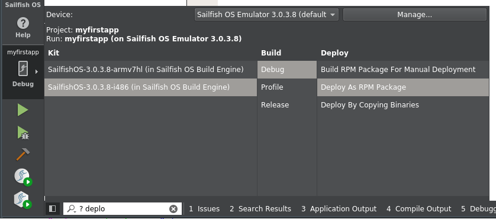
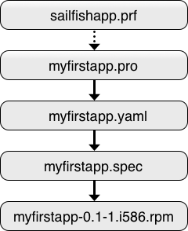

## Packaging Apps

A Sailfish OS application has to be packaged into an installation package before it can be submitted to Jolla Harbour to make it available in Jolla Store. This article briefly describes the available deployment methods and explains the steps involved in creating an installation package for an application project.

### Deployment Methods

Deploying an application to the Sailfish OS emulator or to a device is the process of transferring application binaries and any required resource files (such as QML files, images, the desktop integration file, etc.) to the target execution environment. There are two principal methods for deploying the application: copying binaries directly and creating an RPM installation package containing the files. You can choose the deployment method by using the project kit selector in Sailfiish IDE.

<a href="QtC_Deployment_Method.png" style="width:30em;display:block">
    
</a>

Both deployment methods work whether the application is to be run on the emulator or on a device. However, each method performs the deployment differently and has different pros and cons.

As the name implies, copying binaries transfers the binary and resource files by simply copying the files over to the correct locations in the target environment. This method is fast, as it requires no other steps and the changes to the environment are minimal. Binary copy deployment is a good choice for day to day development.

With the RPM package deployment method, an RPM package containing the application binaries and resource files is created first. After this, the RPM package is transferred to the target environment and installed using native RPM installation tools.

This method is slightly slower than the binary copy method because it involves intermediate steps but there are several benefits. In addition to simply containing the files to be installed, RPM packages can describe package dependencies. This allows automatically installing any packages your application depends on when your application is installed.

Since there is no emulator or device to install to when submitting an application to Jolla Harbour, RPM deployment is the only available option. Additionally, the RPM deployment method mimics the end user installation experience much more closely than binary copy. Because of this it is good idea to test deploying your application as an RPM package from time to time to ensure any package dependencies are correctly resolved.

Also note that kit selection determines where the package can be deployed. x86 packages run on the emulator, whereas only ARM packages can be installed on a device. Packages destined for Jolla Harbour are obviously intended for installation on real devices and hence must be compiled using the `SailfishOS-<version>-armv7hl` kit.

The rest of this article illustrates the process that takes place when an RPM installation package is created for your application project.

### Installation Package Creation Overview

In addition to the standard Qt project file, various other files play a part in describing the files that go into an RPM package and how the package should behave when it is installed into the target environment. The figure below shows the files involved in the creation of an RPM package.

<a href="RPM_Creation.png" style="width:30em;display:block">
    
</a>

If you use the Sailfish OS Qt Quick application template inside the Sailfish IDE to create your project, all of these files are created automatically for you. Most of the files are generated by the new project wizard but some get generated as a part of building or deploying the project. The following sections use a project called `myfirstapp` created using the Sailfish OS Qt Quick application template to explain the role of each of these files.

### The .pro and .prf Files

After creating a project using the Sailfish IDE new project wizard, the `myfirstapp.pro` file looks like this:
```qmake
TARGET = myfirstapp
CONFIG += sailfishapp
SOURCES += src/myfirstapp.cpp
OTHER_FILES += qml/myfirstapp.qml \
 qml/cover/CoverPage.qml \
 qml/pages/FirstPage.qml \
 qml/pages/SecondPage.qml \
 rpm/myfirstapp.spec \
 rpm/myfirstapp.yaml \
 myfirstapp.desktop
```

The Qt project file lists the files that comprise your application. Naturally, many of the items in the project file, such as the compiled target `myfirstapp` and all of the QML files, should become a part of the installation package. But if you’re thinking nothing in the project file itself seems to indicate which files should be installed and where, you’d be right.

Since all projects based on the Sailfish OS Qt Quick application template share an identical structure, the project file variable declarations that direct installation have been separated to a shared Qt feature file.

The `CONFIG += sailfishapp` declaration instructs qmake to include the declarations from the Qt feature file `sailfishapp.prf` into this project file.

Qt feature files (`.prf` files) are similar to project include (`.pri` files) files in that they allow a shared set of declarations to be included into multiple project files. Qt feature files, as the name suggests, are used to provide modular features to all Qt-based projects, whereas project include files are more commonly used to partition a large project into smaller, more manageable parts. Also note that with Qt features you only need to know the name of the feature you want to use (here we’re stating that our project is a Sailfish OS application, hence we want all the declarations that apply to the feature `sailfishapp`). The name of a feature is always the stem of the feature file, i.e. everything before the `.prf` suffix. With project include files you typically give the path and name of the project include file you’re including.

If you’re curious as to the content of the `sailfishapp.prf` feature file, for the emulator target it can be found in the directory:
```
# Linux and OSX
~/SailfishOS/mersdk/targets/SailfishOS-i486/usr/share/qt5/mkspecs/features

# Windows
C:\SailfishOS\mersdk\targets\SailfishOS-i486\usr\share\qt5\mkspecs\features
(assuming you installed Sailfish SDK in the default location.)
```

The file looks like this:
```qmake
QT += quick qml

target.path = /usr/bin

!sailfishapp_no_deploy_qml {
    qml.files = qml
    qml.path = /usr/share/$${TARGET}

    INSTALLS += qml
}

desktop.files = $${TARGET}.desktop
desktop.path = /usr/share/applications

icon.files = $${TARGET}.png
icon.path = /usr/share/icons/hicolor/86x86/apps

INSTALLS += target desktop icon

CONFIG += link_pkgconfig
PKGCONFIG += sailfishapp
INCLUDEPATH += /usr/include/sailfishapp

QMAKE_RPATHDIR += /usr/share/$${TARGET}/lib

OTHER_FILES += $$files(rpm/*)
```

These declarations are common to all Sailfish OS Qt Quick applications. The `INSTALLS` declaration lists the parts of project that are to be installed, here the compiled target, the entire `qml` directory, the desktop integration file, and the application icon.

The values on the right side of the `INSTALLS` declaration refer to the built-in target install set and three custom install sets defined above. For example, for the desktop integration file, an install set named desktop is declared:
```qmake
desktop.files = $${TARGET}.desktop
desktop.path = /usr/share/applications
```

The `files` member of the install set lists the files that are to be installed. This can be one or more files or directories in any order. Here the name of the file to install will be `myfirstapp.desktop`, since `myfirstapp.pro` defines the name of the target as myfirstapp. The path member of the install target defines the `path` where files listed by the `files` member are copied.

For a desktop Qt project, installation is typically performed by running `qmake` followed by make install. This is true for Sailfish OS projects as well but if you take a look at the Compile Output pane in Sailfish IDE after deploying or running a project, you’ll notice the actual command is `make install INSTALL_ROOT=/home/deploy/installroot`.

The path `/home/deploy/installroot` refers to a location in the build engine virtual machine. This is not the final installation location, rather it is the location where the RPM build step looks for the files. The files and directories under the `INSTALL_ROOT` path, however, are organized exactly as the install sets in the `.prf` file dictate.

Now that everything is in place for RPM package creation, the `.yaml` file comes into play for the next step of the process.

### About Qt Feature File Paths

Note that although you can examine the `.prf` files under Sailfish SDK installation directory, these are not actually the feature files used when you build your project. As the build is performed by the build engine virtual machine, the `.prf` files are actually inside the build environment in the virtual machine. The feature files themselves are, however, identical in both locations.

To see this, enter the build environment where you’ll find the feature files in the directory `/usr/share/qt5/mkspecs/features`.
```nosh
$ sfdk build-shell ls /usr/share/qt5/mkspecs/features
```

### The .yaml File

To create an RPM package, you need a SPEC file that provides information about the software being packaged. For Sailfish OS projects, you don’t usually create or modify the SPEC file directly. Instead, a more human-readable intermediate metadata file, a `.yaml` file, is used. The SPEC file itself is generated automatically during the build process from the `.yaml` file.

An initial `.yaml` file is generated when you first create a project using the Sailfish OS Qt Quick application template under Sailfish IDE. You can see from the figure in the Installation Package Creation Overview section that the `.pro` file works as a source of data for the `.yaml` file. For this reason, the parts of the `.yaml` file are regenerated every time the Qt project file changed.

The initial `.yaml` file for the example project looks like this:
```yaml
Name: MyFirstApp
Summary: My Sailfish OS Application
Version: 0.1
Release: 1
Group: Qt/Qt
URL: http://example.org/
License: LICENSE
Sources:
- '%{name}-%{version}.tar.bz2'
Description: |
  Short description of my Sailfish OS Application
Configure: none
Builder: qmake5
PkgConfigBR:
- sailfishapp >= 0.0.10
- Qt5Core
- Qt5Qml
- Qt5Quick
Requires:
- sailfishsilica-qt5 >= 0.10.0
Files:
- '%{_datadir}/icons/hicolor/86x86/apps/%{name}.png'
- '%{_datadir}/applications/%{name}.desktop'
- '%{_datadir}/%{name}/qml'
- '%{_bindir}'
```

Besides being the source for the generated SPEC file, the `.yaml` is used to declare how to resolve both build-time and runtime dependencies for the project. These dependencies are controlled by the keywords described below.

There are several keywords that control how the SPEC file is generated. The most important of these are described next.

#### Name (required)

The name of your project. Note that this is not the name of the application as it appears to the user. Instead it is the base name used to form file names elsewhere in the `.yaml` file. For example, the application icon is referred to as `%{name}.png`. Hence the value for Name should always match the `TARGET` declaration in the Qt project file.

#### Summary (required)

A short description of the package.

#### Version (required)

The version number of the package.

When set to `0` (zero) and the project resides under a Git working directory, the actual version number will be determined programmatically from the name of the latest Git tag on the current branch. Additionally, if the current HEAD, index or working tree differs from the tree denoted by the tag, a suffix composed from the current branch name, time stamp and a commit SHA1 will be added to the package version. If git-state is not clean a git-stash will be created and its SHA1 will be used instead of HEAD.

#### Group (required)

The group where the installed application should appear in the system’s application launcher. For Sailfish OS Qt Quick applications, the value should always be `Qt/Qt`.

#### License (required)

The name of the license the package adheres to.

#### PkgConfigBR (optional)

This keyword is one of the ways to define which packages are required to build your project. The values listed for the *PkgConfigBR* keyword are names of package configuration, or `.pc` files. Similarly to Qt feature files, if you know the name of the package configuration file, you don’t need to know the exact name of the package that provides the functionality. See About the PkgConfigBR and PkgBR Keywords below for a more detailed discussion.

#### About the PkgConfigBR and PkgBR Keywords

In addition to *PkgConfigBR*, the *PkgBR* keyword is also used to manage build-time dependencies. For both, the “BR” stands for Build Requires. The difference is that with *PkgConfigBR* you give the name of the package configuration, with *PkgBR* you have to know the exact name of the package providing said configuration. For example the following two `.yaml` snippets both establish a build-time requirement for the `sailfishapp` configuration:
```yaml
PkgBR:
- libsailfishapp-devel >= 0.0.10
```

```yaml
PkgConfigBR:
- sailfishapp >= 1.0.0
```

The greater than or equal notation can be used to establish a minimum version requirement. Note how *PkgBR* uses the version of the package, whereas *PkgConfigBR* refers to the version of the package configuration, i.e. the version number specified by the Version field in the `.pc` file itself.

Where applicable, the use of *PkgConfigBR* preferred, as it insulates your project from possible package naming changes. The configuration can be referred to by the same name even if the package that provides it is renamed.

#### Requires (optional)

The *Requires* keyword specifies packages that are required by the application at runtime. In case these packages are not already present in the target environment, they get installed automatically when the RPM package for the application is installed.

Typically the packages listed for *Requires* provide importable QML modules, for example the package `sailfishsilica-qt5` enables the application’s QML files to use the Sailfish Silica module via the `import Sailfish.Silica 1.0` statement.

Finding out which package provides which QML module may take a little detective work, see the Tips and tricks section for a few hints on how to locate the package you need.

#### Description (optional)

A longer form description of the package. The pipe character in `Description: |` means that newlines are significant in the description text that follows and should not be folded into spaces.

#### Builder (optional)

The tool that should be used to build this project. Examples of valid values are `qmake5` and `cmake`.

#### Files (optional)

The *Files* keyword lists the files and directories that are copied to the system when the package is installed. Each of the files and paths listed in this section refers to one of the items in the `INSTALLS` declaration in the `sailfish.prf` file.

Note that where the `.prf` file used Qt project variables, the `.yaml` file uses SPEC file macros. The declarations for the project’s qml directory in the in the `.prf` file
```qmake
qml.files = qml
qml.path = /usr/share/$${TARGET}
```

correspond to the line - `'%{_datadir}/%{name}/qml'` in the `.yaml` file.

The number of items in the *Files* section must match the number of items in `INSTALLS` declarations. If this is not the case, you are either attempting to install something that is not generated in the first place, or forgetting to install something that is generated, i.e. you have more lines in the *Files* section than items in `INSTALLS` declarations, or vice versa. Both of these are actually errors, resulting in the error messages when trying to deploy the project.

Note that you should always use the macros, such as `%{_bindir}` for `/usr/bin`, to refer to standard platform locations in the `.yaml` file. A warning is printed to the compilation output if you don’t.

It may seem strange that the path is spelled out in the Qt feature file but referred to with a macro in the `.yaml`. But both of these are actually provided by the SDK – the Qt feature file is a part of the SDK and the line in the `.yaml` file in generated by Sailfish IDE. Hence, if the standard paths ever change, the paths will not get out of sync, as both change when the SDK is updated. Using the macros when you modify a `.yaml` file ensures your project will continue to work without any modifications if the standards paths are ever changed.

### The SPEC File

The SPEC file contains instructions for building the project and for packaging the resulting binaries into an RPM package. The file is generated automatically during the build process from the `.yaml` file, and normally there is no need to modify the SPEC file manually. Every value that affects the generated file can usually be set elsewhere, for example via the `.yaml` file.

If you take a look at the SPEC file (it can be found in the rpm directory after the project has been built at least once), you’ll see it contains many of the values that were set in the `.yaml`, such as the package *Version* and *Requires* declarations.

Most of the SPEC file is overwritten during a build if the source `.yaml` file has changed. As such, there is little point in editing the SPEC file by hand, other than the sections which have been explicitly marked as editable.

Editable parts of the SPEC file are marked with `# >>` and `# <<`. For each step of the build process, there are markers for sections that are customizable. For example, the markers
```specfile
# >> build pre
# << build pre
```

```specfile
# >> build post
# << build post
```

indicate points for custom commands to be executed before and after the project is compiled.

For most Sailfish OS Qt Quick applications, there is no need to change the generated SPEC file in any way. The generated file does everything that the vast majority of applications need but the customization option is there for the few exceptional cases that may require custom steps.

### Tips and Tricks

This section shows a few terminal commands that may be useful for tracking down specific packages or names as they should appear in the *PkgBR*, *PkgConfigBR*, and *Requires* sections of the `.yaml` file. All of the commands should be run under a build environment with `sfdk build-shell --maintain`.

Note that the `zypper` package manager is not available in the emulator nor on a real device in their default configurations. The equivalent command in the emulator virtual machine or on a device is `pkcon`. These two commands have slightly different options and one may not support all the functionality the other has, but both may coexists on one system - `zypper` can be installed with `pkcon install zypper`.

List all available package configurations (for use with the *PkgConfigBR* keyword):
```nosh
$ pkg-config --list-all
```

List installed package configuration files:
```nosh
$ ls -l /usr/lib/pkgconfig/
```

See full details, such as the version, include path, and libraries linked against, e.g. for the `sailfishapp` package configuration:
```nosh
$ cat /usr/lib/pkgconfig/sailfishapp.pc
```

Find out which package provides the `Qt5Positioning` configuration:
```nosh
zypper what-provides 'pkgconfig(Qt5Positioning)'
```

Show all packages (an ‘i’ in the status column indicates the package is currently installed):
```nosh
$ zypper packages
```

Show the files contained in the installed package `qt5-positioning-devel`:
```nosh
$ rpm -ql qt5-qtpositioning-devel
```
