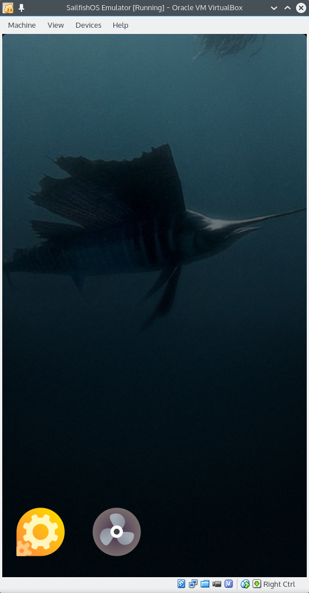
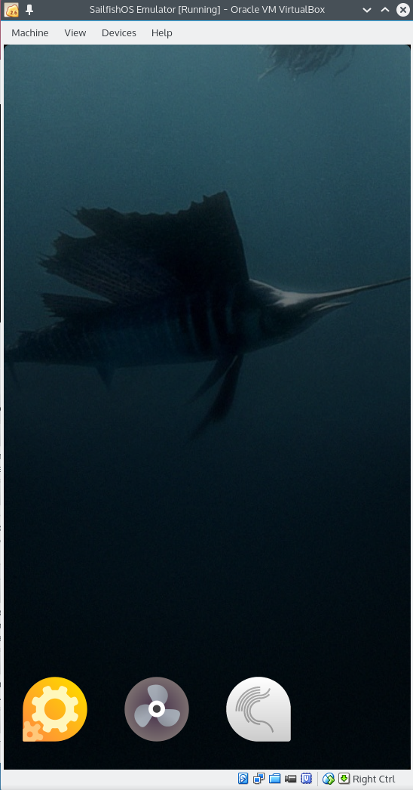
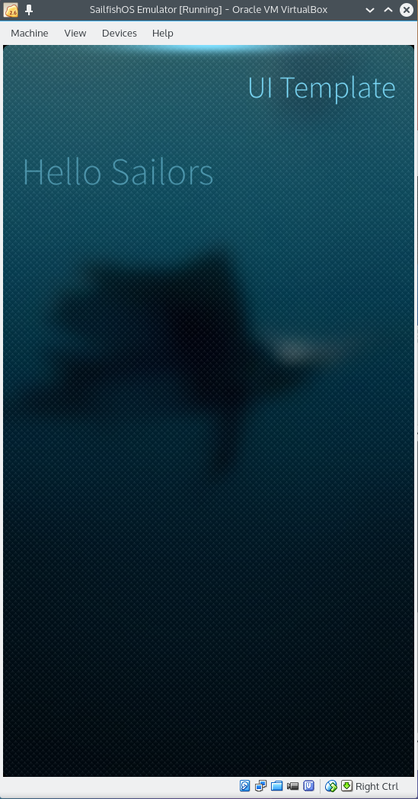

Sailfish SDK provides a streamlined developer experience through the Sailfish IDE. However, native support is only available for projects that use either qmake or CMake as their build system, which may not be the case when porting existing applications over to Sailfish OS and especially when working on platform components. Such projects may be built manually from command line and with an intermediate step involved it is also possible to open them in the Sailfish IDE, with the usual advanced editing features enabled. Techniques described in this document are also useful to those who prefer using a different code editing environment or want to use Sailfish SDK in the context of a continuous integration system. We use a CMake based example application and a GNU Automake based library in this document, but the steps to take are roughly the same for any build setup.

## Preparation

The first thing you need to do is to install the Sailfish SDK. Follow the [Sailfish SDK Installation](/Tools/Sailfish_SDK/Installation) page. Next you should clone the [sample application](https://github.com/sailfishos/cmakesample) and the [sample library](https://github.com/sailfishos/cmakesample) under your home directory.

The `sfdk` tool is available from the `bin` subdirectory of the Sailfish SDK installation directory. For the rest of this guide it is assumed that you e.g. set up a shell alias to allow invoking `sfdk` without specifying its full path.
```nosh
$ alias sfdk=~/SailfishOS/bin/sfdk
```

At this point you should consider learning `sfdk` a bit from its built-in help, at least by briefly checking the part on building packages.
```nosh
$ sfdk --help-building
```

List the installed build tools and choose the build target to build for. Learn more in the aforementioned built-in help of `sfdk`.
```
$ sfdk tools list
SailfishOS-4.4.0.58                          sdk-provided,latest
├── SailfishOS-4.4.0.58-aarch64              sdk-provided,latest
├── SailfishOS-4.4.0.58-armv7hl              sdk-provided,latest
└── SailfishOS-4.4.0.58-i486                 sdk-provided,latest
```

Choose the `i486` target as we will be running in emulator first.
```nosh
$ sfdk config target=SailfishOS-4.4.0.58-i486
```

This guide assumes that all build dependencies that are not available by default are declared in the RPM SPEC file, so that they get installed automatically when you build your package. Should there be a reason to install more build dependencies manually, it can be done using `sfdk tools package-install` and related commands.

## Building the sample application

Clone the sample application and build it with the `sfdk build` command invoked from a separate build directory, i.e., perform a shadow build.
```nosh
$ git clone https://github.com/sailfishos/cmakesample
$ mkdir cmakesample.build.i486 && cd cmakesample.build.i486
$ sfdk build ../cmakesample
```

Once the build finishes, you can find the RPM packages in the `RPMS` directory.

If you wish to repeat any build phase separately, commands like these may be used under the build directory:
```nosh
$ sfdk cmake ../cmakesample [cmake-options...]
$ sfdk make [make-options...]
$ sfdk build-shell <arbitrary-build-command> [options...]
$ sfdk make-install
$ sfdk package
```

Similarly to the `sfdk cmake` command, the `sfdk qmake` command exists for qmake based projects. Together with `sfdk make`, these commands allow to run `rpmbuild` in a way that just the corresponding part of the `%build` section of the SPEC file is executed. Run these with `--help` to learn more.

## Running the sample application in the emulator

It is very strongly recommended that you only deploy your application in form of RPM packages. The following instructions only cover this case.

List the available devices to determine the name of the device corresponding to the emulator.
```
$ sfdk device list
#0 "Sailfish OS Emulator 4.4.0.58"
    emulator         autodetected  defaultuser@127.0.0.1:2223
    private-key: ~/SailfishOS/vmshare/ssh/private_keys/sdk
```

Configure `sfdk` to use the device corresponding to the emulator.
```nosh
$ sfdk config device="Sailfish OS Emulator 4.4.0.58"
```

Deploy the packages built in previous steps.
```nosh
$ sfdk deploy --sdk
```

This will move and install all packages built from the current project to the Sailfish OS emulator. The `deploy` command accepts options to choose other deployment methods and modify the list of packages to be deployed. Check `sfdk deploy --help` for more information.

After successful deployment the application icon to appear in the menu. Tapping on the icon launches the application.

|<a href="Emulator_Plain.png"></a>|<a href="Emulator_Installed.png"></a>|<a href="Emulator_Running.png"></a>|
|-|-|-|
|<span class="md_figcaption">Plain emulator</span>|<span class="md_figcaption">Emulator with the app installed</span>|<span class="md_figcaption">Emulator with the app running</span>|

Congratulations, you have successfully built and deployed a Sailfish OS application manually.

You can also invoke your application from command line
```nosh
$ sfdk device exec /usr/bin/cmakesample
```

Debugger may be conveniently invoked with
```nosh
$ sfdk debug /usr/bin/cmakesample
```

### Other deployment options

If the deployment methods implemented by `sfdk` do not suit specific needs of you package, it is possible to let `sfdk` only transfer the RPMs to the device and then deploy them manually.
```nosh
$ sfdk deploy --manual
```

After that the RPMs are copied into the `~/RPMS` directory on the device. Open a shell to the device and install the RPMs using you preferred method. For the purpose of this example we will simply use `rpm -i`.
```nosh
$ sfdk device exec
(device) $ sudo rpm -i RPMS/cmakesample-1.0-1.i486.rpm
```

Alternatively, plain `scp` may be used to transfer packages available from other location than current build directory. SSH connection parameters may be determined from the device listing provided by `sfdk`.
```
$ sfdk device list
#0 "Sailfish OS Emulator 4.4.0.58"
    emulator         autodetected  defaultuser@127.0.0.1:2223
    private-key: ~/SailfishOS/vmshare/ssh/private_keys/sdk
```

The corresponding `scp` command line would be
```nosh
$ scp -P 2223 -i ~/SailfishOS/vmshare/ssh/private_keys/sdk \
    path/to/package.rpm defaultuser@127.0.0.1:
```

## Running the sample application on a device

First of all you need to register your device with Sailfish SDK. This is currently only possible from the Sailfish OS IDE - [add a new Sailfish OS hardware device](/Develop/Apps/Your_First_App#create-a-connection-to-sailfish-os-hardware-device) in the preferences.

Then configure `sfdk` to use the configured device.
```
$ sfdk device list
#0 "Sailfish OS Emulator 4.4.0.58"
    emulator         autodetected  defaultuser@127.0.0.1:2223
    private-key: ~/SailfishOS/vmshare/ssh/private_keys/sdk
#1 "Xperia 10 - Dual SIM (ARM)"
    hardware-device  user-defined  defaultuser@192.168.2.15:22
    private-key: ~/.ssh/id_x10

$ sfdk config device="Xperia 10 - Dual SIM (ARM)"
```

If you followed this guide from the beginning, you built the application for deployment to Sailfish OS emulator before. While Sailfish OS emulators are i486 targets, most Sailfish OS hardware devices, like the Xperia 10 used in this example, are ARM targets. Therefore, another build of the application is needed. List the installed build tools and choose an appropriate build target as we did before, in the [Preparation](#preparation) section.
```nosh
$ sfdk config target=SailfishOS-4.4.0.58-armv7hl
```

Create a build directory for this target a build the application again.
```nosh
$ mkdir cmakesample.build.armv7hl && cmakesample.build.armv7hl
$ sfdk build ../cmakesample
```

Issue the `sfdk deploy` command under the build directory:
```nosh
$ sfdk deploy --sdk
```

Now your application has appeared in the list of installed applications and is ready to be run.
```nosh
$ sfdk device exec /usr/bin/cmakesample
```

The alternative deployment options are basically the same as those demonstrated with emulator before. On hardware devices, `sudo` is not installed by default and superuser access can be gained with the `devel-su` command.

## Working with dependent packages

**Note:** Parts of this section are only applicable with SDK \>= 3.3

When multiple packages are modified under a task and build time dependencies exist between those, one needs to ensure that the updated versions of the required packages are available under the build environment. This can be conveniently achieved with the help of `sfdk`'s `output-prefix` and `search-output-dir` configuration options (the latter being implied by the former). With the following configuration a common output directory will be used for the resulting RPMs and `sfdk` will consider existing packages under this directory when resolving build time dependencies.
```nosh
$ mkdir ~/RPMS
$ sfdk config --global --push output-prefix ~/RPMS
```

See `sfdk --help-building` to learn how to combine this with the `task` configuration option in order to achieve per-task output directories.

Later we will use emulator again, so take the i486 target back into use if you switched to the ARM target before.
```nosh
$ sfdk config target=SailfishOS-4.4.0.58-i486
```

Clone the sample library and build it. Unlike with qmake or CMake based projects, Automake (Autotools) based projects are rarely packaged in a way that would allow performing a shadow build with `sfdk`. Fortunately, the sample library is a better example in this sense, so let's excercise this option. (Learn more about the limitations with shadow builds from `sfdk --help-building`.)
```nosh
$ git clone https://github.com/sailfishos/automakesample
$ mkdir automakesample.build.i486 && cd automakesample.build.i486
$ sfdk build ../automakesample
```

Now modify the sample application adding a build time dependency to the sample library.

Edit `main.cpp`, and add code like this:
```cpp
#include <automakesample.h>
#include <iostream>
...
std::cout << automakesample::greetings() << std::endl;
```

Edit `CMakeLists.txt` so that the `automakesample` library is found and taken into use with the help of `pkg-config` (see how it is done for `sailfishapp` there) and add `BuildRequires: pkgconfig(automakesample)` into `rpm/cmakesample.spec`.

Now build the updated sample application.
```nosh
$ cd cmakesample.build.i486
$ sfdk build ../cmakesample
```

You should see the following message at some point in the build output:
```
The following 2 NEW packages are going to be installed:
  automakesample        0.1-1
  automakesample-devel  0.1-1
```

Deploy both the sample application and the sample library (but not the development package) to the emulator and run the sample application. You should see the greeting in the console output after the application starts.
```nosh
$ sfdk deploy --all "-*-devel"
$ sfdk device exec /usr/bin/cmakesample
Hello, World!
```

## Editing code with(out) Sailfish IDE

**Note:** This section is only applicable with SDK \>= 3.3

In order to successfully load Sailfish projects and enable advanced code editing features for them, certain level of integration with Sailfish SDK must exist on the development environment side for the particular project type. This is necessary because file system paths involved at build time do not always exist on the host file system - some are only valid under the build engine as explained thoroughly in `sfdk --help-building`. Speaking of Sailfish IDE, this kind of integration exists for qmake and CMake based projects.

Beside this issue specific to Sailfish SDK, a more general issue exists that a code editor or tool may not be capable of retrieving the required information from the build system utilized by a particular project. This is commonly addressed with the help of Clang's JSON Compilation Database format used as an interchangeable project description suitable for loading by tools. The same approach is applicable to the above mentioned issue and it can be used with any development environment capable of loading compilation databases, not only with Sailfish IDE.

For build systems that use `make` at some point, Sailfish SDK supports generating compilation databases conveniently with the `sfdk compiledb` command.

Let's take our Automake based sample library introduced above as an example. After building the project initially, which we did before, generate the compilation database and, provided that shadow build is done, copy (or link) the resulting file into the source directory.
```nosh
$ cd automakesample.build.i486
$ sfdk build ../automakesample # not needed if done before
$ sfdk compiledb
$ cp compile_commands.json ../automakesample/
```

Now the Automake based project may be opened in Sailfish IDE. Use `File > Open File or Project...` to open the compilation database file under the source directory (be careful to not open the original under the build directory). After opening the project, ensure to

1.  configure it to use the kit corresponding to the build target used to build the project with `sfdk` and
2.  adjust the `Build directory` path under `Projects > Build Settings`.

With this configuration, the project may be also built directly from Sailfish IDE for easier navigation to build issues, and (in case of application projects) it would be also possible to update the `Run Settings` and run the project on a device directly from the Sailfish IDE.

As an example of an alternative editing environment, consider using the ViM editor with YouCompleteMe plugin installed. With the YouCompleteMe plugin ViM looks for `compile_commands.json` file up the file system hierarchy starting from the directory when the file being edited exists, so at this point it should be all set up and after opening the `lib/automakesample.cpp` file all features provided by the YouCompleteMe plugin should be available.

## Writing developer-friendly RPM SPEC files

Nothing special is needed from a SPEC file to allow a full, in-place build to be performed (once) with the `sfdk build` command. A little of awareness is needed to allow more developer-friendly workflows with incremental (re)builds and shadow builds involved.

1.  The build and install procedure should be fully realized using the underlying build system (qmake, CMake, GNU Automake, make, ...) with no additional steps implemented at RPM SPEC file level. This also means that the `%doc` macro should not be used.
2.  If the build system is other than qmake or CMake, and a configure-like step is involved in package's build procedure, the `%build` section should be written in a way that this step is skipped for repeated, incremental builds.

Examples of well-written `%build` and `%install` sections follow.

With qmake:
```specfile
%build
%qmake ARGS...
make %{?_smp_mflags}
make %{?_smp_mflags} doc

%install
%qmake_install
```

With CMake:
```specfile
%build
%cmake ARGS...
make %{?_smp_mflags}
make %{?_smp_mflags} doc

%install
%make_install
```

With GNU Automake, Autoconf and others:
```specfile
%build
if ! test -f Makefile; then
    %reconfigure
fi
make %{?_smp_mflags}
make %{?_smp_mflags} doc

%install
%make_install
```

## Declaring dependencies

If your package has run time dependencies to other packages, such dependencies should be stored in the package metadata so that package manager can install also the dependencies when installing your package. We can control this metadata in the SPEC files. The simple way to add a dependency is by adding a Requires field to the SPEC file:
```specfile
Requires:   sailfishsilica-qt5 >= 0.10.9
Requires:   libsailfishapp-launcher
```

In many cases this is not necessary: If your app links to the Harbour-allowed libraries, or uses Harbour-allowed Python modules, the dependencies are created automatically. However, this process is not 100% accurate, so it might be necessary to add or remove dependencies manually in the SPEC file.

If the automated process adds an unwanted depencency, it can be disabled for a single depencency using `%define __requires_exclude`. For example, if the automated depencency generation added an unwanted depencency to a python module called "wrongmodule", you could disable that by writing:
```specfile
%define __requires_exclude python3dist.wrongmodule
```

If you want to disable the automatic dependency generation for python modules completely, you can add:
```specfile
%undefine __pythonapp_requires
```

## Validating package contents

### Running Harbour validator

If you want to make your app available in [Jolla Store via Harbour](https://harbour.jolla.com/), it must pass the Harbour validation checks. You can run the Harbour validator (and more) with `sfdk`:
```nosh
$ cd cmakesample
$ sfdk build
$ sfdk check
```

It is also possible to validate packages built before, i.e., without access to the build tree. Simply pass them on the command line:
```nosh
$ sfdk config target=SailfishOS-4.4.0.58-armv7hl
$ sfdk check ...path/to/harbour-cmakesample-1.0-1.armv7hl.rpm
```
