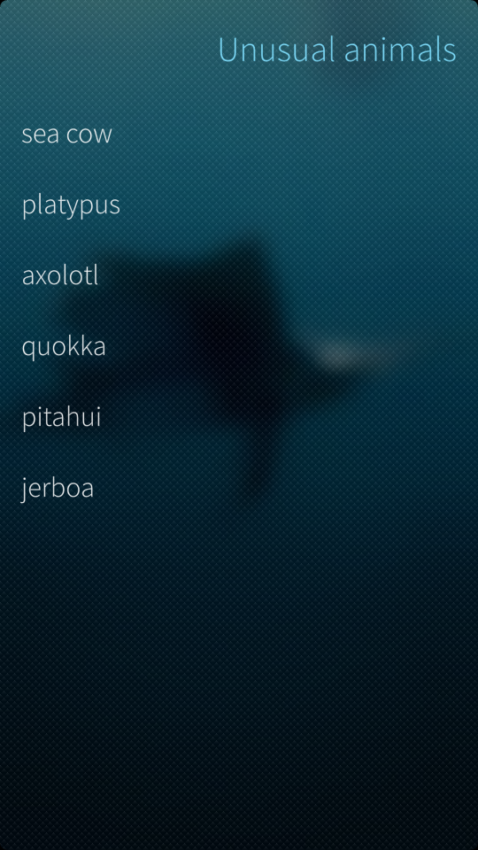

QML is the preferred way of developing apps for Sailfish OS. However there are many cases where this is by itself not enough and dropping into native code is necessary. Common reasons include performance, utilizing existing C/C++ libraries and so on. This tutorial describes how to create an application that combines a QML frontend with a C++ backend. We are going to create a simple application that displays a list of unusual animals. Tapping on any animal causes it to move to the top of the list.

|<a href="Screenshot.png" style="width:30em;display:block"></a>|
|-|
|<span class="md_figcaption">Screenshot</span>|

Combining C++ and QML requires three distinct steps. First we need to create a data model, then we need to expose it to the QML engine and finally we need to call methods on it. Let’s go through these steps in detail. Full source code for this sample can be checked out from [this repository](https://github.com/sailfishos/sample-app-cppqml).

## Creating the model

Exposing data from C++ into QML is done via the [Qt Model/View framework](http://doc.qt.io/qt-5/model-view-programming.html). Our model is a simple array of strings. Qt provides a [QStringListModel](http://doc.qt.io/qt-5/qstringlistmodel.html) for this use case but for educational purposes we will provide our own by inheriting from a [QAbstractListModel](http://doc.qt.io/qt-5/qabstractlistmodel.html). The relevant parts of the model header file look like this.
```cpp
#ifndef DEMOMODEL_H
#define DEMOMODEL_H

#include <QAbstractListModel>

class DemoModel : public QAbstractListModel
{
    Q_OBJECT
public:
    enum DemoRoles {
        NameRole = Qt::UserRole + 1,
    };

    explicit DemoModel(QObject *parent = 0);

    int rowCount(const QModelIndex&) const override { return backing.size(); }
    QVariant data(const QModelIndex &index, int role) const override;

    QHash<int, QByteArray> roleNames() const override;

    Q_INVOKABLE void activate(const int i);

private:
    QVector<QString> backing;
};

#endif
```

There are a few things to take note of. The first is the `backing` variable which holds the list of animals we want to show to the user. The second is the custom method `activate` that we want to call from QML. To make it callable we need to mark it with the `Q_INVOKABLE` macro.

In the implementation file we first populate the list of animals to the `backing` vector.

```cpp
#include "demomodel.h"

DemoModel::DemoModel(QObject *parent)
    : QAbstractListModel(parent)
{
    backing << "sea cow" << "platypus" << "axolotl" << "quokka" << "pitahui" << "jerboa";
}
```

After defining constructor, we tell to Qt what our data elements look like. This is simple as we only have one piece of data to show, the name of the animal.

```cpp
QHash<int, QByteArray> DemoModel::roleNames() const
{
    QHash<int, QByteArray> roles;
    roles[NameRole] = "name";
    return roles;
}
```

If our data was more complicated we would define more roles here. As an example a list displaying people’s names could have two different roles: a given name role and a family name role. The second half of getting data displayed is the function that returns data for a given role. This is specified by Qt’s model system and it looks like this.
```cpp
QVariant DemoModel::data(const QModelIndex &index, int role) const
{
    if (!index.isValid()) {
        return QVariant();
    }
    if (role == NameRole) {
        return QVariant(backing[index.row()]);
    }
    return QVariant();
}
```

This is very simple. If the `index` is valid and the role is correct, just return the name inside a `QVariant`. Otherwise return an empty `QVariant`. The last method we have is the one that is called when an item is activated.
```cpp
void DemoModel::activate(const int i) {
    if(i < 0 || i >= backing.size()) {
        return;
    }
    QString value = backing[i];

    // Remove the value from the old location.
    beginRemoveRows(QModelIndex(), i, i);
    backing.erase(backing.begin() + i);
    endRemoveRows();

    // Add it to the top.
    beginInsertRows(QModelIndex(), 0, 0);
    backing.insert(0, value);
    endInsertRows();
}
```

The operation is very simple, we just remove the item from the given location and insert it to the top. However we need to surround the modifications with calls to the begin and end methods . These calls inform Qt that our model’s state will change and it should update all views that are displaying this model’s data. We don’t have to do anything on the QML side to update the display, Qt takes care of all the details.

## Exposing the model to QML

A C++ model by itself is not very useful, there also needs to be a way to create one from QML. This is accomplished by exposing the new object type to the QML Engine which can be easily done during application startup.
```cpp
int main(int argc, char *argv[])
{
    // Set up QML engine.
    QScopedPointer<QGuiApplication> app(SailfishApp::application(argc, argv));
    QScopedPointer<QQuickView> v(SailfishApp::createView());

    // If you wish to publish your app on the Jolla harbour, it is recommended
    // that you prefix your internal namespaces with "harbour.".
    //
    // For details see:
    // https://harbour.jolla.com/faq#1.5.0
    qmlRegisterType<DemoModel>("com.example", 1, 0, "DemoModel");

    // Start the application.
    v->setSource(SailfishApp::pathTo("qml/cppqml.qml"));
    v->show();
    return app->exec();
}
```

Here we create an application and a [QQuickView](http://doc.qt.io/qt-5/qquickview.html). We store them in [QScopedPointers](http://doc.qt.io/qt-5/qscopedpointer.html) to make sure their resources are appropriately released. The next line does the actual exporting. It exposes the `DemoModel` under the namespace `com.example`, version 1.0. This allows QML pages to instantiate `DemoModel` components as if they were native data types. The last step to complete our application is to create a page to display the contents of the model.

## Displaying data in a view

Instantiating and displaying a `DemoModel` is straightforward.
```qml
import QtQuick 2.0
import Sailfish.Silica 1.0
import com.example 1.0

Page {
    id: page

    SilicaListView {

        anchors.fill: parent

        model: DemoModel {
            id: dmodel
        }

        header: PageHeader {
            id: header
            title: "Unusual animals"
        }

        delegate: BackgroundItem {
            Label {
                x: Theme.horizontalPageMargin
                text: name
            }
            onClicked: dmodel.activate(index)
        }
    }
}
```

Here we create a `SilicaListView` and set `DemoModel` as its data model. All the actual work is done inside the delegate. It is a simple text label that just takes its content from the model. This is done with the line of code that says `text: name`, which tells QML to obtain the name role for the current item. This causes a call to the data method described above with index and role automatically populated. Finally, to make the clicked item move to the top, we set the `onClicked` property. When clicked this will instruct the QML engine to call the activate method of the `DemoModel` with the given index. The delegate’s `index` variable is automatically provided by QML.

## Exercise for the reader

Now you should have an application that combines C++ to QML and you should be able to create your own custom models. Currently the code alters the backing model by adding and removing the same element. Qt provides a smoother way of achieving the same thing: moving rows. This allows e.g. the view to animate the transition better. Try converting this code to use move operations instead. You should not need to change the QML files at all.
