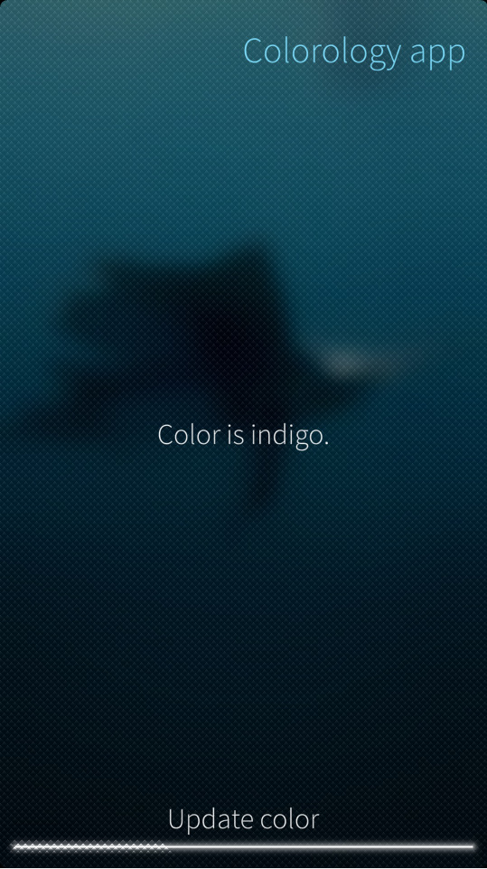
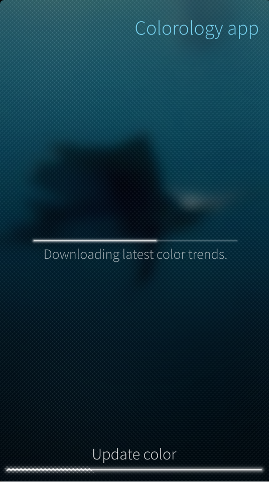

In addition to C++, Python is a fully supported language for developing Sailfish OS applications. It is especially suitable for those applications that have modest resource requirements. If your application does heavy duty processing we recommend using C++ instead of Python.

The UI for a Python application is written in QML and used via the [PyOtherSide UI library](https://pyotherside.readthedocs.org/en/latest/). This gives you full access to all the Sailfish Silica UI widgets. It should be noted that PyOtherSide only supports Python version 3, so your application needs to be written in Python 3. The rest of this document assumes that you have read the documentation for both PyOtherSide and for QML.

In this document we will create a simple Python app for displaying a chosen color. The full source code for this app can be downloaded from [this repository](https://github.com/sailfishos/python-sample). The finished application will look like this.

|<a href="Python_Screenshot_01.png" style="width:30em;display:block"></a>|
|-|
|<span class="md_figcaption">Screenshot 1</span>|

In the middle we display the name of a color. At the bottom is a button. Clicking on it tells the application to contact a web server and download a new color to show. Since this is a sample application we do not actually contact any server, but rather just wait for a while and return a color name chosen at random. This simulates the typical delay you have when using web services.

|<a href="Python_Screenshot_02.png" style="width:30em;display:block"></a>|
|-|
|<span class="md_figcaption">Screenshot 2</span>|

## Creating the Python interpreter

From the platform point of view a Python QML application is identical to a plain QML application. It is up to us to start the Python interpreter in our application. This is done by declaring a Python element in the main QML page.
```qml
Python {
    id: python

    Component.onCompleted: {
        addImportPath(Qt.resolvedUrl('.'));
        setHandler('progress', function(ratio) {
            dlprogress.value = ratio;
        });
        setHandler('finished', function(newvalue) {
            page.downloading = false;
            mainLabel.text = 'Color is ' + newvalue + '.';
        });

        importModule('datadownloader', function () {});
    }

    function startDownload() {
        page.downloading = true;
        dlprogress.value = 0.0;
        call('datadownloader.downloader.download', function() {});
    }
}
```

One of the main things to be aware of when using Python is that executing Python code may be slow. Thus we need to avoid executing slow operations in the main thread because it blocks the UI making the app unresponsive.

In this particular case we wait until the main QML element has been initialised and then set up our system. First we set two callback functions `progress` and `finished`. These signals are sent by our Python core as it is doing work behind the scenes. The logic of these callbacks is quite simple, they just update the state of the UI widgets to the new status. Once these are set up we can import the module `datadownloader` which contains the core logic of the application.

Finally at the end we have the `startDownload` function. It just resets the widget state and calls the Python code to start the download machinery.

## Running slow code in a separate thread

The slow code that emulates downloading looks like this. It is stored (along with all other code in this chapter) in datadownloader.py.
```python
def slow_function():
    for i in range(11):
        pyotherside.send('progress', i/10.0)
        time.sleep(0.5)
    pyotherside.send('finished', random.choice(colors))
```

This function takes five seconds to run. Twice a second it will send a signal whose argument is the percentage of work done so far. Finally it sends a `finished` signal, which tells the UI that it is done. The argument is a random color from the given list. When QML receives this signal it will update the UI according to the new results. Since this operation is slow and non-interruptible, we need to run it in a separate thread with a helper class.
```python
class Downloader:
    def __init__(self):
        # Set bgthread to a finished thread so we never
        # have to check if it is None.
        self.bgthread = threading.Thread()
        self.bgthread.start()

    def download(self):
        if self.bgthread.is_alive():
            return

        self.bgthread = threading.Thread(target=slow_function)
        self.bgthread.start()
```

This class holds the single background thread instance. We initialise the bgthread variable with an empty thread that exits immediately. The reason for this is in the `download` method. If the method is called when there is already a thread running, we just return. If there is no running thread we create a new one and start it. As the final step we create an instance of this class so we can call it from QML.
```python
downloader = Downloader()
```

In the QML code above we called into `datadownloader.downloader.download`. That call executes the `download` method of this object.

## Exercise for the reader

Currently there is no way to cancel the `download` operation, you have to always wait for it to finish. As an exercise, alter the code so can you can cancel the current operation. This requires three different changes to the code base. First you need to change the UI to provide a cancellation button. The second change is adding a flag variable indicating whether the background thread should abort its download and a function to set it. You also need to create a new signal `cancelled` and emit it when cancellation happens and adjust the UI accordingly. Finally connect the cancellation button’s `click` signal to a function that sets the cancellation flag to true.
