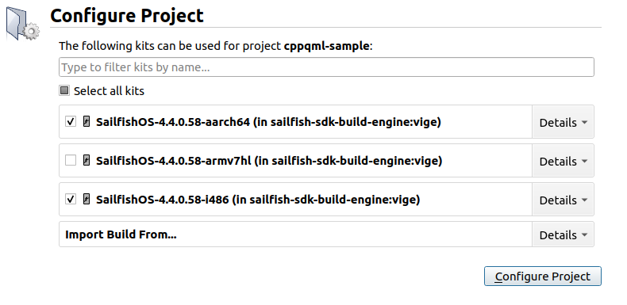
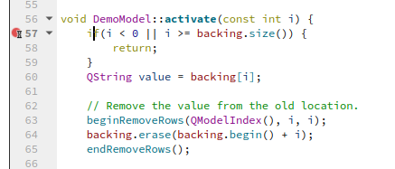
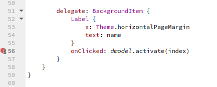

Please read the [tutorial on writing your first app](/Develop/Apps/Your_First_App) first, as it describes the steps to get started with application development.

Once you reach a situation when your application does not do what you want, e.g. it crashes, a debugger is a handy tool. It helps you figure out what's really happening under the hood. The Sailfish IDE comes with a debugger, and this page provides you with instructions on how to use it.

## Sample project

The template project is a bit too simple for providing meaningful example about debugging, let's use the project from the [Combining C++ with QML tutorial](/Develop/Apps/Tutorials/Combining_C++_with_QML/) here. You can find the source code for the project in the [github repository](https://github.com/sailfishos/sample-app-cppqml). After cloning the project, you can open it in Sailfish IDE, by selecting the `cppqml.pro` file. Just like when creating a new project, select the suitable kits for your device and the emulator.

         

## Debugging with the Emulator

### Starting and stopping the application under the debugger

First, make sure you have activated the `SailfishOS-<version>-i486` kit in the kit selector. Then, you can use the  button to start the application under the debugger. Or, you can use the menu selection **Debug → Start Debugging → Start debugging of startup project**. Or, you can just press `F5`. 

You can stop the application using the normal means (e.g. swipe down from top corner), or you can select **Stop Debugger** from the **Debug** menu.

### Working with breakpoints

The most important functionality of a debugger is that it let's you step through your code, line by line, and see what's happening. But before you can do that, you need to make the debugger to pause the execution where you want. That's done by placing a breakpoint in your code. Note! If your application crashes, the debugger will conveniently pause at the point of the crash - there's no need to add a breakpoint in such case.

Let's now place a breakpoint in the `activate()` method of the DemoModel class. Start by opening the demomodel.cpp file in the editor. Go to line 57, which is the first line of the `activate()` method. Press `F9` to insert a breakpoint there. You should see a red circle appear on the editing window before the linenumber. If your debugger is not currently running, there will also be a hourglass on top of the circle.

You can remove the breakpoint by pressing `F9` again on the same line. Another way of toggling the breakpoints is by clicking the red circle with a mouse - or the place where the red circle would be. And of course there is also the menu option: **Debug → Toggle Breakpoint"

Once you have placed a breakpoint at the beginning of the `activate()` method you can start the debugger again by pressing `F5`. Once the application has started, select the first option ("sea cow" on the application). The application execution should now stop. You should be able to see a yellow arrow on the IDE window, indication the position of execution on the code. After a few seconds, you will see a "cppqml is not responding" message on the emulator screen - this is quite normal and you can ignore that. The cppqml application is not responding because it has been paused by the debugger.

You can now use the various displays in the IDE window to view and modify variable contents, browse through the call stack, etc. You can use the selections in the **Debug** menu to step through the code, but it's useful the learn the key bindings: `F10` will step to the next line in the current stack frame. `F11` will step to the next line, but it will also enter functions if the current line happens to contain a fuction call. `Shift+F11` will perform the opposite - it will step out of a function. 

## Debugging with hardware

Once you have [added a Sailfish OS hardware device](/Develop/Apps/Your_First_App/#create-a-connection-to-sailfish-os-hardware-device) to your SDK, debugging with it is really no more difficult than debugging with the emulator. Just be sure to select the correct device in the kit selector. After that, everything should just work - you can just press `F5` to start debugging!

## Debugging QML code

Debugging the QML code is quite similar to debugging C++ code. Let's start by opening FirstPage.qml, and inserting a breakpoint to line 56:

Now, let's start the debugger by pressing `F5` like before, and select an item on the list. The execution should now stop at the QML code, and just like before, you can see various details about the execution in the debugger windows. However, you might notice that sometimes the values which you are interested in are not that easy to find - for example in our case, the value for `index` is nowhere to be seen. Luckily, there's an easy remedy: Use the right mouse button to click on the value you are interested in, and select **Add Expression Evaluator** from the popup menu. Now the value of `index` should become visible in the evaluator window.
