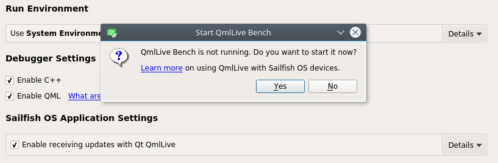
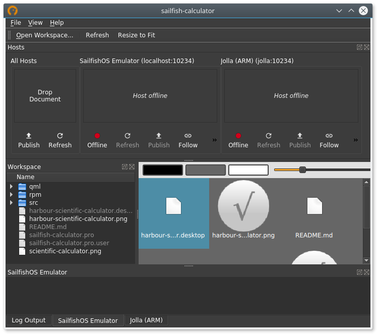
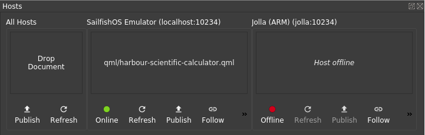

Creating Qt Quick applications for Sailfish OS can be more effective with the help of Qt QmlLive tool from [Qt Automotive Suite](https://doc.qt.io/QtAutomotiveSuite/qtas-overview.html). A QmlLive version specifically tailored for Sailfish OS application development comes preinstalled with the Sailfish SDK. It can control any [libsailfishapp](/Develop/Apps#libsailfishapp)-based application. Used in cooperation with Sailfish IDE it automatically determines all Sailfish OS devices registered to the IDE, maintains its own workspace directory to match the active project directory in the IDE, allows per-project settings to be configured from within the IDE and more. It can be also used as a standalone tool where development within the IDE is not suitable.

## Design Your Application

Qt QmlLive supports live coding with two essential features. First it allows to distribute source code modifications, removing the need to redeploy your application to see the effect. Secondly it can instruct yor application which particular QML component should it load instead of the "main" one, so that each component can be worked on independently.

For the second feature an obvious limitation exists, that previewing a selected QML component works as long as the QML component can be instantiated and displayed as a top level Qt Quick Item or Window with no special requirements on the symbols (internal APIs) available in the instantiating QML scope. If this limitation is hit, it is usually possible to deal with it by wrapping the component with a QML component prepared just for the purpose of previewing with QmlLive, fulfilling all the special requirements on the QML scope. Designing the application with clear separation and encapsulation of its components is a better option though. Ideally your UI components would be free of any connection to the underlaying application logic, like in case of [Qt Quick UI Forms](http://doc.qt.io/qtcreator/creator-quick-ui-forms.html).

Note that within [Sailfish Silica](/Develop/Apps#sailfish-silica) such a limitation currently exists for the `Page` component which can only be instantiated as a descendant of an `ApplicationWindow`. As a result live previewing single pages is not possible. An attempt to remove this limitation is in progress.

For the purpose of this tutorial we will use the calculator application available here: <https://github.com/sailfishapps/sailfish-calculator>.

## Prerequisities

Sailfish OS emulator comes fully prepared for use with Qt QmlLive and does not require any extra configuration from your side. If you want to use your hardware device, the following requirements must be met:

1.  The device is running Sailfish OS version 2.1.0 or newer
2.  Package **qmllive-sailfish** is installed on the device

## Using Qt QmlLive with Sailfish IDE

### Configure Your Project

|<a href="QtC_Enable.png" style="width:30em;display:block"></a>|
|-|
|<span class="md_figcaption">Enable receiving updates with Qt QmlLive</span>|

Open your project within Sailfish IDE and navigate to **Projects** mode, switch to **Run** settings, scroll down to find the **Sailfish OS Application Settings** group and enable receiving updates with Qt QmlLive there.

You will be prompted to start QmlLive Bench now unless you have already started it manually from the **Tools** menu. It is advisable to follow the **Learn more** link and get familiar with the documentation available in the IDE at this point. Apart from using the search functionality you can quickly access the documentation anytime later using the question mark icon appearing when the **Enable receiving updates with Qt QmlLive** option is hovered.

### Run the Application

|<a href="The_Bench.png" style="width:30em;display:block"></a>|
|-|
|<span class="md_figcaption">QmlLive Bench</span>|

Now QmlLive Bench is running and ready to be used with the IDE. All Sailfish OS devices configured within the IDE are visible in the **Hosts** view inside the Bench and active workspace matches the root directory of the active project in the IDE. The bottom part of the QmlLive Bench window would display any warnings eventually produced by QML engine, separately for each host. Only messages emitted by [`QQmlEngine::warnings`](https://doc.qt.io/archives/qt-5.6/qqmlengine.html#warnings) signal can arrive here, not the ordinary log messages. This output is suitable to identify problems with instantiating a particular QML component standalone – this has been highlighted in [Design Your Application](#design-your-application).

Switch to **Edit** mode in the IDE and build and run your application as usually. Under normal circumstances you will find the following two messages in **Application Output** pane in the IDE while the application is starting.
```
qmlliveruntime-sailfish initialized
Waiting for connection from QmlLive Bench…
```


|<a href="Hosts.png" style="width:30em;display:block"></a>|
|-|
|<span class="md_figcaption">Hosts view when the application is running</span>|

Your application will start and you will find the corresponding host in QmlLive Bench indicating online state (green light) and `qml/harbour-scientific-calculator.qml` as the current document. If it happened that your workstation was under heavy load, so that it took too long to launch the application, it may be necessary to connect the corresponding host in QmlLive Bench manually by clicking the **Offline** labelled button.


### Code Live

Everything is set up and you can start coding live. Open the file `qml/elements/StdKeyboard.qml` and change the value assigned to `buttonWidth` from 100 to 150. Save the file and the application reloads immediately, rendering the buttons 150 px wide.

Check the log output pane of the host running your application for signs of possible problems during reloading the component. The log output within QmlLive Bench is cleared automatically each time a document is reloaded. Full log output including regular log messages is available in **Application Output** pane in the IDE. This contains all messages issued since application startup, not only since the last reload trigerred by QmlLive. For your convenience QmlLive visually separates the log output with messages like this every time a document is reloaded:
```
----------------------------------------
QmlLive: (Re)loading "qml/harbour-scientific-calculator.qml"
```

Let's say you would like to concentrate now on a single component from your application. Switch to QmlLive Bench, browse for `qml/elements/StdKeyboard.qml` in the workspace view, and drag & drop it onto the host widget representing the device you use. Your application reloads, displaying just the keyboard component now. This is also indicated by the path displayed in the host widget. Switch to the IDE and edit the keyboard component or any other component directly or indirectly instantiated by the keyboard component. Do not forget to save the file and briefly check the log view in QmlLive Bench for possible issues.

If you develop for multiple devices, it is possible to run the application simultaneously on all the devices. In that case you will find useful the **All Hosts** widget. Dropping a document onto this widget influences all connected hosts. Another feature useful when working with multiple hosts is the **Follow** behavior. Activating a document in the workspace view (e.g. by double clicking it – depending on your platform) triggers active document change on all **Follow**-enabled hosts.

## Troubleshooting

#### Syncing changes is very slow / Strange output during syncing
QmlLive is syncing the set workspace directory to your phone. If this directory contains lots of files, e.g. a test folder with test data or cached dependencies, it is syncing all those.
You can restrict QmlLive to the qml folder by clicking on the details button next to where QmlLive is enabled and append to the workspace e.g. the qml folder. Target workspace needs to be updated accordingly.
If you application has the standard qml folder the resulting settings would be: 
 - Bench workspace: `$projectPath/qml` 
 - Target workspace: `qml`

If the folder is not updated in QmlLive, try pressing enter in the workspace input fields.

## Standalone Usage

This section assumes you have read the above sections and that you are familiar with building packages [manually](/Develop/Apps/Tutorials/Building_packages_-_advanced_techniques).

QmlLive Bench can be run independently of the IDE – find its executable in the `bin` subdirectory of the Sailfish SDK installation directory. On the device side `qmlliveruntime-sailfish` exec wrapper is available to set up your application to accept connection from QmlLive Bench. Without the IDE it is necessary to connect the host manually in the QmlLive Bench after the application is executed.

Basic usage, identical to running the application from the IDE:
```nosh
$ qmlliveruntime-sailfish --update-on-connect /usr/bin/harbour-scientific-calculator
```

Debugging is possible by setting the `exec-wrapper` option in GDB:
```nosh
$ gdb -ex 'set exec-wrapper qmlliveruntime-sailfish [OPTION]...' /usr/bin/harbour-scientific-calculator
```

QML-only applications can be run this way:
```nosh
$ qmlliveruntime-sailfish [OPTION]... sailfish-qml APP_NAME
```

Execute `qmlliveruntime-sailfish --help` to read full list of the available options with documentation.

## Contribute

Repositories related to Qt QmlLive support for Sailfish OS application development:

  - <https://github.com/sailfish-sdk/qmllive>
    Fork of Qt QmlLive tailored to Sailfish OS needs
  - <https://github.com/sailfish-sdk/qmllive-sailfish>
    Device side extensions for Sailfish OS application development
  - <https://github.com/sailfish-sdk/sailfish-qtcreator>
    Qt Creator extended with support for Sailfish OS application development
