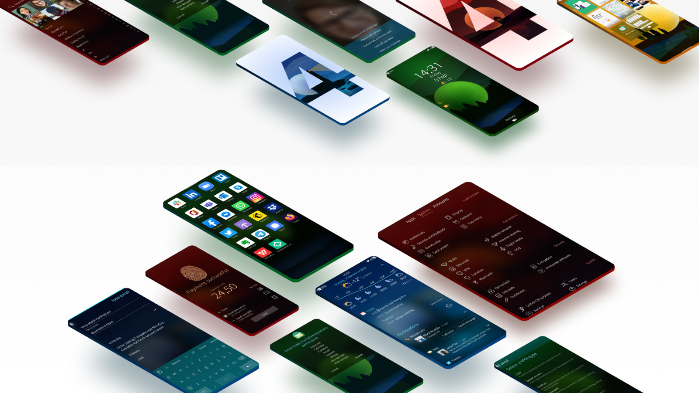
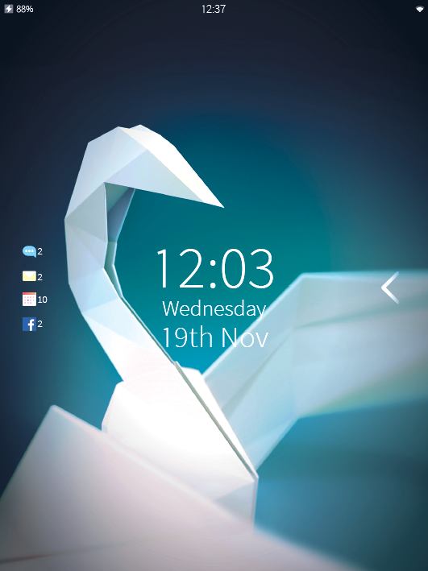
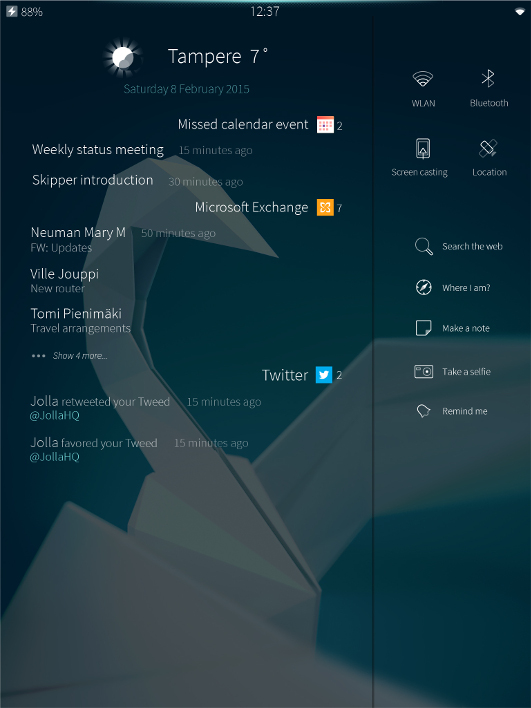
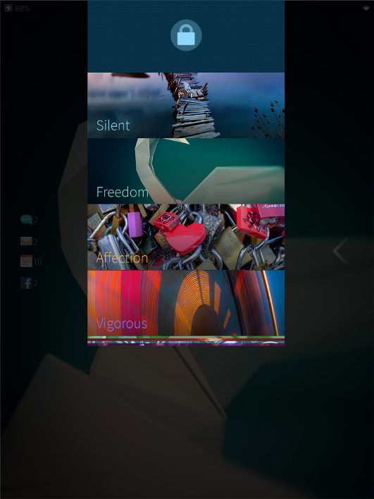
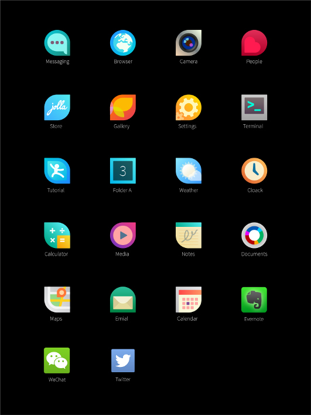
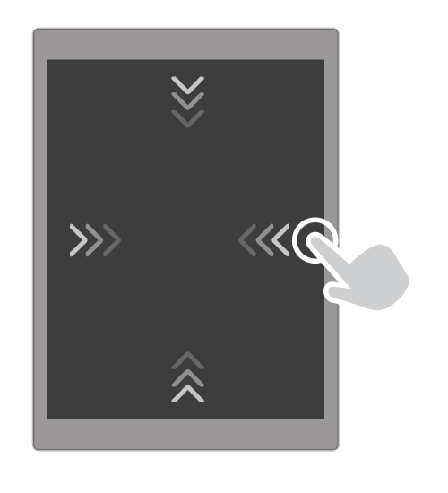
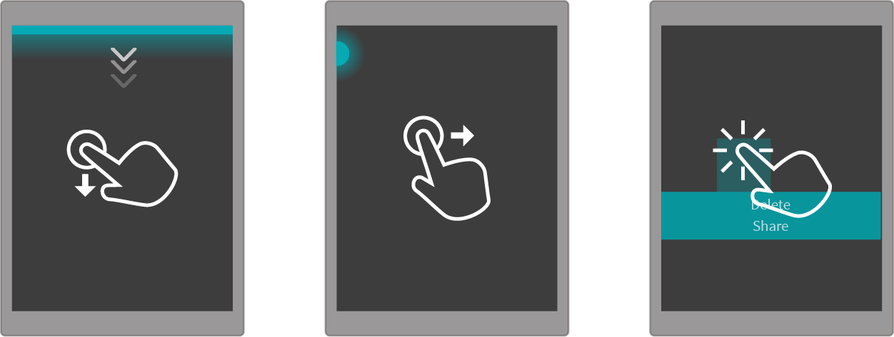
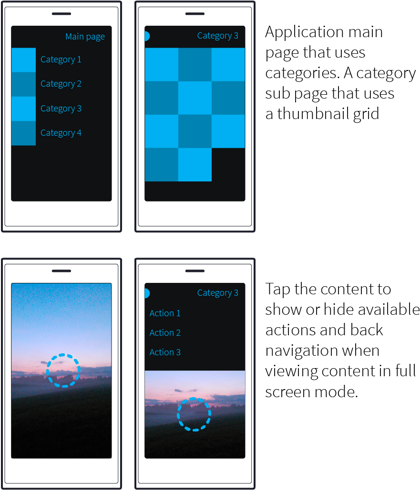
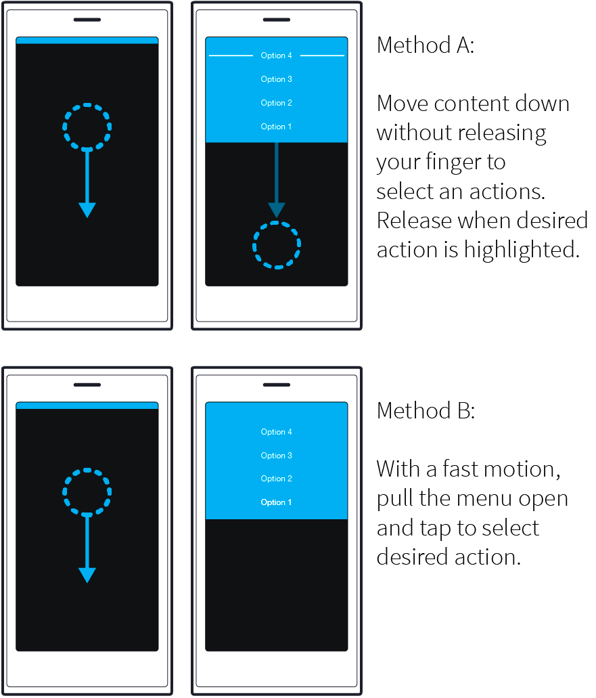

# User Experience

## Logic, consistency and intuitive movement

Multitasking on Sailfish OS shows all your running apps conveniently in one single view. At a glance, you’ll see everything that’s going on, as well as easily switch between apps. You can also control Sailfish OS apps directly from the multitasking view – for example, change your music or play and pause your video stream without opening the app in full.

Sailfish OS works with your natural hand movements via gestures. You don’t have to push tiny buttons or search your way back home – everything is always under your thumb. Sailfish gestures soon become muscle memory and every touch-point a fluid, simple, faster task. It changes the way people interact with their devices. All about gestures, user interactions, the UI framework and more

This guide provides information and support on how to create a stunning user experience for your Sailfish applications.

## Design Principles

### Effortless interaction

Interaction with Sailfish devices is effortless even in a hectic mobile environment. The core interactions are based on simple gestures, supported by visual, tactile and audio feedback. This enables users to interact with the device via the complete screen estate instead of forcing them to tap on tiny buttons, requiring stretching fingers or moving the device up and down within their hands. As an added bonus this permits to reveal more content during these gestures.

### True multitasking at its best

We tend to do a lot things with our phones at once involving several apps at the same time. Sailfish supports true multitasking, allowing you to quickly and seamlessly move around running apps. This keeps you up to date, enables you to fetch and play content and get something done even after pushing the app away from the foreground.

### Reflect your ambiance

In Sailfish, personal style and cooperation with brands are valued. The easy tailoring of the user experience enables users to create a truly individual device, reflecting their personal style and ambience. Cooperation tailoring can reflect a brand and at the same time integrate offerings and services deeply into the Sailfish OS.

### All screen estate is yours

For the user, content is one of the most important parts of the user experience. In Sailfish the UI Chrome, the static screen estate reserved by the OS, is reduced to an absolute minimum letting the user content shine.

### Simply beautiful

Sailfish designs are simple, beautiful and uncluttered. Content is presented clearly, text is legible, animations, haptics and sounds follow an overall theme and support user interactions. The visual style is simple, though warm and friendly; it is based on metaphors of glass and shining light.

### Logical

Sailfish designs are logical and consistent. Consistency means here that similar interaction flows and visuals are reused for similar tasks. Combined, these create more fluent task flows and greater user satisfaction since users can apply a flow they’ve learned easily in other areas.

### Magical

Instead of just doing something different, the intention behind Sailfish is to always improve, innovate and create magical design. Such solutions to problems make the user’s tasks easier, more pleasant and therefore create a positive surprise, in fact, to make the user smile a smile.

### Integrated services

Sailfish features frameworks that enable a deep integration of services. Users can access service related content and options during their core tasks instead of opening and closing a set of dedicated apps. Developers are able to hook into frameworks via plug-ins and thus speed up development time. A single plug-in is normally much easier to develop than a full UI for service features.

## UX Framework

### Lock Screen

The Lock Screen prevents accidental usage of the device. When the display is off, you can access the lock screen by double-tapping the display or by pressing the hardware power key. On the lock screen, you can see important items such as the time and date, notification icons and other system status information without needing to unlock the device. To unlock the device, perform a right or left Edge Swipe.

At the top of the screen you can see important system status information such as battery and connectivity levels.

You can see notification icons on the left-hand side.

The bottom part indicates whether camera or the App grid is shown when swiped upwards from the lower edge.

### Home

Home is the center of Sailfish OS. You always arrive here after unlocking the device and when minimizing or closing an app.

This is where all open apps are displayed in minimized form as Covers. From Home, you can quickly switch from one app to another or use the embedded Cover Actions, which allow you to perform an action without leaving Home (only available in native Sailfish OS apps).

In Home, open apps are arranged in opening order and apps don’t change place when you access them again. When the amount of open apps grows to be more than what fits to the screen, Home grows vertically.

Covers can show key information of the app with a nicer layout than just minimized app view. The Cover Actions can perform a function right away without opening the app (e.g. Update, Play/Pause) or act as a shortcut to a most used sub view of an app (e.g. Search, New alarm).

At the top of the screen you can see system status information such as battery and connectivity levels.

Cover Actions can be found at the bottom of the covers. Tap the icon to start the action. Tapping anywhere else switches to the app.

### Events

From here you can see notifications, weather and other relevant information. In addition, you can start quick actions and modify system state. Events is placed to the left of Home and thus can always be accessed from Home by swiping to right.

You can easily check notifications and today’s upcoming events.

Make quick changes to settings here without having to open the Settings app. Use Quick Actions to start new tasks.

### Top Menu

From the Top Menu you can lock the device, set the device to silent or switch to another Ambience. To access this menu, Edge Swipe from top from anywhere in the UI regardless of whether you are in Home, Events or even in an open app.

Long-pressing the power key also opens the Top Menu; as well as switching between Ambiences, you can also switch off the device from here.

### App Grid

The App Grid can be opened from anywhere in the UI with a bottom Edge Swipe, regardless of whether you are in Home, Events or within an open app. Apps can be rearranged, grouped into folders or deleted by long-pressing on any app icon. Then you can remove an app by tapping the small x, move an app by grabbing the icon and dragging it around or create a folder by dragging one app on top of another. When apps do not fit anymore to one page, more pages are added below.

# Gestures

## Tap

The most basic gesture with touch screens is tap. When you briefly touch the screen on top of an object, the default action of an object is performed.

## Double Tap

In Sailfish OS double tap is used to wake up the device when the display is off. In apps the double tap can be used for e.g. zooming in as an addition to pinch-to-zoom gesture. This enables better one-hand usage.

## Edge Swipe

Getting back to Home, as well as accessing App Grid and Top Menu rely on Edge Swipes. Perform an Edge Swipe by placing your finger at the very edge of the screen and moving it towards the center of the screen.

Edge Swipe from top brings up the Top Menu.

When you are within an app, Edge Swipe from right (or left) takes you back to Home, where you can see your minimized apps.

You can also take a Peek at Home by starting an edge swipe and then, without lifting your finger, reversing the swipe back to the edge. This way you don’t need to actually leave the app for checking system status or updated information on app covers.

Edge Swipe from bottom always opens the App Grid.

## Gestures for Navigation and Actions

In Sailfish OS there are also more gestures than just Edge Swipes. Following gestures are mainly used for navigating inside apps or accessing actions which are not necessarily directly visible in UI.

A glow at the top of the screen indicates that there is a Pulley Menu which contains actions for the page you are on. Move the page downwards to use the menu.

Within an app, you will see a dot at the top left if you are on a sub page. To go back to the previous page, move the current page to the right.

When you want to use actions for individual items on a page, long-press the item to open a menu of available actions.

# Navigation architecture

On a mobile device, it’s crucial to break down complexity into a sensible and understandable form. Sailfish OS apps use pages to form a simple hierarchy that’s compatible with common content and application types. Special care went into harmonizing how horizontal touch gestures are used by applications. This saves development time and make it easier for new users to get up to speed with the app.

## Application pages

When opening a new application page, it stacks up with its parent. Moving application page horizontally, user can navigate back to the previous page. When a single page is not enough, you can use an attached page. It’s another page that’s appended to the page stack, after the current one. You can access it moving the current page to the opposite direction (next page, instead previous one). If you’re porting an app to Sailfish OS, you can use attached page as a replacement for the “Hamburger/basement menu” or different sidebars.

## Pulley menu

A pulley menu is an interactive extension of a page. It can be placed at the top or bottom of a page, and when user moves the content, the pulley menu is revealed. This pattern frees user from the need to reach a certain part of the screen to tap a touch target. Using a pulley menu depends of the distance between press and release coordinates alone. Keeping the number of menu options below five guarantees that the app works also in landscape orientation.

## Dialogs

When you need user confirmation to a functionality, use a dialog page. It uses the page stack gestures to cancel or accept the dialog. User will go back to cancel, or forward to accept the changes presented in the dialog. Dialog page has a distinctive header to separate it from a traditional page. User is taken back to the parent page, after interacting with a dialog.

# App icons

[Find icon design here](https://sailfishos.org/design/icons/)
