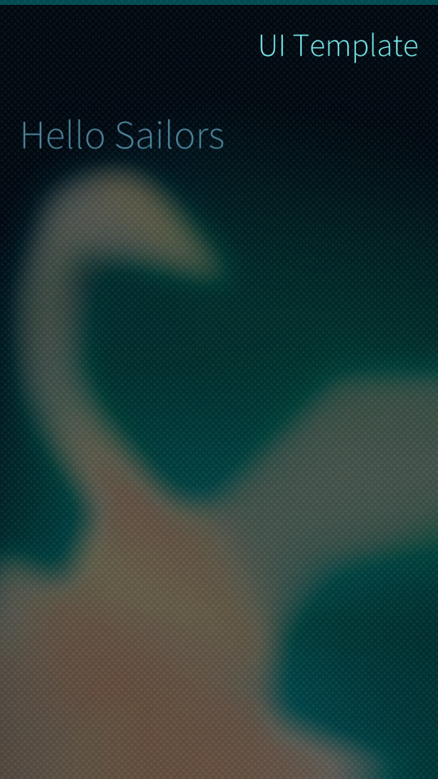
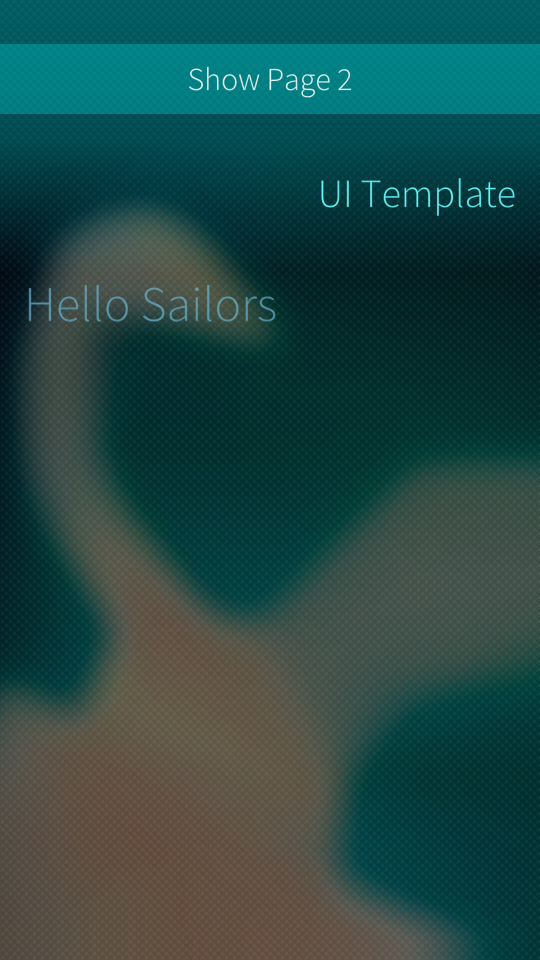
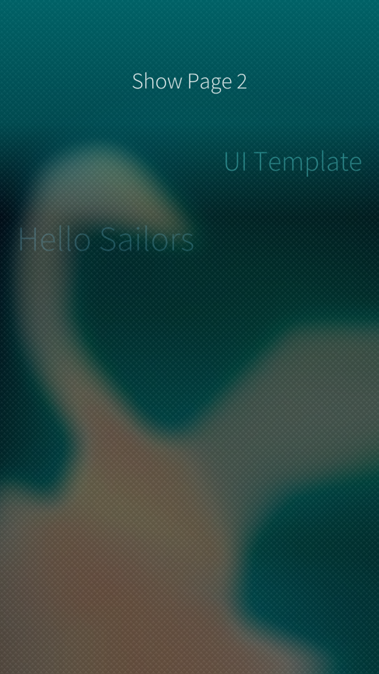
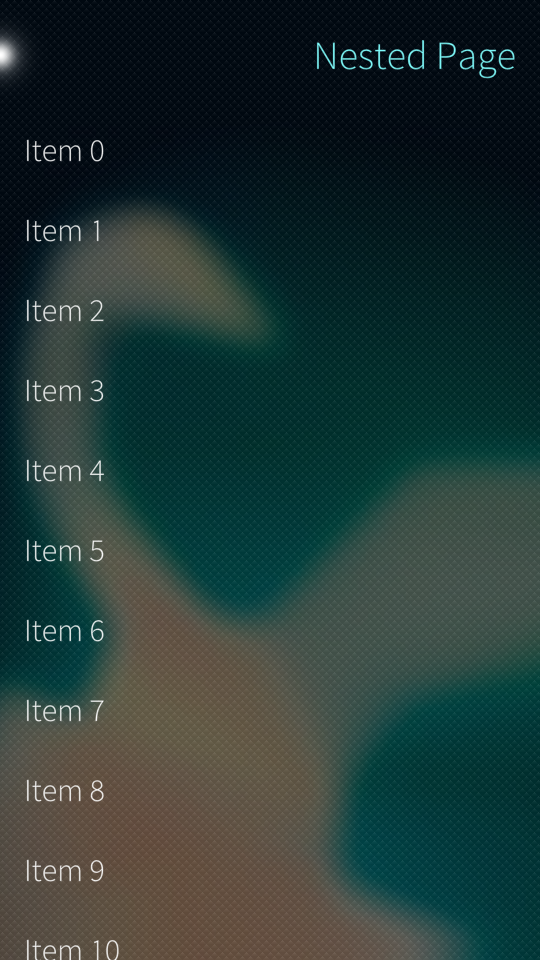
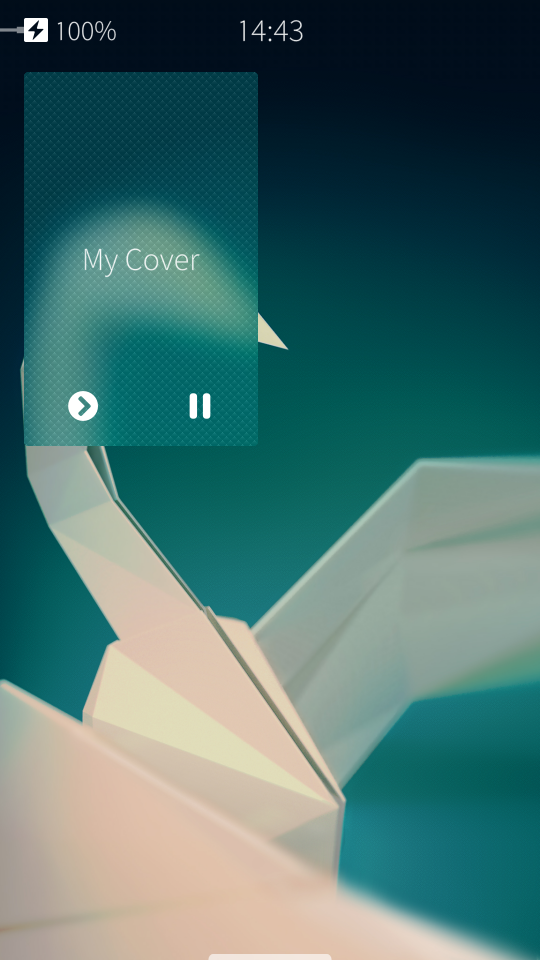

## Using Sailfish OS Apps

Sailfish OS is a touch based UI – we’ll quickly explain how to use some of the gestures in the emulator – for a complete explanation see the UX framework page. There are two kinds of gestures in Sailfish OS – “pulls” are those within the screen; “pushes” are those starting outside the screen. It may help to think of moving an edge of the screen by pushing or pulling it.

> Hint: Pushes are a little tricky to use in the emulator with a mouse since they actually start at the very edge of the window – some users prefer to disable mouse integration in VirtualBox (press Host + “I” or use the Machine menu) to make it easier to push from the edge.

### Pulley Menu

In the UI, notice the glow at the top edge. It indicates a pulley menu which can be revealed with a pull-down gesture in the main window.

### Nested Page

The pulley menu item “Show Page 2″ takes you to the next Page. The menu item can be activated in two ways:

1.  Pull the pulley menu down until the menu item is highlighted; then release to activate, or
    
2.  Pull the pulley menu all the way down to expose the entire menu, and tap on the menu item to activate
    

In the second page, notice the visual indicator at the top left corner. It indicates that this is a stacked page.

To move back to the first page you can:

1.  simply pull from left to right anywhere in the screen
2.  pull from left to right on the page header (useful if the screen has other touch functionality)
3.  touch the glowing page indicator in the top left corner
    

### Active Cover

Applications running in the background have “Covers” which provide a visual summary for the application and support interaction as well. They are displayed in the Home area.

You can access the Home area and see the active cover of the application you just compiled by pushing the application from the side.

This application is showing “My Cover” as the visual representation and provides Play and Pause icons to describe the possible actions.

Pull the cover from left to right to access the left action; pull the other way for the right action.

### Stopping the Application

In the Home screen press and hold the application until the covers fade out and provide a close button – then tap the close button

You can also close the application directly from Sailfish IDE (Qt Creator) by using the stop button.

Next, [Code walkthrough](/Develop/Apps/Code_Walkthrough).
