## Your First App

If you don’t have the SDK installed and running yet, follow the [installation guide](/Tools/Sailfish_SDK/Installation).

### Launch Sailfish IDE

You can launch from the ‘Sailfish IDE’ entry in the system menu (or from `~/SailfishOS/bin/qtcreator` if you’re a Linux terminal person).

As an example, on Ubuntu, open the dash, type in ‘sailfish’. Click on the ‘Sailfish IDE’ icon to launch the IDE.

<a href="Ubuntu_dash_QtC.png" style="width:30em;display:block">
    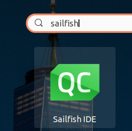
</a>

### Create a Sailfish UI Project

The SDK comes with a Sailfish UI template project that makes it very easy to get started.

1\. In the IDE, click on **File→New File** or **Project**.

<a href="QtC_New_Project.png" style="width:30em;display:block">
    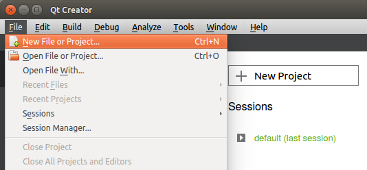
</a>

2\. Select **Applications→Sailfish OS Qt Quick Application** and then click **Choose**.

<a href="QtC_Choose_Template.png" style="width:30em;display:block">
    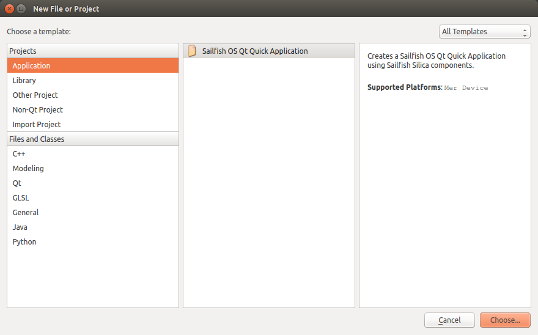
</a>

3\. Give a name to your project. Ensure it is created somewhere under your home directory and click **Next**.

<a href="QtC_Template_01.png" style="width:30em;display:block">
    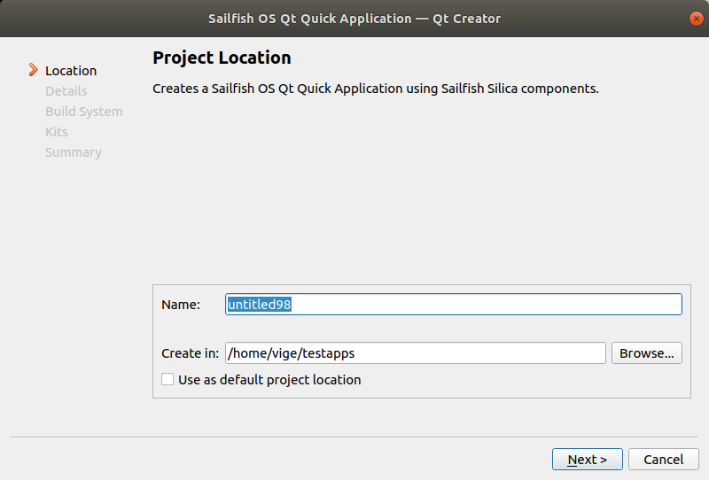
</a>

4\. You can edit the short description of your project or just click **Next**.

<a href="QtC_Template_03.png" style="width:30em;display:block">
    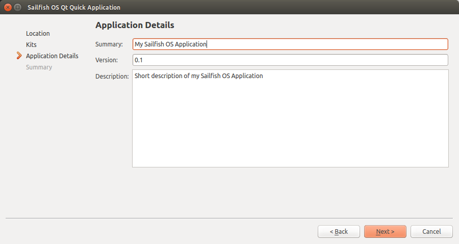
</a>

5\. Select a build system. The default (qmake) is a good choice, but we do support CMake as well, so if you are more familiar with it you may want to try it instead.

<a href="Buildsystem.png" style="width:30em;display:block">
    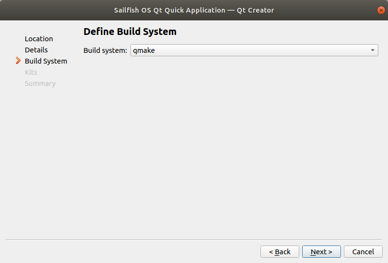
</a>

6\. Select the kit(s) used for building the project. Select `SailfishOS-<version>-armv7hl` for 32-bit ARM devices, `SailfishOS-<version>-aarch64` for 64-bit ARM devices (e.g. Sony Xperia 10 II) or `SailfishOS-<version>-i486` for the emulator.

<a href="Kits.png" style="width:30em;display:block">
    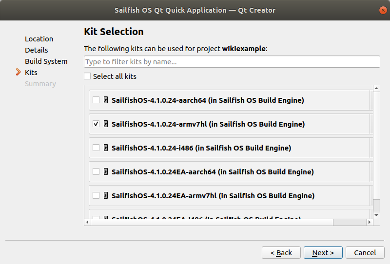
</a>

6\. Click **Finish**.

<a href="QtC_Template_04.png" style="width:30em;display:block">
    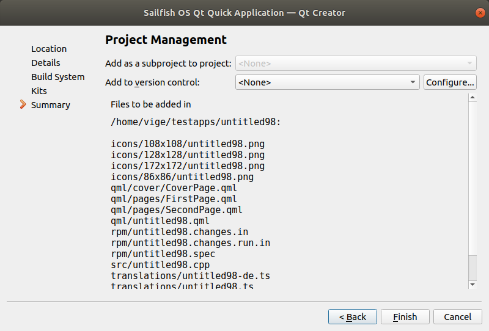
</a>

7\. The project template is imported into your project and opened in the editor.

<a href="QtC_Open_Project.png" style="width:30em;display:block">
    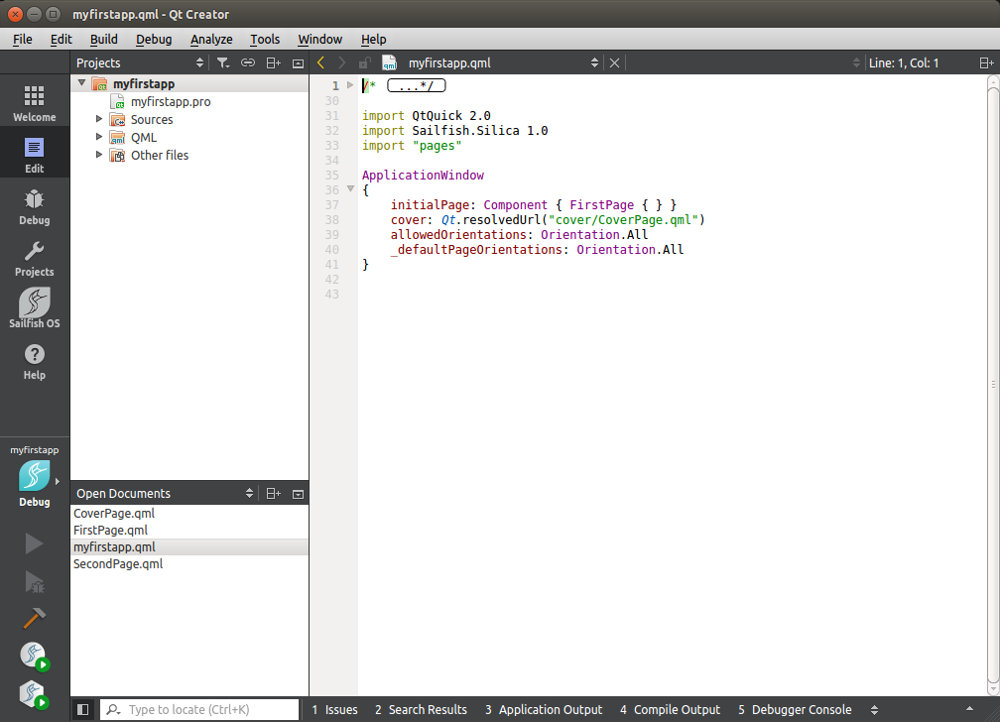
</a>

### Launch the Build Engine and the Emulator

The Sailfish SDK uses a build engine (virtual machine or Docker container) to compile your code and another virtual machine to run an emulator. If these are not running when you attempt to build or deploy an application you will be asked to start them.

> Note: The Build Engine needs access to your source code to compile it and by default your home directory is shared – this is why the project should be in your home.

When a Sailfish OS project is open, the SDK automatically displays two control buttons in the left toolbar for starting/stopping the Build Engine and Emulator.

<a href="Toolbar_Icons.png" style="width:30em;display:block">
    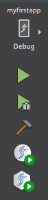
</a>

1. Click on the  icon to launch the Build Engine.\
   The Build Engine is started in the background and the icon will turn gray until the build engine has booted up.

1. Click on the  icon to launch the emulator.\
   NOTE: This icon is only available if the `SailfishOS-<version>-i486` kit is active. You can activate the `SailfishOS-<version>-i486` kit from menu **Build → Open Build and Run Kit Selector…**.

A new VirtualBox window opens and boots up the emulator.

#### Successful connection

When the Qt Creator can successfully connect to both the Emulator and the Build Engine, the icons are updated as shown below.

Before connection:
  - 

Connection established:
  - <a href="Toolbar_Icons_Stop.png" style="width:30em;display:block">
      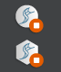
    </a>

### Create a Connection to Sailfish OS Hardware Device

Sailfish SDK can also deploy application to Sailfish OS hardware device. This feature requires a valid Sailfish OS hardware device to be set-up with USB or WLAN connection to computer and making sure that it is possible to connect to it over SSH with password. When using Sailfish OS hardware device as development device in SDK a valid kit needs to be selected (such as `SailfishOS-armv7hl` target).

Sailfish OS hardware device setup is done using Qt Creator’s device settings. Depending on your host environment this is found from either the menu **Tools→Options→Devices** or **Qt Creator→Preferences→Devices**. In this settings view, click **Add…** to start creating device settings.

Unless some custom configuration is used, these default values work just fine. If you encounter timeouts with SSH connections on your PC, you can modify the timeout setting also after the device has been created. Connect the device now, enter your SSH password and press Test Connection as described in the dialog. On successful completion, you can click Next to continue.

<a href="HW_Select.png" style="width:30em;display:block">
    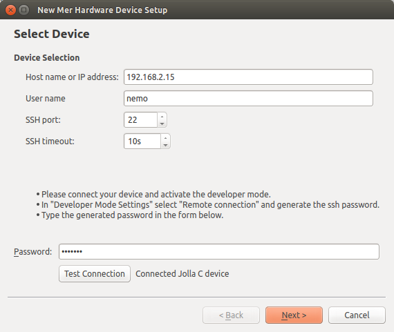
</a>

In the next dialog, you can review and further adjust connection related configuration. Click **Next** to continue.

<a href="HW_Configure.png" style="width:30em;display:block">
    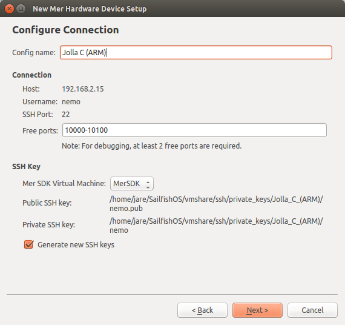
</a>

In next dialog just click **Next** unless you want to abort device creation. In that case click **Cancel**.

Qt Creator shall then create device configuration, deploy the SSH key to device and finally test the setup. In those dialogs user can only click **Close** to go to next phase.

Once tested and verified, Qt Creator shows a view which shows the created device. Notice that configuration files are not updated yet, so if you don’t press **OK** or **Apply** changes will not be saved.

That’s it. Now Qt Creator can deploy your application to device.

### Set ARM Kit to Deploy to Device

By default ARM kit will create RPM binaries, it won’t even try to deploy to device. The deploy option **Build RPM Package for Manual Deployment** is selected. This can be changed from Qt Creator’s main view with deploy options, select **Deploy as RPM Package** or **Deploy by Copying Binaries**.

<a href="ARM_Kit_Select_Deploy.png" style="width:30em;display:block">
    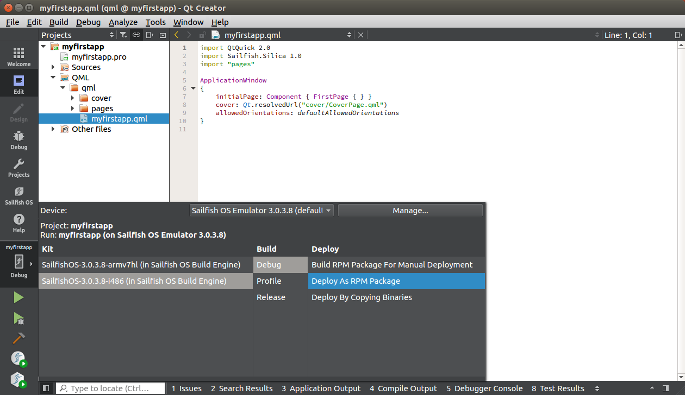
</a>

Congratulations! Now you can build and deploy to Sailfish ARM device.

### Build and Deploy the App

Press the 
button in the toolbar to compile and run the project on the emulator.

That’s it! You just ran your first Sailfish OS application. It should be running in the emulator as shown below.

#### Build RPM Package for Manual Deployment

The default deploy option is to only build RPM packages. In this case the Run and Debug buttons are replaced with single Deploy button, that can be used to create the RPM packages. Alternatively the menu **Build → Deploy Project “projectname”** can be used to trigger package creation.

Next steps: exploring how to [use the application](/Develop/Apps/Using_Sailfish_OS_Apps).
