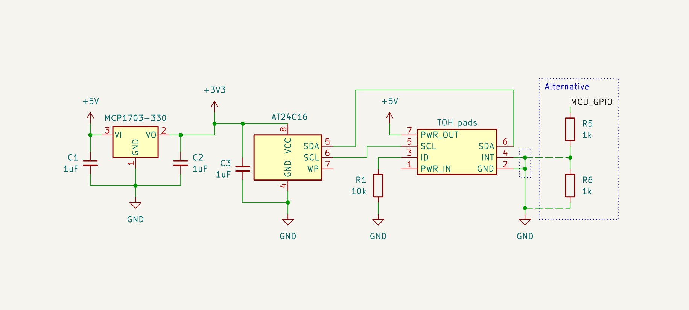

# Jolla Phone (2026) The Other Half development

This page contains information for developing _The Other Half (TOH)_ back covers for _Jolla Phone (2026)_.

The page uses 0x prefix to denote hexadecimal integer values.

_Any details on this page are still under development and subject to change without notice._

## Pogo pins

The phone side has the following pogo pins (as numbered in the image):

1. Power input pin (5-9 V, max. 1 A) for charging the device
2. Ground pin
3. ID pin to connect a resistor for rough TOH identification
4. Interrupt pin for TOH to signal towards the device
5. SCL pin for I²C / I3C bus
6. SDA pin for I²C / I3C bus
7. Power output pin (5 V, max. 1 A) for powering TOH

||
|-|
|TOH connector pads on the phone (as viewed from behind the device)|

Pogo pins are spaced 2.90 mm apart in both dimensions (horizontally and vertically).

Note that the pogo pins provide only 5 V output but I²C / I3C bus is 3.3 V thus most TOH designs need a voltage regulator.
The 5 V output is designed to be able to provide more power for TOH than what 3.3 V would allow.
For low power TOH designs a simple low-dropout linear regulator (LDO) will suffice.
Power output is provided during reading of the memory chip and on request after that until detaching of TOH is detected.

Charging current is limited to maximum of 1 A by default.
Charging from TOH is disabled when USB power is connected.

The device acts as I²C / I3C controller.
TOH should not provide its own pull-ups on SCL and SDA pins.

ID pin and INT pin use are described later in [Detecting TOH presence and type](#detecting-toh-presence-and-type).
ID and INT pins should not be connected to 3.3 V or 5 V.

## Dimensions, pin locations and mounting points

Pogo pin connector is located on the lower right behind the device.
There is a small pocket of space left of the pogo pin connector that can be used for the TOH components when they are located on the phone side of the PCB.

||
|-|
|Locations and measures from behind the device. All measures are referencing the phone sides. The phone outline and clip locations are approximate.|

There are clips all around the device on the sides and two more in the middle.
Those are the main way of attaching TOHs.

There are also four M1.4 screw inserts (2.0 mm deep) around the device for securing TOH in place.
This is useful for heavier and bulkier TOHs that may not have sufficient grip from plastic clips alone.

## Detecting TOH presence and type

There are three things on TOH detection: interrupt that tells a cover may have been attached or detached, ID pull-down resistor that tells how to detect TOH, and then I²C communication to read a memory chip.

Every TOH should connect INT to ground by default so that attachment can be detected, and a pull-down resistor on ID pin that determines the way to identify the connected TOH.
Grounding INT pin can be achieved via straight connection to ground if TOH does not need to control INT pin.
Internally INT pin is pulled to 1.8 V and the device has a current limiting resistor for it.
If TOH needs to control INT pin, then it should use a pull-down resistor between 1 kohm and 2.7 kohm on INT pin.
The default is to always pull INT pin low but TOH can set the pin high (max. 1.8 V) once it has been given permission to use INT from the device and it needs to send an interrupt.

When TOH is attached the device sees an interrupt on INT pin and checks ID pin voltage set by the pull-down resistor.
Depending on the voltage the next step may be to turn on 5 V on power output pin and read I²C memory chip at address 0x50.
The memory chip content describes what TOH has been connected and how it should be handled.

Detaching TOH is detected by INT pin becoming high and the device reading a voltage that tells there is no ID pin pull-down present any more.

||
|-|
|Minimal TOH circuit example. Alternative circuit marked with dotted outline, use it if INT needs to be controllable, in which case do not connect INT directly to ground.|

### Selecting ID resistor value

**I²C memory chip must have target device address of 0x50.**
This is a very common memory chip address and also used for example for EDID info on displays.
However different memory chips have different ways of addressing the data.
To facilitate that some ID resistor values have been assigned to certain types of I²C memory chips.

**Use 1% tolerance or better resistors for ID.**
This allows for a good range of values and takes into account variance in ADC accuracy.

Below you can find currently assigned resistor values for ID pin pull-down.
The table may be extended in the future.

| ID pull-down resistor | Type | Example chip |
|-----------------------|------|--------------|
| 10 kohm               | 8-bit addressed memory chip with up to 256 byte blocks | AT24C16 |
| 15 kohm               | 16-bit addressed memory chip with up to 65,536 byte blocks | AT24C256 |

Note that the chips may expand to further blocks in following target device addresses after 0x50.
For example AT24C16 uses 8 blocks in addresses 0x50-0x57.

A TOH with a microcontroller unit may emulate a memory chip at target device address 0x50.
In that case it should use a resistor that corresponds to the emulated memory chip.
Most microcontrollers cannot support very many I²C addresses when acting as a target device.
Thus it is recommended that TOHs with emulated memory chips use 15 kohm resistor and 16-bit addresses if they ever want to expand beyond 256 bytes but remain within one block of memory.

### Memory chip content

The table below describes what the memory chip must contain.
First value at address 0 in the order of the table.
All integers longer than one byte are big-endian (aka network byte order).

| Name         | Size     | Offset | Value |
|--------------|----------|--------|-------|
| Magic        | 4 bytes  | 0x00   | 0x4A, 0x54, 0x4F, 0x48 |
| Checksum     | 4 bytes  | 0x04   | CRC-32 of the following memory content until the end of the payload |
| Vendor ID    | 2 bytes  | 0x08   | Vendor specific ID |
| Product ID   | 2 bytes  | 0x0A   | Vendor chosen product ID |
| Reserved     | 2 bytes  | 0x0C   | 0x00, 0x00 |
| Payload size | 2 bytes  | 0x0E   | Size of payload in bytes |
| Payload data | Variable | 0x10   | CBOR data |

After this there can be any content that TOH needs, such as configuration data.
It is preferred to not alter the memory chip content described above on a regular basis and it may also be write protected.
Firmware updates to TOHs may change the content if needed.

Reserved bytes should be set to zero as they are reserved for a future need.

**Vendor ID must be a value assigned to the vendor of TOH.
Do not use ID specified for another entity.**
See the table below for currently assigned values.

<!-- The table at docs.sailfishos.org is the official table. Any other copies may or may not be correct. -->

Product ID is something that the vendor of TOH decides.

#### Assigned TOH vendor IDs

Use only your own TOH vendor ID, or 0x0000 when you are developing a product and have not yet got an assigned ID.
To request a vendor ID send a PR to the documentation to add another line to the table below.
The ID is considered as reserved once the PR has been merged.

| Entity | Vendor ID |
|--------|-----------|
| Reserved for TOH development | 0x0000 |
| Jolla Mobile Ltd | 0x0001 |

#### Payload data

The CBOR data format that payload uses is a common JSON like binary format that has much lower overhead.
The purpose of payload data is to define things like whether 5 V output should be left on after reading the memory chip,
if the attached TOH is intended for example as a charging TOH or as an input TOH,
what ambience should be applied if any,
or a website for the vendor or product to get more information.
Extensibility of CBOR allows to add new data in future TOHs.

The payload should be a single CBOR encoded map with keys defined in the following table.
All keys are optional.
Two letter strings were chosen for keys to save space and provide sufficient extendability.

| Key | Type    | Content |
|-----|---------|---------|
| SC  | Integer | Schema version, currently always 0x00 |
| SN  | String  | Serial number, can be any text |
| VN  | String  | Vendor name |
| PN  | String  | Product name |
| VS  | String  | Vendor website URL |
| PS  | String  | Product website URL |
| PO  | Boolean | Leave power out enabled after detection |
| PI  | Boolean | Whether this is a power input TOH |

The table may be extended to support more keys in the future.
