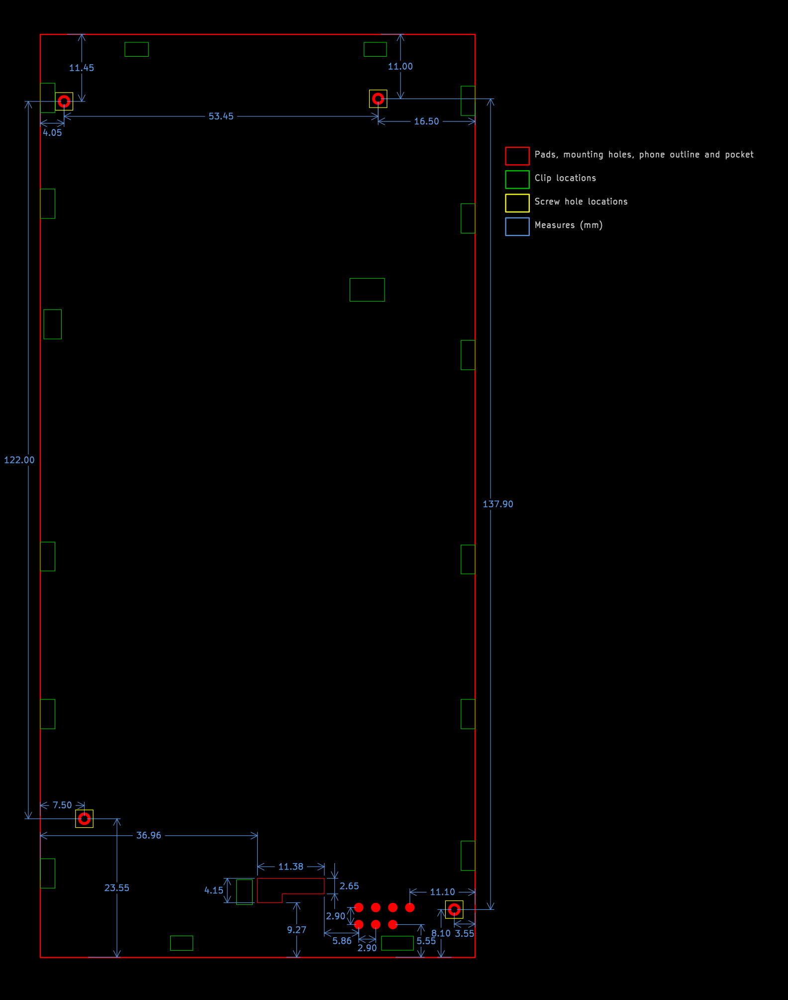

# Jolla Phone (2026) The Other Half development

This page contains information for developing _The Other Half (TOH)_ back covers for _Jolla Phone (2026)_.

_Any details on this page are still under development and subject to change without notice._

## Pogo pins

The phone side has the following pogo pins (as numbered in the image):

1. Power input pin (5-9 V, max. 1 A) for charging the device
2. Ground pin
3. ID pin to connect a resistor for rough TOH identification
4. Interrupt pin for TOH to signal towards the device
5. SCL pin for I²C / I3C bus
6. SDA pin for I²C / I3C bus
7. Power output pin (5 V, max. 1 A) for powering TOH

||
|-|
|TOH connector pads on the phone (as viewed from behind the device)|

Pogo pins are spaced 2.90 mm apart in both dimensions (horizontally and vertically).

Note that the pogo pins provide only 5 V output but all the IO is 3.3 V thus most TOH designs need a voltage regulator.
The 5 V output is designed to be able to provide more power for TOH than what 3.3 V would allow.
For low power TOH designs a simple low-dropout linear regulator (LDO) will suffice.

Charging current is limited to maximum of 1 A to protect the pogo pins.
Charging from TOH is disabled when USB power is connected.

## Dimensions, pin locations and mounting points

Pogo pin connector is located on the lower right behind the device.
There is a small pocket of space left of the pogo pin connector that can be used for the TOH components when they are located on the phone side of the PCB.

||
|-|
|Locations and measures from behind the device. All measures are referencing the phone sides. The phone outline and clip locations are approximate.|

There are clips all around the device on the sides and two more in the middle.
Those are the main way of attaching TOHs.

There are also four M1.4 screw inserts (2.0 mm deep) around the device for securing TOH in place.
This is useful for heavier and bulkier TOHs that may not have sufficient grip from plastic clips alone.
