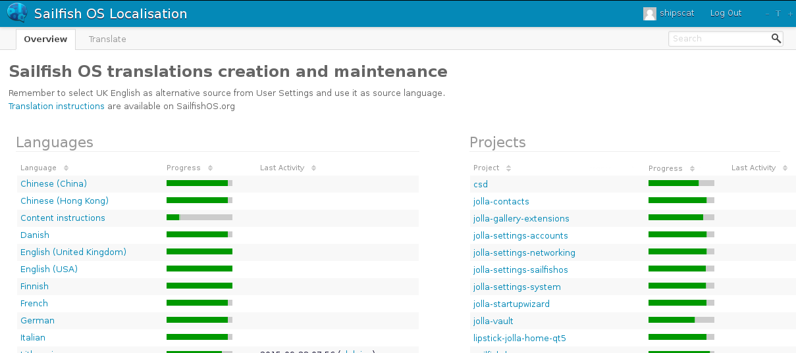
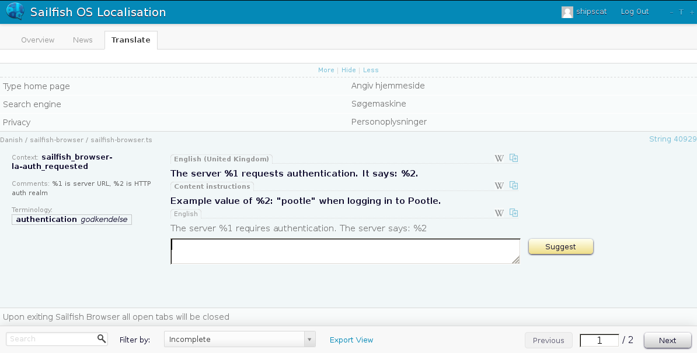
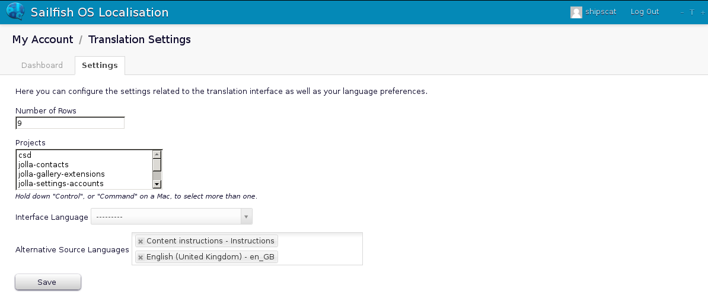

Help making Sailfish OS word-perfect by using our [Community translation tool](https://translate.sailfishos.org)!

# Log in

We're certain you can't wait to get started, please go ahead by logging into [<https://translate.sailfishos.org>](https://translate.sailfishos.org/accounts/login/?next=%2F) using your Jolla Account credentials ([click here](https://account.jolla.com/registration/register) to register a new account).

If for any reason login is unsuccessful, please logout/login to <https://account.jolla.com> before raising an issue on FSO.

Please do not rush to use the tool before you have read through the rest of this document.

# Stay tuned

The most important in this agile world of localisation is to keep yourself up-to-date with the latest announcements.

We strongly suggest to review the `Localisation` category on our Q&A forum -- the [FSO](https://forum.sailfishos.org/c/localisation/20).

Look out for [translation round announcements](https://forum.sailfishos.org/tag/translation-round) and follow general [L10n discussions](https://forum.sailfishos.org/c/localisation/20).

# Be heard

Feel free to use FSO to ask questions about the best ways to translate, where in the UI a particular strings shows up (context), discuss with your compatriots, and tag such questions with `translate`.

If it is language specific, add apropriate tag. For example: to talk about some particular wording in Chinese, tag with `chinese`, but if it's region-specific, tag with `chinese-hong-kong` or `chinese-china` (likewise `norwegian-bokmal` without the "å")

If you plan to make a mass-translation of a certain term, like renaming all occurrences of "Périphériques" to "Appareil" in French, please by all means first create a FSO question about this first, to discuss with your fellow language speakers and get such mass-change approved!

# Requesting a new language

Any newly added languages will be community-driven -- made of contributions and downloadable separately as language packs.

The current list of suggested languages and their coordinators is [shown on TJC](https://together.jolla.com/question/134467/official-announcement-translate-sailfish-os-elections-of-community-languages-linguists/#comment-134485). But please use FSO for new requests, as TJC is now read-only.

To join this vibrant community, follow the three steps below.

## Three essential steps

...of how to get your favourite language off the ground quicker and make life easy for other translators:

  - Write a [style guide](/Develop/L10n/Style_Guides)
  - Volunteer to [coordinate](#coordinators) it
  - Fill up its [Terminology](#terminology) project

# Tone of voice

Sailfish OS Tone is **informative**. We want to keep the users on top of all UX aspects, whether they are design or technical.

Sailfish OS Tone is **honest**. Be concise yet sincere.

Sailfish OS Tone is **unambiguous**. Without this we cannot be informative and honest. We need to make sure the message cannot be misinterpreted.

Sailfish OS Tone is **jolly**. We are on a voyage, sailing the seas with our captain. Keep this in mind and reflect in the UI. Translations shouldn't be dead serious... So long as they are correct and not misleading.

Sailfish OS Tone is **young**. We target to interact with the users and talk with them, not to them. We want to use the same tone that is used in everyday life.

## Why we define our tone

Consistently formatted and formulated messaging gives readers the possibility to concentrate to the message said. It identifies the speaker. It involves the readers in different ways (calms them, is informative, involves user by strong identifiable style…) The tone of voice targets to differentiate us. It shows our values and it shows our personality. Good article on the matter: <http://www.bloomberg.com/news/articles/2005-09-24/lose-the-jargon-voice-your-brand>

# Style

Style guides are important to keep translations nice and consistent. Below in the articles you'll find instructions for a running system translations (UI strings), as well as technical writing for documents such as user manuals (those are not being localised in our Pootle at the moment, but good to have for the future).

  - [Language Style - Chinese (China)](/Develop/L10n/Style_Guides/Chinese_%28Simplified%29)
  - [Language Style - Chinese (Hong Kong)](/Develop/L10n/Style_Guides/Chinese_%28Hong_Kong%29)
  - [Language Style - Danish](/Develop/L10n/Style_Guides/Danish)
  - [Language Style - English (United Kingdom)](/Develop/L10n/Style_Guides/English_%28United_Kingdom%29)
  - [Language Style - Finnish](/Develop/L10n/Style_Guides/Finnish)
  - [Language Style - French](/Develop/L10n/Style_Guides/French)
  - [Language Style - German](/Develop/L10n/Style_Guides/German)
  - [Language Style - Italian](/Develop/L10n/Style_Guides/Italian)
  - [Language Style - Norwegian Bokmål](/Develop/L10n/Style_Guides/Language_Style_-_Norwegian_Bokmål)
  - [Language Style - Polish](/Develop/L10n/Style_Guides/Polish)
  - [Language Style - Portugese](/Develop/L10n/Style_Guides/Portugese)
  - [Language Style - Romanian](/Develop/L10n/Style_Guides/Romanian) (community)
  - [Language Style - Russian](/Develop/L10n/Style_Guides/Russian)
  - [Language Style - Slovak](/Develop/L10n/Style_Guides/Slovak) (community)
  - [Language Style - Spanish](/Develop/L10n/Style_Guides/Spanish)
  - [Language Style - Swedish](/Develop/L10n/Style_Guides/Swedish)

Contribute a guide for your language using our [Language Style - HOWTO](/Develop/L10n/Style_Guides)\!

# Terminology

The world of IT is filled with technical terms, hence we keep a glossary handy to not get lost in translation. We called that project ["Terminology"](https://translate.sailfishos.org/projects/terminology/) in Pootle, not associated with any particular application, and contains useful terms for each language.

  - **If it's a newly added language, complete its Terminology project first and foremost. Pootle automatically fetches words from there when translating all other projects!**
  - Term's translation may also describe different variations, e.g. email (noun), Email (app name)
  - Proposing new terms can be done in [forum.sailfishos.org](https://forum.sailfishos.org/c/localisation/20). Please supply all needed information and description, explaining purpose and reasoning
  - To improve a term, ensure you have familiarised yourself with the [Translation Tool](#translation-tool) guide, then suggest a better translation. Only in the Terminology project you can vote for existing term suggestions by pressing the star symbol
  - Do not perform mass-renames throughout all other projects, without having a conclusive discussion on FSO with people speaking your language, and without getting the term changed first.

# Translation tool

Please first familiarise with [Tone of Voice](#tone-of-voice), [Style](#style) guidelines, and the [Terminology](#terminology) project before doing any translation work.

## Getting started

Main view presents available apps (called projects) and languages

The quickest way to start contributing is:

1.  click on a language you'll be translating to
2.  choose a project
3.  click on a number (of words) in the "Need Translation" column

You'll be taken to the first untranslated entry in the Translate view

Upon your very first login you will notice at most three source languages above the input box: English (United Kingdom), Content instructions, and "English". The latter (non-bold one) is Engineering English, and should **never** be taken as reference to translation, because it may not always follow correct terminology, spelling, or grammar. Look back at EE only when you need an additional "technical" clarification as last resort.

Properly localised strings, with correct terminology, are in the "English (United Kingdom)" language, along with "Content instructions" meta-language for further explanations where applicable.

Feel free to input your translation and click "Suggest" (Ctrl+Enter as shortcut).

It will now appear as a suggestion, and eventually will be approved and submitted by your language Coordinator (for more on Translator Roles [click here](#translator-roles-groups))

To quickly browse between entries, you can press Ctrl+Up/Down. To change which entries can be edited, adjust the "Filter" at the bottom of your browser.

To add other source languages we shall go to the profile settings: click on your username in the top-right corner: "My Account" view contains the needed setting "Alternative Source Languages"

Add any similar languages that might help translating (e.g. for Danish we can add Swedish). Click "Save".

## Handling plurals

Everyone prefers correct plural forms, avoiding cases like "You have 1 new messages", or the need to add "You have 1 new message(s)". Some languages have more than one plural, e.g. in Lithuanian to accommodate all cases, one would pollute their translations with "Turite 1 naują/-as/-ų žinutę/-es/-čių".

Qt and Pootle work together to solve this, so all strings which contain a number token `%n`, will request as many translations as language has plurals.

For example, the People app contains the string in English (Engineering English): "%n contact(s) already available."

To translate into "English (United Kingdom)", there would be two input boxes presented. If you hover each box, you'll see "Plural Form 0" and "Plural Form 1". By evaluating the [plural equation for a given language](http://localization-guide.readthedocs.org/en/latest/l10n/pluralforms.html) -- expression `(n != 1)` in this case, we see that the singular form (when n equals 1) is false, which in computers is represented by number 0, and true for all other cases (yields as number 1). That number corresponds to the plural form that will be used.

Therefore we translate as follows:

  - Plural Form 0: **%n contact already available**
  - Plural Form 1: **%n contacts already available**

Other languages may have more complex plural equations, with [ternary operators](https://en.wikipedia.org/wiki/%3F%3A) (? :), evaluating to a plural form number in each clause.

Don't be alarmed if you see a "pluralised" translation string which does not contain a number token `%n`. That is a completely valid case when the mentioning of actual number is irrelevant.

Which brings us to a point that you should always fill out all requested plural forms, even if some of them become equal in certain contexts. A quick example in Lithuanian:

You have %n new message(s):

  - Plural Form 0: **Turite %n naują žinutę**
  - Plural Form 1: **Turite %n naujas žinutes**
  - Plural Form 2: **Turite %n naujų žinučių**

Whereas when number of messages is not important: You have new message(s):

  - Plural Form 0: **Turite naują žinutę**
  - Plural Form 1: **Turite naujų žinučių**
  - Plural Form 2: **Turite naujų žinučių**

# Translation round schedule

As soon as we internally branch off the next release, L10n strings get pushed out to our community translation tool (Pootle), with the "call to arms" announcements on FSO and SoMe.

The round usually lasts 1-2 weeks depending on the amount of strings. The translations are then taken back in and land in the release.

Sometimes the round may be extended if late-comer strings arrive due to any development circumstances.

Community Pootle will be available 24/7 even after accepting final string state, so any typos or too-long-strings can be corrected during the time between releases and land in the subsequent release.

# Translator roles (groups)

## Default group

Upon your very first login, you will be assigned to the default group, where you will be able to only suggest translations, They will need to be accepted and submitted as actual translation by your language Coordinator.

## Coordinators

Translation coordinators are language maintainers. Their powers and duties are:

  - review: accept or decline suggestions made by anyone else
  - comment existing suggestions, if clarification is needed
  - able to translate on their own (immediately submitting their suggestions)
  - raise FSO tickets if inconsistent/incorrect suggestions keep coming in
  - accept Terminology suggestions to further ensure consistency
  - stay on top of translations: remove the "Needs work" status and act on old suggestions
  - they are welcomed to show initiative in writing and up-keeping a [style guide](/Develop/L10n/Style_Guides)

Regarding those FSO tickets: a translation dispute may arise , e.g. one translator keeps suggesting sentences in one grammatical/verbal form, the other -- in another, and in this way nearly every string gets two suggestions. Coordinator then raises a FSO question to clarify such cases.

A translator can be promoted (or volunteer) to become a coordinator on meritocracy basis (the more translations get accepted, the higher are the chances for that person to eventually start coordinating contributions made by others). We'll approach such active members ourselves, as well as they get nominated by existing coordinators or from the praises by other contributors.

Community-driven languages must have a coordinator, otherwise they do not qualify to be added to the tool (there's no-one to accept the suggestions).

To volunteer yourself as the coordinator, write under the [FSO Localisation category](https://forum.sailfishos.org/c/localisation/20), briefly describe your motives as the suitable linguist under your chosen language. You can mention your previous work or contributions (a perfect example being our great Czech/Slovak community translators). It is also possible to have multiple coordinators.
