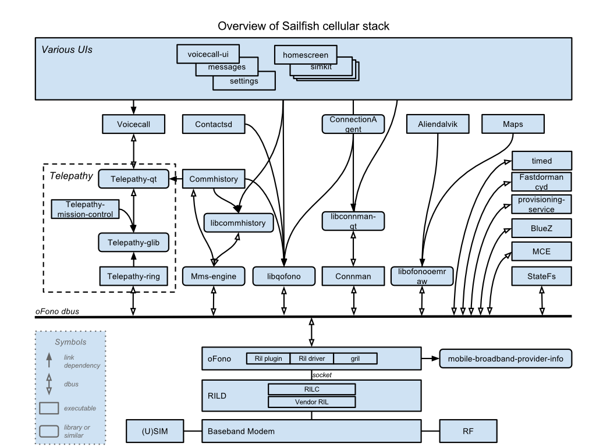

As Sailfish OS is intended for use in mobile devices and particularly in mobile phones it's quite important that there is an effective cellular telephony stack to enable the user to manage and use contacts and to make, receive and manage phone calls, messages and data connections over GSM networks - the essential functionality of a mobile phone.

## Overview

The stack consists of components that provide this functionality as well as generally interoperating with the cellular network. Some additional components that extend or enhance the use of cellular telephony are explained later as are some extension mechanisms which provide a means to implement additional feature to be found in many modern mobile phones.

The components are shown in the figure below:

The cellular stack consists of:

  - RIL : Android HAL
  - oFono : modem abstraction
  - Connman : Connection Handling
  - Telepathy : Voice and message middleware
  - D-Bus API : Modem state handling
  - Contactsd : Contacts handling
  - Call and message handling

## How and Why is Android involved?

Android currently dominates the mobile industry which leads to the almost exclusive provision of BSPs for the Android OS. SFOS therefore must make use of the low level software components (the HAL) intended for use by Android - it does this using the [libhybris](libhybris "brokenlink") compatibility mechanism.

Although the upper levels of the Telephony stack are open the modem and audio hardware adaptations are almost always proprietary.

The [Android Telephony Hardware Abstraction Layer](/Reference/Core_Areas_and_APIs/Networking/Android_Telephony_Hardware_Abstraction_Layer) (HAL) contains the hardware specific code including the Radio Interface Layer (RIL)

## oFono: cellular modem abstraction

The [Cellular Modem Abstraction](/Reference/Core_Areas_and_APIs/Networking/Cellular_Modem_Abstraction) layer hides modem specific features and dependencies from other software layers. It provides a standard interface and adapts a modem specific behaviour to that interface. It forms a central element in the telephony stack and consists of two modules: Libqofono and oFono.

In a modern mobile software platform there are other technologies that are used together with the cellular telephony. These technologies can either use the telephony technology to extend their functionality or they are used to extend the functionality of the telephony technology. Here are some extensions:

  - [Cellular Positioning](/Reference/Core_Areas_and_APIs/Networking/Cellular_Positioning)
  - [Cellular Network Time](/Reference/Core_Areas_and_APIs/Networking/Cellular_Network_Time)
  - [Cellular USB Tethering](/Reference/Core_Areas_and_APIs/Networking/Cellular_USB_Tethering)

and some users:

  - [Seamless Software Update Cellular Usage](/Reference/Core_Areas_and_APIs/Networking/Seamless_Software_Update_Cellular_Usage)
  - [Bluetooth Cellular Usage](/Reference/Core_Areas_and_APIs/Networking/Bluetooth_Cellular_Usage)

## Cellular Data Connections

Cellular networks provide data connection services to allow access to the Internet. In [Cellular Data Connections](/Reference/Core_Areas_and_APIs/Networking/Cellular_Data_Connections) are handled by five components. Four main components: ConnMan, Libconnman-qt, Nemo-qml-plugin-connectivity and ConnectionAgent. There is an additional Provisioning-service extension component.

## Telepathy Framework

The middleware for a cellular voice call and an SMS is provided by the [Telepathy Framework](/Reference/Core_Areas_and_APIs/Networking/Telepathy_Framework). Its primary purpose is to abstract the protocol or technology used for a voice call and messaging by giving a unified interface. From the Telepathy client perspective, sending a message or making a voice call should be the same regardless of the protocol or technology used. E.g. it should be no different for a client to make a cellular voice call or a SIP (Session Initiation Protocol) based IP voice call using Telepathy. This is achieved by using a modular design where each module communicates with each other via the D-Bus communication framework.

## Cellular modem

In a mobile software platform it is necessary to handle the changes indicated by the modem and the state changes of the modem. Whilst this can be done independently by each application following the state changes forwarded by the modem adaptation layer (oFono) this can create unwanted complexity, so other means are provided. [D-Bus API](/Reference/Core_Areas_and_APIs/D-Bus_APIs) provides information about modem and modem related states.

## Contacts handling

There are multiple components which relate to the management of contact data in Sailfish OS, which together provide access to contact information from various sources including SIM cards, instant messaging rosters, synchronisation servers, and social networks. For more information about the components in the contacts domain, please seee the documentation [here](/Reference/Core_Areas_and_APIs/Apps_and_MW/Contacts).

## Cellular voice call and message handling

The upper part of the cellular telephony architecture is cellular voice calls and message handling. This consists of four components: Voicecall, Commhistory-daemon, Libcommhistory, and Mms-engine. They interact with other parts of the system, such as Libqofono and Telepathy to enable the implementation of applications for receiving and sending messages (SMS and MMS), as well as receiving and making voice calls using the cellular network. More information about these components of the telephony stack can be found [here](/Reference/Core_Areas_and_APIs/Apps_and_MW/Telephony).
