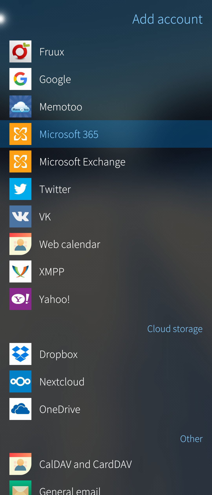
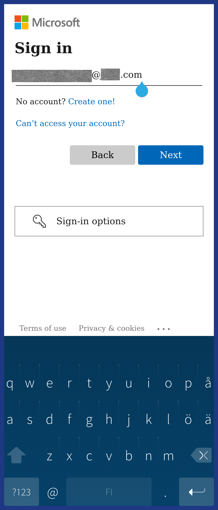
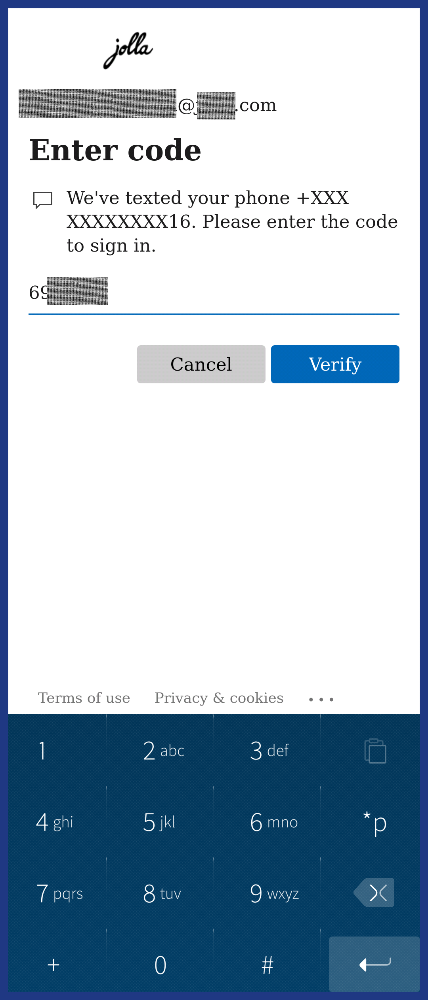
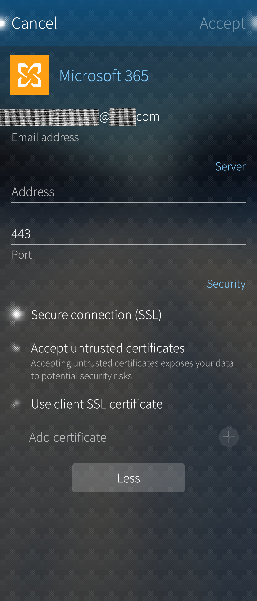
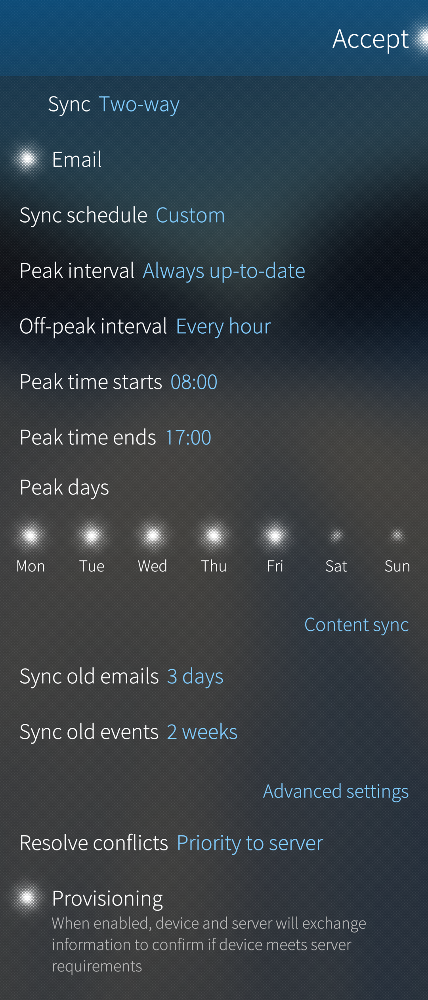
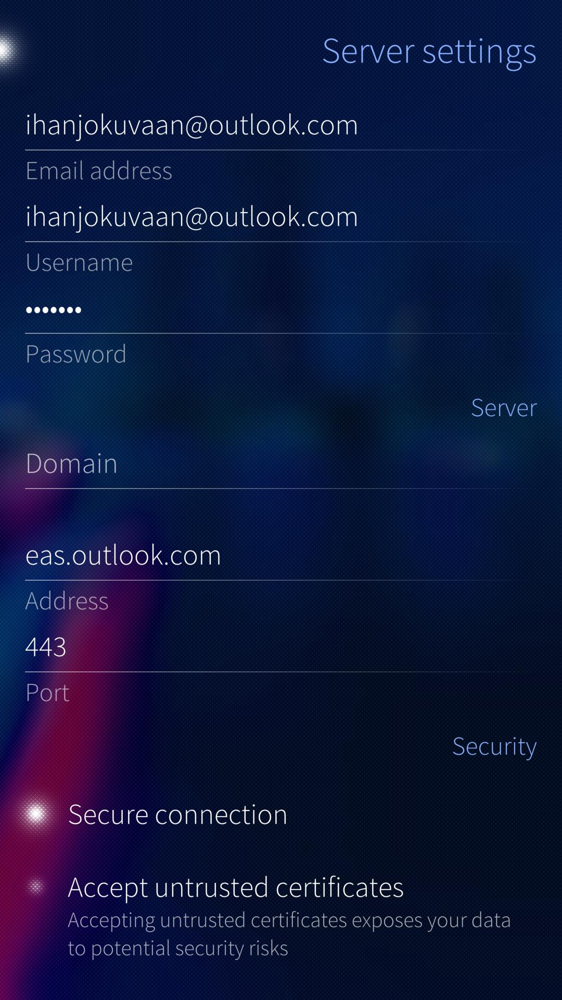

# Two options for Exchange accounts

There are two Exchange account types to choose from since September 30th, 2022. The new one is based on **Modern authentication** (a.k.a. **OAuth 2.0**) whereas the old one relies on Basic authentication.

The support of the new type was added to Sailfish OS release 4.4.0.72 in the summer of 2022. It appears by the name "**Microsoft 365**" in the account settings. The old type keeps using the name "**Microsoft Exchange**".

The authentication method is the only difference between these two account types.

It is difficult to say, for sure, which account type should be chosen. Microsoft is deprecating **[Basic Authentication](https://techcommunity.microsoft.com/t5/exchange-team-blog/basic-authentication-deprecation-in-exchange-online-september/ba-p/3609437)** while some other service providers are perhaps not (or not yet). This is why Sailfish OS keeps supporting both types for now.

Choose Microsoft 365 if you need one or more of the following or if your service provider requires them:

* Modern authentication (**[OAuth 2.0](https://oauth.net/2/)**)
* Two-factor authentication (**[2FA](https://www.microsoft.com/en-us/security/business/security-101/what-is-two-factor-authentication-2fa)**)
* The account is organizational (e.g. work or school account) and provided by Microsoft

Choose Microsoft Exchange if

* Your account is personal and used to access Microsoft email inboxes, including outlook.com and hotmail.com
* The service provider is not Microsoft (consult your provider, though)

If you are still unsure which one to use, contact your service provider. The other way would be this: try to set up a Microsoft 365 account. If that fails then select Microsoft Exchange.

# Installing the Exchange service to Sailfish OS

The Exchange service is one of the items that require the **[Sailfish OS licence](/Support/Help_Articles/Sailfish_OS_Licence/)**. After buying and activating the licence, it is possible to install Exchange.

* Launch the Jolla Store application.
* Sign in to your Jolla account if requested.
* Scroll down to the bottom of the page. Tap on "Jolla" (category).
* Tap on "Microsoft Exchange". This item covers both account types.

* Pull down "Install".

There is no MS Exchange application in Sailfish OS, such that it would appear among the icons in the app grid. Exchange is just another account in Settings > Accounts. MS Exchange also appears in the Mail, Calendar and People applications.

Please sign in to your Exchange account next.

## The new Microsoft 365 account

**This account type allows one to login into Exchange with Modern authentication and two-factor authentication (2FA). The method used is the OAuth2 authentication.**

OAuth2 authentication was taken into use in Exchange account creation on Sailfish OS release 4.4.0. Microsoft deprecates [Basic Authentication](https://techcommunity.microsoft.com/t5/exchange-team-blog/basic-authentication-deprecation-in-exchange-online-september/ba-p/3609437) for Exchange accounts on September 30th, 2022.

### Signing in

Make sure you have a working internet connection from your Sailfish device.
* Go to "Settings" and choose "Accounts"
* Tap "+ Add account"
* Tap  "**Microsoft 365**"

* 
  
    Pic 1: New Microsoft 365 account (Modern authentication)
  

* View the Microsoft 365 Terms on Service
* Tap "Consent" at the top right corner. Sailfish Browser opens up for entering the credentials (see Pic 2 below)

* 
  
    Pic 2: Entering email address on Browser
  
* 
  
    Pic 3: Entering password on Browser
  

* Enter your email address and tap "Next"
* Enter your password and tap "Sign in"
* This message appears: "_Would you like to remember the password for &lt;your_email&gt; on login.microsoftonline.com?_". Tap "Cancel" or "Save" (Cancel lets you continue signing in but does not save your credentials)
* **[2FA](https://www.microsoft.com/en-us/security/business/security-101/what-is-two-factor-authentication-2fa)** authentication starts. How it goes, depends on the method you have previously chosen for this account. In the example below, the 2nd phase is based on receiving a code in a text message (SMS). An alternative way would be to use the Microsoft **[Authenticator](https://www.microsoft.com/en-us/security/mobile-authenticator-app)** app.
    * Verify your identity. Text +XXX XXXXXXXXXX  (this is your phone number almost hidden). Tap it (Pic 4).
    * Check the received text messages. The top one should be from Microsoft and contain the 6-digit code
    * Type the code on the line of the "Enter code" page. Tap "Verify" (Pic 5).
    

* 
  
    Pic 4: Request 2FA code over SMS
  
* 
  
    Pic 5: Enter the 2FA code
  

* This message appears briefly: "Checking server settings and policies..."
* If your sign-in was accepted, the view with "Microsoft 365" and your name under it appear (Pic 6). There is the Server section below them with the button "More". It allows you to set the server address (if needed) and select some security details (Pic 7).

* 
  
    Pic 6: Microsoft 365 account created
  
* 
  
    Pic 7: Advanced settings
  

* Tap "Accept" at the top right corner to proceed. The message "Retrieving settings from server" appears. Wait.
* The final step, selecting the account details, shows up. The details include which apps you want to synchronise on this account: Calendar, Email, Contacts (People) and how often (Pics 8-9).

* 
  
    Pic 8: Sync settings 1/2
  
* 
  
    Pic 9: Sync settings 2/2
  

* Tap "Accept" at the top right corner the last time.
* Your Exchange account will appear in Settings > Accounts. It has the text "Setting up account..." under it for a while. Please wait. Then the account is ready.

## The old Microsoft Exchange account

**This account type relies on Basic authentication. Two-factor authentication (2FA) is not supported.**

### Signing in

#### Step 1

Make sure you have a working internet connection from your Sailfish device.
* Go to "Settings" and choose "Accounts"
* Tap "+ Add account"
* Tap  "**Microsoft Exchange**"

* 
  
    Pic 10: New Microsoft Exchange account (Basic authentication)
  

* Enter the following information

   * Your email address
   * Password             _(use the "eye" button to check that there are no typing errors)_
* An example:

* 
  
    Pic 11: Exchange account created
  
* 
  
    Pic 12: Advanced settings
  

* Tap "Accept" near the top right corner to make your device download the required settings automatically. This works if your service provider supports **autodiscover**. The message "Retrieving settings from server..." should appear momentarily. Next, the view of picture B3 appears.
    You can then skip to Step 3.
* If you know already that your service provider does not support autodiscover, then tap **“More”** (see Pic B1 above) and carry on to Step 2.
* If you tried the automatic lookup but it failed, then fill in the missing items (or incorrect items shown in red font) in Step 2.

#### Step 2

Enter the required information:

   * The server domain name  _(leave it empty if your server does not have one)_
   * Server address
   * Private customers: outlook.office365.com _or_ m.hotmail.com _or_ eas.outlook.com_
    (or something else)_
   * Business customers: _contact your IT support_
   * Server port number   (_most servers use port 443_)
   * Enable "Secure connection"
   * We recommend leaving the option "Accept untrusted certificates" OFF unless you know precisely what this is about and what consequences it may have.
   * Tap "Accept" in the top right corner to save the settings and have them checked by the server.

#### Step 3

Your Sailfish phone is now showing the service options (see pictures 13 and 14 below) – select the options you prefer: which apps to synchronise and how often.
   * Which services shall be synchronised (_email, contacts, calendar_)
   * Automatic or manual synchronization, sync interval, busy times
   * Peak hours and days
   * Past periods from which you want to get emails and calendar events
   * Place of conflict resolution ("_server_" _usually_).
   * Service provisioning[^1] _We recommend switching it ON_
* Scroll to the page top.
* Tap "Accept". 
* Your Exchange account will appear in Settings > Accounts. It has the text "Setting up account..." under it for a while. Please wait. Then the account is ready.

* 
  
    Pic 13: Sync settings 1/2
  
* 
  
    Pic 14: Sync settings 2/2
  

# Synchronisation

The Exchange service starts automatically syncing your data as soon as the sign-in is completed. After a couple of minutes, you have your emails, calendar appointments and contacts on your device, depending on the choices you made.

It is also possible to have the data synchronised by using the pull-down option "Sync".

# Pulldown menu

The pulldown menu has the following options (Pic 15):

* 
  
    Pic 15: Exchange account: pulley menu
  
* 
  
    Pic 16: Checking server settings
  

You can check your server settings by using the option "Edit server settings" from the pulley. The picture above on the right shows a typical setup. Note that there is no "Accept" button after making changes. You will need to save and exit by swiping the screen to the right (Pic 16).

- - - - -

[^1]: Sailfish OS 4.0.1 supports the following provisioning policies of the device lock:  * DevicePasswordEnabled * AutomaticLocking * MinDevicePasswordLength * MaxDevicePasswordFailedAttempts * MaxInactivityTimeDeviceLock

