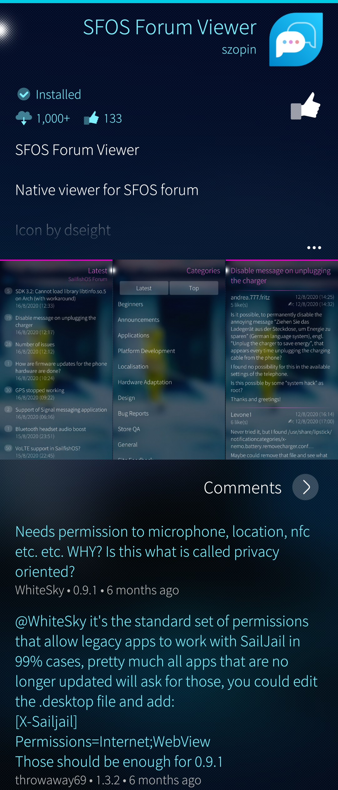

This document provides information on the Jolla account. What is it used for and how to sign in to an existing Jolla Account or create a totally new Jolla Account on your device. Instructions for retrieving lost Jolla Account credentials are given, too.

# What is the Jolla Account needed for?

The Jolla Account is required for the following things:

* Downloading applications and updates for them from the Jolla Store. There is a registry of devices and their OS versions and app versions
* Downloading Sailfish OS updates and licensed apps. Sailfish OS licence is required here, too
* It serves as your account for our community site **[Sailfish OS Forum](https://forum.sailfishos.org/)**
* It serves as your account at the **[Jolla Online Webshop](https://shop.jolla.com)**

The following Jolla service is separate from the Jolla Account

* Jolla Customer Care

# Adding the Jolla account to your device

* Go to the menu on Settings > Accounts
* Tap "Add account"

* 
  
    Adding an account
  

* 
  
    Selecting Jolla account
  

* Tap "Jolla" and the following view appears:

* 
  
    Jolla account exists
  

## Signing into an existing Jolla account

If you already have a Jolla account check that the option "I have a Jolla account" is selected.
Next, type your username and password (see the picture above)

If you are unsure about your credentials, you can check them by trying to log in **(using a computer) at [https://account.jolla.com/](https://account.jolla.com/)**

If you receive an error about an incorrect password or username, then you can **[reset your password](https://account.jolla.com/registration/password/reset/)**

## Registering a new Jolla account

If you are a new Jolla user with no previous Jolla Account, let's create it now

* Tap "I am a new user".
* Type a username you want (not an email address, please). You will soon see if it is free to be used.

* Enter your password. Type it again for verification.  Please use the eye icon at the end of the line to show the typed letters.

* 
  
    New user registering
  

* Proceed by tapping "Next" at the top right corner.

* 
  
    Details of a new user
  

* Type your personal information
   * Not all fields are mandatory (e.g., phone number)
   * Red text implies incorrect information
   * There must be a **unique email address** for each Jolla account (if you want to create more accounts) - the email address is used for confirming a password reset request

* Accept your information
* Confirm the account by tapping "Accept" at the top right corner, again.

# Forgot your username and/or password?

In case you have forgotten the username and/or the password to your account, please **[click here to reset](https://account.jolla.com/registration/password/reset/)** your password, and receive an email reminder of what your username is.
When asked, please enter the email address that you used when creating your Jolla Account.

# Resolving problems with Jolla account

If you are unable to sign in to your Jolla account, install apps or OS updates, or see the licensed apps in Jolla Store, read onwards.

## Prerequisites

Check that the time and date are correct on your phone. If they are wrong, fix them in "Settings > System > Time and date".
Check that you have a working Internet connection from your phone, either via WiFi or via mobile data. If you have already some apps installed, like Weather or Browser, use them to ensure that the connection really works.

## Validate your Jolla account on a computer

Open a Browser app on your computer. Browse to **[https://account.jolla.com/registration/login/](https://account.jolla.com/registration/login/)**.

* Log in with your Jolla account credentials – if you are able to log in then the account is OK
* If you cannot log in a new page appears: Select _"Reset Password"_ or _"Forgot password? Reset it here"_ and enter the same email address you used when you originally registered your Jolla account
* You will receive an e-mail with the subject _"Password reset on account.jolla.com"_. If you do not get this e-mail in a few minutes,  please check your Spam folder.  The message contains your username (as a reminder) and a link to set a new password. Click the link. Type the new password two times and click "CHANGE THE PASSWORD".
* Note: your username cannot be your email address nor contain any accented characters.
* After successfully changing the password, use "Log in" below the confirmation to verify that the new credentials really work.
* Please memorize your username and password.

## Access your Jolla Account from your Sailfish OS device

* Check that the date and time settings of your device are correct in "Settings > System > Time and Date"
* Make sure your phone is connected to the Internet
* Enter your username and password (the same ones as in the computer validation above)

You should now be logged in to the Jolla Store and able to install applications and get SailfishOS updates (provided that you have a Sailfish OS licence - see chapter [Finding the licensed apps in Jolla Store](#finding-the-licensed-apps-in-Jolla-Store) below).

Ensure that all that works - read ahead.

### Download and install applications

* Open the Jolla Store app
* Scroll down and tap "Apps >".
* Swipe the display to the left to expose the app categories
* Tap on the category you want
* Tap on each app you want to get. Pull down "Install".
* Jolla Store should soon show the status "Installed". The app should appear at the end of the App Grid. Note that "Android App Support", "Predictive Text Input" and "Microsoft Exchange" are exceptions: there is no icon for them at the App Grid. Instead, they appear in the Settings and elsewhere.

* 
  
    An app installed
  
  
* 
  
    A new app at App Grid
  
  

If you are able to install an app then your Jolla account is enabled and works ok.

### Download and install Sailfish OS updates

**[This article](/Support/Help_Articles/Updating_Sailfish_OS/)** has detailed instructions for getting and installing an OS update. In brief, one can start the process in two ways:

1.  Visit the Events view and tap a notification of an available OS update
2.  Check the availability of an OS update at "Settings > System > Sailfish OS updates" by pulling down "Check for updates"

If there is an update available take it by selecting "Download" in the pulley menu. Follow the on-screen instructions.

### Finding the licensed apps in Jolla Store

The Sailfish OS licence is available for users of Xperia phones to which Sailfish OS has been ported - see **[this list of supported devices](/Support/Supported_Devices/)**. The licence entitles the user to install OS updates and install some apps, including _Android™ App Support_ and _Microsoft Exchange_. Check the details of the **[Sailfish X licence](/Support/Help_Articles/Sailfish_X_Licence/)**.

All of the licensed apps appear in the **Jolla category** of the Jolla Store app. Scroll down the home page to see the categories on the right. Tap "Jolla >".

* 
  
    Jolla Store categories
  
  
* 
  
    Apps in Jolla category
  
  

If you cannot see the licensed apps, ensure that you have signed in from the phone to the same Jolla account that you used for purchasing the licence. If you have just recently purchased it, restart your phone to activate the licence. Then check the Jolla Store again.

