<div class="flex-images" markdown="1">

* <a href="Amb_background_at_home_view.png">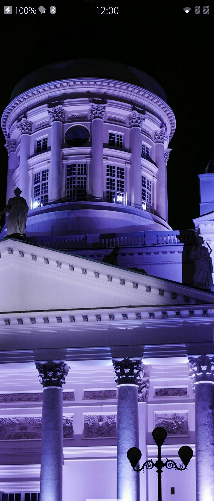</a>
  <span class="md_figcaption">
    Pic 1: An ambience at the Home view
  </span>
* <a href="Amb_affecting_events_view.png">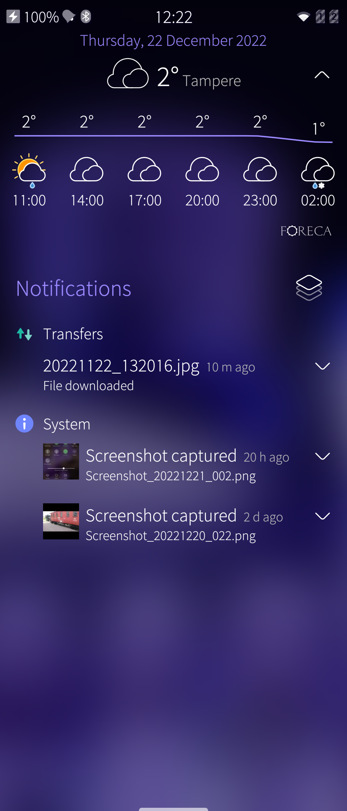</a>
  <span class="md_figcaption">
    Pic 2: An ambience at the Events view
  </span>
</div>


# What is an Ambience?

It is possible to personalize your Sailfish device to reflect what you're doing or how you're feeling.
Ambiences help in this.  Creating an Ambience begins with a photo - select one with a nice highlight colour (tint). Your phone will use that colour throughout the menu texts and backgrounds.

The image you have chosen also underlies all your applications. The user interface of Sailfish OS is designed to make it seem like the applications appear on a layer of textured glass - that's why you can see through them to the ambience you picked.

An ambience can be linked to a different set of tones.

You can create as many Ambiences as you wish and change them according to your mood or the time of the year or anything. One way of using them (and tones attached to them) would be to have one for work hours, another for leisure and a third for nights (and other occasions requiring silence).

# Making an Ambience a favourite

Open "Settings > Ambiences". Tap an ambience you like. Tap the star icon so that it turns full. This ambience is now one of your favourites.

<div class="flex-images" markdown="1">

* <a href="Amb_settings_of_an_amb.png" class="narrow-image">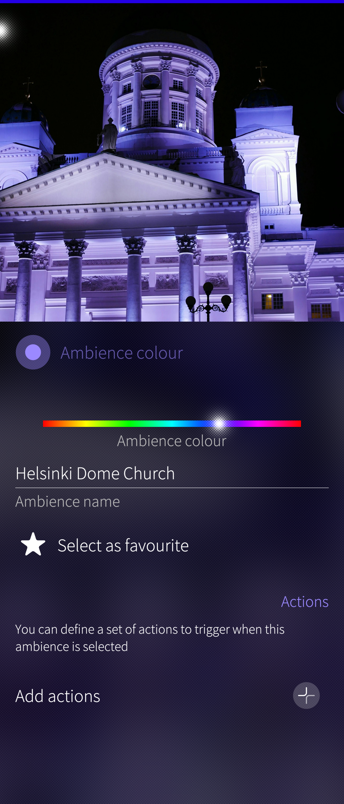</a>
  <span class="md_figcaption">
    Pic 3: Ambience settings showing the star button
  </span>
</div>


Another way to set a favourite goes in this way:

* Open the Top Menu (see Pic 4 below)
* Long-tap an ambience you like
* Take "Add to favourites" on the drop-down menu.

Favourite ambiences are shown at the top row of the Top Menu, followed by non-favourite ambiences.

In the same way, favourite ambiences are shown at the top of "Settings > Ambiences", followed by non-favourite ambiences.

# Changing Ambience in your collection of ambiences

Open the Top Menu. Observe the Ambiences at the top row. The recently used favourites are visible - the rest can be seen by flicking the row to the left.

Tap the Ambience you want to set. The change will be reflected in the background colour in a few moments.

<div class="flex-images" markdown="1">

* <a href="Amb_top_menu_with_amb.png" class="narrow-image"></a>
  <span class="md_figcaption">
    Pic 4: Ambiences at Top Menu
  </span>
</div>

Changing the Ambience can of course be done in the menu "Settings > Ambiences", too. Long-tap the Ambience you want. Then take the command "Set ambience" in the popup menu.

<div class="flex-images" markdown="1">

* <a href="Amb_settings_popup_menu.png" class="narrow-image">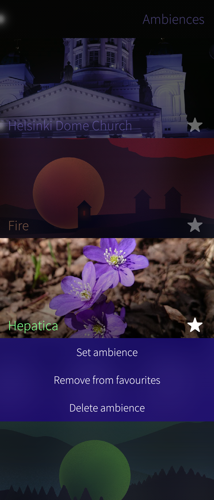</a>
  <span class="md_figcaption">
    Pic 5: Ambience settings: popup menu
  </span>
</div>


# Editing an Ambience

An Ambience can be modified in the following ways:

* "Ambience name" can be given
* "Ambience colour" can be changed using the slider
* It can be set as a favourite or non-favourite
* "Add actions" allows to change of the set of tones used when this Ambience is in effect. This should provide a quick way of changing the active set of tones according to the situation. For instance, silence the phone before going to a theatre simply by switching to a silent mode ambience.

See the example in the pictures 6 to 8 below.

<div class="flex-images" markdown="1">

* <a href="Amb_settings_before.png">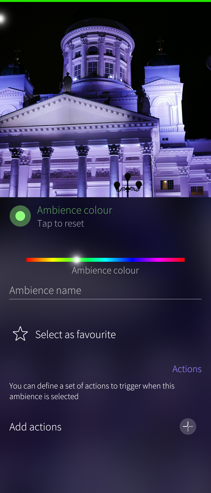</a>
  <span class="md_figcaption">
    Pic 6: A new ambience before tailoring
  </span>
* <a href="Amb_adding_actions.png">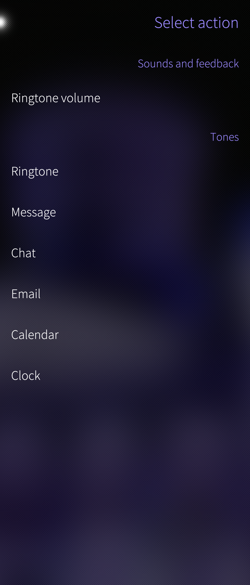</a>
  <span class="md_figcaption">
    Pic 7: Adding actions for Ambience
  </span>
</div>

The settings of a resulting ambience could be something like this:

<div class="flex-images" markdown="1">

* <a href="Amb_settings_after.png" class="narrow-image">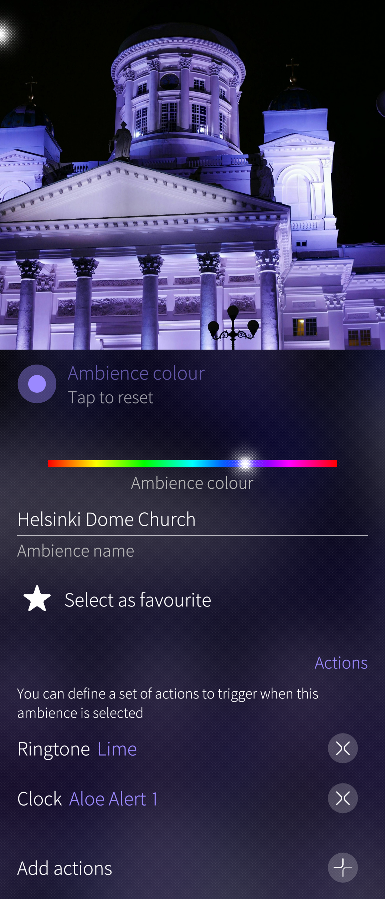</a>
  <span class="md_figcaption">
    Pic 8: Ambience settings after tailoring
  </span>
</div>


# Removing an Ambience

Pull down "Delete ambience".

The current ambience cannot be deleted. Therefore, change the ambience first.

* Open "Settings > Ambiences"
* Tap the Ambience to be removed
* Pull down "Delete ambience"

# Creating a new Ambience

There are two ways, A and B. Both of them have the slight issue that they are not really "WYSIWYG", i.e., one cannot see the final result while making the ambience. The resulting ambience background image is likely to be different from A and B.

Use a high-resolution photo, it should preferably have about 3000 pixels in both dimensions as the Ambience tool will crop the photo heavily. The background images of the built-in ambiences have the dimension of 2048 x 2048 pixels.

This is the original photo used in the A and B exercises below:

<div class="flex-images" markdown="1">

* <a href="Amb_photo_original.png" class="narrow-image">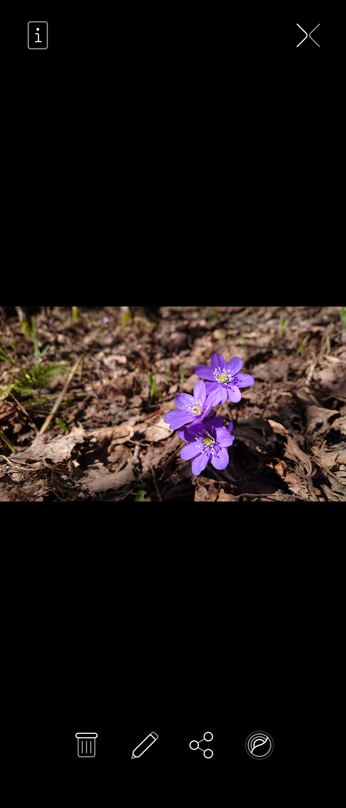</a>
  <span class="md_figcaption">
    Pic 9: Original photo to make an ambience from
  </span>
</div>


## A. Apply the ambience tool of Gallery directly.

1.  Open Gallery
2.  Select and open a nice photo
3.  Use the ambience button at the right end of the toolbar
4.  Adjust the ambience colour, give it a name, make a favourite, add actions.
5.  Choose if you want to use the dark style (dark colour scheme) or the light one.

<div class="flex-images" markdown="1">

* <a href="Amb_A_created_with_gallery_tool.png" class="narrow-image">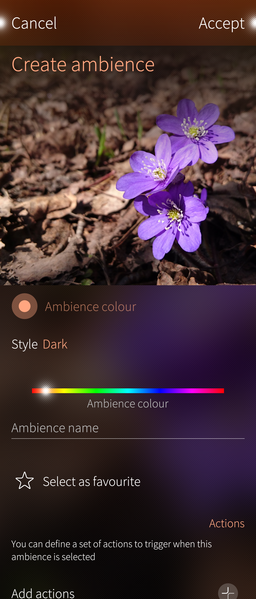</a>
  <span class="md_figcaption">
    Pic 10: Settings of Ambience from the Gallery tool
  </span>
</div>
     
      
The final background (wallpaper) of the new ambience is like this

<div class="flex-images" markdown="1">

* <a href="Amb_A_result.png" class="narrow-image">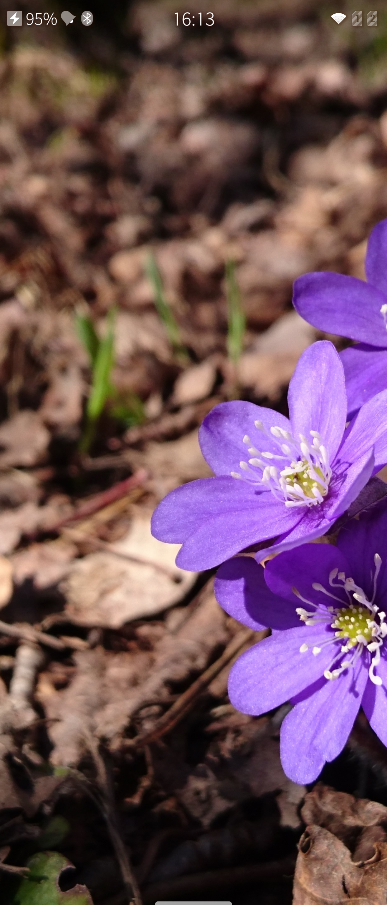</a>
  <span class="md_figcaption">
    Pic 11: Ambience from the Gallery tool ready
  </span>
</div>
      

This ambience is now set and automatically put in effect. It is the current ambience of the phone.

## B. Crop a photo using the ambience aspect ratio first. Create the ambience then.

1.  Open Gallery
2.  Select and open a nice photo
3.  Use the edit button on the toolbar
4.  Use the crop button at the editor's toolbar
5.  Choose "Ambience" for the aspect ratio. It creates a square image.
6.  Move the photo to the crop area. It is probably best to place the important parts in the middle. When Sailfish applies the resulting ambience image, it makes it as high as the phone display and cuts away the rectangular areas on the left and right to make it narrow and fit the phone display. You may need to try a few times to make a nice ambience. Save the image to the Gallery.

<div class="flex-images" markdown="1">

* <a href="Amb_B_set_photo_to_crop_area.png" class="narrow-image">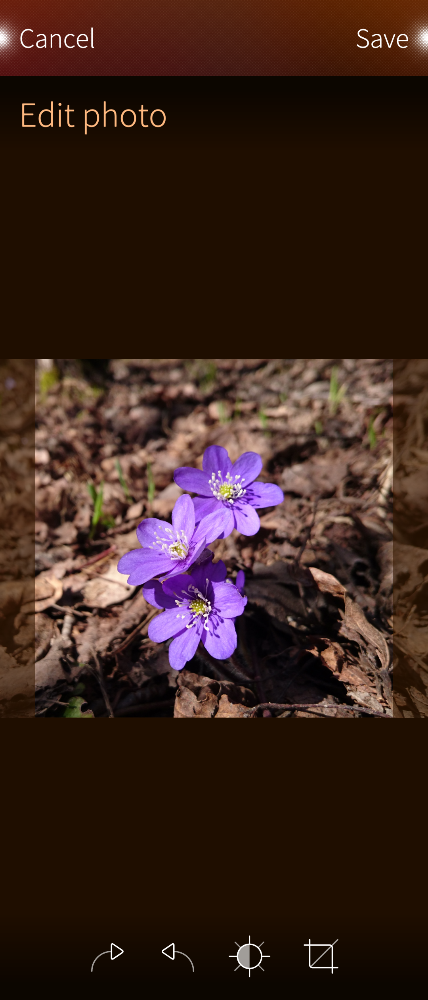</a>
  <span class="md_figcaption">
    Pic 12: Cropping a photo for an Ambience. Aspect ratio 'Ambience' used.
  </span>
</div>
    

* Go to step A1. 
* At step A2, select the new photo from step B6.
* Traverse steps A3 to A6.

<div class="flex-images" markdown="1">

* <a href="Amb_B_result.png" class="narrow-image">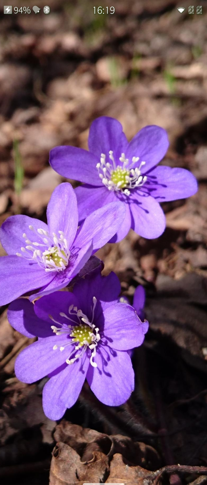</a>
  <span class="md_figcaption">
    Pic 13: Ambience rev. 2 from the Gallery tool ready
  </span>
</div>


# Further reading

If you are interested in learning the technical side of ambience and have developer skills then the following links may be worth reading.

* **[Theme Color](https://openrepos.net/content/nephros/theme-color)** An app made by our community member nephros
* **["How-to ambience"](https://together.jolla.com/question/16673/howto-ambiences/)** Forum discussing ambiences (this is old but has still some useful information)

## Location of ambience data in Sailfish OS

The storage of built-in ambiences of Sailfish OS resides in
```
/usr/share/ambience
```

Each built-in (default) ambience has a dedicated folder holding the actual ambience file and a subfolder containing the jpg of the background image.

All ambiences, the built-in ones and those created by the user are managed in an SQLite database at

```
/home/defaultuser/.local/share/system/privileged/Ambienced/ambienced.sqlite
```


