APKPure store contains a good choice of popular Android apps. It is easy to install Android apps to your Sailfish OS device after installing the app of APKPure. This document explains how to do it.

# Downloading the APKPure apk to your Sailfish device
1. Open the Sailfish Browser app.
2. Type and open page **apkpure.net**
3. Tap the green-and-white "Download" on that page, to the right of "Use APKPure App" (**[Pic 1](#pic_1))**. 
4. Avoid the advertisements. DO NOT tap the START button of **[Pic 2](#pic_2)**. Scroll down a couple of pages until you see the view of **[Pic 3](#pic_3)**. The green button with the white text "Download APK" is the one we are looking for.
5. Tap the "Download APK" button. The download of the APKPure apk file (installation file) begins. The browser may ask you to select the folder into which to download the file. "Home > Downloads" is a good choice.
6. Sailfish will show a download banner at the top of the display (**[Pic 4](#pic_4)**). Please wait until the download is complete.

* <a href="APKpure01.png" name="pic_1">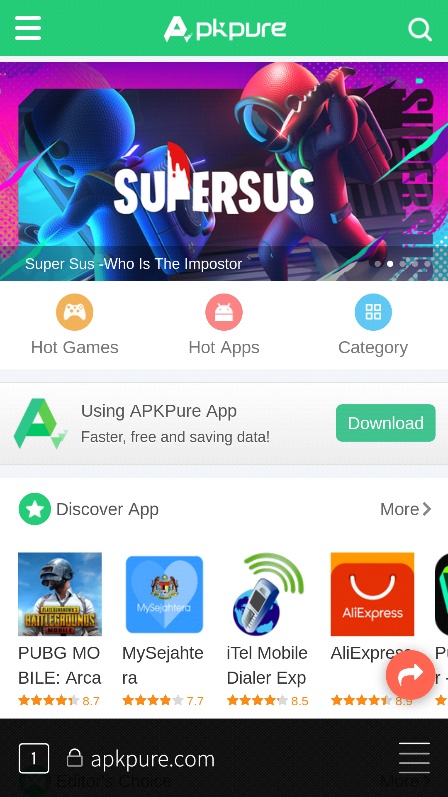</a>
  
  Pic 1: Home view of APKpure
  
* <a href="APKpure02.png" name="pic_2">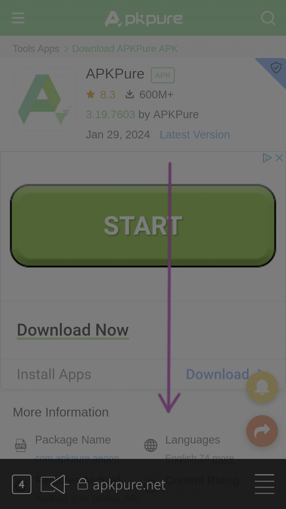</a>
  
  Pic 2: Finding the correct download button
  

 ---

* <a href="APKpure03.png" name="pic_3">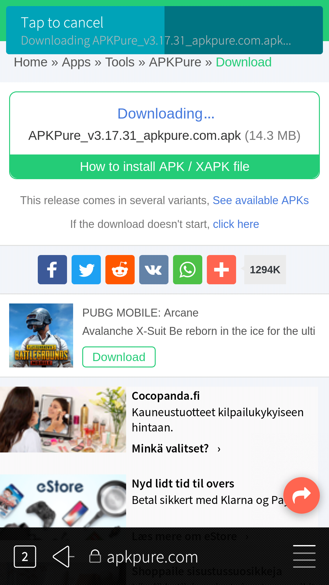</a>
  
  Pic 3: Button to download the APK (green)
  
* <a href="APKpure04.png" name="pic_4">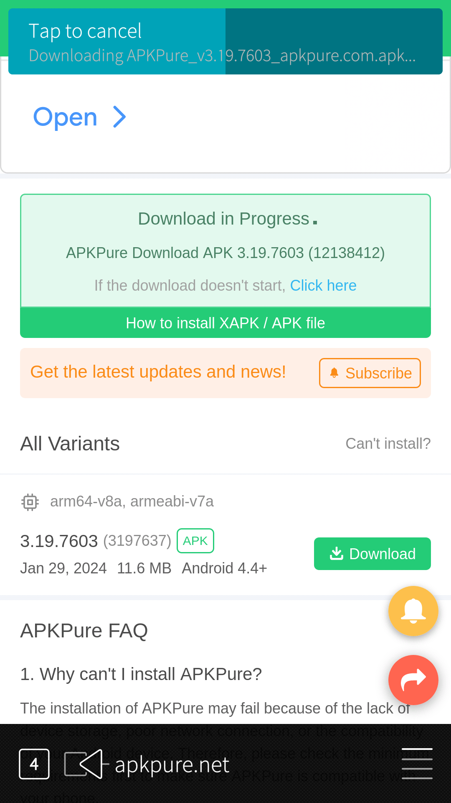</a>
  
  Pic 4: Download in progress
  

# Installing the APKPure app to your Sailfish device
Let's install APKPure now.

1. Tap the icon at the bottom right corner of the Sailfish Browser window (it has 4 short lines stacked). This opens a menu, scroll the menu until you see the item "Downloads" at the 2nd last position in that menu (**[Pic 5](#pic_5)**). Tap Downloads. This opens the Transfers page of Sailfish OS (**[Pic 6](#pic_6)**)
* Alternatively, instead of using the browser, open the Settings app and go directly to the "Settings > Transfers" menu page.
2. The downloaded installation file **"APKPure_v.*_apkpure.com.apk"** appears on the top of the page, tap it.
3. Tap the Install button of **[Pic 7](#pic_7)**.
4. Sailfish starts installing the APKPure application. Once it is installed (after 5-15 seconds), you will see an information banner on the top of the screen (**[Pic 8](#pic_8)**).

Sailfish OS will install the Android app "APKPure" to your device.

* <a href="APKpure05.png" name="pic_5">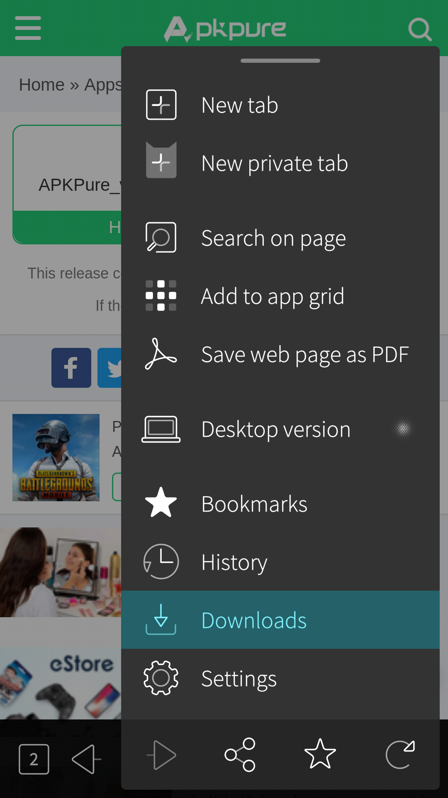</a>
  
  Pic 5: Downloads in the browser menu
  
* <a href="APKpure06.png" name="pic_6"> Transfers"></a>
  
  Pic 6: Settings > Transfers (pointing to Downloads)
  

---
---

* <a href="APKpure07.png" name="pic_7">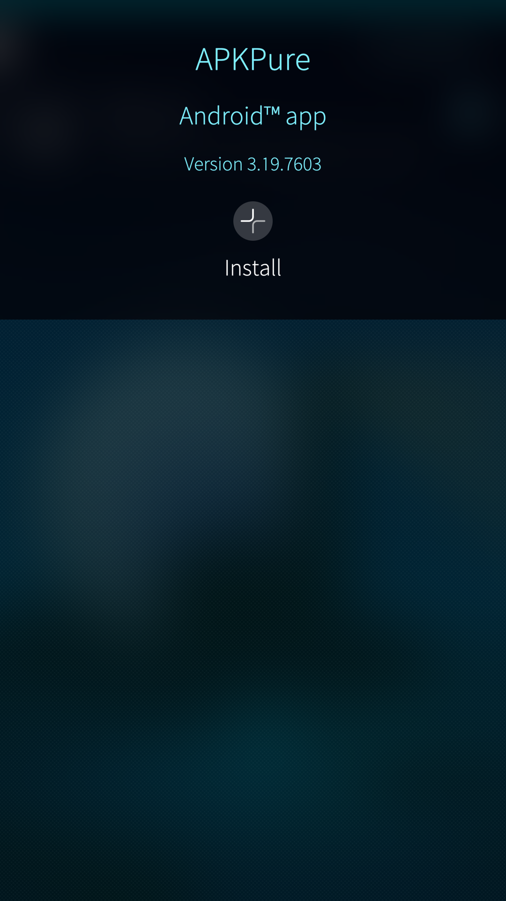</a>
  
  Pic 7: Start installing the APK
  
* <a href="APKpure08.png" name="pic_8">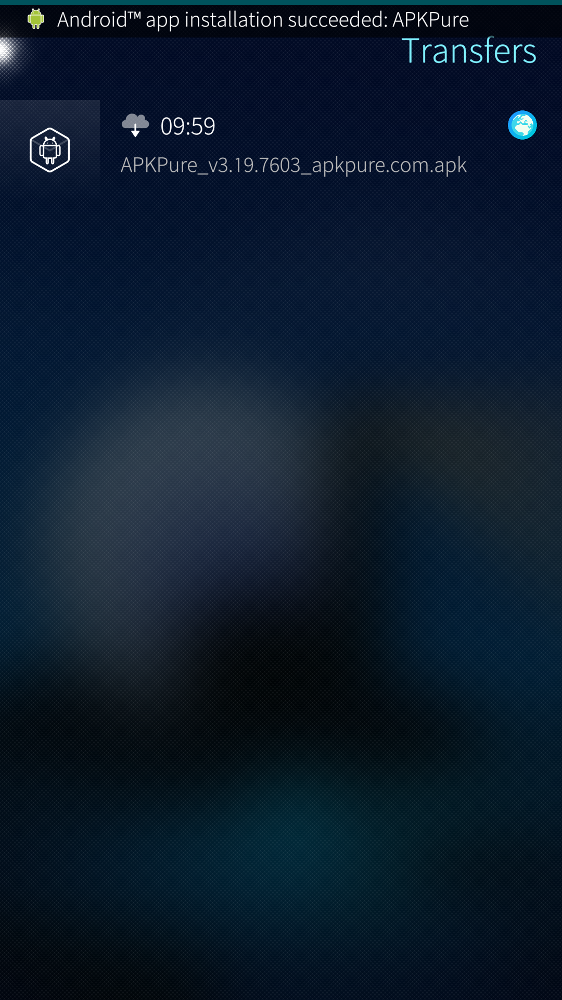</a>
  
  Pic 8: Installation completed
  

The APKPure app appears as the last item of the app grid in the picture below.

* <a href="APKpure10.png" name="pic_10" class="narrow-image">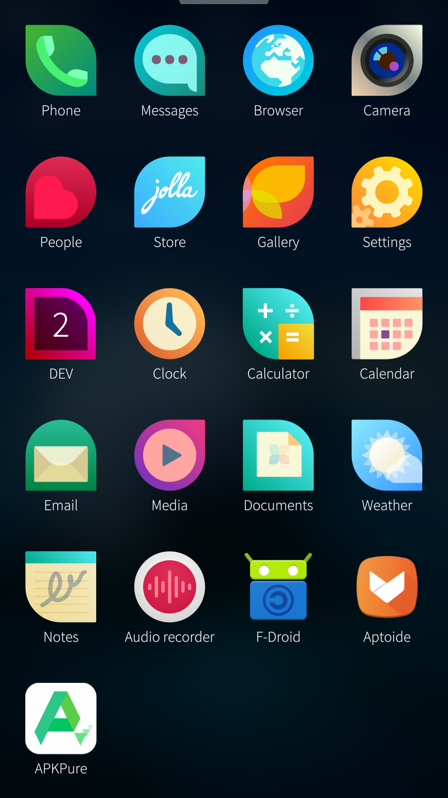</a>
  
  Pic 10: App grid with APKPure
  

# Installing Android apps from the APKPure store to your Sailfish device
1. Once the installation of the APKPure app is completed, open the app.
2. Tap in the search box at the top of the app window. Type the beginning of your favourite Android app name, e.g. "Instagr"(for Instagram). APKPure will show some matches (see **[Pic 31](#pic_31)**). Tap the Install button to the right of "Instagram"
3. Downloading will start (**[Pic 32](#pic_32)**).
4. Tap "INSTALL" in the dialogue shown in **[Pic 33](#pic_33)** to let APKPure install the app.

NOTE: if this is your 1st app from APK Pure, instead of Pic 33, you will see **[Pic 41](#pic_41)** first as you will need to give some more permissions - see [the last chapter](#allowing-apkpure-to-install-apps) of this document. After this, you will be guided back to step 4 above.

* <a href="APKpure31.png"  name="pic_31">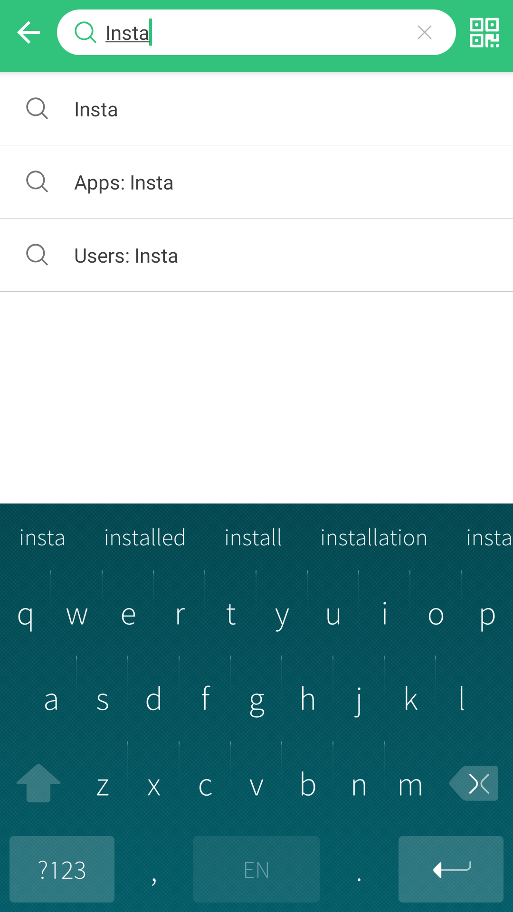</a>
  
  Pic 31: Searching for an app to install
  
* <a href="APKpure32.png" name="pic_32">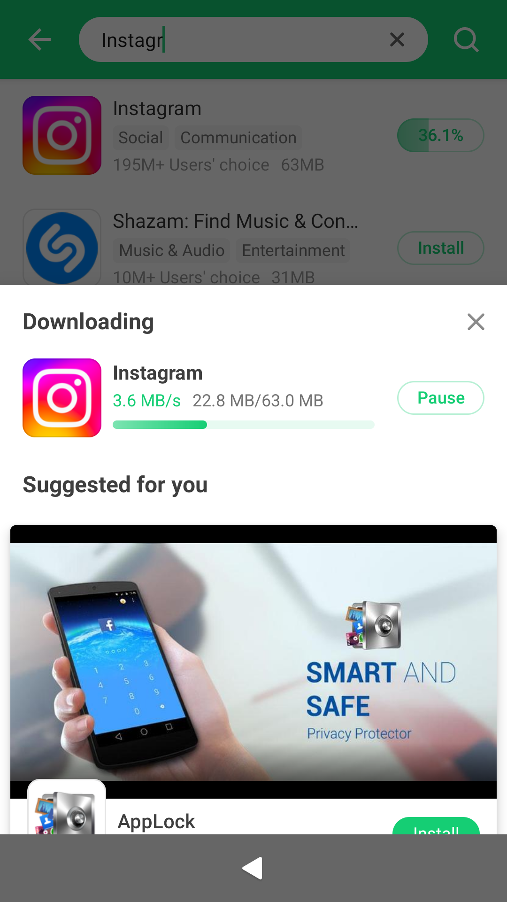</a>
  
  Pic 32: App being downloaded
  

---
---

* 
  
  Pic 33: Ready to install the app
  
* <a href="APKpure32.png" name="pic_34">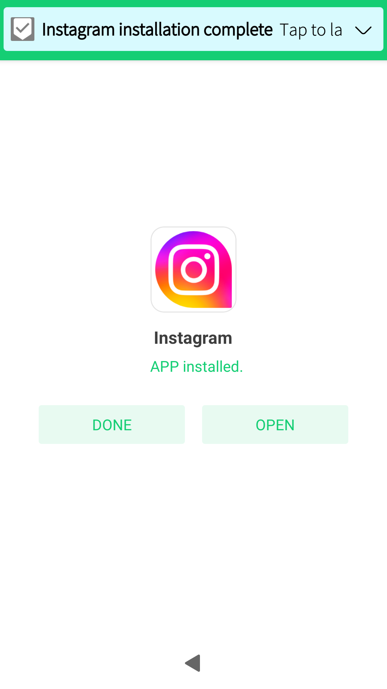</a>
  
  Pic 34: App successfully installed. 
  

# Allowing APKPure to install apps
If you install the 1st app from APK Pure to this phone, APK Pure will request permission. It will show you two dialogues.

The first one, related to phone calls, you can deny but for the latter one, "Allow APKPure to access photos, media and files on your device", you should allow [*] or else the app cannot install anything on your phone.

[*] Alternatively, you can allow storage access for the app by doing the following:

* Open "Settings > Apps > APKPure"
* Tap "Open Android settings"
* Tap "Permissions"
* In the list of denied resources, tap "Files and media" followed by "Allow management of all files".
* Close Settings
* Open APKPure app again. Installing Android apps should be possible now.

Even after allowing the storage access (as explained above), the APKPure app will request one more permission (see **[Pic 41](#pic_41**) before installing the 1st app to your phone: "Allow from this source". This means that you will need to grant permission to install Android apps from the APKPure app store. Furthermore, you will need to enable "Allow untrusted software" in "Settings > Untrusted software".

To give permission, move the slider to the right so that it turns green - see **[Pic 41](#pic_41)** and **[Pic 42](#pic_42)**. Next, tap the back arrow at the top left corner. If the app is shown minimised, tap to expand it. Wait for a few seconds and the view of **[Pic 33](#pic_33)** should appear. Trigger the installation of your app by tapping "INSTALL".

* <a href="APKpure41.png" name="pic_41">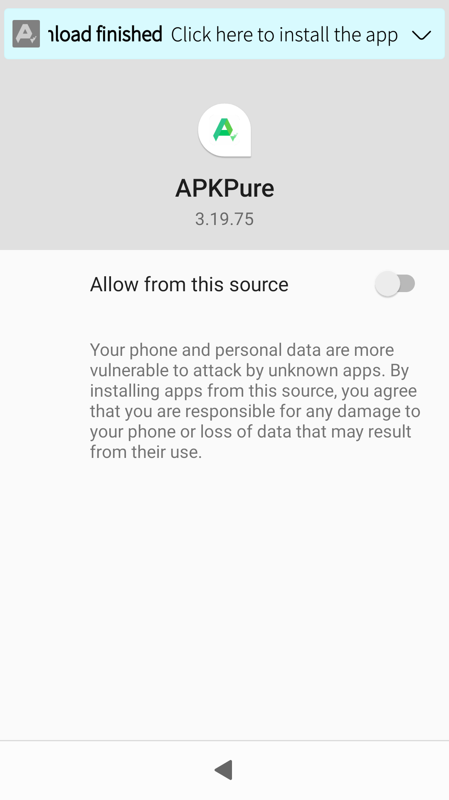</a>
  
  Pic 41: Permission to install required
  
* <a href="APKpure42.png" name="pic_42">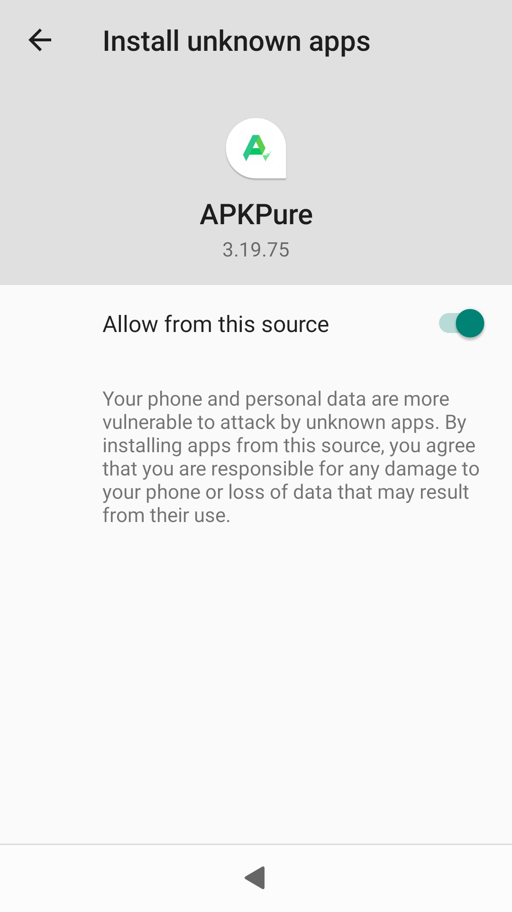</a>
  
  Pic 42: Permission to install granted
  

When you install your subsequent Android apps from APKPure, it will go as explained in [this chapter](#installing-android-apps-from-the-apkpure-store-to-your-sailfish-device). There is no need to do the actions of [this last chapter](#allowing-apkpure-to-install-apps) anymore.

