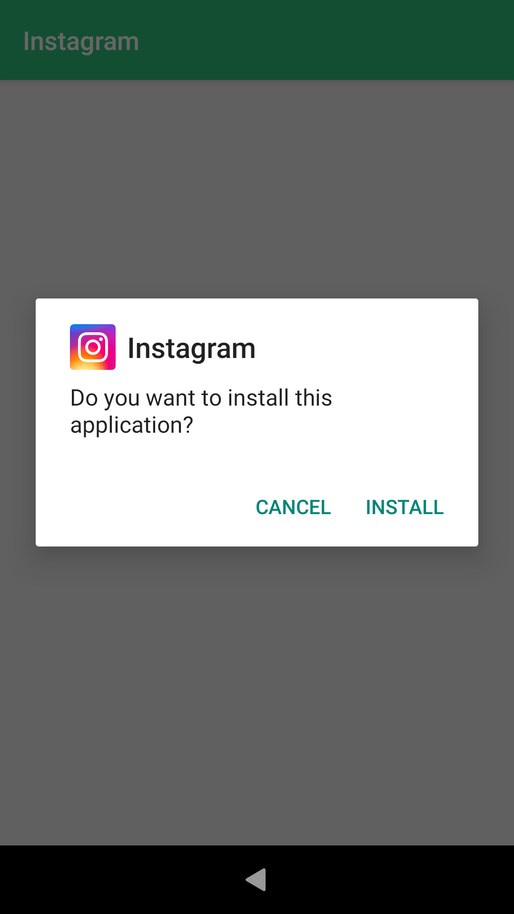
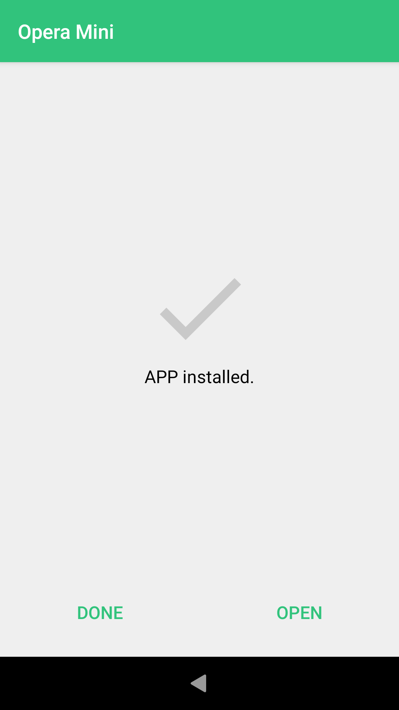
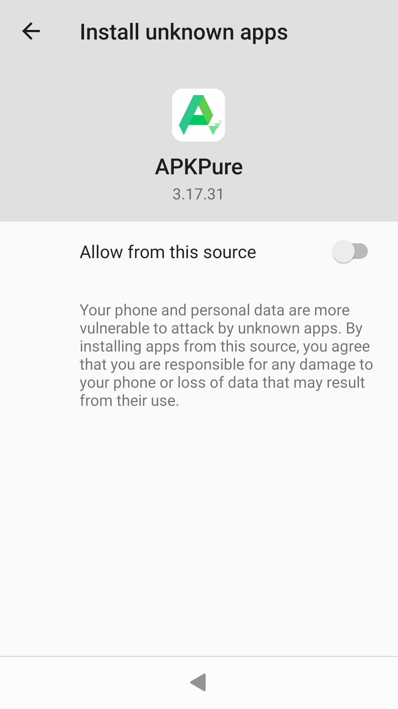
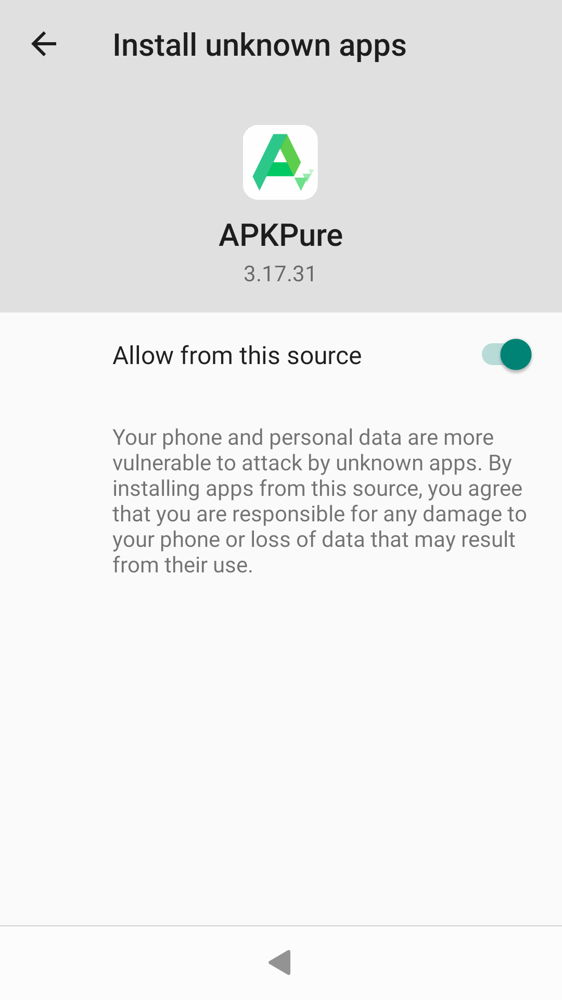

APKPure store contains a good choice of popular Android apps. It is easy to install Android apps to your Sailfish OS device after installing the app of APKPure. This document explains how to do it.

# Downloading the APKPure apk to your Sailfish device
1. Open the Sailfish Browser app.
2. Type and open page **m.apkpure.com**
3. Tap the green-and-white "Download" on that page, to the right of "Use APKPure App" (see the picture below on the left). Avoid the advertisements popping up.
4. Tap another green-and-white "Download" - it has the version number and size now. The download of the APKPure apk file (installation file) begins.
5. Sailfish will show a download banner at the top of the display. Please wait until the download is complete.

* 
  
  
* 
  
  
  Screen captures from searching and installing whatsapp 

* 
  
  

# Installing the APKPure app to your Sailfish device
Let's install APKPure now.

1. Tap the icon at the bottom right corner of the Sailfish Browser window (it has 4 short lines stacked). This opens a menu, scroll the menu untill you see the item "Downloads" at the 2nd last position in that menu. Tap Downloads. This opens the Transfers page of Sailfish OS.
* Alternatively, instead of using the browser, open the Settings app and go directly to the menu page "Settings > Transfers".
2. The downloaded installation file **"APKPure_v.*_apkpure.com.apk"** appears on the top of the page, tap it.
3. Sailfish starts installing the APKPure application. Once it is installed (after 5-15 seconds), you will see an information banner on the top of the screen.

Sailfish OS will then install the Android app "APKPure" to your device.

* 
  
  
* 
  
  
  Screen captures from searching and installing whatsapp 

* 
  
  

The APKPure app appears as the last item of the app grid in the picture below.

* 
  
  

# Installing Android apps from the APKPure store to your Sailfish device
1. Once the installation of the APKPure app is completed, open the app.
2. Tap in the search box at the top of the app window. Type the beginning of your favourite Android app name, e.g. "Insta". APKPure will show 3 options below. Tap on line "Apps: Insta".  
Make sure you have selected the subpage "Apps" at the top of the display.
3. Tap "Install" next to your app (e.g. Instagram) - see the picture below in the middle. Downloading will start.
4. Tap "INSTALL" in the dialogue shown in the right-most picture below to let APKPure install the app.

Note that in the case of your 1st app from APK Pure, you will need to give some more permissions - see [this chapter](#allowing-apkpure-to-install-apps) below.

* 
  
  
* 
  
  
  Screen captures from searching and installing whatsapp 

* 
  
  

Once the installation is ready, you will see this:

* 
  
  

# Allowing APKPure to install apps
If you are installing the 1st app from APK Pure to this phone, APK Pure will request permission. It will show you two dialogues.

The first one, related to phone calls, you can deny but for the latter one, "Allow APKPure to access photos, media and files on your device", you should allow [*] or else the app cannot install anything on your phone.

[*] Alternatively, you can allow storage access for the app by doing the following:

* Open Settings > Apps > APKPure
* Tap "Open Android settings"
* Tap "Permissions"
* In the list of denied resources, tap "Storage" followed by "Allow"
* Close Settings
* Open APKPure app again. Installing Android apps should be possible now.

Even after allowing the storage access (as explained above), the APKPure app will request one more permission ( see the left-most picture below) before installing the 1st app to your phone: "Allow from this source". This means that you will need to grant permission for installing Android apps from the APKPure app store.

To give permission, move the slider to the right so that it turns green - see the left-most picture below. Once done, the right-most picture will appear. Trigger the installation of your app by tapping "INSTALL".

* 
  
  
* 
  
  
  Screen captures from searching and installing whatsapp 

* 
  
  

When you install your subsequent Android apps from APKPure, it will go as explained in [this chapter](#installing-android-apps-from-the-apkpure-store-to-your-sailfish-device). There is no need to do the actions of [this last chapter](#allowing-apkpure-to-install-apps) anymore.
