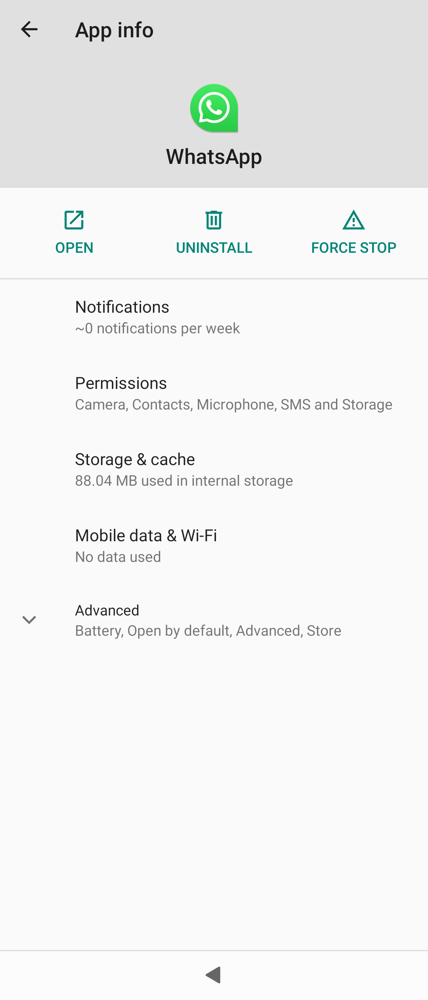
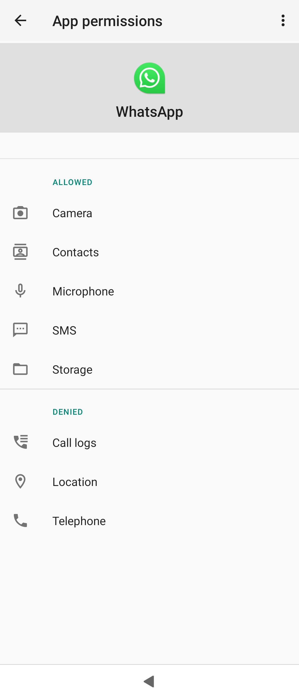

_The Sailfish OS settings should be applied in Android apps, too. However, there may be some glitches, i.e., not everything works that way. Hence it may be necessary to access the Android settings and try to adjust them._

The most often needed settings are the permissions to access certain services and the notifications from various apps shown on the screen.

# Adjusting the settings of Android AppSupport of Sailfish OS

The Settings app of Sailfish OS has the item **Android AppSupport** almost at the end of the page "Settings > System > Android AppSupport", in the section "Info".

<div class="flex-images" markdown="1">

* <a href="Android_App_Support_in_Settings.png" class="narrow-image"> Android AppSupport"></a>
  <span class="md_figcaption">
    Pic 1: Settings > Android AppSupport
  </span>
</div>


Android AppSupport is a dedicated run environment for Android apps on top of Sailfish OS. It can be thought of as a kind of sandbox for playing Android apps in it. This sandbox sets limits on what the Android apps can do. Having Android AppSupport running in the background consumes system resources, including the battery.

You can decide if the Android AppSupport is automatically started when you restart your phone or not until it is really needed. If you leave it OFF (i.e., the switch light in front of "**Start Android AppSupport on bootup**" is dimmed - see Pic 1 above) then the Android service would be started only when you open an Android app on your phone. If Android AppSupport is OFF then the background services of various Android apps (e.g. messengers) cannot work. This implies that messaging apps, for instance, cannot communicate. On the positive side, the battery will last longer.

The other option to start the Android service is to do it manually by tapping the **Start** button on page "Settings > System > Android AppSupport". If you have had Android AppSupport running you can stop it with the **Stop** button. Note that only one of these two buttons is visible at a time.


# Accessing the settings of an individual Android app

_The "Open Android settings" button and Android settings app are not available on products with earlier versions (4.1 and 4.4.) of Android AppSupport (Jolla Phone, Jolla Tablet, Jolla C, Xperia X). The instructions below are for Xperia XA2, various Xperia 10 models and, Jolla C2_.

1) Go to Settings > Apps > \[_name-of-an-Android-app_\]<br>
We are looking at the settings of WhatsApp application in the example shown in Pic 2.

<div class="flex-images" markdown="1">

* <a href="Settings_Apps_WhatsApp.png" class="narrow-image"> Apps > WhatsApp"></a>
  <span class="md_figcaption">
    Pic 2: Settings > Apps > WhatsApp
  </span>
</div>

  
2) Tap the button "Open Android settings" (see Pic 2 above).

3) Tap "Permissions" (Pic 3) to check or change the permissions of this particular app.

<div class="flex-images" markdown="1">

* <a href="Android_Settings_of_WhatsApp.png"></a>
  <span class="md_figcaption">
    Pic 3: Android Settings of WhatsApp
  </span>
* <a href="Android_Permissions_of_WhatsApp.png"></a>
  <span class="md_figcaption">
    Pic 4: Permissions of WhatsApp
  </span>
</div>


4) Consider checking the notifications, storage, and other settings, too.

# Accessing the common Android settings

Open the common settings of all Android apps by tapping the "Android version" five (5) times at the top of the page "Settings > System > Android AppSupport" 

It is possible to access the common settings also by using the command-line interface (CLI):
```
devel-su -p apkd-launcher com.android.settings
```
## Common settings

The following view appears. In there, it is possible to adjust the settings in each category.

<div class="flex-images" markdown="1">

* <a href="Android_Apps_Common_Settings.png" class="narrow-image"></a>
  <span class="md_figcaption">
    Pic 5: Common settings of Android apps
  </span>
</div> 
  
  

## An example: Turning the touch screen sounds off

Some Android apps produce sounds on every tap to the touch screen which may turn annoying after a while. At least on earlier Sailfish OS releases, the Sailfish settings could not prevent these sounds from playing. To silence them:

* Open the common settings, like above
* Tap Sound
* Tap Advanced
* Turn Touch sounds off
* Close Android settings.

# Further reading

Learn more about Android AppSupport by clicking the links below.

* What Android apps does Sailfish OS support and how do I get them? Read the document **[Android Application Support](/Support/Help_Articles/Android_App_Support/)**
* How to get rid of Android AppSupport? Read this: **[Uninstalling Android AppSupport](/Support/Help_Articles/Android_App_Support/Removing_Android_App_Support/)**.


