**_Aptoide is a 3rd party app_**

_Please note that the Aptoide app was not developed by Jolla and that Jolla has no control over it. Jolla has simply made this Android app available in the Jolla Store._

_If you have something to report on Aptoide or on any of the apps available in the store, please contact the **[Aptoide company](https://en.aptoide.com/company/about-us)** directly._

_The customer support of Jolla cannot help you._

If you want to consider using other app stores, please read **[this document](/Support/Help_Articles/Android_App_Support/)**.

 
  
# Getting started

  
## Installing Android AppSupport

_If you have installed Android AppSupport already, you are ready to jump to the chapter **[Installing Aptoide](/Support/Help_Articles/Android_App_Support/Aptoide/#installing-aptoide)** below._

Installing and running Android applications on your Sailfish device requires the **Android AppSupport** platform from the Jolla Store. Please note that in the case of Sailfish X (i.e., Xperia devices), you will need a valid **[licence](/Support/Help_Articles/Sailfish_X_Licence/)** for being able to download and install **Android AppSupport**.

### This is how to install Android AppSupport

* If you do not have the Sailfish X licence yet, buy it in the **[Jolla Shop](https://shop.jolla.com/)** first. Make sure you select the licence matching your phone.
* **[This document](/Support/Help_Articles/Sailfish_X_Licence/#how-does-the-licence-work)** explains how to activate the licence on your phone.
* Open the Jolla Store app on the phone.
* Scroll down and go to folder "Jolla". You will then see the item "Android AppSupport". Tap it and pull down the command "Install".
      
NOTE: _Android AppSupport is not an actual app, so it will not appear in the app grid after installation but work in the background. However, there will be a new menu item: "Settings > System > Android AppSupport"._

  
## Installing Aptoide

Once Android AppSupport is installed, download **Aptoide Store** from the Marketplaces folder in the Jolla Store and install it. This app appears by the name **Aptoide** with an orange icon having a white V shape on it.

* <a href="Aptoide-in-Store.png" class="narrow-image">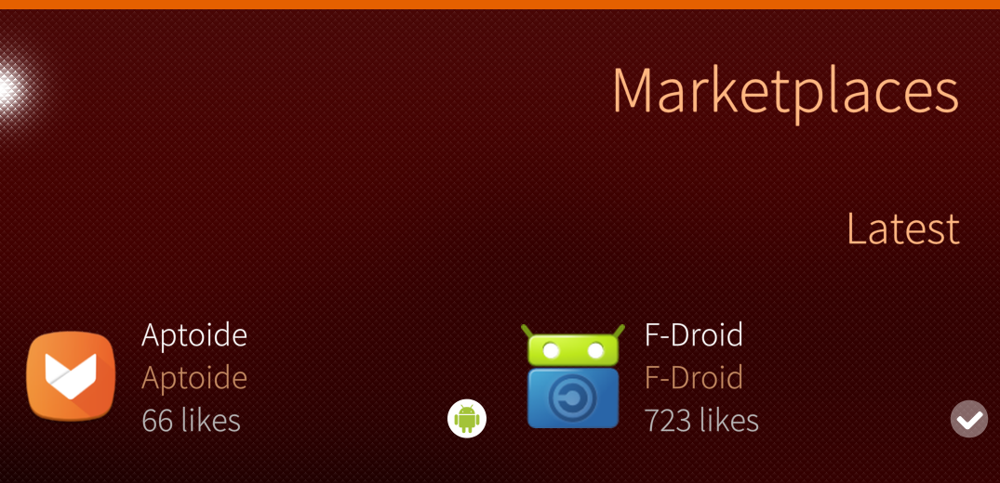</a>
  
    Aptoide in Jolla Store
  

  
The installed Aptoide Store appears at the end of your installed applications in the App Grid with a similar icon as in the Jolla Store.

* <a href="Aptoide-on-App-Grid.png" class="narrow-image">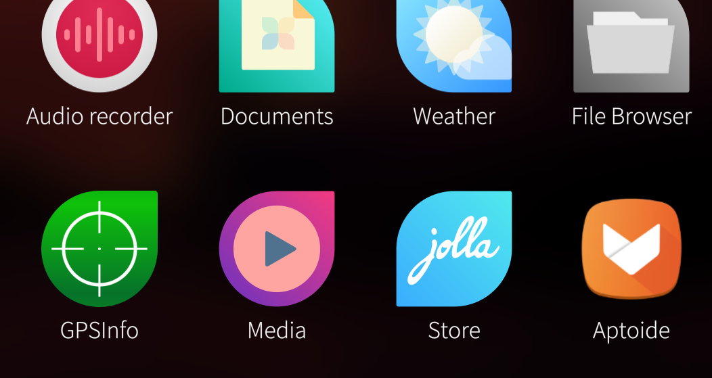</a>
  
    Aptoide at App Grid
  

  
  
# Downloading applications from Aptoide Store

Launching the Aptoide Store application (for the first time) will show a short tutorial to you and then some disclaimers. After passing through them, Aptoide's home page will appear (see the screenshot below).

The **toolbar** is located at the bottom of the screen. With the "Home" button near the bottom left corner, one can return to the initial (home) view of this app.

 The home view presents some popular applications.  You can get to the actual list of apps divided into a number of categories by tapping the "APPS" button near the top right corner and by scrolling the display. If you tap "MORE" (just under the top apps) instead of scrolling, a long list of top apps will be shown to you.

The "Apps" button at the right end of the toolbar has the apps that you have installed on your phone (once you have done that). It will also indicate for which of those apps there are updates.

* <a href="Aptoide-home-view.png" class="narrow-image">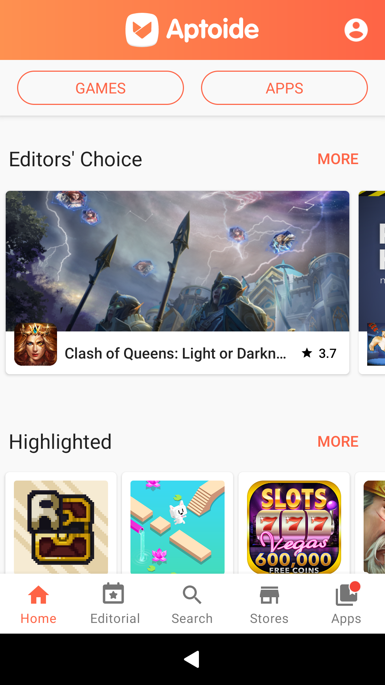</a>
  
    Home view of Aptoide app
  

  
  
## Using search

Search for your favourite app by tapping "Search" at the toolbar and by typing a keyword for the search.

Tap the app you want to install (see also chapter **[Installing applications](#installing-applications)** below).

* <a href="Aptoide-search-Signal.png" class="narrow-image">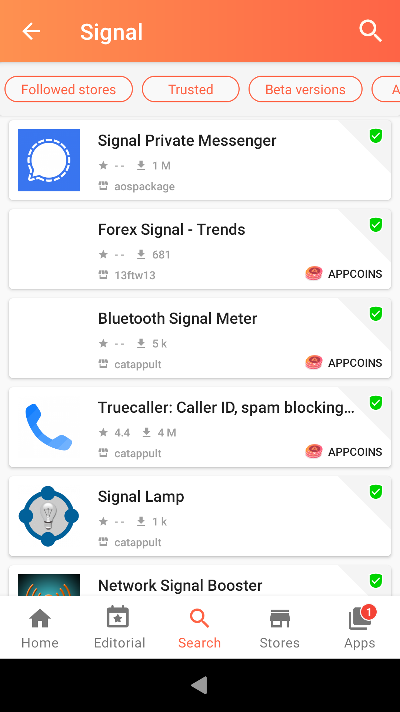</a>
  
    Signal app found
  

  
# Installing applications

Tapping on a search result (or an app icon anywhere) will produce the application page of the selected application. We use _WhatsApp_ as an example in this chapter.

Before tapping "INSTALL" check that the publisher is correct. Otherwise, you might get an application which is not authentic. In the worst case, it can be some kind of exploitation attempt. Therefore, tap on the "TRUSTED" button (with a green and white checkmark) on the right. It should bring up a small white rectangle with the text "Trusted app OK" (and some other information in some cases) on it.

* <a href="Aptoide_ready_to_download_WA.png">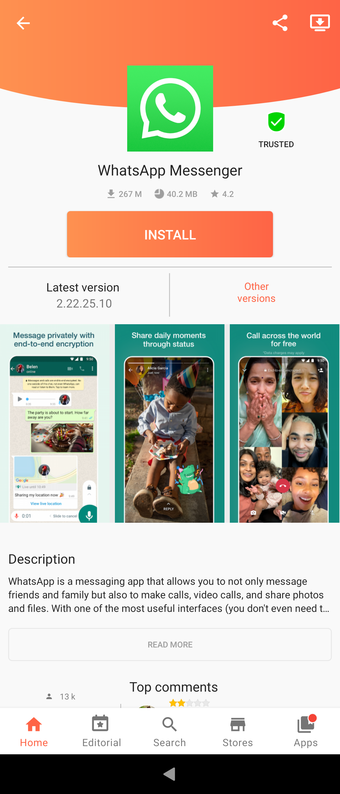</a>
  
    WhatsApp ready to be downloaded and installed
  
* <a href="Aptoide_trusted_app.png">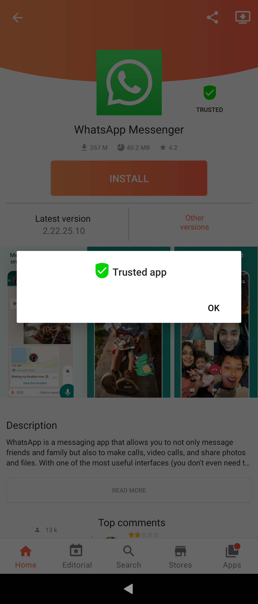</a>
  
    This should be a safe app
  

On the first picture below, the app is being downloaded. After the download is finished, tap "INSTALL" again. Aptoide prompts you to confirm the installation.

* <a href="Aptoide_downloading_WA.png">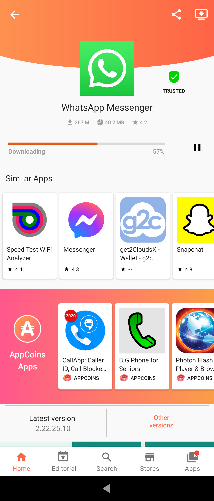</a>
  
    WhatsApp being downloaded
  
* <a href="Aptoide_confirm_installation.png">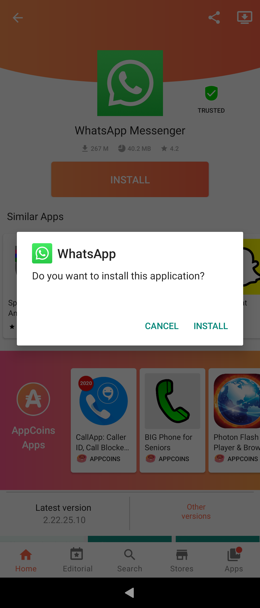</a>
  
    Confirm installation
  

It is possible to install earlier versions of the apps by finding one in "Other versions".

* <a href="Aptoide_WA_installed.png" class="narrow-image">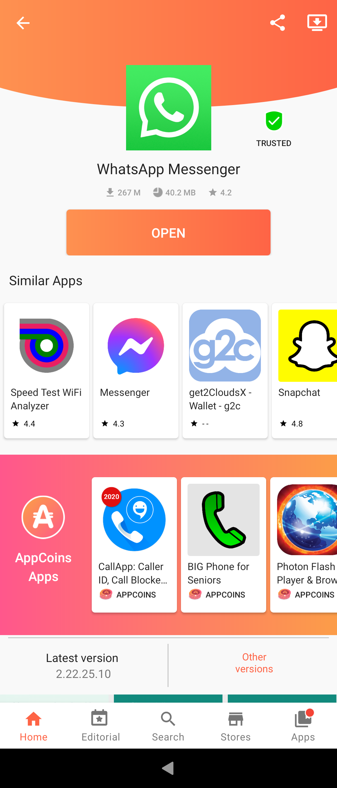</a>
  
    WhatsApp installed
  

  
  
# Uninstalling applications

The primary way of uninstalling apps on Sailfish devices is to open the app grid and long-tap it until the app icons get the delete buttons (X) on them. The actual deletion takes place by tapping the X buttons of those apps you want to uninstall.

* <a href="AppGrid_delete_apps.png" class="narrow-image">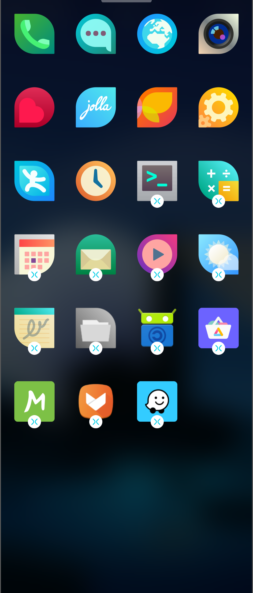</a>
  
    App Grid showing apps that can be deleted
  

  
  
Uninstalling applications at the “Apps” page (go there via the toolbar), which shows all installed apps, does not seem to work for an unknown reason.

* <a href="Aptoide-installed-apps.png" class="narrow-image">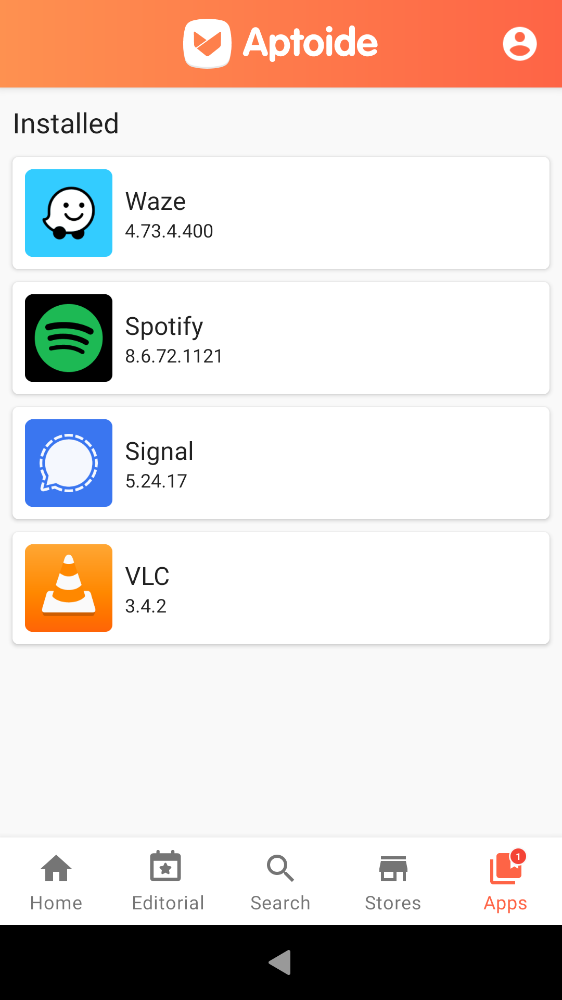</a>
  
    Aptoide showing installed apps
  

  
## Updating applications

Aptoide Store notifies you when there are updates available to your applications. To download the updates, go to the "Apps" tab at the toolbar, and tap "Update all" or tap just the individual apps you need to update.

* 
  
    There are updates for some installed apps
  
* <a href="Aptoide-Waze.png">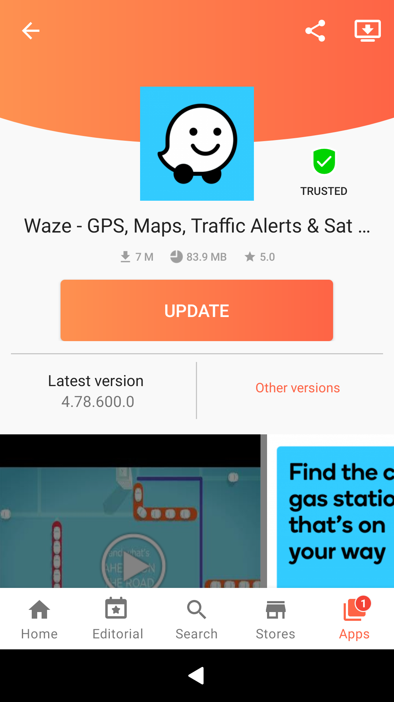</a>
  
    Waze app ready to be updated
  

  
  
# Substores within Aptoide Store

Aptoide Store is, in fact, a collection of several application stores. Anyone is free to start their own application store and publish them on Aptoide Store. One can then “subscribe” to these stores to broaden search results. _Jolla has no visibility to and control over those stores._

Use the "Store" Button of the toolbar to get familiar with this feature.

