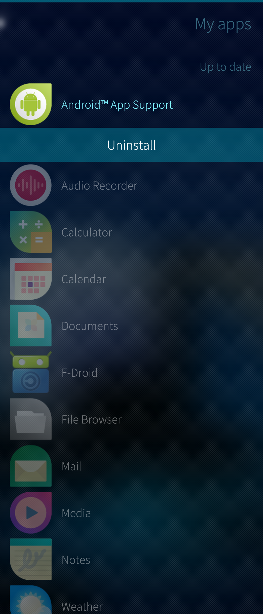

This document instructs how to revert a Sailfish device back to a state where there is no Android AppSupport and no Android apps. Alternatively, it is possible to remove the AppSupport but no Android apps or not all of them, allowing to reinstall the AppSupport.


# Clean removal

This is the recommended way of removing the Android AppSupport. It is to remove everything necessary but you can optionally keep the installed Android apps or some of them.

1) Uninstall all Android apps installed from the Jolla Store
* Jolla Store has the following Android apps: _F-Droid_, _Aptoide_ and _Here WeGo_ (2024 July).
* These apps **must** be uninstalled before uninstalling the AppSupport due to some dependency issues. AppSupport cannot be fully uninstalled without doing this step.
* Open the Jolla Store. Pull down My Apps.
* Look for the 3 apps mentioned above. Long-tap one at a time and select “Uninstall”.

2) Uninstall your Android apps installed from other app stores
* Open the app launcher grid
* Tap and hold the background until all icons get an X on them
* Uninstall all or selected Android apps by tapping the X on each of them
* If you do not remove an Android app here, it will persist over the removal and reinstallation of AppSupport (the icons are hidden when AppSupport has been removed).

3) Uninstall Android AppSupport
* Open the Jolla Store app on your phone
* Pull down My Apps
* Look for "Android AppSupport"
* Long-tap it and select "Uninstall"
  
<div class="flex-images" markdown="1">

* <a href="AAS_uninstall.png" class="narrow-image"></a>
  <span class="md_figcaption">
    Uninstalling Android AppSupport
  </span>
</div>

4) Check that it worked (optional)
* Open the Terminal app
* Issue the command

```
rpm -qa |grep -E "alien|apkd|appsupport"
```
* If the command printed just the following one line, AppSupport was successfully removed:

```
feature-alien-0.4.2-1.2.3.jolla.aarch64
```
(please ignore the version)

5) Restart the device

If you want to keep using AppSupport, open the Jolla Store again and install AppSupport. Remember to start it in “Settings > System > Android AppSupport”. After this, all Android apps that you did not uninstall (at step 2) will reappear at the app grid.


# Brutal way

Consider using this method if the **[Clean removal](/Support/Help_Articles/Android_App_Support/Removing_Android_App_Support/#clean-removal)** fails to work, for some reason.
The commands below will definitely and quickly remove all Android stuff. Use it only if you are familiar with working on the command line. Be careful to run the commands correctly, or else you might cause damage to your device. You will need to enable the **[Developer mode](/Support/Help_Articles/Enabling_Developer_Mode/)** before proceeding.

1) Uninstall Android AppSupport
* Open Jolla Store app on your phone
* Pull down "My Apps"
* Look for "Android AppSupport"
* Long-tap it and select "Uninstall" (see the picture above)
  
2) Run the following commands in the Terminal. Note that they remove all of your installed Android apps and their data, too, in addition to AppSupport.
```
devel-su
rm -rf /home/.android/
rm -rf /home/defaultuser/android_storage/   ## On some phones: /home/nemo/android_storage/
```
3) Restart the device.

# Factory reset or reinstalling Sailfish OS

**[Factory reset](/Support/Help_Articles/Factory_Reset/)** will definitely wipe out all Android stuff and unfortunately much more. Hard work will be needed to set up the device for pure Sailfish OS use after the reset.

**[Reflashing (reinstalling) Sailfish](/Support/Help_Articles/Reinstalling_Sailfish_OS/)** cleans everything up on the device: all data, apps and accounts are lost. However, setting up the phone is easier than after the factory reset.
