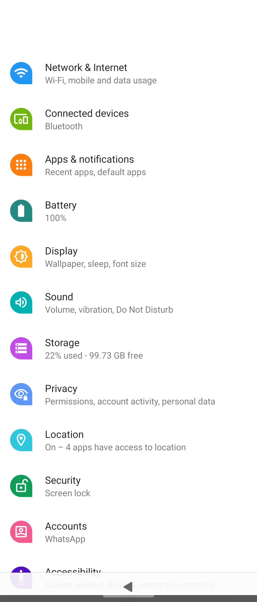

_The Sailfish OS settings should be applied in Android apps, too. However, there may be some glitches, i.e., not everything works that way. Hence it may be necessary to access the Android settings and try to adjust them._

The most often needed settings are the permissions to access certain services and the notifications from various apps shown on the screen.

# Adjusting the settings of Android App Support of Sailfish OS

The Settings app of Sailfish OS has the item **Android<sup>TM</sup> App Support** almost at the end of the page, in the section "Info".

<div class="flex-images" markdown="1">

* <a href="Android_App_Support_in_Settings.png" class="narrow-image"> Android App Support"></a>
  <span class="md_figcaption">
    Pic 1: Settings > Android App Support
  </span>
</div>


Android App Support is a dedicated run environment for Android apps on top of Sailfish OS. It can be thought of as a kind of sandbox for playing Android apps in it. This sandbox sets limits on what the Android apps can do. Having Android App Support running in the background consumes system resources, including the battery.

You can decide if the Android App Support is automatically started when you restart your phone or not until it is really needed. If you leave it OFF (i.e., the switch light in front of "**Start Android App Support on bootup**" is dimmed) then the Android service would be started only when you open an Android app on your phone. If Android App Support is OFF then the background services of various Android apps (e.g. messengers) cannot work. This implies that messaging apps, for instance, cannot communicate. On the positive side, the battery will last longer.

The other option to start the Android service is to do it manually by tapping the **Start** button at the bottom of the said menu page. If you have had Android App Support running you can stop it with the **Stop** button. Note that only one of these two buttons is visible at a time.


# Accessing the settings of an individual Android app

_The "Open Android settings" button and Android settings app are not available on products with earlier versions (4.1 and 4.4.) of Android App Support (Jolla Phone, Jolla Tablet, Jolla C, Xperia X). The instructions below are for Xperia XA2, Xperia 10, Xperia 10 II and Xperia 10 III_.

1) Go to Settings > Apps > \[_name-of-an-Android-app_\]<br>
We are looking at the settings of WhatsApp application in the example shown in Pic 2.

<div class="flex-images" markdown="1">

* <a href="Settings_Apps_WhatsApp.png" class="narrow-image"> Apps > WhatsApp"></a>
  <span class="md_figcaption">
    Pic 2: Settings > Apps > WhatsApp
  </span>
</div>

  
2) Tap the button "Open Android<sup>TM</sup> settings" (_see Pic 2 above)_

3) Tap "Permissions" (Pic 3) to check or change the permissions of this particular app.

<div class="flex-images" markdown="1">

* <a href="Android_Settings_of_WhatsApp.png"></a>
  <span class="md_figcaption">
    Pic 3: Android Settings of WhatsApp
  </span>
* <a href="Android_Permissions_of_WhatsApp.png"></a>
  <span class="md_figcaption">
    Pic 4: Permissions of WhatsApp
  </span>
</div>

 
  
4) Consider checking the notifications, storage, and other settings, too.

# Accessing the common Android settings from the command line

It is possible to access the common settings of all Android apps by using the command-line interface (CLI).

For this, you need to enable the [**Developer mode**](/Support/Help_Articles/Enabling_Developer_Mode/), so that you get the **Terminal** app to your phone.

_This CLI approach requires the Android App Support version 8.1 (or higher) which implies Xperia XA2, Xperia 10, Xperia 10 II and Xperia 10 III products._

Do as follows:

1) Open the Terminal app<br>
2) Run the command below
```
apkd-launcher com.android.settings
```

The following view appears. In there, it is possible to adjust the settings in each category.

<div class="flex-images" markdown="1">

* <a href="Android_Apps_Common_Settings.png" class="narrow-image"></a>
  <span class="md_figcaption">
    Pic 5: Common settings of Android apps
  </span>
</div> 
  
  

# An example:  Turning the touch screen sounds off

Some Android apps produce sounds on every tap to the touch screen which may turn annoying after a while. At least on earlier Sailfish OS releases, the Sailfish settings could not prevent these sounds from playing. To silence them:

* Open the common settings, like above
* Tap Sound
* Tap Advanced
* Turn Touch sounds off
* Close Android settings.

# Further reading

Learn more about Android App Support by clicking the links below.

* What Android apps does Sailfish OS support and how do I get them? Read the document **[Android Application Support](/Support/Help_Articles/Android_Application_Support/)**
* [Uninstalling Android App Support](https://jolla.zendesk.com/hc/en-us/articles/360015459134)


