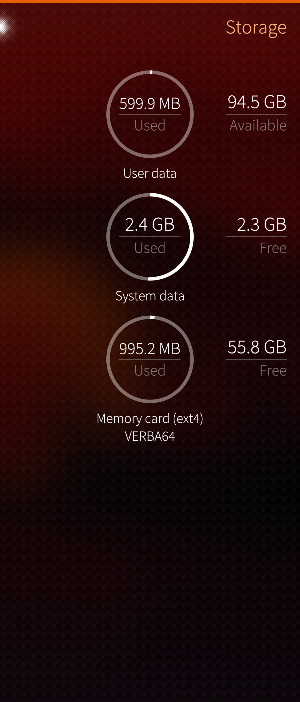
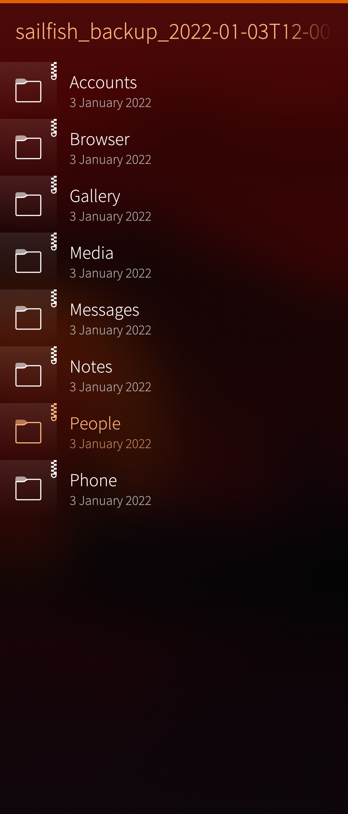
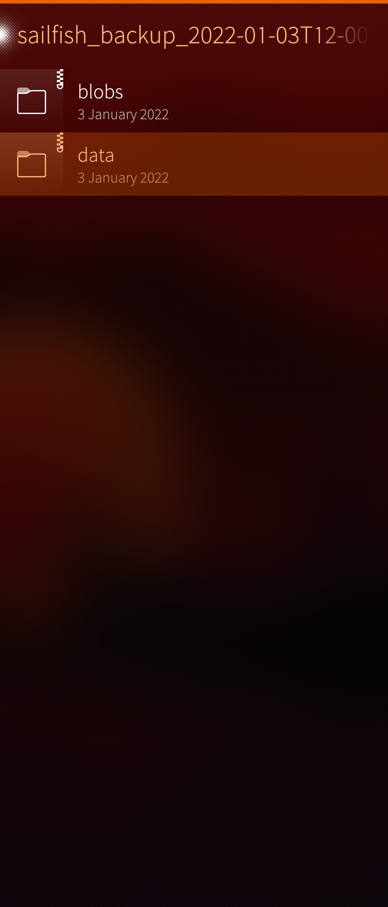
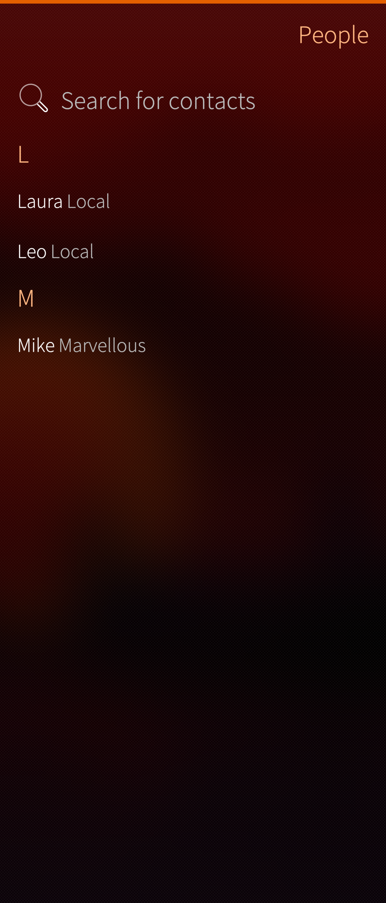

The Restore function of Sailfish OS is to bring the data back to apps from a backup file. Sometimes this may fail, due to various reasons. In such a case there may be the need to rescue some data from the backup file manually. This article explains how to do it - using contacts and calendar appointments as an example.

# Backup utility

The **[backup utility](https://docs.sailfishos.org/Support/Help_Articles/Backup_and_Restore/)** of Sailfish OS saves the so-called **local contacts** only. It does not save the contacts synchronised to/from a cloud service (e.g. Gmail or MS Exchange) as that would be unnecessary: those contacts can be retrieved from the cloud by signing in to one's account again from the mobile device and by enabling the account setting for this.

The same applies to calendar appointments. The **private (local) appointments** are kept in the Sailfish OS device. They are not synchronized to the cloud. However, they are included in the backup.

The backup data is stored to file **sailfish_backup_yyyy-mm-ddThh-mm-ssZ.tar** (where yyyy-mm-dd means year-month-day, and hh-mm-ss means hours-minutes-seconds, i.e. the date and time of creating the backup) in the SD card or on a cloud service like Dropbox. An example such a file name is sailfish_backup_2019-03-28T11-39-17Z.tar .

This compressed file contains files **all.vcf** holding the local contacts and  **all.ics**  holding the private calendar appointments, and many other files.

In the following we assume that this file is located in the SD card. If it were in a cloud service (e.g. Dropbox) you should download it to your device first.

# Extracting the contacts and appointments from backup

Do as follows:
## Contacts

1) Go to Settings > Storage.

2) Tap "Memory card"

3) Look for your **sailfish_backup** files in the end of the listing. Tap the one you want. Pay attention to the date and time to select the correct one (if there are several).

* 
  
  
* 
  
  

4) A view with folders appears. These are still compressed.
5) Tap "People", then tap "data", and file **all.vcf** appears. Tap-and-hold it and then tap "Extract" in the pop-up menu.

* 
  
  
* 
  
  

* 
  
  

6) Tap **all.vcf** . People app opens up. It tells how many contacts there were in that vcf file and how many new contacts were added to People app.  Those contacts were automatically imported.

* 
  
  
* 
  
  

* 
  
  

7) Tap "View all contacts" at the bottom of the screen to see your contacts.

## Calendar appointments

1. Go to Settings > Storage.
2. Tap "Memory card"
3. Look for your **sailfish_backup** files in the end of the listing. Tap the one you want. Pay attention to the date and time to select the correct one (if there are several).
4. A view with folders appears. These are still compressed.
5. Tap "Calendar", then tap "data", and file **all.ics** appears. Tap it and then "Extract".
6. Tap **all.ics** . Calendar app opens up showing your private appointments. Tap "Import" at top right corner to move the appointments to your calendar.
7. Done.
