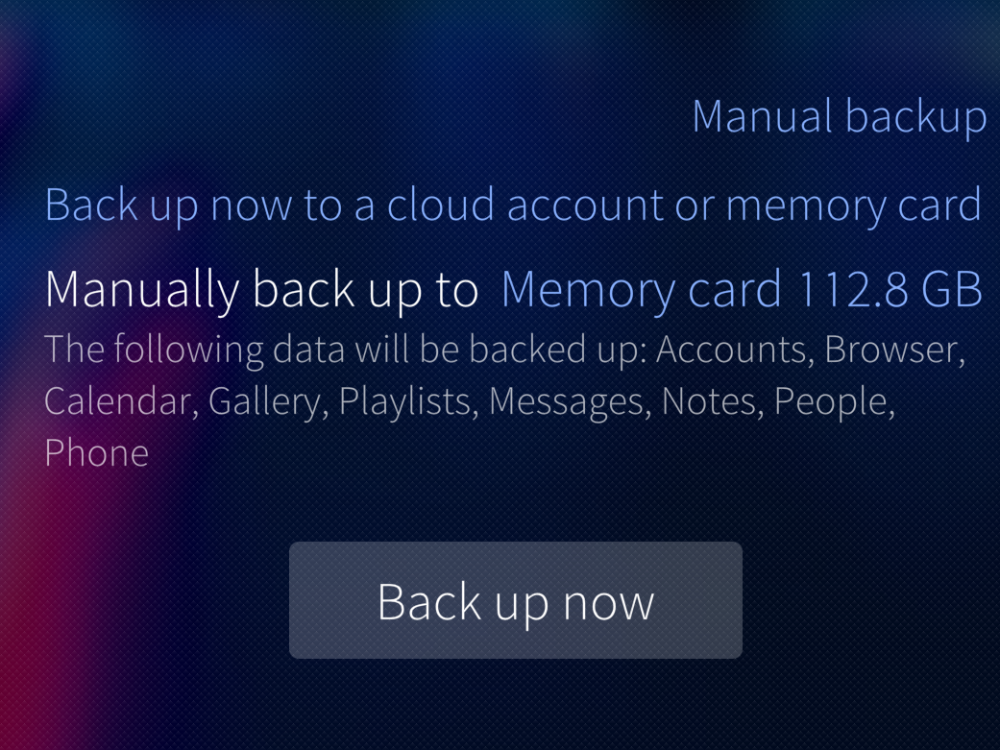
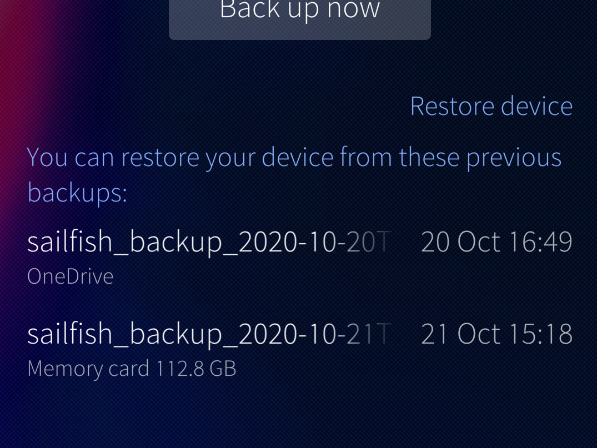
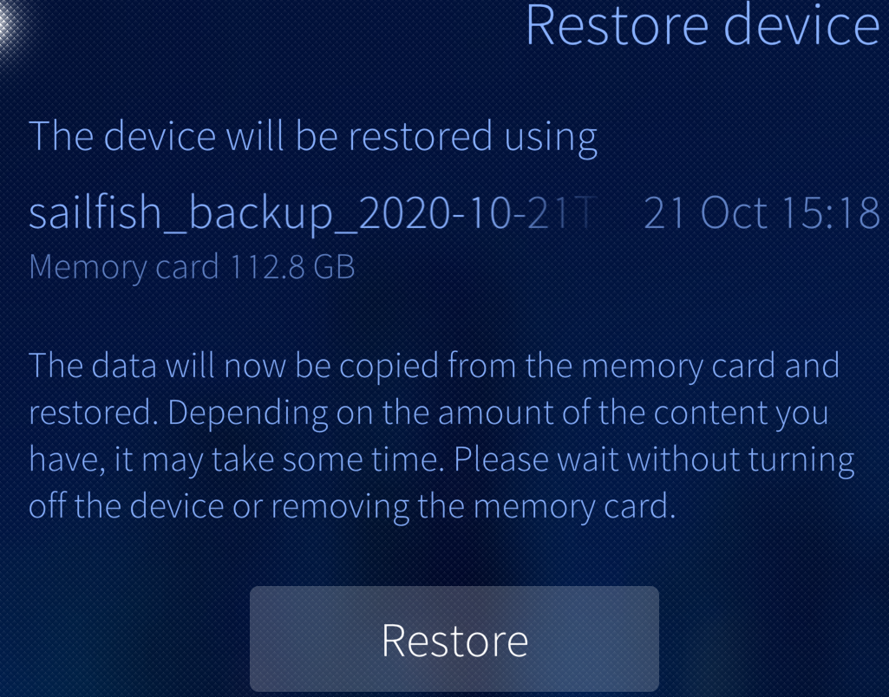
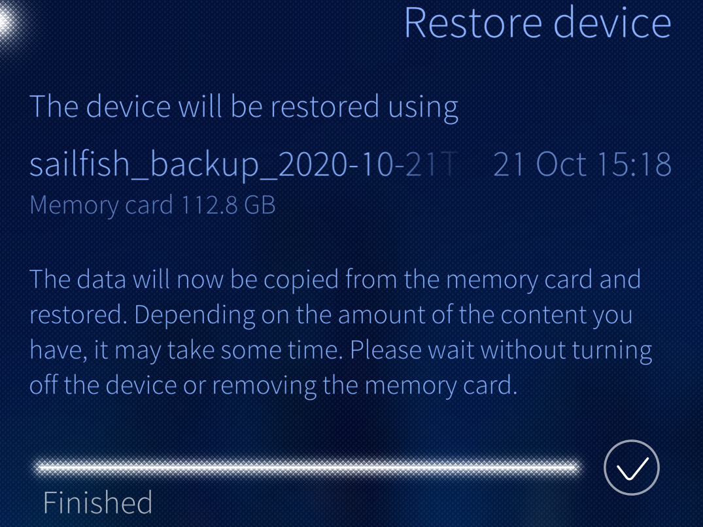
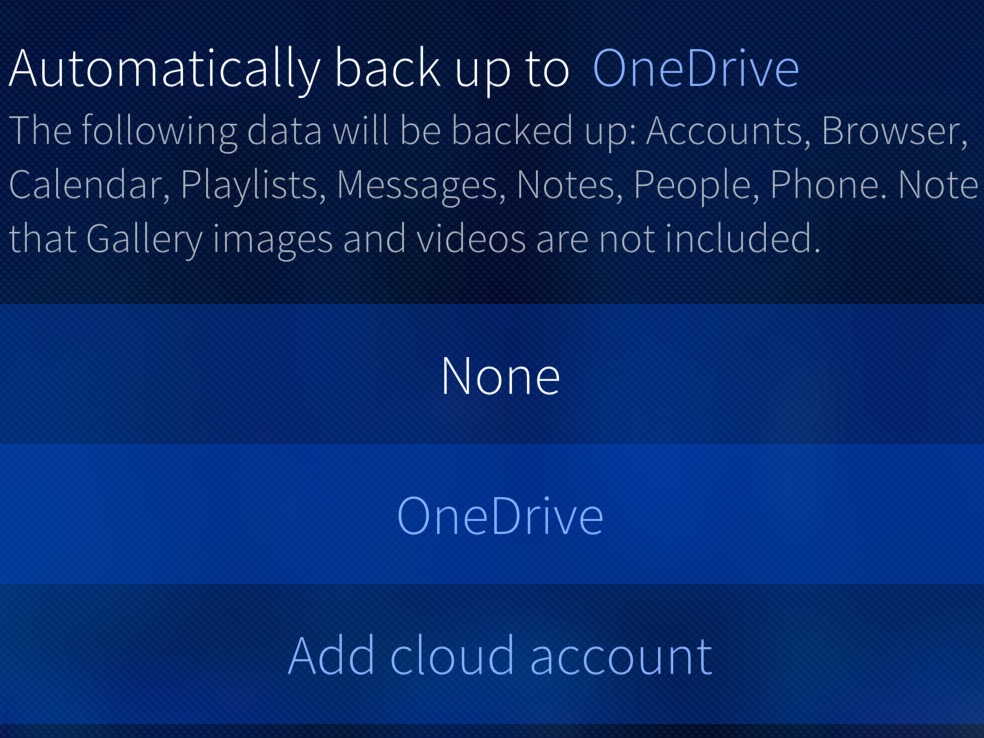
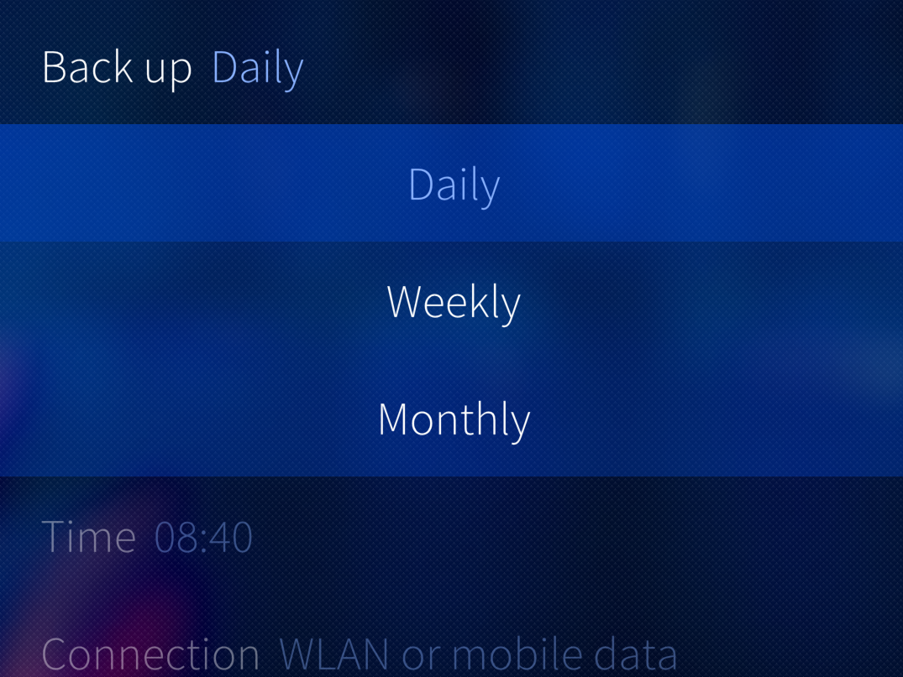
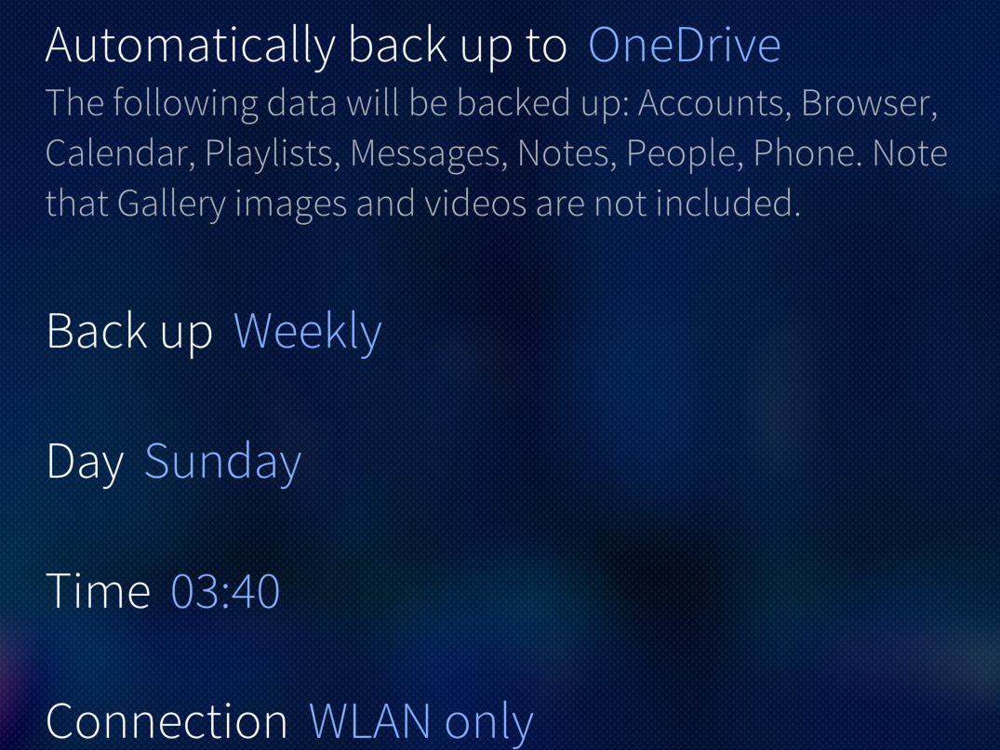
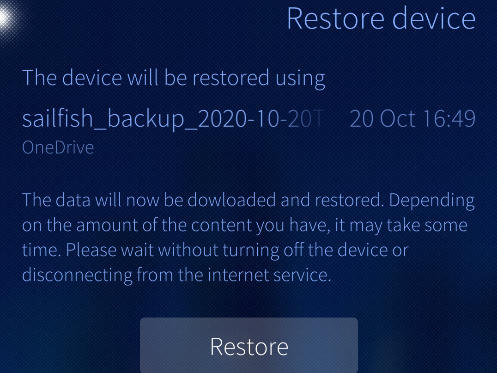

# Foreword

**We warmly recommend backing up your data from your Sailfish device to safe storage like a memory card or cloud service (_Dropbox_, _Nextcloud_ or _OneDrive_). The latter is probably better as if the device should get stolen then the memory card would be lost, too.**

**The backup should be done on a regular basis. Sailfish OS release 3.4.0 makes this easier as we have implemented automatic scheduled backups.**

The picture below shows how the menu page "Settings > System > Backup" looks like. The top half is for setting up automated backups and the middle part for making manual backups while the bottom part lists the previous backups (if any) and let's you restore them to the device if needed.

* 
  
    Main view of backup & restore
  

# Limitations

Before you use the backup/restore utility, please bear in mind that it cannot save all the data on your device.

## What is NOT included in backups

The backup utility of Sailfish OS does not save:

* Installed applications (neither Sailfish nor Android), not even a list of them
* Passwords of accounts
* The settings in the Settings menu
* Contacts synchronised to a remote service (e.g. Google). _Local (non-synced) contacts are backed up, though_
* Calendar appointments synchronised to a cloud service (e.g. Google). _Local (non-synced) appointments are backed up, though_
* Pictures and videos are not backed up to any cloud service, only to an SD card
* Music files
* Email messages
* Recorded calls
* Document files in the Documents folder of the phone
* Application data of Android apps

Items NOT listed in chapter ["What is included in backups"](#what_is_included_in_backups) are not backed up, either, i.e., the list above may not have everything mentioned.

## What is included in backups

The following items are backed up (but with some exceptions):

**Accounts**: your configured accounts ("Settings > Accounts"). _You will have to relogin to your accounts after using the Restore function as passwords are not backed up._

**Browser:** your browser bookmarks & tabs. _Your saved passwords are not included in the backup._

**Gallery:** photos and images appearing in the Gallery app (residing in folders Pictures and Videos of the phone).
  - _Files in other folders, such as Downloads are not backed up._
  - _Pictures and videos are not backed up to cloud services, only to an SD card_
  - _Pictures and videos saved by Android applications are not backed up at all._

**Media:** your playlists from the Media application. _The actual music files (e.g. *.mp3) are not backed up._

**Messages:** your SMS and IM messages. _Attachments of the MMS messages (i.e. pictures and other media files) are not backed up._

**Calendar:** your list of calendars in "Manage calendars" (in the pulldown menu) and your private calendar entries (local, non-synchronised) in the Calendar app. _Synchronised entries (e.g. those from the Google calendar service) are not backed up as they can be found from that service._

**Notes**: your notes in the Notes application. _Restoring notes from backup always overwrites pre-existing notes in the device (if any)_

**People:** your local (non-synchronised) contacts. _Contacts synced with cloud services (Google, Facebook) are not backed up as they can be found from the cloud._

**Phone:** Call history.

Items missing from this list are NOT backed up.

## Backup prior to factory reset and prior to reinstalling Sailfish

If you intend to do a device reset (reset the device to factory settings) or reinstall Sailfish OS to the device, please note that ALL DATA in the device will be completely WIPED OUT. As written in chapters ["What is NOT included in backups"](#what_is_not_included_in_backups) and ["What is included in backups"](#what_is_included_in_backups) above, Sailfish backup does not save everything you have on your device, i.e. some data will be lost.  However, the data on the memory card and on the SIM card(s) remains intact.

Proceed in this order to restore your system after the reset:

1\. First [**install all system updates**](https://docs.sailfishos.org/Support/Help_Articles/Updating_Sailfish_OS/) until you have the latest Sailfish OS version again. Note that this step is not needed if you just reinstalled the latest Sailfish OS version
2\. Install all of your applications
3\. Restore the backup only now
4\. Check your accounts at "Settings > Accounts". We recommend re-signing each of them.

## Backup prior to encrypting user data

We recommend backing up your data before encrypting the user data (i.e., the home partition) of your device. This is our document on the [**encryption of user data**](https://docs.sailfishos.org/Support/Help_Articles/Encryption_of_User_Data/).

We also recommend encrypting your memory card (SD card) first, before encrypting home, to ensure that your backup data is safely stored on the card. How to encrypt the SD card is explained in this [**document on SD cards**](https://docs.sailfishos.org/Support/Help_Articles/SD_Card_Format_and_Encryption/).

# Manual backups

Manual backups (i.e., "backup now") can be saved to memory cards and to cloud services.

In this chapter, we describe how you can make a backup to a memory card inserted in your Sailfish device and how to restore the backup if there is a need to. Making and restoring a backup to/from a cloud service is done in the same way as shown in chapters 3.1 and 3.2 below. You just need to have an Internet connection and be signed in to a cloud account before you start.

## Backing up to memory card

Making a backup to a memory card is straightforward as it does not require any internet connection. Also, pictures and video clips from the device memory are backed up in this case (whereas they are not included in the cloud backups).

The downside of keeping backups on a memory card is the risk of losing the card together with the phone or otherwise (a card is a small object and could disappear among other objects).

1\. Turn your device off.

2\. Insert a memory card (an SD card) into the device. Check what is said about compatibility in this [**document on SD cards**](https://docs.sailfishos.org/Support/Help_Articles/SD_Card_Format_and_Encryption/).

3\. Turn the device on (it is always good to restart the device before taking a backup).

4\. Unlock the memory card if encrypted or else you would be reminded about this in the red text "The memory card is locked" at step #5. In such a case, you should tap the "Mount" button.

5\. Open Settings and select Backup

6\. Tap on “Manually back up to” and select “Memory card”. Tap “Back up now” and the progress bar appears.

* 
  
    Manual backup to memory card
  
* 
  
    Manual backup in progress
  

7\. The backup process may take a while depending on the amount of data on your device.

8\. When you see the view below the backup process is complete and your backup has been successfully copied to the memory card. Tap the check mark and you are done.

* 
  
    Backup completed
  

## Restoring from memory card

1\. Open Settings and select Backup

2\. On the “Restore device” section, choose an item "_sailfish\_backup\_*_ " to restore.  The items have different storage locations and dates. Tap one with the text "Memory card" underneath it and you will be shown the view below on the right.

Unlock the memory card if encrypted or else you would be reminded about this in the red text "The memory card is locked". In such a case, tap the Mount button.

3\. Tap "Restore" to start the process

* 
  
    Previous backups listed
  
* 
  
    Restore from memory card
  

4\. The progress of the restoration is shown next. Allow it to run to the end. When you see the view below on the right, the restore process is complete. Tap the check mark.

* 
  
    Restoring finished
  

5\. Restart your device. Sign in to your accounts, again

# Automatic backups

With Sailfish OS release 3.4.0, it became possible to make automatic backups that follow the schedule you have set. It is up to you if your data is backed up daily, weekly or monthly and at which time of the day. Isn't this easy? The backups are done for you on regular basis.

Automatic backups can only be targeted to cloud services, such as Dropbox, Nextcloud or OneDrive. However, automatic backups cannot be saved to a memory card.

In order to use this option, first, you need to sign in to your cloud account at "Settings > Accounts". As a consequence of this, the cloud service you signed up for appears as a backup location under "Settings > Backup".

The backup and restore processes are similar for all cloud services. Below, you will see the instructions for OneDrive as an example in this document.

NOTE: _Gallery photos and videos are not saved to cloud backups._

## Automatic backup to the cloud

1\. Go to Settings and select Backup.

2\. Tap "Automatically back up to" and select the cloud service you want to use (if several). Note that only one cloud service can be active for backups at a time. In this item, you can also select "None" to prevent automatic backups from happening.

3\. Tap "Back up" to select how frequently you want your data to be backed up.

* 
  
    Target for automatic backup
  
* 
  
    Frequency of automatic backup
  

4\. Tap "Time" to select the time of the day when the backup is created (_no picure about this_).

5\. Finally, select the type of Internet connection to be used for transferring the data to the cloud. If the selected type of connection is not available at the scheduled time then the backup is skipped.

* 
  
    Internet connection for backup
  

The resulting backup schedule could be something like this:

* 
  
    Summary of automatic backup settings
  

You will see afterwards a line of text in the Backup section of the Events view showing the time when backups were made.

## Restoring from the cloud

Restoring a backup from a cloud is done in the same way, on your command, as from a memory card in chapter ["Restoring from memory card"](#restoring_from_memory_card).

The only differences are that you will need an Internet connection and to be signed in to your cloud account before you start.

To start the restoration, select one of the previous backups residing in the cloud and tap Restore: 

* 
  
    Previous backups listed
  
* 
  
    Backup to be restored from cloud (OneDrive)
  

# Logs

The backup app collects and saves logs to a folder `/home/$USER/.local/share/sailfish-backup/logs/ `  where $USER is either 'nemo' or 'defaultuser'.

The log of a backup just completed (or still incomplete) can be viewed directly at the display by long-tapping the progress line. The logs of previous backups can be viewed by long-tapping their names at the bottom of the menu page.

# Known issues

## Account credentials are lost

The accounts are typically not restored correctly. Some accounts (but not all) get a red text warning about this and ask to sign in again. This can be seen in "Settings > Accounts".

It is a known problem that some accounts, e.g. Exchange, also require a new sign-in although they do not get the red warning texts. Since the menu of the Exchange account does not have any dedicated command for signing in, we recommend deleting the account first, followed by a new sign-up.

## Restoring fails due to a different username

The default username of Sailfish OS is "defaultuser" since the early Sailfish 3 generation. Before that, the default was "nemo". Some devices may still have "nemo" if those devices have always been updated over the air. Installing a recent Sailfish OS release would bring "defaultuser" to the device. It has turned out that some backups made as user "nemo" cannot be restored to the device which has been upgraded to "defaultuser" in the meantime.

# In case something goes wrong

If the backup process stops in the middle of the progress line and cannot continue after a few minutes, then it is best to stop it and try again after restarting the device.

it may be possible to find the reason for a failure in the logs (see chapter [5\. Logs](/hc/en-us/articles/201804906/#Logs)).

