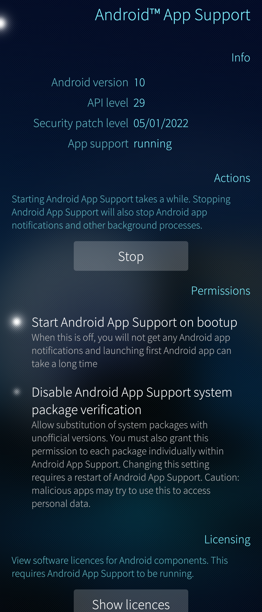

Battery lifetime depends on how the device is used. Making a lot of calls, playing games and streaming videos consumes a lot of power compared to the case where the device is in an idle state with the display blank. Your device heating up is a sign of heavy strain on the device, meaning high battery drain.

# What drains the battery?
Below are some general tips on how to maximize battery life. The tips listed below are meant to give you an understanding of what drains the battery so that when needed you can try to lighten the load on the battery and lengthen the battery life.

* Always use the **latest** available **version of SailfishOS**. Go to Settings > Sailfish OS updates and pull down "Check for updates".
* **Close apps** that you do not probably need in the next couple of hours.
* Set the **Sleep** after time as short as is convenient for you (Settings > Display)
* Set the **Brightness base level** as low as still convenient (Settings > Display)
* Set the **background synchronization** of email and other accounts to happen as seldom as good for you. Specify dedicated sync intervals for your email accounts in Settings > Accounts > "your Email accounts". This same setting applies to the calendar sync, too.
* Turn **Bluetooth** and **NFC** off unless you need it on a regular basis (Settings > Bluetooth and Settings > NFC).
* Turn **Internet sharing** (WLAN hotspot, tethering) off if no more needed.
* Turn **Location service** off in Settings > Location if you are not using map applications daily. Depending on the navigation settings of those apps, the current drain from the battery may grow significantly.
* Disable Settings > **Android AppSupport** unless you use your Android apps regularly. There is more information about this later in this article.
* Consider turning **mobile data** off if you can be connected to the Internet via WLAN. You would still be reachable via phone calls.
* Check the **network mode** of mobile data. By default, your device will search for the fastest network available (4G, 5G), but if speed is not critical to you or you usually use a WLAN network, then consider using a 2G or 3G mobile network instead (Settings > Mobile network > Network mode).
* Select the **cellular operator** (carrier) with the best network in your area. The better the network coverage, the less the phone needs to rely on remote base stations and swap between network generations (4G, 3G, 2G). If the operator has a firewall for mobile data then the phone will receive less (unnecessary) incoming data traffic, allowing it to stay in a suspended state longer.
* Enable the **battery saving** mode (Settings > Battery).

It is also good to **restart** the phone every now and then (once a week), especially if it feels warm. It may be that after you have closed an application the system has failed in turning off all the processes the application required. A restart would eliminate all hanging processes.

# Investigating applications and processes as the cause of battery drain
It is quite rare, that the battery itself is the main culprit of the battery drain. This is why it is good to attempt to rule out that **applications** or **stuck processes** aren't causing a heavy load on the phone, thus creating a battery drain and possible heating up of the device.

## Monitoring the device
There are applications that list the running applications and processes in your device, and report how much CPU power and memory they require.

Search for one or more of the following applications in the **Jolla Store**. Consider installing them on your device.

* Crest
* Lighthouse
* Battery Log

### Crest
The pulley menu of Crest has a number of settings that are used to select the kind of data interesting to you. In the example below, the settings make the app show only applications and sort them by their impact on CPU power.

* Set Autorefresh ON
* Set Apps only ON for an overview, or OFF to show a detailed view including various processes
* Tap Sort by CPU once or twice so that the highest % figure gets to the top of the left-most column

If you contact Jolla customer support we would like to get a screenshot of the listing of your Crest. Take the screenshot by long-pressing both volume keys at the same time. Collect the screenshot from the folder Pictures/Screenshots.

* 
  
  
* 
  
  
  Screen captures from Crest main view and Settings.

### Lighthouse
Use Lighthouse (pictures below) in the following way:

* Open the app
* Tap Processes to get a detailed view of which processes are running in the system - they are automatically sorted so that the active processes are shown on top

If you contact Jolla customer support we would like to get a screenshot of the listing of your Lighthouse. Take the screenshot by long-pressing both volume keys at the same time. Collect the screenshot from the folder Pictures/Screenshots.

* 
  
  
* 
  
  
  Lighthouse main view on the left, and the "Processes" view on the right. Processes are sorted by their CPU Usage.

### Battery Log
The pulley menu of Battery Log has the settings menu. It is probably best to select the shortest storage period of 5 days, first, and then tap (as many times as required) on the graph area of the app to make it say "Displaying 1 day(s)". In this way, the battery curves start developing to the main display of the app sooner. You can adjust the colours of those curves in the settings, to your liking.b

Battery Log is useful in following the overall current consumption over time. It may help in finding some special points in the timeline when the current drain or CPU usage goes high, and thereby figure out what is causing the abnormal behaviour.

If you are able to pinpoint an application or process that is constantly running at high CPU power, you now have the tools to investigate the issue further.

* If it's an application, consider uninstalling or updating the application.
* If it relates to a phone process, see if you can investigate the app it could be related to, or whether a simple reboot would solve the situation.
* A [**device reset**](/Support/Help_Articles/Factory_Reset/). is often the best way to determine whether the software is causing the increased drain of the battery. Resetting your device is likely to have positive implications on the battery life.

## Controlling the Android™ AppSupport
The purpose of **stopping** or **starting** the Android AppSupport is to see whether it is a process related to an Android application that is causing the battery drain because it is stuck or simply power-hungry.

* 
  
  

**Stopping Android AppSupport**: ends all processes related to the Android service, including background tasks. The service will be automatically restarted if you launch an Android app (in this case it takes longer to get the app up and running).

**Starting Android AppSupport**: you can manually start the Android AppSupport when needed. This is an alternative to letting Sailfish OS start the service when the device is restarted. Note that the Stop button in the picture above appears as "Start" when Android AppSupport is off.

**"Start Android AppSupport on bootup"** means that Sailfish OS will start the service automatically when the device is started up. Hence the service will be running in the background, making it faster to open Android apps and making it possible to receive notifications from the installed apps (e.g. notifications on received Whatsapp messages).

## Apps from untrusted sources
It is possible to install apps onto your Sailfish device such that those apps have not passed the quality control of Jolla. Typically, those apps have been developed for Sailfish but they have not yet been accepted to Jolla Store because they have failed some quality control steps.

We do not recommend installing these applications because they may cause unexpected problems hard to identify and fix. Some apps may also increase current consumption.
