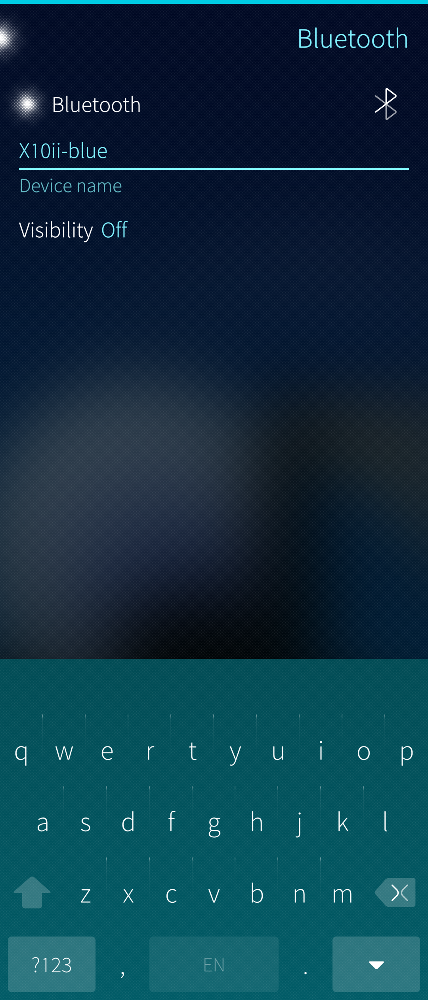
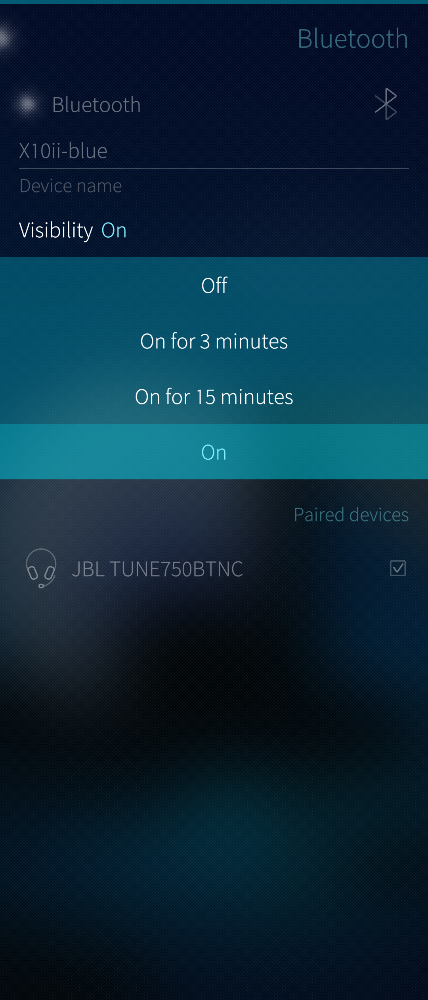
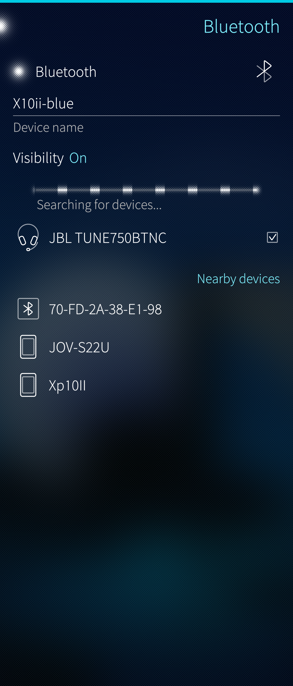
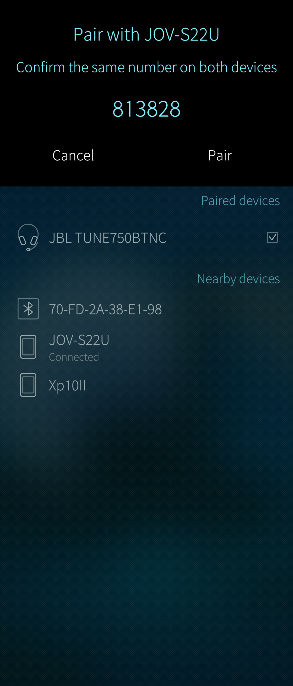
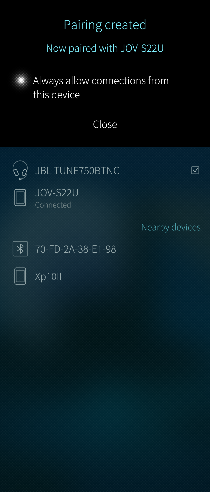
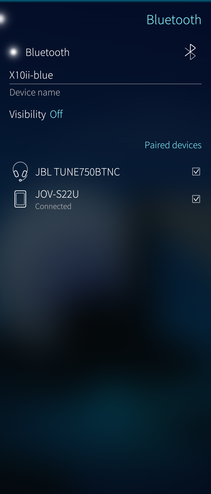
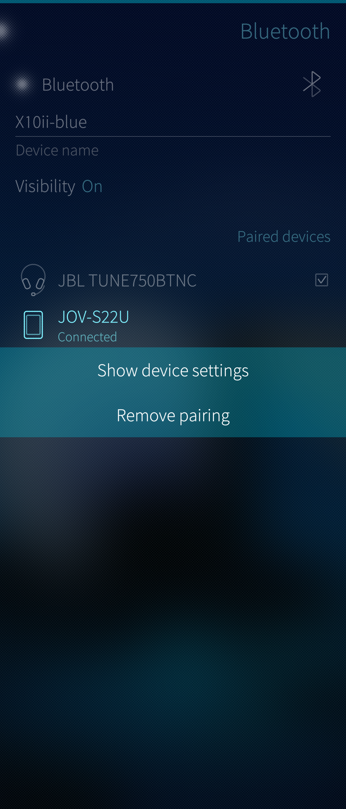
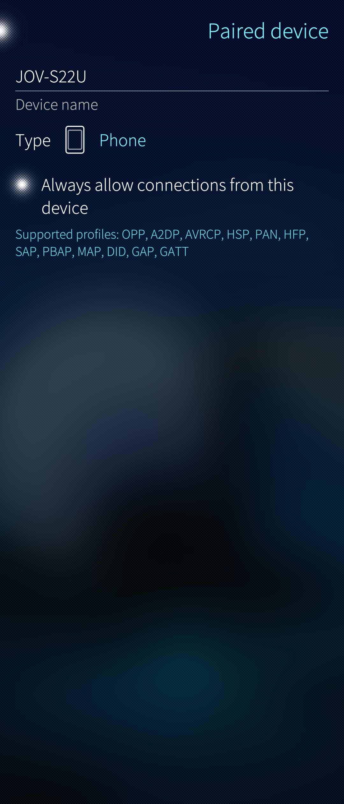
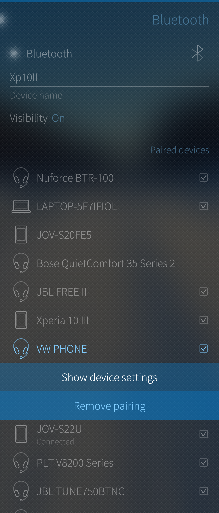

_Before you start 'pairing' a peripheral device with your Sailfish OS phone, please check the device manual to see how to pair them. It is common that with accessories such as headsets or speakers you have to press the power button (or some other button) of a Bluetooth device for several seconds to force it to the pairing state. This state is typically indicated with a  light blinkíng rapidly (often in blue colour)._

# Preparing for Bluetooth connections

1)  Open the menu "Settings > System > Bluetooth".

2)  Tap "Bluetooth" (near the top left corner) to switch Bluetooth on _(Pic 1)_.

3)  Change the device name if you want. It will appear for other devices making device searches helping to identify the correct device.

4)  Turn the visibility ON, at least for few minutes, so that this phone can be paired with another device _(Pic 2)_. After a successful pairing, the visibility can be kept OFF - it does not prevent connections.


<div class="flex-images" markdown="1">

* <a href="BT_turned_on_and_name_given.png"></a>
  <span class="md_figcaption">
    Pic 1: Bluetooth menu
  </span>
* <a href="BT_visibility_options.png"></a>
  <span class="md_figcaption">
    Pic 2: Bluetooth visibility
  </span>
</div>


# Making two Bluetooth devices a pair

Making the devices a pair (or 'pairing' them) is the prerequisite for connecting the devices for data transfer. Only paired or known devices can establish connections. 

Bluetooth connections work over a short distance between the device. This is typically less than 10 meters.

While in the menu "Settings > System > Bluetooth",

1) Pull down and select "Search for devices".

2) After about 10 to 60 seconds, the phone lists all devices with Bluetooth enabled and close enough to you. They appear in the section _Nearby devices_ _(Pic 3)_.

<div class="flex-images" markdown="1">

* <a href="BT_searching_new_devices.png" class="narrow-image"></a>
  <span class="md_figcaption">
    Pic 3: Searching for Bluetooth devices
  </span>
</div>

3) Tap on the device you want to connect to (e.g., "JOV-S22U" which is a smartphone)

4) Your Sailfish OS device will now ask you to ‘accept’ the connection. Your Jolla and the device to be connected should show the same 6-digit code (if the other device has a display).
Accept the connection on both devices if the codes match _(Pic 4)_.

NOTE: When pairing devices lacking a display and keyboard (e.g., headsets) code matching is not used. The pairing process jumps directly to the view of _(Pic 5)_.


<div class="flex-images" markdown="1">

* <a href="BT_pairing_with_code.png"></a>
  <span class="md_figcaption">
    Pic 4: Bluetooth menu
  </span>
* <a href="BT_phone_paired_allow_connections.png"></a>
  <span class="md_figcaption">
    Pic 5: Bluetooth visibility
  </span>
</div>


5) Decide if you always want to allow connections between these devices automatically _(Pic 5)_. Otherwise, you will need to allow the connection on this menu page every time you need it.

The just connected device "JOV-S22U" appears under _Paired devices_ (see _Pic 6_ ). It has a checkbox to the right of its name to indicate that automatic connections are enabled (step 5). The previously paired headset "JBL" is not connected here but it has automatic connections enabled, too.

<div class="flex-images" markdown="1">

* <a href="BT_two_devices_paired_one_connected.png" class="narrow-image"></a>
  <span class="md_figcaption">
    Pic 6: Showing two Bluetooth devices paired with this phone
  </span>
</div>


Each paired device has a context menu that is accessible by long-tapping the name of the device _(Pic 7)_.

The context menu lets one either check the connection details or remove the paired device. The details show the device type (phone, headset, etc.) if the connections are allowed and the Bluetooth profiles supported _(Pic 8)_

<div class="flex-images" markdown="1">

* <a href="BT_popup_menu_of_paired_device.png"></a>
  <span class="md_figcaption">
    Pic 7: Bluetooth menu
  </span>
* <a href="BT_showing_device_settings.png"></a>
  <span class="md_figcaption">
    Pic 8: Bluetooth visibility
  </span>
</div>


# Problem-solving

This chapter has some guidance for resolving problems with Bluetooth.

Pairing two "intelligent" devices (having a display and buttons) may be started from either device. Especially, some car kits (i.e., audio systems of cars) tend to take an active role. Remember to set the 'Visibility' of your phone on in this case before trying to pair.

If pairing repeatedly fails, restart both your Sailfish OS device and the other device. Try again.


## Checking stepwise

The instructions below refer to a car kit but you can use the same steps with any Bluetooth device.

1)  Remove the pairing from your car kit.

2)  On your Sailfish phone, open the menu "Settings > System > Bluetooth"

3)  Remove the pairing from the phone. Long tap the name of the paired device (car kit) and take "Remove pairing" _(Pic 9)_.


<div class="flex-images" markdown="1">

* <a href="BT_remove_car_kit.png" class="narrow-image"></a>
  <span class="md_figcaption">
    Pic 9: Removing a paired device
  </span>
</div>


4)  Turn Bluetooth OFF on the phone. Next, turn it back ON.

5)  Pair these devices again. Start the pairing from the car kit as this usually works better (with car kits).

6)  If step 4 fails, repeat steps 1 to 4. This time, initiate the pairing from the Sailfish phone.


If you want to connect to a device without any user interface (e.g. a headset) then start the pairing from the phone.
We recommend accepting the pairing dialogues on both devices and allowing the devices to connect automatically.


## Pairing with MAC address

_Sometimes Bluetooth pairing keeps failing, particularly between Sailfish and cars._
_Pairing from the Sailfish command line may help._ _This advice is for advanced users.  It can be attempted on all Sailfish OS devices but not on the Jolla Phone or on the Jolla tablet (as the commands below require bluez5)._

Some Bluetooth tools need to be installed. The actual pairing command relies on the so-called MAC address of the device to be paired. The MAC can be checked from Settings > System > About phone on Sailfish devices and from a corresponding menu on other devices.

You will need to enable the **[developer mode](/Support/Help_Articles/Enabling_Developer_Mode/)** for this. Once done, give the following commands in the Terminal app or make an SSH connection from a computer to the phone. The following links have SSH instructions for **[Windows computers](/Support/Help_Articles/SSH_and_SCP/SSH_and_SCP_Windows/)** and for **[Linux computers](/Support/Help_Articles/SSH_and_SCP/SSH_and_SCP_Linux/)**.


### Install the tools

```
\[defaultuser\] devel-su       ## Type your SSH password

\[root\] ssu ar qa             ## Enable quality assurance repository
\[root\] pkcon refresh
\[root\] pkcon install bluez5-tools
\[root\] pkcon install bluez5-tracing
```

### Do the pairing

```
\[root\] bluetoothctl
Agent registered

\[bluetooth\]# scan on
Discovery started
\[CHG\] Controller 3C:01:EF:CB:CF:56 Discovering: yes
\[NEW\] Device 3C:01:EF:C7:5F:A2 Xp10II             ## New device, check & copy the MAC
\[CHG\] Device 3C:01:EF:C7:5F:A2 RSSI: -53

\[bluetooth\]# pair 3C:01:EF:C7:5F:A2               ## Pairing the new device, use the MAC ^
Attempting to pair with 3C:01:EF:C7:5F:A2
\[CHG\] Device 3C:01:EF:C7:5F:A2 Connected: yes
Request confirmation
**\[agent\] Confirm passkey 266780 (yes/no):** yes  ## Check the display of the new device
\[CHG\] Device 3C:01:EF:C7:5F:A2 UUIDs: 00001105-0000-1000-8000-00805f9b34fb
\[CHG\] Device 3C:01:EF:C7:5F:A2 UUIDs: 0000110a-0000-1000-8000-00805f9b34fb
\[CHG\] Device 3C:01:EF:C7:5F:A2 UUIDs: 0000110b-0000-1000-8000-00805f9b34fb
\[CHG\] Device 3C:01:EF:C7:5F:A2 UUIDs: 0000110c-0000-1000-8000-00805f9b34fb
\[CHG\] Device 3C:01:EF:C7:5F:A2 UUIDs: 0000110e-0000-1000-8000-00805f9b34fb
\[CHG\] Device 3C:01:EF:C7:5F:A2 UUIDs: 00001112-0000-1000-8000-00805f9b34fb
\[CHG\] Device 3C:01:EF:C7:5F:A2 UUIDs: 0000111f-0000-1000-8000-00805f9b34fb
\[CHG\] Device 3C:01:EF:C7:5F:A2 UUIDs: 0000112f-0000-1000-8000-00805f9b34fb
\[CHG\] Device 3C:01:EF:C7:5F:A2 UUIDs: 00001200-0000-1000-8000-00805f9b34fb
\[CHG\] Device 3C:01:EF:C7:5F:A2 UUIDs: 00001800-0000-1000-8000-00805f9b34fb
\[CHG\] Device 3C:01:EF:C7:5F:A2 UUIDs: 00001801-0000-1000-8000-00805f9b34fb
\[CHG\] Device 3C:01:EF:C7:5F:A2 UUIDs: 0000180a-0000-1000-8000-00805f9b34fb
\[CHG\] Device 3C:01:EF:C7:5F:A2 ServicesResolved: yes
\[CHG\] Device 3C:01:EF:C7:5F:A2 Paired: yes        ## Pairing succeeded
Pairing successful
\[CHG\] Device 3C:01:EF:C7:5F:A2 ServicesResolved: no
\[CHG\] Device 3C:01:EF:C7:5F:A2 Connected: no
\[bluetooth\]# exit
```

### Uninstall the tools

```
devel-su
\[root\] pkcon remove bluez5-tracing
\[root\] pkcon remove bluez5-tools
\[root\] ssu rr qa
\[root\] pkcon refresh
\[root\] exit
```

The paired device appears in the Bluetooth menu of your phone now.


