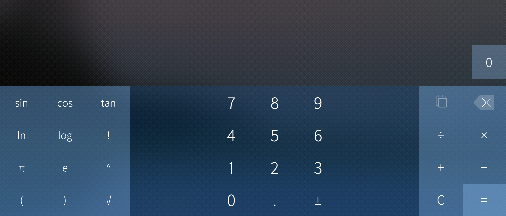

# Calculator application

The Sailfish Calculator application is a helpful math tool, you can quickly do a simple calculation or compose an elaborate equation made from several linked calculations:
* Tapping a result from other calculations uses it in your calculation and creates a link to it.
* Linked results are updated if the original calculation is changed.
* Log calculations can be panned horizontally.

You can rotate the device to landscape to expose scientific mode with trigonometric and logarithmic, square root, exponentation and factorial operations. You can also group calculations with braces and input math constants like π and Euler's number.

* 
  
    Calculator application basic view.
  

* 
  
    Calculator application's scientific view can be opened with up swipe.
  

* 
  
    Calculator application scientific view can be opened simply turning the device to landscape orientation.
  

