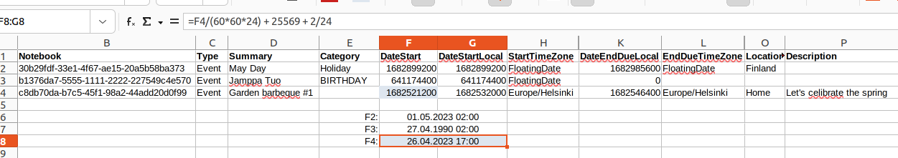

This article explains how to copy calendar items (appointments) from the SQL database of Sailfish OS to iCalendar (ics) or CSV files. The iCalendar files can then be imported to Calendar applications on other platforms. CSV files, in turn, can be viewed with spreadsheet apps like LibreOffice Calc or MS Excel.


The UI of Sailfish Calendar has the option for sharing appointments (in iCalendar format). Unfortunately, this is available for single appointments only - the option to select all items is missing.

# Preparations

## Developer tools

* Enable the **[Developer Mode](/Support/Help_Articles/Enabling_Developer_Mode/)**
* Open the Terminal app on your computer and create an **[SSH connection](/Support/Help_Articles/SSH_and_SCP/)** to your Sailfish device

Define the symbol MYHOME for your home area. We will need it later:

```
cd $HOME
export MYHOME=$(pwd)
```

## Add SQL tool to your Sailfish OS device

```
devel-su   ## your SSH password is needed here
pkcon refresh
pkcon install sqlite
exit
```

# Exporting in iCalendar format

## Get your sub-calendar names and UIDs

This step must be traversed to dig out the names of the sub-calendars (NOTEBOOK_UID) used in the SQL database of the Sailfish Calendar app. These names will be needed in the further steps where we collect the actual calendar events from the database.

```
devel-su -p sqlite3 \
   $MYHOME/.local/share/system/privileged/Calendar/mkcal/db \
  "SELECT Name, CalendarId FROM Calendars;"
```

### A sample output:
```
Default|be4fa3ac-201a-4d24-88c8-7394cd0febbf
Birthdays|b1376da7-5555-1111-2222-227549c4e570
John's Google|be653166-8437-4f2a-bb34-53566874c156
Calendar|d4ab6b28-ec96-4814-b218-1e0125836c25
```

The first item is the default personal calendar (_see "Manage calendars" in the pulley of the Calendar app_). The 3rd one is the calendar of a John's Google account, and the 4th one is the calendar of an Exchange account.

Each item has the NOTEBOOK_UID right after the separator character '\|'.

## Export calendar data to an iCalendar (.ics) file

```
devel-su -p icalconverter export -n <NOTEBOOK_UID> <XXXXX.ics>
```

Replace "\<NOTEBOOK_UID\>" with one of the actual UIDs from the section ["A sample output"](#a-sample-output) and replace "\<XXXXX.ics\>" with a descriptive file name of your choice.

An example:

```
devel-su -p icalconverter \   
export -n be653166-8437-4f2a-bb34-53566874c156 john-google.ics

Password:  
Enjoy your privileges.  
[D] main:88 - Successfully wrote: 2741 bytes of data to: "john-google.ics"
```

## Collect the resulting file(s)

Move file `.ics` file from your Sailfish OS device to a computer or another device where it can be imported to a calendar application.

# Exporting in CSV format

## Copy your calendar database to a working directory

The next step was added just to ensure that the actual database would not get accidentally damaged. Therefore, we make a copy of the database to MYHOME and apply the SQL commands (below) to the copy.

```
devel-su -p \
cp $MYHOME/.local/share/system/privileged/Calendar/mkcal/db $MYHOME
```

## Give the following commands to access the SQL database

```
cd $MYHOME  
sqlite3 db  
  
sqlite> .headers on  
sqlite> .mode csv  
sqlite> .output calendars.csv  
sqlite> select * from Components;  
sqlite> .quit 
```

## Collect the resulting file

Move file `calendars.csv` from your Sailfish OS device to a computer where you have LibreOffice Calc (or a corresponding spreadsheet app).  Open the CSV file with that app.

* There should be one row for each appointment
* The columns have the data from various fields of the Calendar app
* The text of the appointments should be readable

## Read and process the data with a spreadsheet program

Open a CSV file with Libre Office or Excel. Do the "Text to Columns" operation for column A using a comma as the delimiter (this may be automated).

Column D (see the [picture below](#picture_1)) has the summaries of the appointments while the free text descriptions are in column P.

### Timestamps

Column F or "DateStart" contains the timestamps related to the events. The date and time are given in the Unix timestamp ("Epoch") as "seconds from 1970-01-01".

It is possible to create a formula for LibreOffice (or Excel) to do the conversion automatically. Sailfish OS has the time stamps of the calendar events in seconds and corresponding to the UTC time. Hence the initial conversion formula is:

```  
FG8 = F4/(60*60*24) + 25569  
```

where the cell **F4** (see the picture below) holds the value in _seconds_ from Sailfish and **FG8** is the result in _days_. The weird constant 25569 is the number of days from the epoch date 1899-12-31 (used in the spreadsheet apps) to the Unix epoch date 1970-01-01 (70 years = 25569 days). You probably want to convert the result to your own time zone, too. If you are located 2 hours east of the UTC zone, for instance, you'll need to add 2/24 days to the formula, making it to:

```  
FG8 = F4/(60*60*24) + 25569 + 2/24  
```
Being x hours west of the UTC, you should subtract x/24 days.

Show the FG8 value on LibreOffice (or Excel) using the data and time format of your liking (e.g. YYYY-MM-DD HH:MM:SS).

<div class="flex-images" markdown="1">

* <a href="Calendar_csv_example.png" name="picture_1"></a>
  <span class="md_figcaption">
    Sample view from Libre Office spreadsheet
  </span>
</div>

Note that the timestamps related to birthdays indicate the dates of birth, not the anniversaries.


