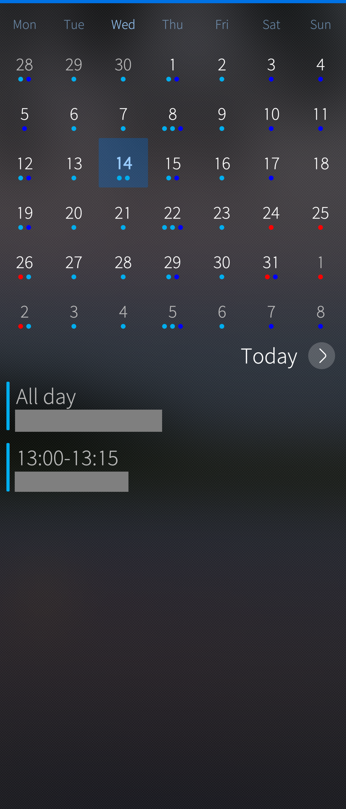
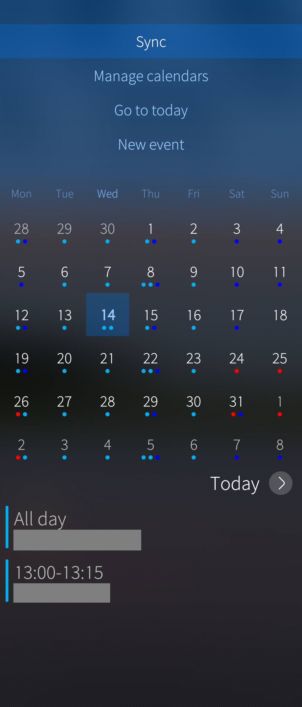
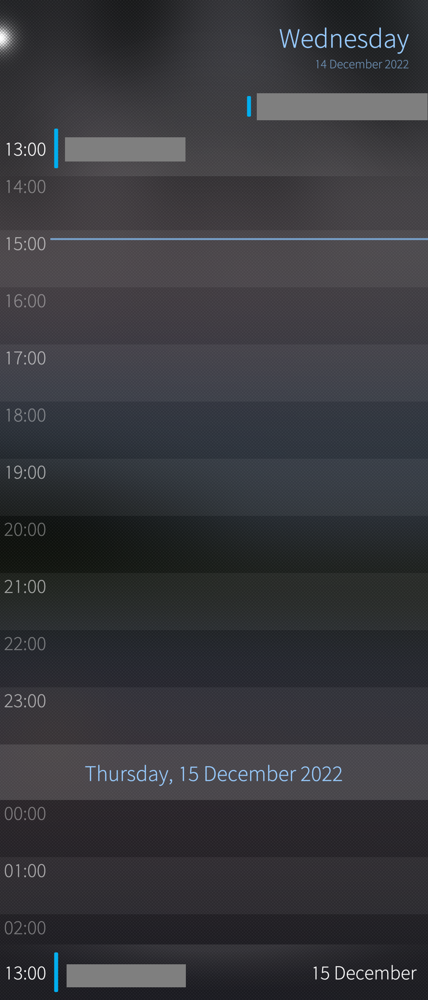
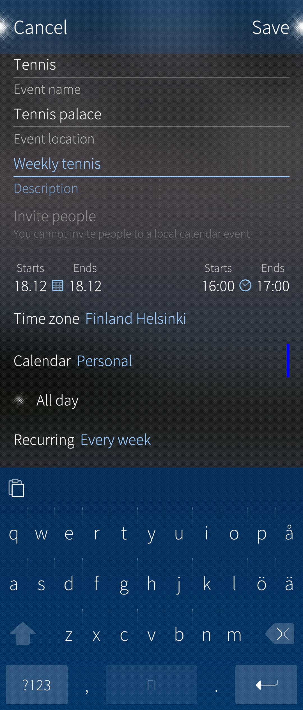
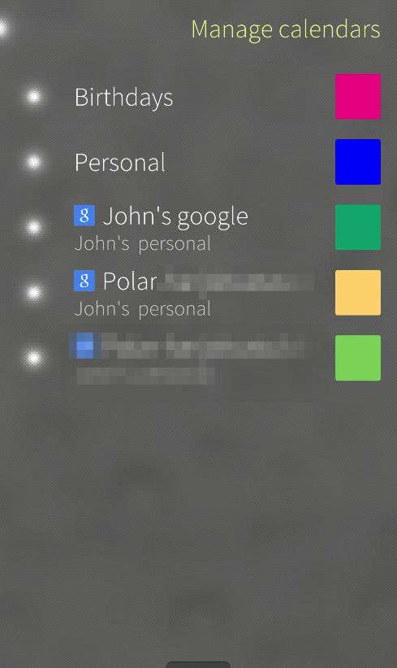

The **Sailfish Calendar** application is your time-management tool. You can sync your cloud-based calendars to it, and you can maintain a calendar on your phone. Be sure to check the “Good to know” section at the bottom of this article for some useful tips & information.

# Getting started
To be able to use the Calendar, you first have to get it from the Jolla Store. If you didn’t get it during the first launch of your phone, here’s how to get it:

1. Make sure that your Sailfish device is connected to the internet
2. Open up Jolla Store
3. From the pulley menu above, search for “calendar”
4. Download the Calendar app
5. Open the Calendar

# Different views of the Calendar
When your Calendar app opens, you are greeted with the Month view.

## Month View

* To change the month you are viewing, swipe left or right.
* A dot(s) under a date indicates that there are one or more appointments for that day. Tapping on a date will show you the calendar entries on that day.
* To view week numbers, you can swipe slightly from left to right (see the picture in the middle, below)
* Pulling down on the view reveals the pulley menu and the options to “New event”, “Go to today” and “Manage calendars”, and "Sync".
* If you ever get lost or confused in the Month view, you can select “Go to today” to get back to view the current month and day.

* 
  
  
* 
  
  

## Day View
You can access the Day view by first selecting a date in the Month view, and then pressing the selected day at the base of the calendar at the right-hand side ("Today" or the weekday like "Wednesday").

In the Day view, it is easier to see if you have any overlapping events scheduled for that day.
You can also create new events in this view, simply by tapping at the time you want.

At the bottom of the view, you can see events that are coming up if you scroll further down. At the top of the screen, you can see events that are in the past that you can see by scrolling up.

* 
  
  

# Creating a new Event in Calendar
When it’s time to mark something important down, pull the view down in the Month view and select “Create new event”.

1. Give your event a name
2. Specify the location of the Event
3. Give your event a more comprehensive description (Note that you can be as descriptive as you want in this field; this field is very spacious!)
4. You must then define the start and end date of your event. (Note: in the case of recurring events, this is the start and end time of one instance, not the whole chain of events!)

Starts:
The start date is by default today’s date.
The default start time is the time it is now.

Ends:
The end date is by default also today’s date.
The default end time is an hour from what the time is now.

Tapping on the start and end dates will take you to the Date picker view.
Tapping on the start and end times will take you to the Time picker view.
Remember to accept the date and time you chose by tapping on the top right corner where it shows what you chose for the date or time.

5. Next, you can define to which calendar on your device the Event should be assigned to. Just press the text “Calendar” to see all the calendars available see [this chapter](#managing-your-calendars). Your calendar app keeps your current choice of the calendar as the default value for new appointments.
Please note: calendars that have the text (Read-only) after their name, are calendars that can’t be synced back to the cloud. Making entries into these calendars will only be visible on your Sailfish OS device).

6. If you don’t want to specify a beginning and end time for your event, you can simply turn on “All day” to make your event visible in your calendar for the entire day.

7. If you want your calendar entry to recur, you can do this by tapping “Recurring” and then selecting an alternative you want. It is possible to later edit a single occurrence of a recurring event to make an exception to it.

8. You can also set a reminder by pressing “Remind me” and choosing a suitable time to be reminded of the event. Your calendar keeps this as the default value for new appointments.

9. When you are ready to save the event, swipe to the left or press “Save” in the top right corner.

* 
  
  

# Managing your Calendars
Sometimes you might want to control how many calendars are visible in your Calendar application, or just check which ones you’re currently subscribed to on your device.

To manage your calendars:
1. Open your Calendar app
2. Pull down the view to reveal the pulley menu and select “Manage calendars”
3. You will be presented with a list of all calendars available.

NOTE: Your accounts in Settings > Accounts dictate which calendars appear in the pulley menu.

## Visibility of calendars
On the left-hand side, you will see a column of dots brightly lit. Tapping on a brightly glowing dot will make it darker, and the corresponding calendar will no longer be visible. If you want to make a calendar visible again, simply press the globe until it’s bright again.

## Changing calendar colours
On the right-hand side of the view, you see the colours assigned to each calendar. Tapping on the colour will present you with a view, where you can change the colour of the calendar in question.

When you’re done adjusting the visibility of your calendars or their colours, just swipe left or press the dot in the top-left corner.

## Different synchronisation types of calendars
Some calendars that you sync from web services may have the text "Read-only" in their name. This means, that calendar events assigned to these calendars might be impossible to edit, or that changes made to them won't sync back to the web service. Changes to calendars with this type might only be visible on your Sailfish device.

Calendar type Personal is the local calendar. The events assigned to these calendars are not synced to any service - they are kept in the phone memory only. These local events are included in Sailfish [backups](/Support/Help_Articles/Backup_and_Restore/) (in contrast to the synchronised events).

Google calendar and Microsoft Exchange calendar are examples of calendar types, the events of which are synchronized both ways with the server, depending on the account settings in menu Settings > Accounts. Note that in order to use Microsoft Exchange you need to have [Sailfish X license](https://shop.jolla.com/).

* 
  
  

# Good-to-know about the Calendar in general
If you set an end date for your calendar entry, the event will end on the date you’ve specified, but the calendar will treat it as a non-stop event. This means that an event will begin the date you specify, start at the time you specify, and then go on uninterrupted until the end date and time you time you’ve specified.
There is no week view in the Calendar app.
Birthday events cannot be created, deleted or modified in Calendar because they are obtained through syncing. It is, however, possible to change or delete a person’s birthday by modifying that person’s information in the People application (phonebook). Thereafter the modification made will appear in Calendar, too.
The sync schedule for your calendars is the same as for the corresponding email service. For Exchange, there are more refined sync options in Settings > Accounts > Exchange.
You can snooze a calendar alert by flipping the phone (turn it screen downwards) or by pressing the power key shortly.

