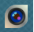
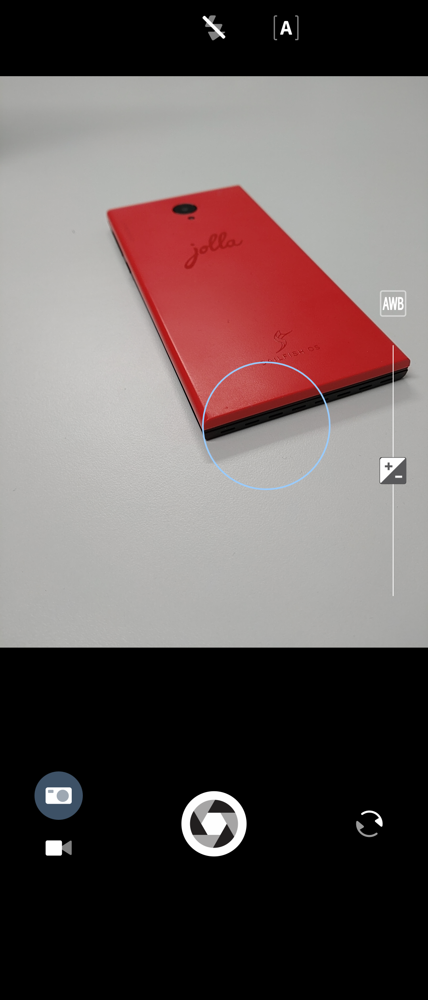
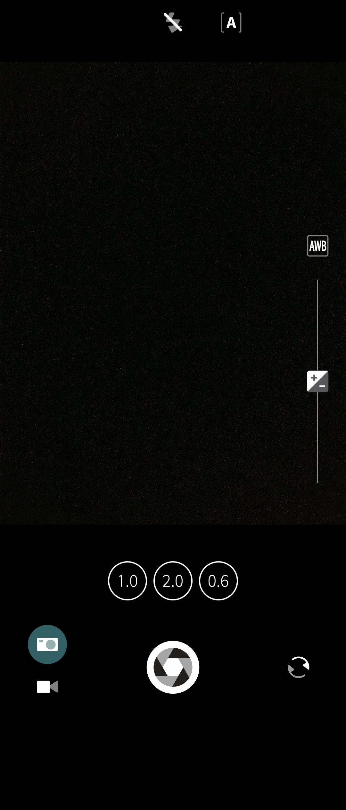
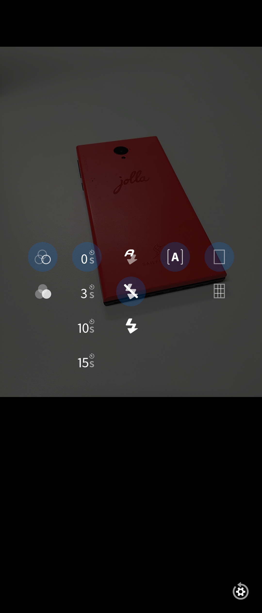
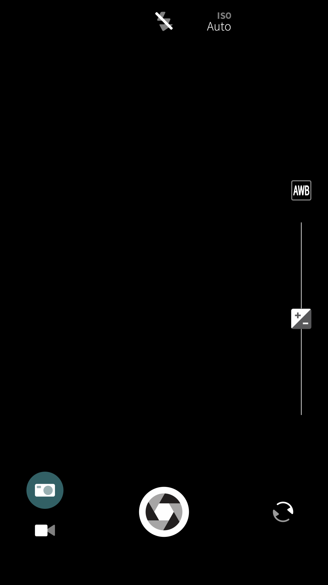
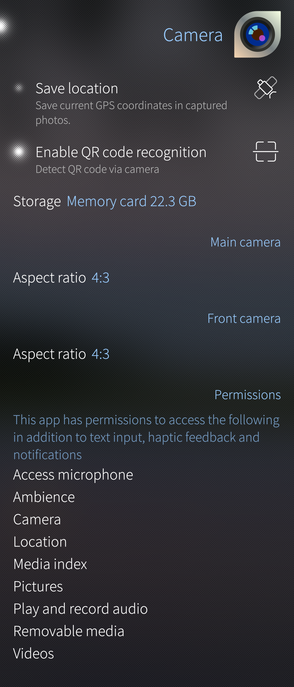

# Using the Camera app

To launch the Camera app, tap on the "Camera" icon.

<div class="flex-images" markdown="1">

* <a href="icon_camera.png" class="narrow-image"></a>
  <span class="md_figcaption">
  Pic 1
  </span>
</div>

The app can also be opened directly from the lock screen by swiping up from the bottom of the screen, this also requires that the "Quick access to Camera" is enabled from "Settings > System > Gestures".

There are the following ways to capture picture once the camera app is opened:

1. Tap the capture button on the viewfinder of the Camera app.
2. Press down one of the volume keys, aim the camera and then release the key. The picture is captured on the release action. This is the best way of taking sharp pictures.
3. On some phone models, there may be a dedicated capture button on the side of the device.

Note that the Camera app can be operated both in portrait and landscape orientations.

# Capture button (shutter button)

The capture button is in the middle of the bottom toolbar by default (see Pic 2) but it can be relocated on the screen. This is done by tapping and holding the viewfinder until three (for the portrait mode) or six (for the landscape mode) circles appear. Tap one to move the capture button there.

# Viewfinder

The picture below presents the viewfinder of the camera. On the top there is the toolbar row, and by touching it all of the options will appear.

The selection of the still and video cameras is located at the bottom left. 

The lightblue circle in the middle of Pic 2 is the focus area. The camera sets the focus according to the distance and illumination of it. It is possible to move the focus area to a different location simply by tapping the display. The focus circle appears first in white colour but gets the ambience colour as soon as the camera has set the focus.

<div class="flex-images" markdown="1">

* <a href="viewfinder.png" class="narrow-image"></a>
  <span class="md_figcaption">
  Pic 2
  </span>
</div>

The viewfinder may look different on different phone models, below you can see the viewfinder of the Xperia X10 II. It has the choice of lense buttons too, indicated with numbers 1.0, 2.0 and 0.6 (representing the normal, tele and wide-angle lenses)

<div class="flex-images" markdown="1">

* <a href="viewfinder02.png" class="narrow-image"></a>
  <span class="md_figcaption">
  Pic 3
  </span>
</div>


# Flicking through captured photos in Camera

When you have taken a photo, swipe right to see the photos you've taken with the camera. This view is called the "Camera roll". It works in a similar way as the Gallery: the bottom toolbar has the buttons to delete, share and to make an ambience.

Swiping left will take you back to the Camera viewfinder again.

# Pictures are stored in Gallery app

You can later view and manage your pictures in the **[Gallery app](/Support/Help_Articles/Gallery/)**. On the file system level, your pictures go to folder ```$HOME/Pictures/Camera```. If you view your pictures from a PC over USB, then you can find them under Sailfish device in folder "Mass storage > Pictures > Camera".


# Adjusting settings

The settings of the Sailfish Camera app are listed below. 

## Settings useful at the moment of capturing pictures

These settings (see Pic 4 below) are brought to the display by touching the top of the viewfinder:
* Colour filtering on/off. When on, the different colour options appear at the bottom toolbar
* Capture delay:  0, 3, 10 or 15 seconds
* Camera flash: Automatic, Flash off, Flash on 
* Light sensitivity (ISO) or a dumb automatic exposure button "[A]" (depending on the phone model)
* Viewfinder grid: No grid, Thirds grid
* Reset to default settings (at the bottom right corner of the screen)

<div class="flex-images" markdown="1">

* <a href="camera_settings.png" class="narrow-image"></a>
  <span class="md_figcaption">
  Pic 4
  </span>
</div>

The following settings appear near the right edge of the viewfinder (see Pic 5 below):
* White balance can be adjusted with the AWB button. The options are Automatic, Sunny, Cloudy, Tungsten and Fluorescent.
* Exposure can be increased and decreased by the vertical slider (+/-). On some devices (e.g. Jolla C), you can select various (automatic) exposure modes.

These functions appear at the bottom toolbar (see Pic 5 below):
* Camera mode: Still camera and Video camera
* Capture button
* Camera selection: Main camera, Front camera

<div class="flex-images" markdown="1">

* <a href="viewfinder-XA2.png" class="narrow-image"></a>
  <span class="md_figcaption">
  Pic 5
  </span>
</div>

## Less frequently needed settings

The less frequently needed settings are located in the menu "Settings > Apps > Camera". In there, you can adjust the settings shown on the screenshot below.

<div class="flex-images" markdown="1">

* <a href="camera_app_settings.png" class="narrow-image"></a>
  <span class="md_figcaption">
  Pic 6
  </span>
</div>

# Multiple cameras of Xperia 10 III

Due to an unsolved technical problem (up to Sailfish OS 4.5.0, at least), the default setup of the various camera lenses of Xperia 10 III is such that the front camera and only one of the three back cameras can be used. 

However, it is possible to force the three back cameras (wide angle, normal, and tele) to work but this change will render the front camera useless. This may still be a better option for those who do not take selfies.

You will need to enable the **[Developer mode](/Support/Help_Articles/Enabling_Developer_Mode/)** and use the **[vi editor](/Support/Help_Articles/Enabling_Developer_Mode/#how-to-use-the-vi-or-nano-text-editors-at-sailfish-terminal)**. 
Get the super-user rights and enable the support of multiple cameras by editing the settings file:
```
devel-su
vi /vendor/etc/camera/camxoverridesettings.txt
## Look for item multiCameraEnable and set it to value TRUE, i.e. "multiCameraEnable=TRUE". Save the change.

killall /vendor/bin/hw/android.hardware.camera.provider@2.4-service_64   ## restart the camera service
## alternatively to the last command above, just restart the phone
```


