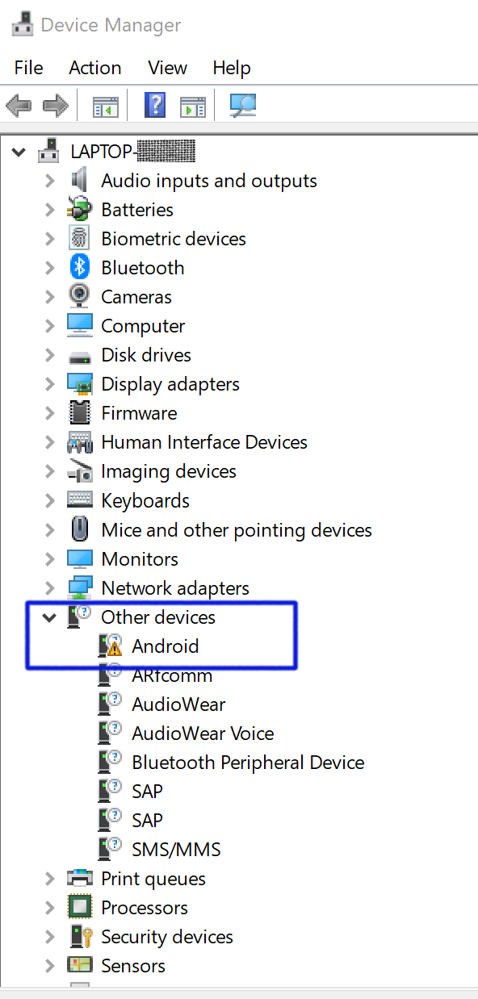
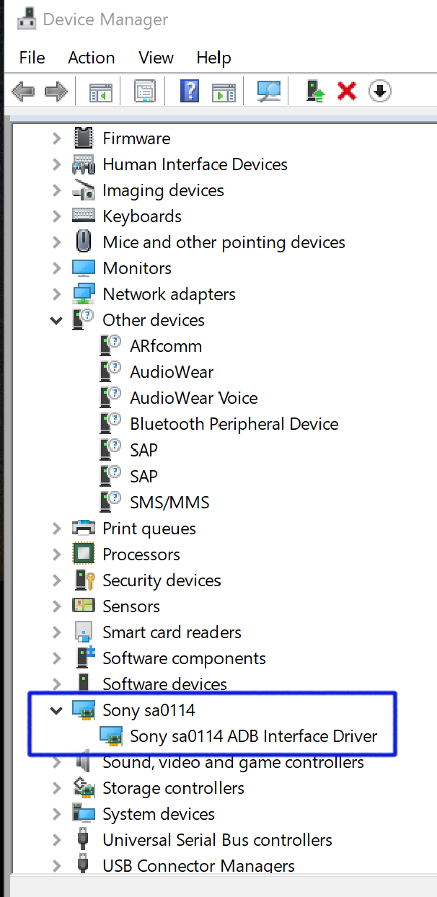
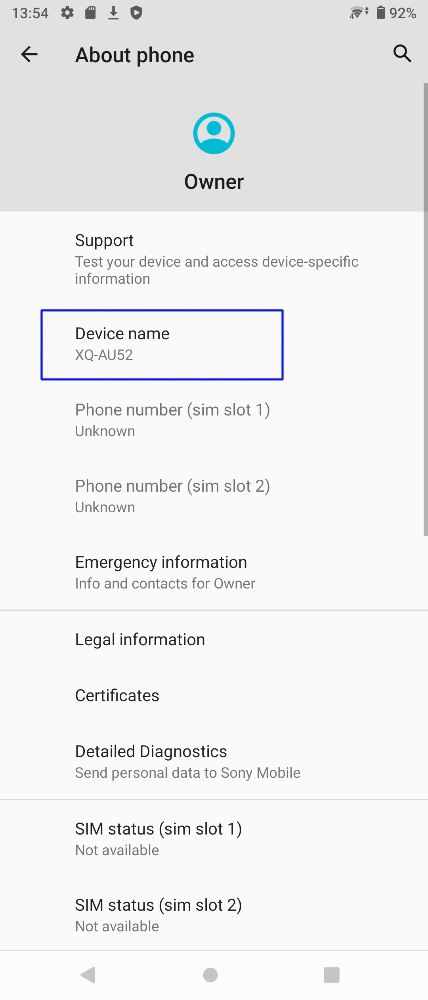
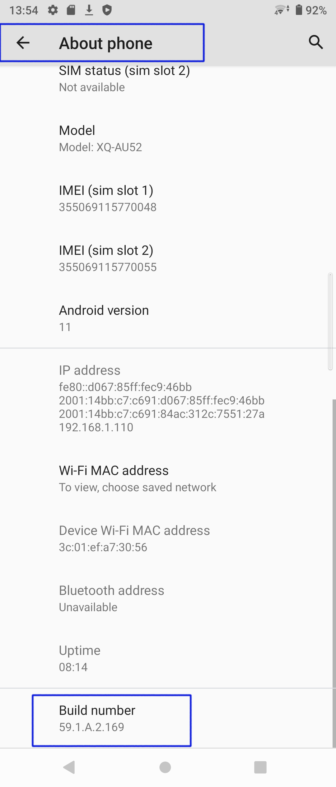
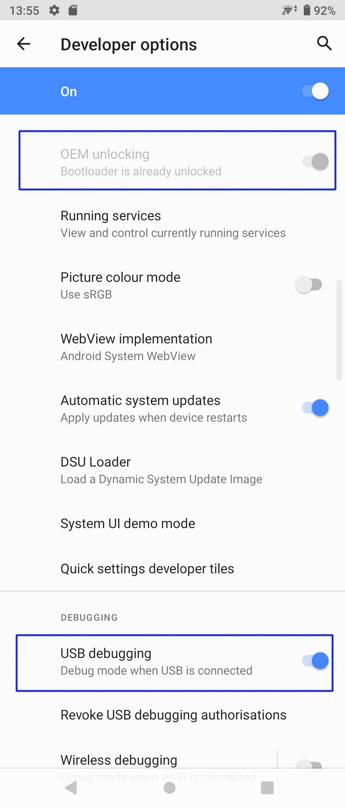
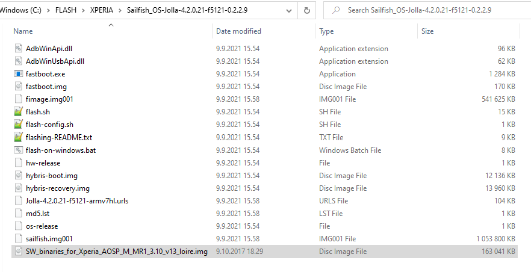
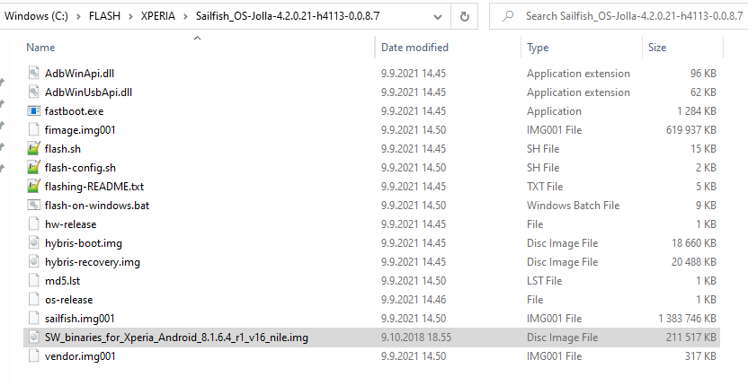
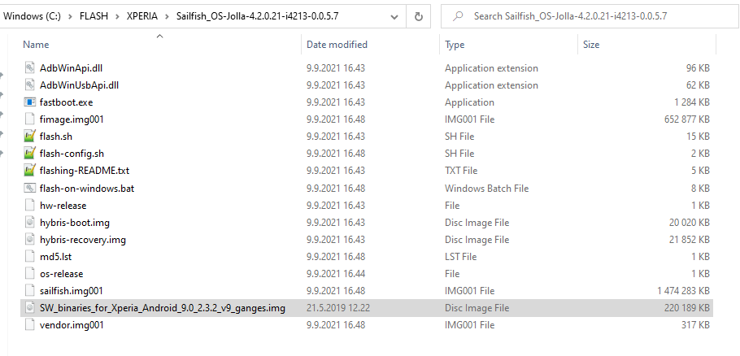
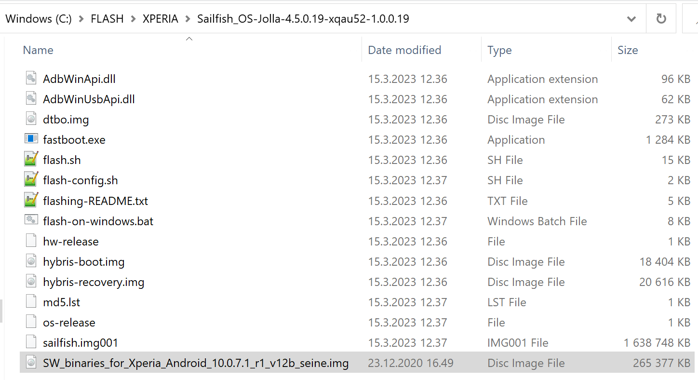
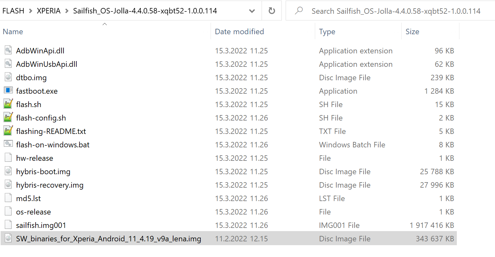

# Introduction

Our official instructions for installing Sailfish X are [**on this web page**](https://jolla.com/sailfishxinstall/). There are separate instructions for Windows, Linux and Mac computers. Furthermore, there is a different set of instructions for the Xperia X,  Xperia XA2, Xperia 10, Xperia 10 II, and Xperia 10 III.

Jolla Shop has a selection of **[Sailfish OS "images"](https://shop.jolla.com/downloads/)** for each **[supported device](/Support/Supported_Devices/)** model. An image means a binary package or a compressed file that contains the executable code of the Sailfish operating system and some tools needed for the installation. The images can be downloaded as zip packages from the Jolla Shop after purchasing the **[Sailfish X licence](/Support/Help_Articles/Sailfish_X_Licence/)**. You will need to sign in to the Shop for the download using the same Jolla account that you used for purchasing the licence.

In brief, installing Sailfish can be done on a device connected to a computer with a USB cable. At the moment of connection, the device is forced to a special state, the _fastboot_ state. The computer shall have a directory holding the uncompressed Sailfish image.

The act of programming the code of the operating system to the device is called _flashing_ (as the type of code storage is _flash memory_).

# Checklist

This document, although called a checklist, explains in detail how to flash the Sailfish OS to a supported device. It is more verbose than the rather compact **[official installation instructions](https://jolla.com/sailfishxinstall/)** but relies on them throughout the document.

Go through all chapters and ensure that you have done everything correctly.


# Fastboot driver, tool and command

In this chapter, we prepare the computer for the flashing.

The Android tool _fastboot_  is required for unlocking the _bootloader_ of the Xperia device and for flashing (installing) Sailfish OS [^1] to your device. An alternative operating system (like Sailfish) can only be installed and used when the bootloader is unlocked.

The fastboot tool requires the fastboot driver to be able to work. Typically, Linux and Mac computers have this driver by default, while it must be installed to Windows. The following three chapters help installing the fastboot driver on different computers.

The fastboot command can be used only when the phone is connected to the computer in the _fastboot mode_, indicated by the **blue** light on the phone. For details, see the 1st item in ["Troubleshooting the USB connection and fastboot mode"](#troubleshooting-the-usb-connection-and-fastboot-mode).


## On Linux computer

Usually, the Android tools are ok by default on Linux computers. The _fastboot_ command should work fine. However, if you are facing some trouble in using fastboot, consider installing it according to these instructions:
* [Xperia X](https://jolla.com/sailfishx-linux-instructions/#LX-2)
* [Xperia XA2](https://jolla.com/sailfishx-linux-instructions-xa2/#LXA2-2)
* [Xperia 10](https://jolla.com/install-sailfish-x-xperia-10-linux/#L10-3)
* [Xperia 10 II](https://jolla.com/how-to-install-sailfish-x-on-xperia-10-ii-on-linux/#L10ii-3)
* [Xperia 10 III](https://jolla.com/how-to-install-sailfish-x-on-xperia-10-iii-on-linux/#L10iii-3)

There is some troubleshooting in chapter ["Troubleshooting the USB connection and fastboot mode"](#troubleshooting-the-usb-connection-and-fastboot-mode).

## On macOS computer

In the case of a macOS computer, you need to first install **[Homebrew](https://en.wikipedia.org/wiki/Homebrew_(package_management_software))**, the open-source package management system that simplifies the installation of software on macOS. Install Homebrew using the instructions on **[this link](https://brew.sh/index.html)**.

Next, install the support for the _fastboot_ by following these instructions:
* [Xperia X](https://jolla.com/sailfishx-macos-instructions/#MX-2)
* [Xperia XA2](https://jolla.com/sailfishx-macos-instructions-xa2/#MXA2-2)
* [Xperia 10](https://jolla.com/sailfishx-xperia10-macos/#M10-3)
* [Xperia 10 II](https://jolla.com/how-to-install-sailfish-x-on-xperia-10-ii-on-macos/#M10ii-3)
* [Xperia 10 III](https://jolla.com/how-to-install-sailfish-x-on-xperia-10-iii-on-macos/#M10iii-3)

There is some troubleshooting in chapter ["Troubleshooting the USB connection and fastboot mode"](#troubleshooting-the-usb-connection-and-fastboot-mode).

## On Windows computer

You should have a computer running Microsoft Windows (preferably **Windows 10** or **Windows 11**).

Windows PCs do not have the _fastboot_ tool nor the drivers installed by default. Therefore, you must install the **fastboot driver** on your PC. The tool itself, _fastboot.exe_, is included in the Sailfish OS image (zip package).

Moreover, it has turned out that these drivers must be re-installed if you connect a different Xperia device to your PC.

The phone must be connected to the computer in the _fastboot mode_ before the fastboot driver can be installed to Windows. Press and hold the Volume Up button and connect the USB cable between your phone and your computer. Wait for the LED to light up **blue** on the phone. If the LED turn green check the 1st item in ["Troubleshooting the USB connection and fastboot mode"](#troubleshooting-the-usb-connection-and-fastboot-mode).

Open the Windows **Device Manager** by pressing both the Windows button and the X button. Next, click Device Manager on the pop-up menu.

If the Device Manager shows "Android" under "Other devices" (see Picture 1 below) then the correct fastboot driver (of Sony) is missing from your PC. This can be fixed by following these instructions:

* [Xperia X](https://jolla.com/sailfishx-windows-instructions/#WX-2)
* [Xperia XA2](https://jolla.com/sailfishx-windows-instructions-xa2/#WXA2-2)
* [Xperia 10](https://jolla.com/install-sailfish-x-xperia-10-windows/#W10-3)
* [Xperia 10 II](https://jolla.com/how-to-install-sailfish-x-on-xperia-10-ii-on-windows/#W10ii-3)
* [Xperia 10 III](https://jolla.com/how-to-install-sailfish-x-on-xperia-10-iii-on-windows/#W10iii-3)

You will end up in the view shown in Picture 2. The new device **Sony sa0114** shall appear.

<div class="flex-images" markdown="1">

* <a href="Fastboot_driver_missing_from_Win10.png"></a>
  <span class="md_figcaption">
    Picture 1: Fastboot driver missing from a Windows computer
  </span>
* <a href="Fastboot_driver_updated_Win10.png"></a>
  <span class="md_figcaption">
    Picture 2: Fastboot driver installed to Windows
  </span>
</div>

**Note 1**: In contrast to Sony's instructions, _Android SDK_ needs not (should not) be installed on the PC.

**Note 2**: There is no dedicated driver for Xperia XA2, Xperia 10, Xperia 10 II or Xperia 10 III devices. Instead, the same driver that is used for Xperia X devices works for all of these devices, too.

**Note 3:** There is some troubleshooting in chapter ["Troubleshooting the USB connection and fastboot mode"](#troubleshooting-the-usb-connection-and-fastboot-mode).


### Troubleshooting the fastboot mode on Windows

**[This zip package](Win10-fastboot-driver-setup-in-phases.zip)** contains stepwise screenshots about installing the fastboot driver to a Windows computer.

There is some troubleshooting in chapter ["Troubleshooting the USB connection and fastboot mode"](#troubleshooting-the-usb-connection-and-fastboot-mode).

# Unlocking the bootloader

This chapter discusses the enablers for unlocking the bootloader and changing the operating system of your device. The status checks require that your device is still running the Android OS.

If you have already unlocked the bootloader and installed the Sailfish OS (but it is failing to serve well) then you should probably jump to chapter ["Correct contents in the flashing directory"](#correct-contents-in-the-flashing-directory).  If you would anyhow like to run the checks explained below then you must **[revert the device back to Android](/Support/Help_Articles/Reinstalling_Sailfish_OS/)** first.

## Xperia bootloader

The _bootloader_  normally checks the integrity of the system it is about to boot up (turn on). Since it only knows about the official Sony Android, it has to be unlocked in order to install an alternative operating system like Sailfish and to boot up Sailfish.

Ensure that the bootloader of your Xperia device (that is still running Android) can be unlocked.  To do this, open the Phone Dialer application and type the following code (as if it were a phone number):

```
*#*#7378423#*#*
```

A menu page should pop up. Tap "Service info > Configuration" and seek "Rooting Status". One of the following three values should appear. If it is:

1) "_Bootloader unlocked: Yes_"<br />
    The bootloader has been unlocked previously and you can install Sailfish on your Xperia. Jump to chapter ["Correct contents in the flashing directory"](#correct-contents-in-the-flashing-directory)
    
2) "_Bootloader unlock allowed: No_"<br />
    It is unfortunately not possible to install Sailfish on this device. You should contact your Sony dealer in this case. There is no point to continue reading this document.
    
3) "_Bootloader unlock allowed: Yes_"<br />
    Your next task is to **unlock the bootloader**. Do that by following chapter 7 of our Xperia 10 III instructions (use the 3 links below). _This approach is good for all Xperia devices (not just Xperia 10 III)- just select the correct phone model at the Sony website_.
   * [Windows](https://jolla.com/how-to-install-sailfish-x-on-xperia-10-iii-on-windows/#W10iii-7) 
   * [Linux](https://jolla.com/how-to-install-sailfish-x-on-xperia-10-iii-on-linux/#L10iii-7) 
   * [Mac](https://jolla.com/how-to-install-sailfish-x-on-xperia-10-iii-on-macos/#M10iii-7)


## This is how your Android device should look like when it is ready for installing Sailfish X

The following pictures represent the phone when it is still running the Android operating system. Either you are just preparing the device for Sailfish OS, or else Sailfish OS did not work properly and you have reverted the device to Android using Sony's _Emma tool_ (see this **[document on reverting Xperia back to Android](/Support/Help_Articles/Reinstalling_Sailfish_OS/)** for a detailed approach).

 Check that you can see the following views on your device:

### A) Settings > System > About phone

Check the device model (Picture 3). All supported models are **[listed in this table](/Support/Supported_Devices/)**. Note that there are several different Sailfish X images (read: installation packages) for the various models. Be sure to download the one matching your device.

Also, check the Build number (Picture 4). The valid build numbers (a.k.a. Android baseband version) are explained in **[this table](/Support/Help_Articles/Reinstalling_Sailfish_OS/#the-baseband-version-table)**. The Build number also indicates the Android OS version (although not explicitly). Read carefully the first lines of our **[Sailfish X instructions](https://jolla.com/sailfishxinstall/)** to see which phones should be updated and which not.

<div class="flex-images" markdown="1">

* <a href="Xperia10ii_AboutPhone.png"></a>
  <span class="md_figcaption">
    Picture 3: About phone #1 (Android)
  </span>
* <a href="Xperia10ii_Build_number.png"></a>
  <span class="md_figcaption">
    Picture 4: About phone #2 (Android)
  </span>
</div>


### B) Settings > System


You must enable the **Developer options** to be able to carry on. Enable them by tapping the "Build number" item of Picture 4 several times in a quick sequence. Then go to "Settings > System" and find the new item Developer options.


### C) Settings > System > Developer options

Scroll down and find item **OEM unlocking** (which means bootloader unlocking). If the bootloader of your device has been unlocked previously, you will see it greyed out like in Picture 5 below. This is ok and no further actions are required for this setting.

However, if the item "OEM unlocking"  appears black and locked (i.e. the slider is on the left), then you must first push the slider switch to the right to make the unlocking possible. The **actual unlocking** shall be done as instructed in chapter 7 of our Xperia 10 III instructions (use the 3 links below). _This approach is good for all Xperia devices (not just Xperia 10 III)- just select the correct phone model at the Sony website_.
* [Windows](https://jolla.com/how-to-install-sailfish-x-on-xperia-10-iii-on-windows/#W10iii-7) 
* [Linux](https://jolla.com/how-to-install-sailfish-x-on-xperia-10-iii-on-linux/#L10iii-7) 
* [Mac](https://jolla.com/how-to-install-sailfish-x-on-xperia-10-iii-on-macos/#M10iii-7)

Scroll further down and find the item "USB debugging". This is also a prerequisite for the fastboot mode. You must enable it to make installing Sailfish X successful.

<div class="flex-images" markdown="1">

* <a href="Xperia10ii_OEM_USB.png" class="narrow-image"></a>
  <span class="md_figcaption">
    Picture 5: OEM and USB items enabled
  </span>
</div>


# Correct contents in the flashing directory 

By _flashing directory_ (a.k.a. _"Sailfish directory"_), we mean the location on your PC to which you have unzipped the Sailfish OS image. Check that you have prepared the contents of the directory correctly.

Note that there are different instructions for Xperia X, Xperia XA2, Xperia 10, Xperia 10 II, and Xperia 10 III.  Also for different computers. Make sure you read the correct instructions. We have linked them for you below:

|   Linux     |    Mac      |   Windows        |
| :---------: | :---------: | :--------------: |
| [Xperia X](https://jolla.com/sailfishx-linux-instructions/#LX-3) | [Xperia X](https://jolla.com/sailfishx-macos-instructions/#MX-3) | [Xperia X](https://jolla.com/sailfishx-windows-instructions/#WX-3) |
| [Xperia XA2](https://jolla.com/sailfishx-linux-instructions-xa2/#LXA2-3) | [Xperia XA2](https://jolla.com/sailfishx-macos-instructions-xa2/#MXA2-3) | [Xperia XA2](https://jolla.com/sailfishx-windows-instructions-xa2/#WXA2-3) |
| [Xperia X10](https://jolla.com/install-sailfish-x-xperia-10-linux/#L10-4) | [Xperia X10](https://jolla.com/sailfishx-xperia10-macos/#M10-4) | [Xperia X10](https://jolla.com/install-sailfish-x-xperia-10-windows/#W10-4) |
| [Xperia X10 II](https://jolla.com/how-to-install-sailfish-x-on-xperia-10-ii-on-linux/#L10ii-4) | [Xperia X10 II](https://jolla.com/how-to-install-sailfish-x-on-xperia-10-ii-on-macos/#M10ii-4) | [Xperia X10 II](https://jolla.com/how-to-install-sailfish-x-on-xperia-10-ii-on-windows/#W10ii-4) |
| [Xperia X10 III](https://jolla.com/how-to-install-sailfish-x-on-xperia-10-iii-on-linux/#L10iii-4) | [Xperia X10 III](https://jolla.com/how-to-install-sailfish-x-on-xperia-10-iii-on-macos/#M10iii-4) | [Xperia X10 III](https://jolla.com/how-to-install-sailfish-x-on-xperia-10-iii-on-windows/#W10iii-4) |


Check that you have the following two items in the flashing directory:

1) **The correct Sailfish image for your device model**
* There are 2 different installable images for Xperia X, 6 images for Xperia XA2, 4 images for Xperia 10, 2 images for Xperia 10 II, and one image for Xperia 10 III. Pick up the correct one.
* You can check the phone model by pulling out a white label from the SIM card slot,  from the sales package, or from the phone menus
* If in doubt about the device model, please see the chapter ["Final check before flashing"](#final-check-before-flashing) below

2) **The correct Sony vendor binary**
* There are different vendor binaries for Xperia X, Xperia XA2, Xperia 10, Xperia 10 II, and Xperia 10 III
* Find more information in the chapters right below

## Xperia X

Extracting the Sailfish zip package brings in everything necessary, except for the Sony binary image `SW_binaries_for_Xperia_AOSP_M_MR1_3.10_v13_loire.img` which you need to download as instructed in chapter 5 of Sailfish X instructions for Xperia X:
* [Windows](https://jolla.com/sailfishx-windows-instructions/#WX-5) 
* [Linux](https://jolla.com/sailfishx-linux-instructions/#LX-5) 
* [Mac](https://jolla.com/sailfishx-macos-instructions/#MX-5)

Check that the contents of the flashing directory are like in the picture below (we have OS release 4.2.0.21 as an example there).

<div class="flex-images" markdown="1">

* <a href="XperiaX_flashing.png"></a>
  <span class="md_figcaption">
    Picture 6: A flashing directory of Xperia X
  </span>
</div>


## Xperia XA2

Extracting the Sailfish zip package brings in everything necessary, except for the Sony binary image `SW_binaries_for_Xperia_Android_8.1.6.4_r1_v16_nile.img`  which you need to download as instructed in chapter 5 of Sailfish X instructions for Xperia XA2:
* [Windows](https://jolla.com/sailfishx-windows-instructions-xa2/#WXA2-5) 
* [Linux](https://jolla.com/sailfishx-linux-instructions-xa2/#LXA2-5) 
* [Mac](https://jolla.com/sailfishx-macos-instructions-xa2/#MXA2-5)

Check that the contents of the flashing directory are like in the picture below (we have OS release 4.2.0.21 as an example there).

<div class="flex-images" markdown="1">

* <a href="XperiaXA2_flashing.png"></a>
  <span class="md_figcaption">
    Picture 7: A flashing directory of Xperia XA2
  </span>
</div>

NOTE: Sony has also provided the binary file v17, however, some connection problems in the 5 GHz band of WiFi networks have been reported when using it. Therefore it may be best to use the v16 file. 

Note that the zip file name of v17 has the version id "17B" whereas the "B" does not appear in the img file name.

You can change the vendor binary by flashing just it without affecting Sailfish OS.  Please read this **[document](/Support/Help_Articles/Updating_Vendor_Image/)**.

## Xperia 10

Extracting the Sailfish zip package brings in everything necessary, except for the Sony binary image `SW_binaries_for_Xperia_Android_9.0_2.3.2_v9_ganges.img`  which you need to download as instructed in chapter 5 of Sailfish X instructions for Xperia 10:
* [Windows](https://jolla.com/install-sailfish-x-xperia-10-windows/#W10-5) 
* [Linux](https://jolla.com/install-sailfish-x-xperia-10-linux/#L10-5) 
* [Mac](https://jolla.com/sailfishx-xperia10-macos/#M10-5)

Check that the contents of the flashing directory are like in the picture below (we have OS release 4.2.0.21 as an example there).

<div class="flex-images" markdown="1">

* <a href="Xperia10_flashing.png"></a>
  <span class="md_figcaption">
    Picture 8: A flashing directory of Xperia 10
  </span>
</div>


## Xperia 10 II

Extracting the Sailfish zip package brings in everything necessary, except for the Sony binary image `SW_binaries_for_Xperia_Android_10.0.7.1_r1_v12b_seine.img`  which you need to download as instructed in chapter 5 of Sailfish X instructions for Xperia 10 II:
* [Windows](https://jolla.com/how-to-install-sailfish-x-on-xperia-10-ii-on-windows/#W10ii-5) 
* [Linux](https://jolla.com/how-to-install-sailfish-x-on-xperia-10-ii-on-linux/#L10ii-5) 
* [Mac](https://jolla.com/how-to-install-sailfish-x-on-xperia-10-ii-on-macos/#M10ii-5)

Check that the contents of the flashing directory are like in the picture below.

<div class="flex-images" markdown="1">

* <a href="Xperia10ii_flashing.png"></a>
  <span class="md_figcaption">
    Picture 9: A flashing directory (here: Xperia 10 II [xqau52] and OS version 4.5.0.19)
  </span>
</div>


## Xperia 10 III

Extracting the Sailfish zip package brings in everything necessary, except for the Sony binary image `SW_binaries_for_Xperia_Android_10.0.7.1_r1_v9a_lena.img`  which you need to download as instructed in chapter 5 of Sailfish X instructions for Xperia 10 III:
* [Windows](https://jolla.com/how-to-install-sailfish-x-on-xperia-10-iii-on-windows/#W10iii-5) 
* [Linux](https://jolla.com/how-to-install-sailfish-x-on-xperia-10-iii-on-linux/#L10iii-5) 
* [Mac](https://jolla.com/how-to-install-sailfish-x-on-xperia-10-iii-on-macos/#M10iii-5)

Check that the contents of the flashing directory are like in the picture below.

<div class="flex-images" markdown="1">

* <a href="Xperia10iii_flashing.png"></a>
  <span class="md_figcaption">
    Picture 10: A flashing directory (here: Xperia 10 III [xqbt52] and OS version 4.5.0.19)
  </span>
</div>

# Final check before flashing

Here we check that fastboot really works and that the bootloader is unlocked. The procedure below should not be needed. Run it if there are problems in installing Sailfish OS.

1.  Connect your device in the fastboot mode (blue LED) to your computer with a USB cable.
2.  On the computer, open the terminal and change the directory to your flashing directory (see the chapter ["Correct contents in the flashing directory"](#correct-contents-in-the-flashing-directory). _This is crucial in the case of Windows especially, as we rely on fastboot.exe located in this directory._
3.  Give the command below. NOTE for Windows: _We recommend using the default command shell of Windows (CMD) instead of PowerShell as the latter may have an incompatible configuration and the command syntax below would not work._
    
```
fastboot getvar all
```
It should print 20 to 200 lines of text, including:
* `(bootloader) unlocked: yes`
* `(bootloader) secure: no`
* `(bootloader) product: H4113` <br />
    this item dictates which Sailfish image you need to select
* `(bootloader) version-baseband: 1311-2918_50.1.A.13.83` <br />
    where "50.1.A.13.83" (an example here) is the build number (a.k.a. baseband version) from your phone (see chapter ["A) Settings > System > About phone"](#a-settings--system--about-phone) above).

If you get a decent result containing the items above, proceed to the next chapter. However, if the command failed then check again everything in the chapters above and retry. If the command indicated that the bootloader is not unlocked (i.e., it is still locked), then you cannot install Sailfish OS to this device (unless you are able to unlock it).

# Flashing Sailfish OS

The instructions for the **actual flashing** (installing the code to the phone) are in our **[Sailfish X instructions](https://jolla.com/sailfishxinstall/)**. Note that there are different instructions for Xperia X, Xperia XA2, Xperia 10, Xperia 10 II, and Xperia 10 III. Please select the correct link below depending on your phone:

|   Linux     |    Mac      |   Windows        |
| :---------: | :---------: | :--------------: |
| [Xperia X](https://jolla.com/sailfishx-linux-instructions/#LX-6) | [Xperia X](https://jolla.com/sailfishx-macos-instructions/#MX-6) | [Xperia X](https://jolla.com/sailfishx-windows-instructions/#WX-6) |
| [Xperia XA2](https://jolla.com/sailfishx-linux-instructions-xa2/#LXA2-6) | [Xperia XA2](https://jolla.com/sailfishx-macos-instructions-xa2/#MXA2-6) | [Xperia XA2](https://jolla.com/sailfishx-windows-instructions-xa2/#WXA2-6) |
| [Xperia X10](https://jolla.com/install-sailfish-x-xperia-10-linux/#L10-8) | [Xperia X10](https://jolla.com/sailfishx-xperia10-macos/#M10-8) | [Xperia X10](https://jolla.com/install-sailfish-x-xperia-10-windows/#W10-8) |
| [Xperia X10 II](https://jolla.com/how-to-install-sailfish-x-on-xperia-10-ii-on-linux/#L10ii-8) | [Xperia X10 II](https://jolla.com/how-to-install-sailfish-x-on-xperia-10-ii-on-macos/#M10ii-8) | [Xperia X10 II](https://jolla.com/how-to-install-sailfish-x-on-xperia-10-ii-on-windows/#W10ii-8) |
| [Xperia X10 III](https://jolla.com/how-to-install-sailfish-x-on-xperia-10-iii-on-linux/#L10iii-8) | [Xperia X10 III](https://jolla.com/how-to-install-sailfish-x-on-xperia-10-iii-on-macos/#M10iii-8) | [Xperia X10 III](https://jolla.com/how-to-install-sailfish-x-on-xperia-10-iii-on-windows/#W10iii-8) |


## Printouts from the flashing script in a successful case

The attached PDF files show the output from the flashing script run successfully.

* Example 1: OS version 4.5.0.19 to an Xperia 10 II (XQ-AU52) with a Windows 11 PC: **[PDF1](Printout_from_successful_Win11_flashing_of_Sailfish_version_4.5.0.19.pdf)**.
* Example 2: OS version 4.4.0.72 to an Xperia 10 II (XQ-AU52) with a Linux Ubuntu PC: **[PDF2](Printout_from_successful_Linux_flashing_of_Sailfish_OS_version_4.4.0.72.pdf)**.

## Troubleshooting the USB connection and fastboot mode

1.  The phone must be connected to the computer in the _fastboot mode_ before the fastboot command can be used. Press and hold the Volume Up button and connect the USB cable between your phone and your computer. Wait for the LED to light up **blue** on the phone. If the Volume Up key is pressed too hard then **green** light may appear. Therefore, make sure you press the button **gently** when connecting the USB cable. If you keep getting the green light, restart the PC and the phone, and try again. If the phone has a cover (hiding the keys on the side) consider removing it. If the problem persists no matter what you try, check that the volume keys of your phone work in normal conditions, i.e. when playing music or video with the phone.
2.  Make sure that your USB cable is a **data cable** (having all lines connected) and not a charging cable. You can test this by copying a file over the cable from the PC to the phone or v.v.
3.  Sometimes a certain USB port on the PC may not work. In such a case try **another USB port**.
4.  Sometimes  USB3 ports fail to work. In such a case try a **USB2 port**, if available. We recommend trying a **USB2 hub** if USB2 ports are not available.
5.  Linux: flashing Sailfish to Xperia XA2 might get interrupted in the message " FAILED (remote: 'unknown command')". In that case, read this **[document](/Support/Help_Articles/Flashing_Troubleshooting/)**.
   

----
[^1]: Sailfish OS is the technical name while Sailfish X is the commercial name.
