The Sailfish Clock application has the following features:
  * Alarm clock
  * Timer
  * Stopwatch 

They appear at the top of the app window as three pages. The initial home view of the Clock application is shown below (Pic 1).

* <a href="Clock_default.png" class="narrow-image">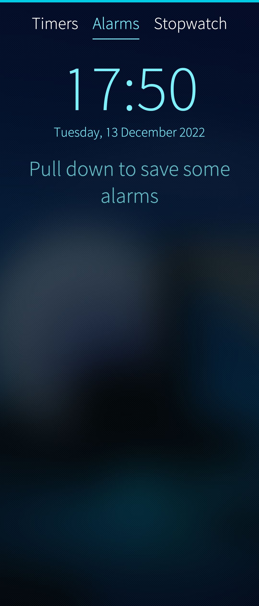</a>
  
    Pic 1: Home view of Clock app
  

# Alarm clock

To set an alarm, tap "Alarms" at the page top and select "New alarm" from the pulley menu. This will bring you to a view where you can set the alarm (Pic 2):

* <a href="Clock_new_alarm_weekdays_name.png" class="narrow-image">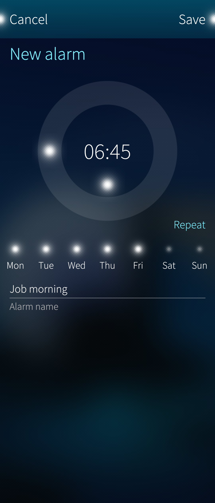</a>
  
        Pic 2: Setting new alarm
  

## Configuring an alarm

* **Alarm time:** Use the double ring tool to specify when the alarm is triggered. The outer ring adjusts minutes and the inner ring hours. In the picture above, the alarm has been set to go off at 06:45.

    NOTE:  Go to "Settings > System > Time and date" to choose the 24-hour clock or the 12-hour clock.

* **Alarm name:** Specifying an alarm name will result in this text being displayed at the time when the alarm is triggered.  Not making changes in this field means that the default text "Alarm" is used.
* **Repeat:** You can set your alarms to automatically repeat on certain weekdays. In the picture above, we have set the _"Job morning"_ alarm to occur on Monday through Friday, but not on Saturday and Sunday.

## Overview of alarms

The main view of the clock shows the existing alarms. The picture below has three of them. Active alarms have the switch light on and shown with the ambience colour whereas inactive alarms have the light turned off (see "Nap" below) and the white colour. The latter will start alerting according to their schedule only after you have turned them on again by tapping them in this view.

The weekdays (Monday to Sunday) an alert is related to, are indicated below the alarm times.

**Activating an alarm:** Tap the alarm (see Pict 3 below) to activate it. The colour of the item will change from white to the ambience colour (light blue in this example) and the switch light will turn on. You can exit the application or dim the screen of your device (do not turn off the phone, though) now. When the alarm time has been reached you will hear and see the alert.

**Modifying an alarm:** To modify an alarm item, tap and hold it and select "Edit" (or "Delete") from the drop-down menu (Pic 4).

* <a href="Clock_3_alarms_2_active.png">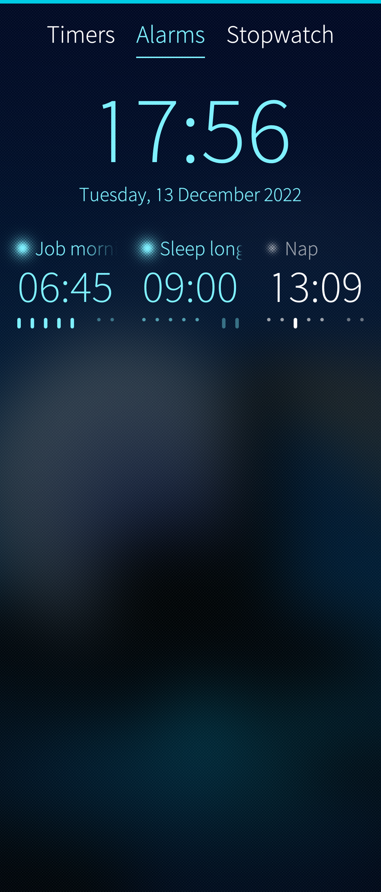</a>
  
   Pic 3: Main view of alarms
  
* <a href="Clock_alarm_modify.png">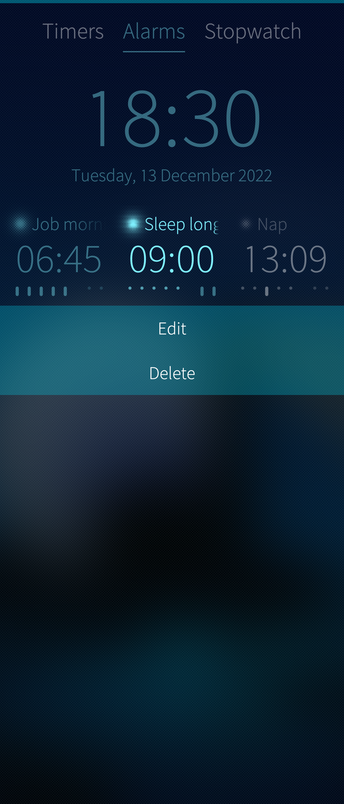</a>
  
   Pic 4: Modifying an alarm
  

## When an alarm goes off

When an alarm goes off the view below appears (Pic 5) and the alert tone starts sounding. The alert view has the name of the alert (or just "Alert"), the time, and the reminders for how to snooze (silence) and dismiss the alert.

* <a href="Clock_alarm_goes_off.png" class="narrow-image">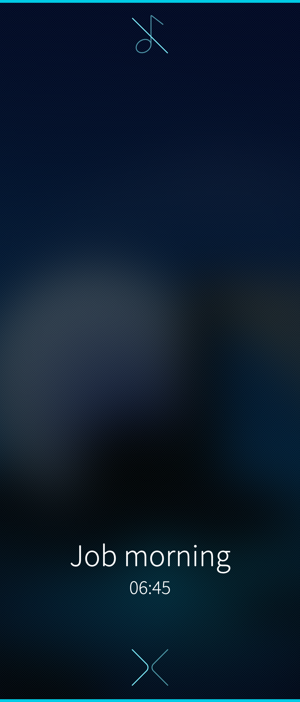</a>
  
    Pic 5: Clock alarm triggered
  

When the alarm clock is playing the alert, it can be snoozed by pulling down "Snooze" (Pic 6) or by flipping the phone (turning the display downwards). This silences the tone, too. An ongoing snooze can be checked in the **[Events view](https://sailfishos.org/design/ux-framework/)**.

Stopping the alarm completely is done by pushing up the command "Dismiss" (Pic 7).

* <a href="Clock_alarm_pull_to_snooze.png">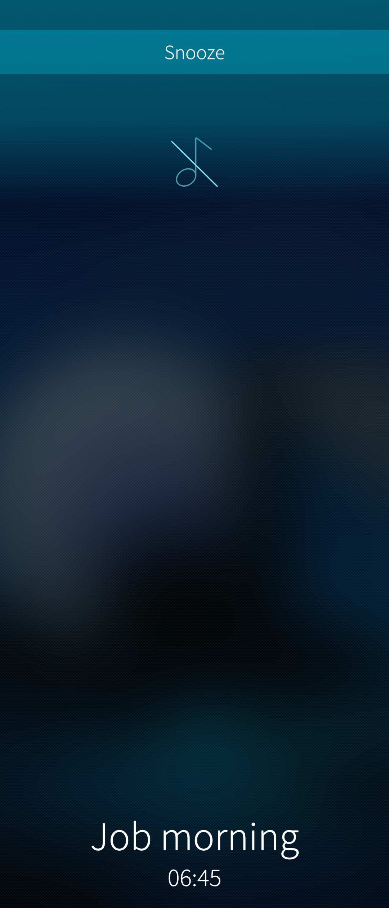</a>
  
    Pic 6: Snoozing an alarm
  
* <a href="Clock_alarm_push_to_dismiss.png">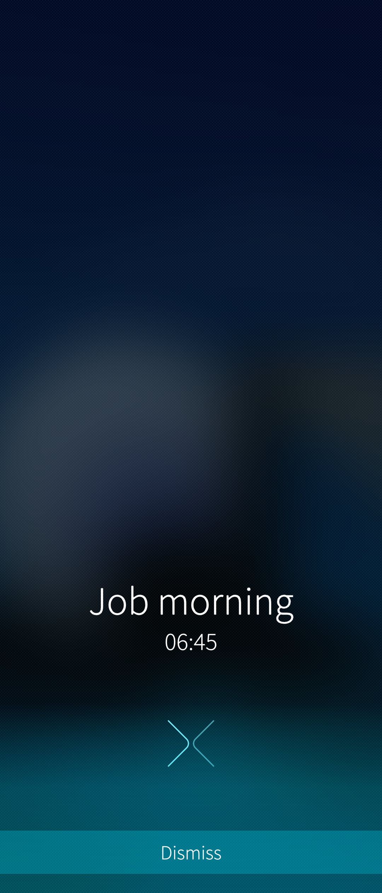</a>
  
    Pic 7: Dismissing an alarm
  

The duration of the snooze is preset and can be changed in "Settings > Apps > Clock" (Pic 8):

* <a href="Clock_alarm_snooze_duration.png" class="narrow-image">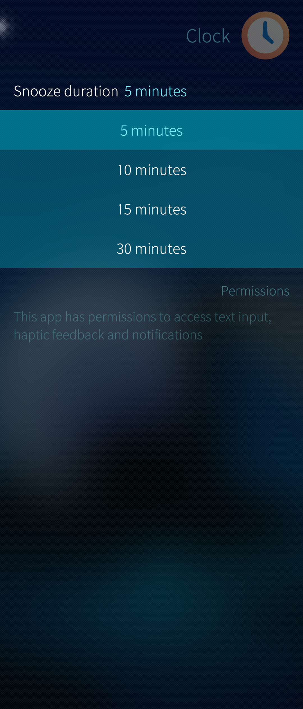</a>
  
    Pic 8: Snooze duration
  

The alert tone is selected in "Settings > System > Sounds and feedback". See chapter **[Setting the alert tone](#setting-the-alert-tone)**

# Timer

The timers can be found on the Timers page in the home view of the Clock application.

To set a timer, select "New timer" from the pulley menu. This will bring you to a view (Pic 9) where you can set the timer:

* <a href="Clock_new_timer_set.png" class="narrow-image">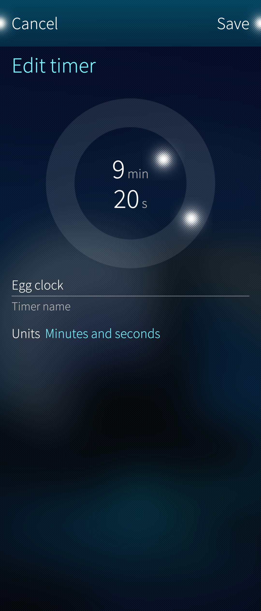</a>
  
    Pic 9: Setting a timer
  

## Configuring a timer

* **Setting the duration:** Use the double ring tool to specify how long the timer shall run. The outer ring adjusts minutes and the inner ring hours, or alternatively, the outer ring adjusts seconds and the inner one minutes. This depends on the value of "Units".  In the picture above, the timer has been set to run for 9 min 20 sec.
* **Timer name:** Specifying a timer name will result in this text being displayed when the timer expires.  Not making changes in this field means that the default text "Timer" is used.
* The alert tone is selected in "Settings > System > Sounds and feedback". The same tone is used for the alarm clock and timers. See chapter **[Setting the alert tone](#setting-the-alert-tone)**

## Overview of timers

The main view of the timers page shows the existing timers. Pic 10 below has three of them. The active timer is shown with the ambience colour (and the time counting down) whereas the rest are white. In this example, the _Egg clock_ will expire in 5 min 45 sec.

* <a href="Clock_3_timers_1_running.png" class="narrow-image">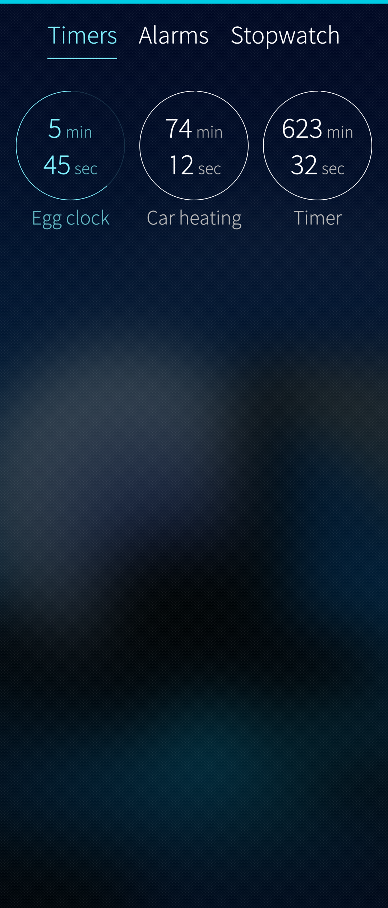</a>
  
    Pic 10: Set of timers
  

**Starting the Timer:** Tap on the circle to start a timer. You can exit the application or dim the screen of your device (do not turn off the phone, though) now. When the timer has run through, you will hear an alarm.

**Modifying the Timer:** To modify a timer you have created, tap and hold the timer, and select "Edit" (or "Reset" or "Delete") from the drop-down menu.

## When a timer expires

When a timer goes off the view below appears (Pic 11) and the alert tone starts sounding.

This view has the name of the timer (or just "Timer"), the duration elapsed, and the reminder for how to stop the alert. It is done by pushing up the command "Dismiss" (Pic 12) or by flipping the phone display downwards.

* <a href="Clock_timer_goes_off.png">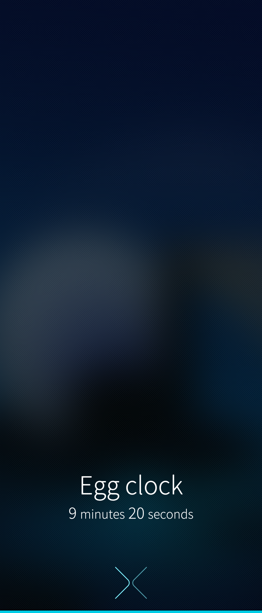</a>
  
   Pic 11: Timer has expired
  
* <a href="Clock_timer_push_to_dismiss.png">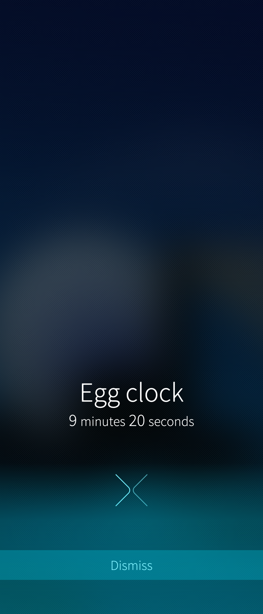</a>
  
   Pic 12: Dismissing a timer alert
  

# Stopwatch

The Stopwatch can be found on the Stopwatch page in the home view of the Clock application (Pic 13).

Press the "Play" button (the arrowhead) to start the Stopwatch:

* <a href="Clock_stopwatch_default.png" class="narrow-image">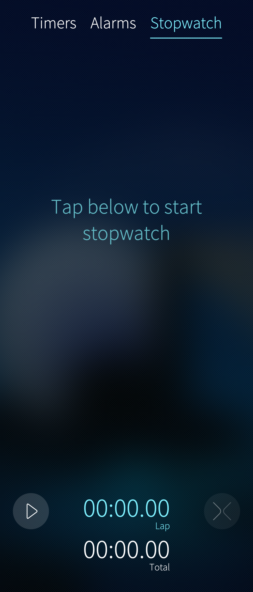</a>
  
    Pic 13: The home view of stopwatch
  

Pic 14 below shows a running stopwatch with two lap times. A new lap is recorded by tapping the "Plus" (\+) button. The stopwatch can be paused by tapping the "Pause" (\|\|) button and restarted by tapping the "Play" button.

Pic 15 shows a paused stopwatch. It can be restarted with the "Play" button and cleared with the "X" button.

* <a href="Clock_stopwatch_3_laps_running.png">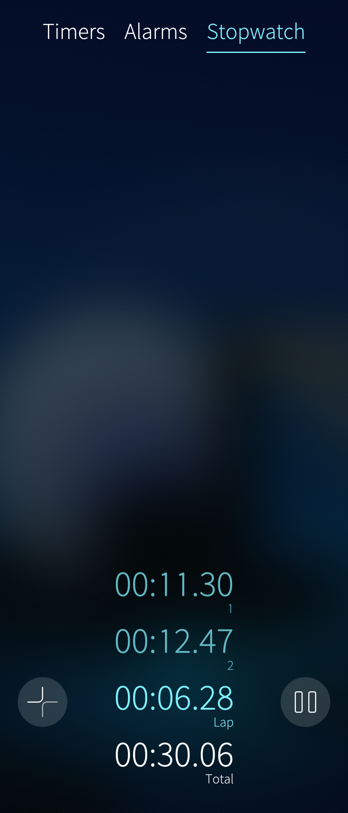</a>
  
    Pic 14: Stopwatch running
  
* <a href="Clock_stopwatch_4_laps_stopped.png">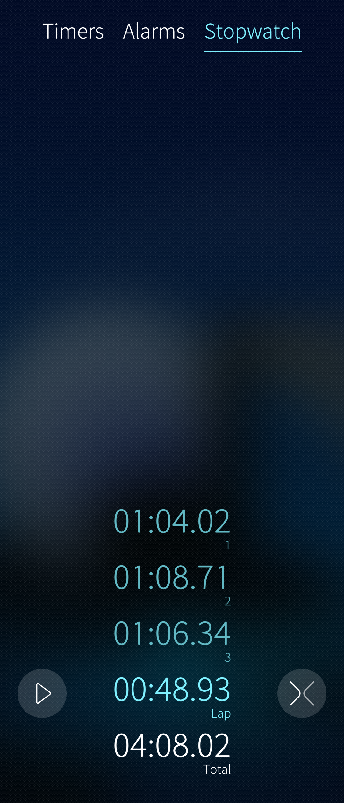</a>
  
    Pic 15: Stopwatch paused
  

# Setting the alert tone

There is just one tone used for all alerts and timers in Sailfish OS. This tone is selected in "Settings > System > Sounds and feedback" (see Pic 16 below).

In Pic 16, the current tone of the Clock app is "Nadeshinko Pink Alert 1". By tapping that item, the view of Pic 17 appears. In there, you can select any listed tone, search it from your music files or decide to take "No sound", i.e. muted alerts. Note that the vibrator may play despite the tone selection. Please test.

* <a href="Clock_alert_tone_set.png">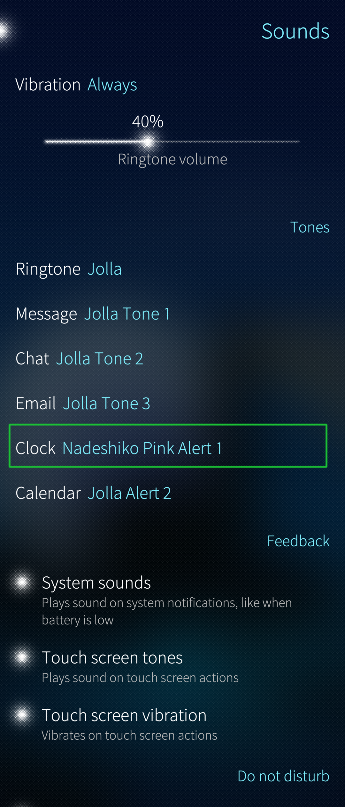</a>
  
    Pic 16: Clock app tone
  
* <a href="Clock_alert_tone_select.png">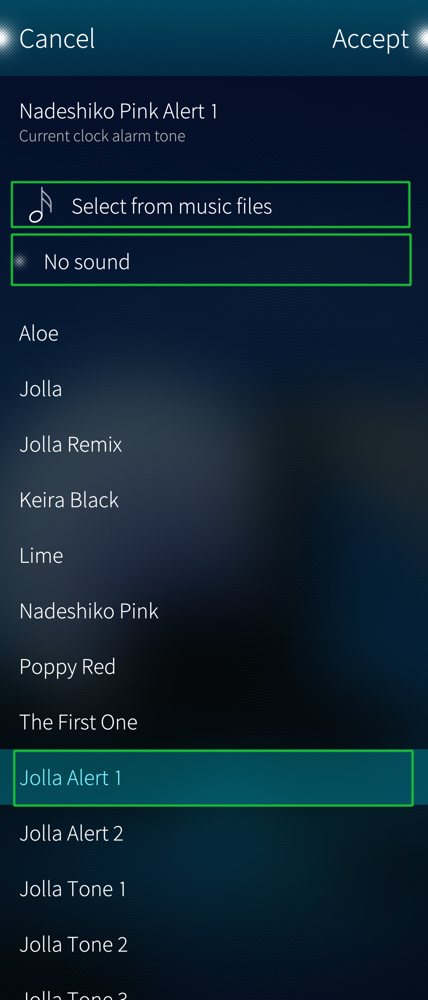</a>
  
    Pic 17: Options for the clock app tone
  

  
  
