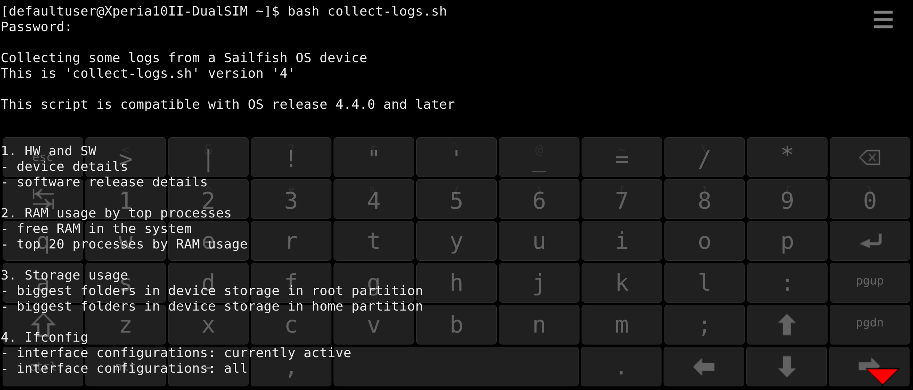
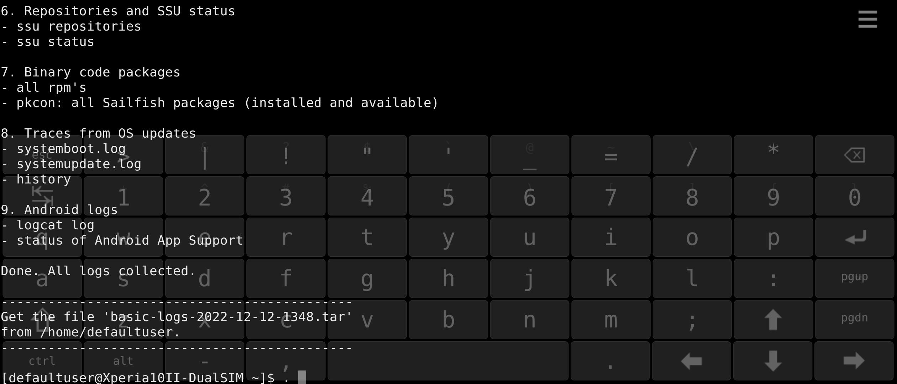

_When a device does not work properly and symptoms are not clear it is useful to collect some data and logs from the device. It may be possible to conclude the culprit by investigating those logs._

This document has a script (command file) attached, helping the collection of logs greatly. The script does everything for you - it knows where to get the data and how to handle it. 
The end result is one file, a container, with all logs in it.

NOTE: The data is collected from the previous device restart onwards. If you need to get and study persistent data (data from beyond the restart) then consider [this document](/Support/Help_Articles/Collecting_Logs/Collect_Persistent_Logs).


# Preparations

1) Enable the **[Developer mode](/Support/Help_Articles/Enabling_Developer_Mode/)** on your phone. You need to do this only to get the Terminal app and to set up the password for "SSH and root access".

2) Download the script file below (right-click it and take "save link as")

**[collect-logs.sh](collect-logs.sh)**

to your computer.  

3) Copy the file to your phone. It is good to place the file into the folder ```/home/defaultuser``` (or into ```/home/nemo```).

4) Open the Terminal app on your phone.

5) Set the file permissions with the following command:
```
chmod 744 collect-logs.sh
```

# Using the script


6) Run the script in the Terminal app with the command:
```
 bash collect-logs.sh
```

Type your SSH/root password if requested.

The script collects the data and compresses it into one single file. The file is saved in the home storage area of your phone. The script prints the name and location of this file just before it says "DONE".

<div class="flex-images" markdown="1">

* <a href="Script_starts.png"></a>
  <span class="md_figcaption">
    Script starts
  </span>
</div>


<div class="flex-images" markdown="1">

* <a href="Script_stops.png"></a>
  <span class="md_figcaption">
    Script stops
  </span>
</div>


# The result

Copy the log file "basic-logs-\<date\>-\<time\>.tar" 
(for instance: ```basic-logs-2022-12-07-1547.tar```)

from your phone to your computer.

If you are in contact with Jolla customer care, send this file to them, please.
