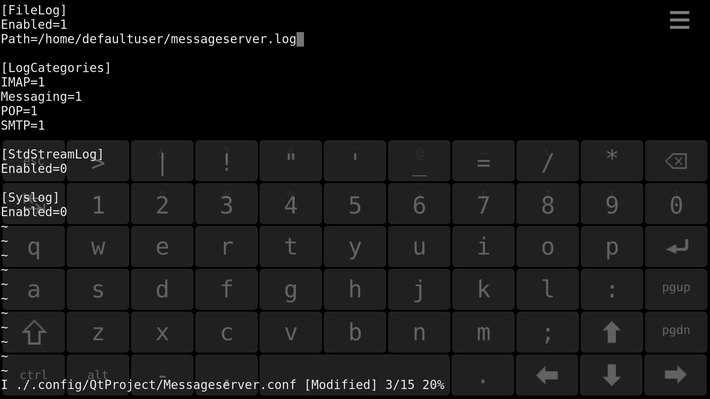

_Email application requires seamless co-operation with the client (phone) and the email server. There are a number of different protocols to 
choose from - the protocols shall match. Despite our attempts to automate the process, it may happen that the Email app does not always work correctly. 
In that case, it is useful to do some debugging, i.e. to collect logs showing the detailed data traffic between the phone and the server._

This article instructs how to enable message logging and collect the logs.

# Preparations

Check what your home directory is. We will save the logs there.

```
echo $HOME
cd $HOME
```

Pay attention to if it prints out **a)** `/home/nemo` or **b)** `/home/defaultuser`. You will need this below while editing the configuration file "Messageserver.conf".

**[This article](/Support/Help_Articles/Enabling_Developer_Mode/#how-to-use-the-vi-or-nano-text-editors-at-sailfish-terminal)** explains 
how to use the 'vi' line editor on the Sailfish Terminal app.

Open the configuration file to the vi editor with this command:

```
vi ./.config/QtProject/Messageserver.conf
```

Enable logging to a file. Add the correct path of your home directory:

```
[FileLog]
Enabled=1
Path=/home/nemo/messageserver.log              ## case a) 

[FileLog]
Enabled=1
Path=/home/defaultuser/messageserver.log       ## case b)
```

This is how it should look at the vi editor:

<div class="flex-images" markdown="1">

* <a href="Enable-msg-server-logs.png"></a>
  <span class="md_figcaption">
    Configuration file in the vi editor
  </span>
</div>


Save the changes by tapping “Esc” to exit the insert mode, and then, by typing “:wq” followed by “Enter”. 
Reboot the device to put the new configuration in effect.

# Collecting logs

Reproduce the email problem. Try to send/receive an email message using your email account, or run the Sync command in the pulley menu of your email account 
(in "Settings > Accounts > \[account\]"), depending on how the issues have usually occurred. The messages related to this sync action are then collected to the log file defined above.

It is useful to collect the **journal** log, too. Please follow the instructions in **[this article](https://jolla.zendesk.com/hc/en-us/articles/202886373)**.

As soon as you have completed collecting the logs, connect your Sailfish device to your computer with a data-enabled USB cable in the MTP mode. In the File Manager of the computer, 
find files **messageserver.log** and **journal.txt** in the Mass storage under your Sailfish device. 

Send the files to Sailfish Forum or to Jolla Customer Care, please.

**PLEASE make notes** when the issue happened (date and time) so that it would be easier for us to investigate your logs later.

# End of job

After taking the logs, turn the message logging off again by setting "Enabled" to 0 in file "Messageserver.conf" (i.e., revert the changes you made to the configuration file). 

Remember to reboot your phone.


