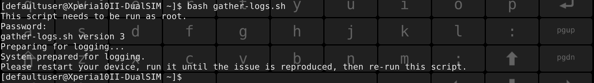
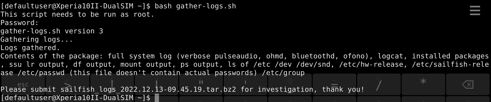

_When a device does not work properly and the symptoms are not clear it is useful to collect some data and logs from the device. It may be possible to conclude the culprit by investigating those logs._

This document has a script (command file) attached, helping the collection of logs greatly. The script does everything for you - it knows where to get the data and how to handle it. It even makes the phone to save the journal log if the phone should reboot itself during the testing process. The end result is one file, in a compressed container.

The script collects some general data (e.g. the journal and information on the device and on installed software) but especially data about audio control, Bluetooth and mobile telephony.


# Preparations

1) Enable the **[Developer mode](/Support/Help_Articles/Enabling_Developer_Mode/)** on your phone. This is needed to get the Terminal app and to set up the password for "SSH and root access".

2) Download the script file below (right-click it and take "save link as") to your computer.

**[gather-logs.sh](gather-logs.sh)**

3) Copy the file ```gather-logs.sh``` to your phone. It is good to place the file either into the folder ```/home/defaultuser``` (or into ```/home/nemo```).

4) Open the Terminal app on your phone.

5) Set the file permissions with the following command:
```
chmod 744 gather-logs.sh
```

# Using the script

## Round #1

The purpose of this round is to make your phone ready for collecting logs before the problem occurs again. The journal log is made persistent, so that it would survive over a potential reboot of the device.

Open the Terminal app.

Run the script the 1st time with the command:

```
bash gather-logs.sh
```

Type your SSH/root password when requested.

The script prepares your device for gathering some data in this 1st round. Next, you must restart the device or else the script would not work correctly in the 2nd round.

<div class="flex-images" markdown="1">

* <a href="Gather_round_1.png"></a>
  <span class="md_figcaption">
    Output from the 1st round
  </span>
</div>


# Reproducing the issue

As soon as you have restarted your phone, please try to reproduce the issue we are to investigate.

## Round #2

Once you have observed the problem, you should open the Terminal app and run the script the 2nd time.
```
bash gather-logs.sh
```

The script collects the data and compresses it into one single file. The file is saved in the home storage area of your phone. The script prints the name and location of this file to the display.

<div class="flex-images" markdown="1">

* <a href="Gather_round_2.png"></a>
  <span class="md_figcaption">
    Output from the 2nd round
  </span>
</div>

At the end of the script, the special settings on your phone (from round #1) are removed. The phone is reverted back to its original state. However, you will need to disable the Developer mode yourself in "Settings > System > Developer tools".


# The result

Copy the log file "sailfish_logs_\<date\>-\<time\>.tar.bz2"

(for instance: ```sailfish_logs_2022.12.13-09.45.19.tar.bz2```)

from your phone to your computer.

If you are in contact with Jolla customer care, send this file to them, please.


