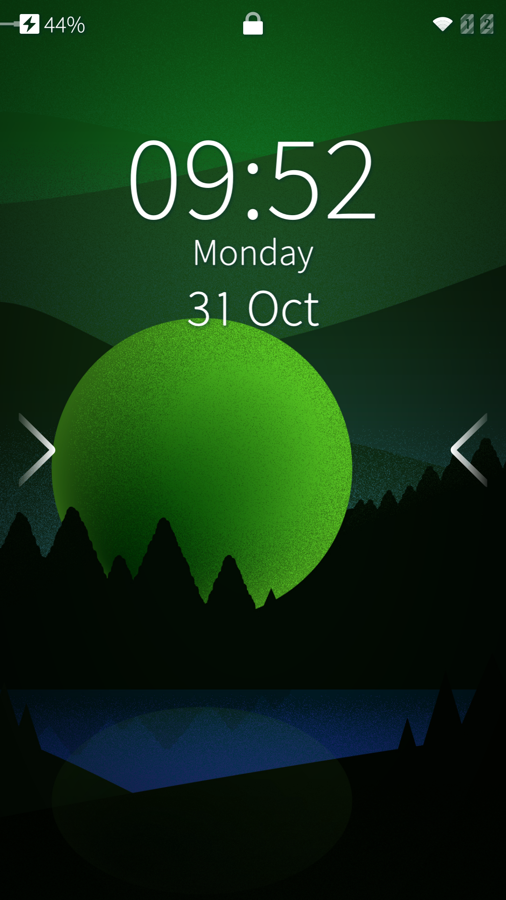
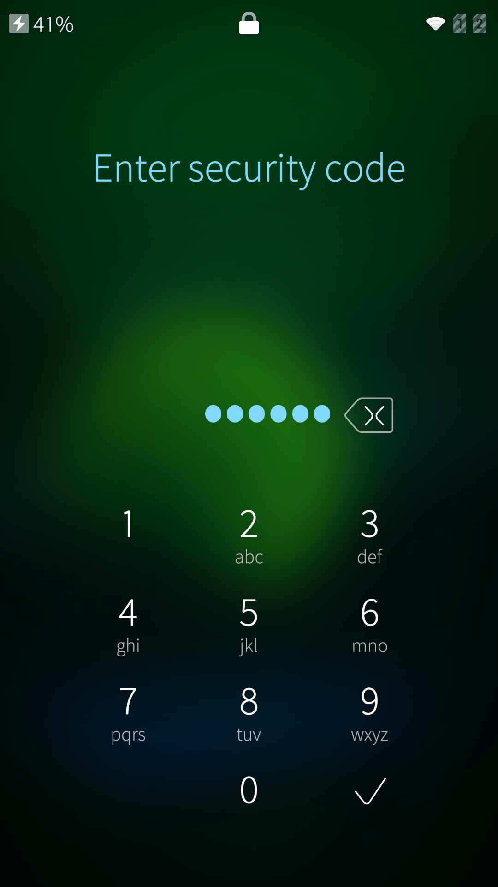
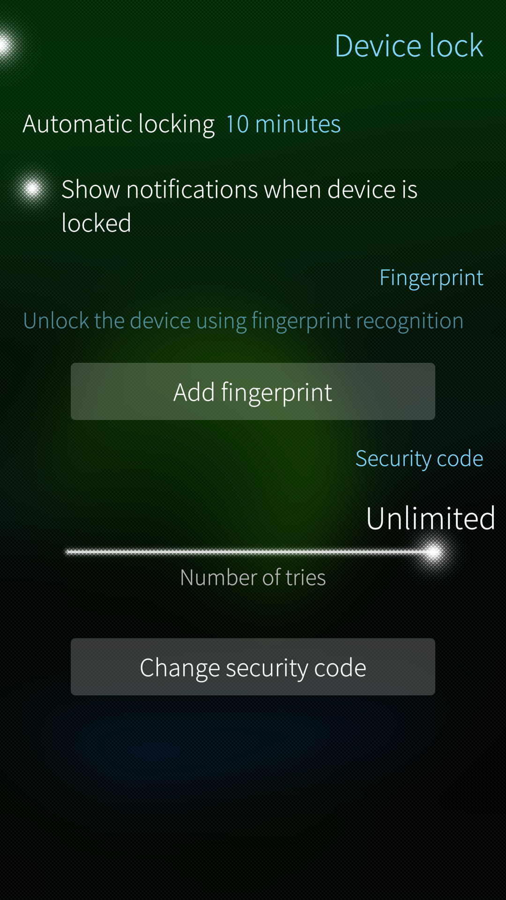
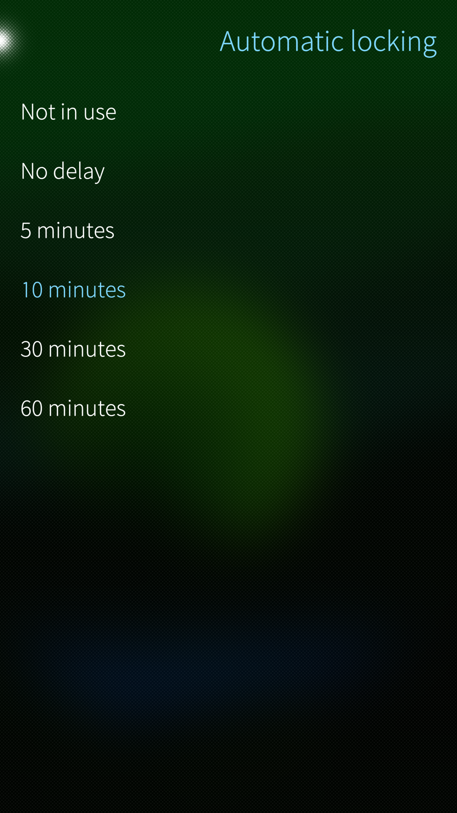

# About the Device lock

The **Device lock** has three main purposes:

1.  **Touch display lock**. It can be set on immediately or by a timer to prevent using the touch display and thereby the whole device. The correct Security code must be typed to unlock the display.
2.  **Function lock**. It prevents unauthorized use of a number of sensitive device functions. The correct Security code must be typed to use those functions.
3.  **Encryption of user data**. The data in the user area ("/home") is [encrypted](https://docs.sailfishos.org/Support/Help_Articles/Encryption_of_User_Data/). It must be unlocked when the device is restarted. The security code is used for unlocking.

The picture below shows the Lock screen. Note the lock icon at the top. The two arrow heads hint that you should swipe the display sideways to be able to unlock the display. After swiping, the Security code dialogue will appear.

* 
  
    The lock screen with arrows hinting how to swipe
  
* 
  
    Security code dialogue
  

There is no way to recover any data from a device that is locked up with a Security code. This is because the purpose of the code is to deny all access to data on the device unless the correct code is entered. There are no extra secret codes or the like to open backdoors. Therefore, make sure you **do not forget the Security code** you set.

Setting up the Security code during the initial startup of a device (following flashing or factory reset) is mandatory. It cannot be skipped.

The dialogue for typing the Security code to unlock the touch screen can be replaced with **fingerprint recognition** (_discussed later in this document_). This works on devices supporting this feature and having the fingerprint detector. 

On a shared device (having multiple user accounts), there is no Device lock item in the Settings menu for additional users, i.e., only the admin user can manage the device lock.

## Security code

The security code of Sailfish OS can contain numeric characters {0, 1, 2, 3,... 9} only. The minimum length of the code is 5 digits but we recommend a considerably longer code. The maximum is 42.

Please note that this same code is also used for the encryption of user data.

Support for an alphanumeric security code is coming up in one of the releases after 4.4.0.

# Turning on the Device lock

## Activation of the Device lock

The Device lock is activated during the Startup wizard, i.e. the first startup of the device after installing/flashing Sailfish to the device.

The activation is done so that you type the Security code of your choice (at least 5 digits but consider a longer one) once and then again for confirmation. There is no dedicated ON-switch. The Device lock is active now, immediately.  You will need to type this code always when beginning to use the secured functions discussed later in this article. Please memorise your code!

## Configuration of the Device lock

The correct Security code must be typed in before changing any of the settings below.

* 
  
    Device lock settings
  
* 
  
    Options for Automatic locking
  

### Automatic locking of the display

This item in Settings is for the **touch display lock** only. The time value of this item defines how soon (or if not at all) the touch display lock goes on. 
The display lock delay is counted from the moment when the display turns black (in the lack of user actions). The delay of display going black, in turn, is controlled by the value "Settings > System > Display > Sleep after"). It starts counting from the last touch on the display. As for an example, if the "Sleep after" timer is set to 2 minutes and the "Automatic locking" to 5 minutes, then the display lock will automatically go on after 7 minutes from the last touch.

There are the following options:

* "**No delay**" means that the touch display is locked immediately after switching the display off. This happens with a short press of the Power key or by tapping the lock symbol in the Top Menu. If the phone is left idling then the display off timer ("Sleep after") will elapse after a selected time period and trigger the display lock on. When you press the Power key shortly the next time, the black display will turn into the Lock Screen view.
* "**5/10/30/60 minutes**", makes the display lock go on after the selected time from switching the display off. As long as the timer has not elapsed, the display can still be turned on (with the Power key) without typing the code.
* "**Not in use**" prevents the display from getting automatically locked.  With this option, the touch screen cannot be locked up at all. The display lock is always OFF. Note that the Security code will be requested even with this option when attempting to perform certain protected actions with your phone (see chapter 3). Making this selection ("not in use") does not remove the Security code from your device! It affects the touch display lock only.

    

### Show notifications when the device is locked

Notifications from various apps are shown on the display also when the Touch display lock is on.

### Configuring the fingerprint recognition

This function requires a fingerprint detector on the device. Not all Sailfish OS devices have it (_in such a case, this menu item is missing from devices that do not have it)._

* 
  
    Fingerprint menu
  

Fingerprint recognition can be used to unlock the display lock (instead of typing the security code) and when going to add a new fingerprint. Sailfish OS does not support fingerprint recognition in other contexts (see chapter 3).
NOTE:_  As the user data of Sailfish phones is encrypted (see **[this article](https://docs.sailfishos.org/Support/Help_Articles/Encryption_of_User_Data/)**), a phone, while being turned on, will present the dialogue for entering the code to unlock the encryption. This code (which is the same Security code as for the Device lock) must always be typed, i.e., it cannot be bypassed with a fingerprint._

#### Adding a fingerprint

* Type your security code
* Start tapping your fingerprint on the detector until the fingerprint symbol becomes all white. Follow the on-screen instructions. Note that the location of the detector varies: it may be on the back or on the side of the phone, or at the touch display.
* It is possible to add several fingerprints (Fingerprint 1, Fingerprint 2, Fingerprint 3, etc.)

* 
  
    Teaching a fingerprint 1
  
* 
  
    Teaching a fingerprint 2
  

#### Deleting a fingerprint

Tap and hold a "Fingerprint #n" item. Take 'Delete' from the pop-up menu.

### Number of tries

One can decide how many times one can try different codes in the Security code dialogue. Consider the best value in the case your phone gets in wrong hands; also consider the case where you cannot recall the code yourself. The options are:

* 4 to 50 times
* Unlimited

### Change the security code

By tapping this button one can replace the current Security code with a new one. The current code must be correctly entered to begin the process.

# Functions that require the Security code to use them

As explained in the previous chapter, the Security code prevents the use of the touch display (and thereby the use of the whole device). It is also used to protect the use of the following functions:

* Make changes to the Device lock settings (note: there is no specific button to accept the changed settings - another security code dialogue appears for the confirmation, instead)
* Toggle certain items in Top Menu
* Allow connections over USB cable
* Sign in to a corporate MS Exchange account. Many service providers require that the Device Lock is in use to protect confidential information
* Allow installation of untrusted software
* Enable Developer mode
* Set the password for remote connections (SSH password)
* Set the password for Internet sharing (WLAN hotspot)
* Reset the phone to factory settings
* Use the Recovery mode
* Register additional users
* _\[More functions may appear in the following OS releases\]_

**NOTE:**  Even if you set your Automatic locking to "Not in use"  (affecting the touch screen lock), you will still be prompted to enter the Security code for the actions described above.

# How to disable the Device lock

There is no way to disable the Device lock.

# Quick locking of the touch display

Double-press the Power key quickly when the display is on.

The display turns off and the touch display lock goes on immediately, regardless of the delay set for _Automatic locking_ in menu "Settings > System > Device lock" [^1].
This implies that the touch display must be unlocked by typing the Security code before being able to use the device the next time.

[^1]: The value "Not in use" of Automatic locking prevents the actual locking up. In this case, the display is just turned off.

