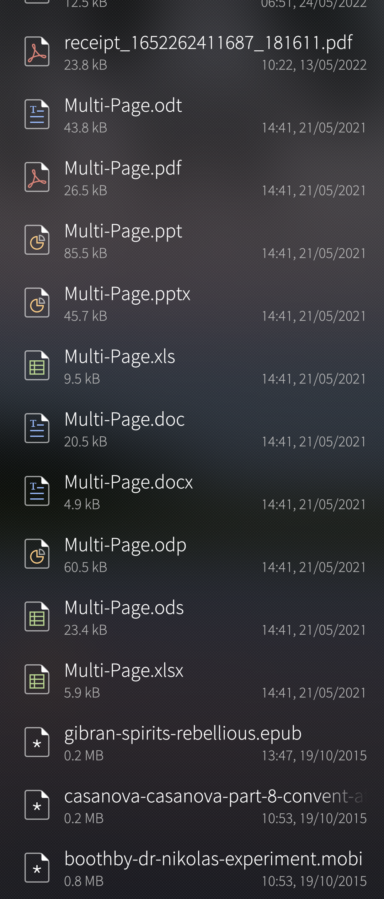
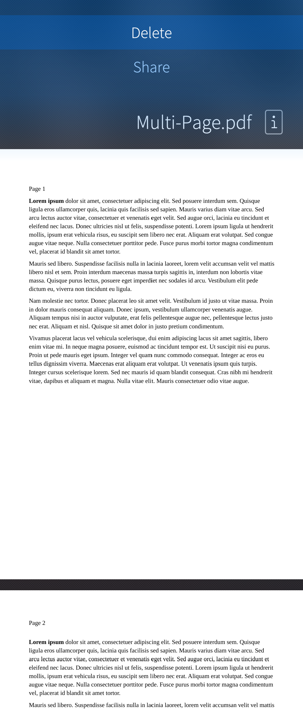
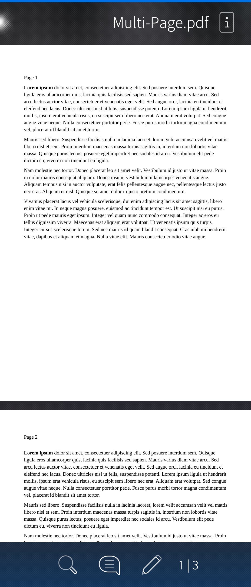
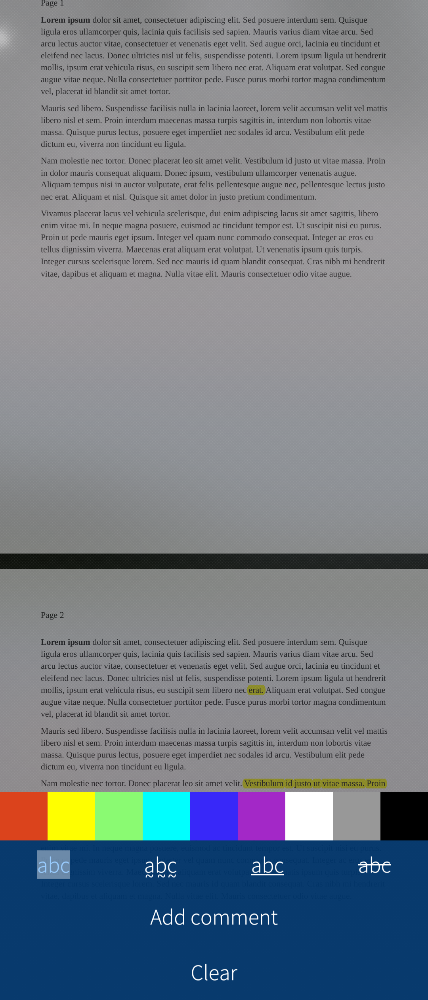

# Documents application

Documents you download to the device appear and can be viewed in Documents app.

* 
  
    Documents main view showing the list of the documents on your device
  

Documents lists every document stored on your device, SD card or other connected storage device. Documents can be viewed, zoomed, you can also jump to a specific part of the document from an attached page. In addition PDF viewer supports text search, annotations and adding comments.

Supported documents and formats include:
* PDF documents
* Text documents (.doc, .docx, .odt, .rtf and .txt)
* Spreadsheets (.xls, .xlsx, .ods and .csv)
* Presentations (.ppt, .pptx,  and .odp)

Also dozens other less common document known formats.

## Options
Documents app has also Search, Write a note and highlight/Add comment options on the bottom toolbar.

* 
  
    Documents app options on top menu.
  

* 
  
    Documents app options on the bottom toolbar.
  

* 
  
    Documents app additional options on the bottom toolbar.
  

