This article will help you get the most out of the Email application. It instructs general use and provides some hints and tips.

# Email accounts

To begin reading emails on your device you must first add your email account(s) to the device.

This is done in "Settings > Accounts". Tap the “\+ Add account” button to see the list of accounts supported by Sailfish OS. Configure those that you need on your device. 

## Email account types

Sailfish supports IMAP, POP and Microsoft's Exchange email accounts.

IMAP and POP accounts are email accounts that you can generally also access via your browser i.e. via Webmail. Such email accounts are referred to as “General email“ in Settings:

You can also add Microsoft Exchange and Google email accounts to your Sailfish device.

* 
  
    Pic 1: Choice of accounts
  

For help with installing Exchange accounts, please **[see here](/Support/Help_Articles/Accounts_Setup/Setup_Exchange_Account/)**.

For help with installing General Email accounts, please **[see here](/Support/Help_Articles/Accounts_Setup/Setup_General_Email_Account/)**.

For help with installing Google accounts, please **[see here](/Support/Help_Articles/Accounts_Setup/Setup_Google_Account/)**.

# Receiving emails

Your Sailfish device will receive incoming email messages according to the synchronization settings of your email accounts in "Settings > Accounts". Look for the "Sync schedule" in the relevant
one of **[these documents](/Support/Help_Articles/Accounts_Setup/)**.

It is possible to get all new messages at once with a manual sync, too. This is done by using the "Update" command of the pulley menu of an inbox (see Pic 4 below).

**Tip:** If you have a Google and/or Exchange account configured with your device, updating your email can also sync the contacts and the calendar related to these accounts.

# App status

There are two ways to check the staus of your emails and of the Email app. One is to use the "Unified inbox" explained in chapter "Reading email" below. The other way is to glance the Cover [^1] of the Email app. When you minimize applications you will see them as "cards" on your Home screen. They are called Covers. The Email app's Cover provides you with a way to quickly refresh all your email accounts.

Below is a zoom-in series of using Email Cover to update all accounts:

* <a href="Email_cover_series.png">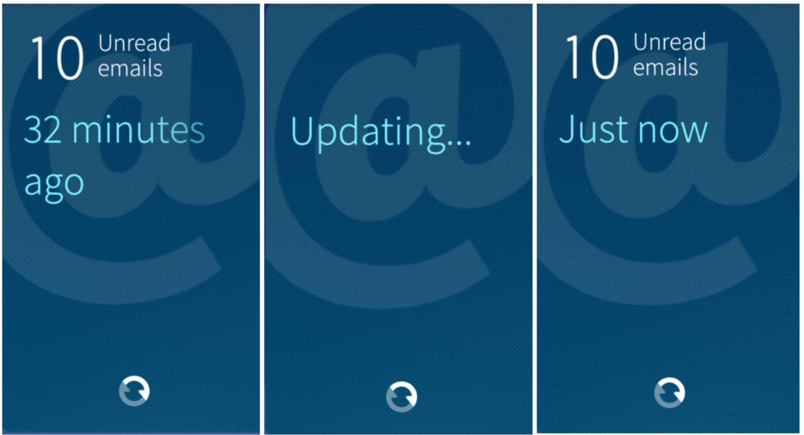</a>
  
    Pic 2: Using Email Cover to update accounts
  

Simply tap on the "Update" icon (at the lower part of the Cover) to refresh all your accounts.

## Email Cover status

 _Just now_: a check for new emails just occurred.

 _Up-to-date_: a check recently occurred, but there were no new emails.

 _Updates X ago_: the last time new emails were sought after was X time ago.

 _Problem with sign-in:_ your email couldn't be updated because of issues with the sign-in credentials you have provided. Go to "Settings > Accounts" to fix this issue.

 _Unable to sync_: performing the sync was not successful, please make sure you have an Internet connection.

 _Not connected_: please make sure you have an Internet connection.

# Reading email

Email is one of the default apps of Sailfish OS, i.e., it exists on all devices. You are ready to open the Email app as soon as you have signed in to one or more email accounts (see chapter **[Email accounts](#email-accounts)** above).

## Unified inbox

When you tap on the Email application icon, the following unified Inbox view appears:

* <a href="Email_unified_inbox.png" class="narrow-image">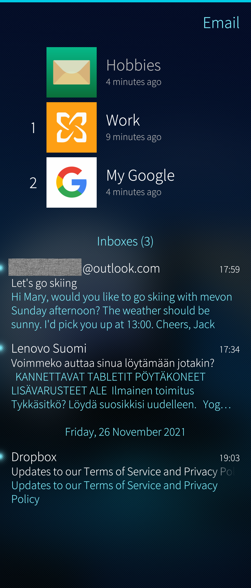</a>
  
    Pic 3: Unified inbox
  

At the top of the screen, you see all your email accounts active on your Sailfish device. There is a number to the left of each account indicating how many unread messages there are on that account. Under the account name, there is status information on when the account was previously updated on this device.

The bottom half of the screen shows the latest _unread emails_ from all of your email accounts. The account a message belongs to is not shown. The messages are sorted by their times of arrival, with the latest on top. There is a snippet of the message content under the sender. If you tap a message to read it, the whole message is shown to you. Swipe to the right to return to the unified view. Note that the message you just read is no more shown in this view.

* <a href="Email_unified_inbox_pulley.png" class="narrow-image">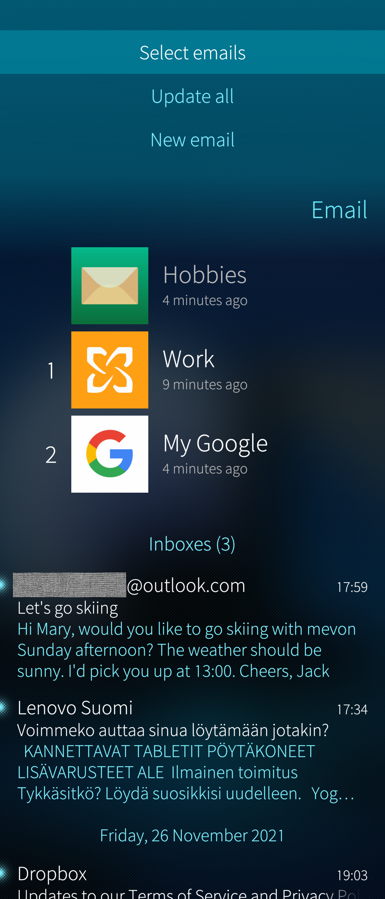</a>
  
    Pic 4: Pulley menu of unified inbox
  

 

The pulley menu of this view allows you to quickly create “New email”, “Update all” your email accounts or begin to "Select emails". The selected messages can be either deleted (trash bin button) or marked as read (envelope button) in one go.

* <a href="Email_selected_delete_or_read.png" class="narrow-image">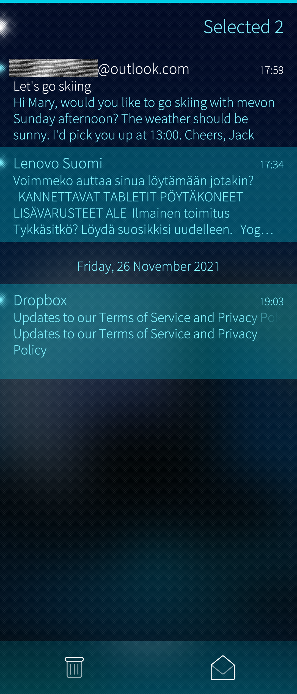</a>
  
    Pic 5: Email messages selected
  

## Individual inboxes

Tap on an individual email account (Pic 3, upper part) to expose this email account’s inbox (see Pic 6 below). The messages are sorted by their reception dates and times, the latest on top. Messages containing attachments are indicated with the clip icon.

* <a href="Email_inbox_view.png" class="narrow-image">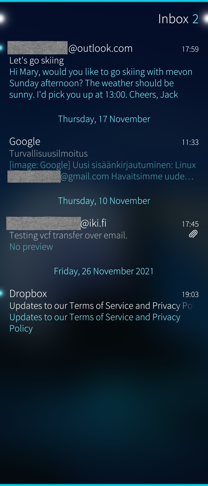</a>
  
    Pic 6: Email inbox of one account
  

From the pull-down menu (Pic 7) one can:

* Change how messages are sorted
* Select multiple emails
* Search with a keyword
* Update the inbox
* Start creating a new message

The inbox has also the push-up menu (Pic 8) for downloading more messages from the server to the phone.

* <a href="Email_inbox_pulley.png">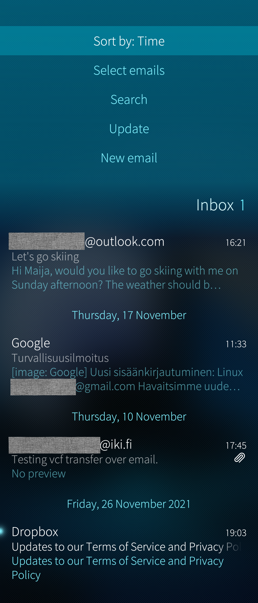</a>
  
    Pic 7: Pull-down menu of email inbox
  
* <a href="Email_inbox_pushup_get_more.png">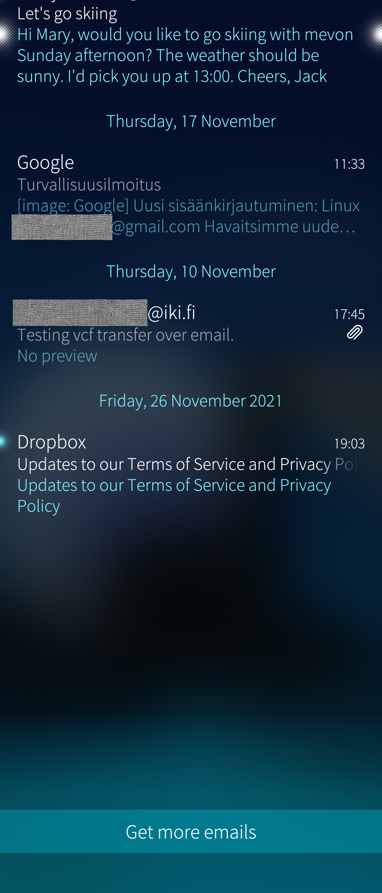</a>
  
    Pic 8: Push-up menu of email inbox
  

If you swipe to the left in the inbox, you will see the Folders view of this account. Tap any folder to see its contents.

* <a href="Email_folders.png">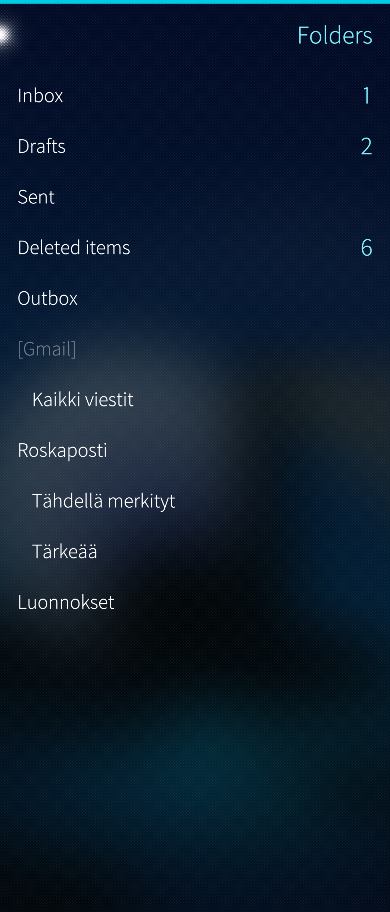</a>
  
    Pic 9: Email folders
  
* 
  
    Pic 10: Example: drafts folder
  

**Tip:** If you aren’t sure if you’ve sent an email, check the Outbox folder for unsent mails.

# Composing and sending email

Writing a new message begins by selecting the command  “New email” from the pulley menu of the Email app. You need to be in either the Unified Inbox (Pic 3 above) 
or in the inbox of any of the email accounts configured with your phone (Pic 6 above) to see this option in the pulley menu.

* <a href="Email_start_sending_email.png" class="narrow-image">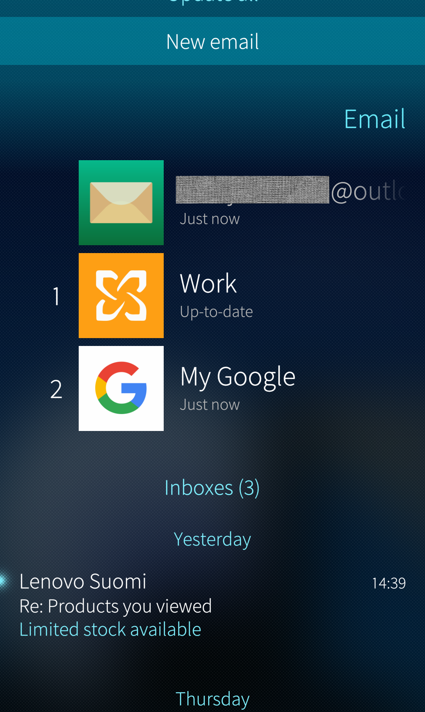</a>
  
    Pic 11: Start composing a new email message
  

The command "New email" will take you to the message composition screen:

* <a href="Email_body_of_new_email.png" class="narrow-image">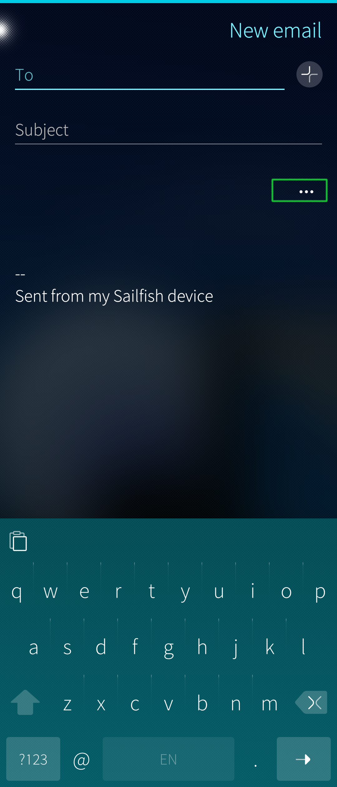</a>
  
    Pic 12: Body of new email
  

You can type the recipients’ addresses on the “To” line or fetch contacts from the People app by using the (\+) icon.

Once you’ve specified the recipient(s) & subject, you can “Send” the email by using the pulley menu.

Note that this message would be sent from your default email account. See chapter **[Account from which to send the message](#account-from-which-to-send-the-message)** below for details.

## Additional settings for outbound emails

Tap the three dots button near the right edge (marked with a green rectangle in Pic 12 above) to reveal additional settings for sending the email.

### More recipient categories

The view of additional settings brings to more lines for the recipients, the usual CC and the BCC.

### Attachments

If you want to add an attachment file, tap “Add attachment”. Note that the size of the attachments should not exceed 5 to 10 Mbytes (depending on the limit set by your service provider). We recommend that you upload really big files to a cloud service first (e.g. Dropbox or the like) and that you send only a link pointing to that file in the cloud.

* <a href="Email_new_email_additional.png" class="narrow-image">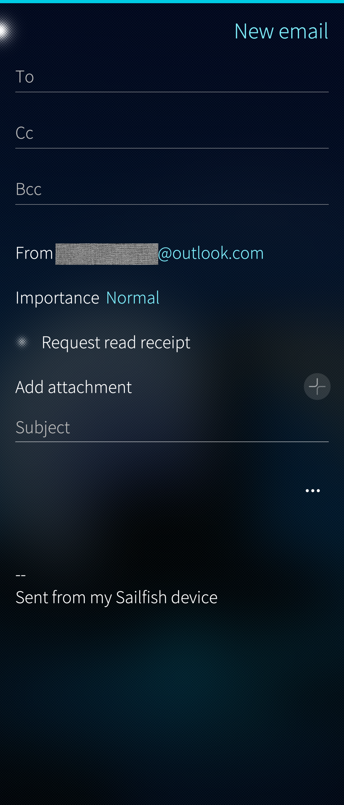</a>
  
    Pic 13: New email - additional settings
  

### Account from which to send the message

There is a default setting for the account (if you have configured two or more emails accounts on your device) to be used for sending email messages. This setting is located at "Settings > Apps > Email" and it appears there with the title “Default account for sending” (see Pic 14 below).

It is possible to override the default account for an individual message by tapping "From" in the additional settings (see Pic 13 above) and by selecting another account. If you did not touch the "From" field then it keeps showing the default account.

The recipients of your messages will see your messages arriving from the account shown at the "From" field (be it the default or the one chosen for the current message).

* <a href="Email_default_account.png" class="narrow-image">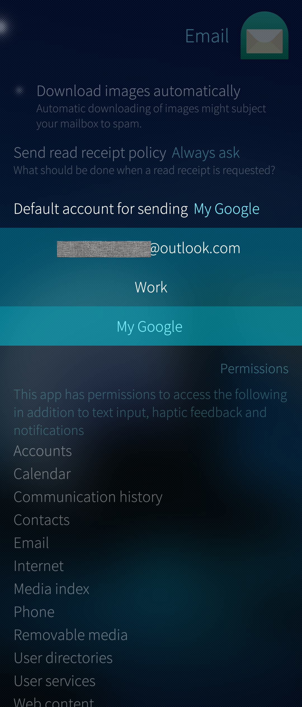</a>
  
    Pic 14: Setting the default email account
  

### Other settings

There are also the options to indicate the importance of the outbound message and to request read receipts.

# Related articles

[Setting up a General Email account (IMAP/POP) on Sailfish](/Support/Help_Articles/Accounts_Setup/Setup_General_Email_Account/)

[Setting up an Exchange account on Sailfish](/Support/Help_Articles/Accounts_Setup/Setup_Exchange_Account/)

[Setting up a Google Account on Sailfish](/Support/Help_Articles/Accounts_Setup/Setup_Google_Account/)

----------
[^1]: Read more about [Covers and Cover actions](https://sailfishos.org/design/ux-framework/).

