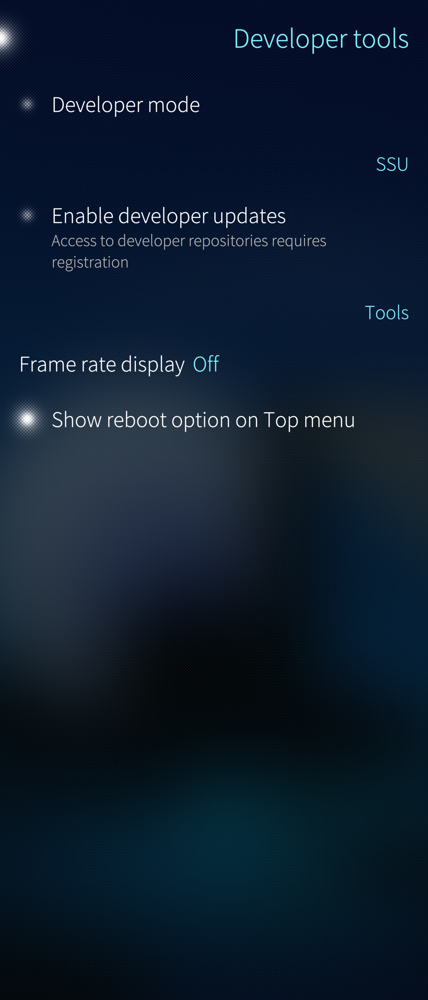
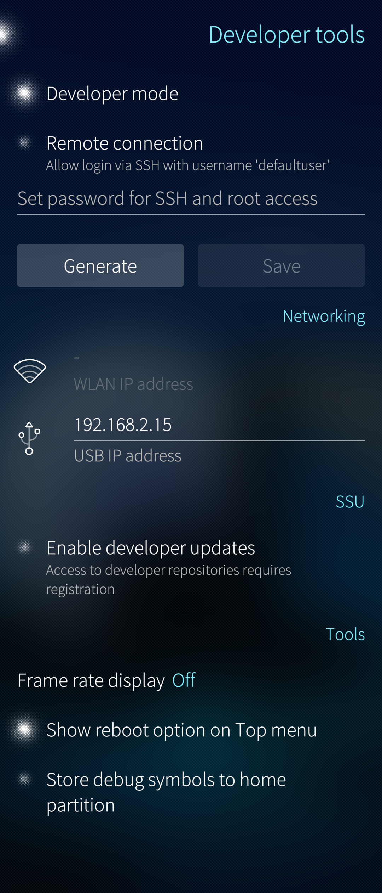
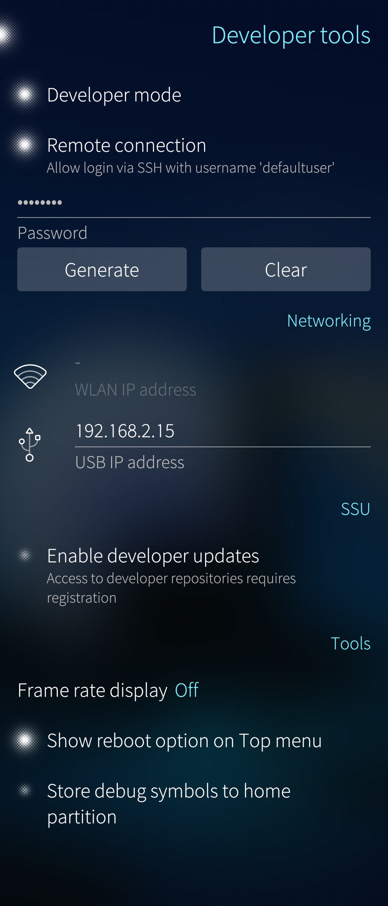
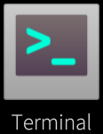
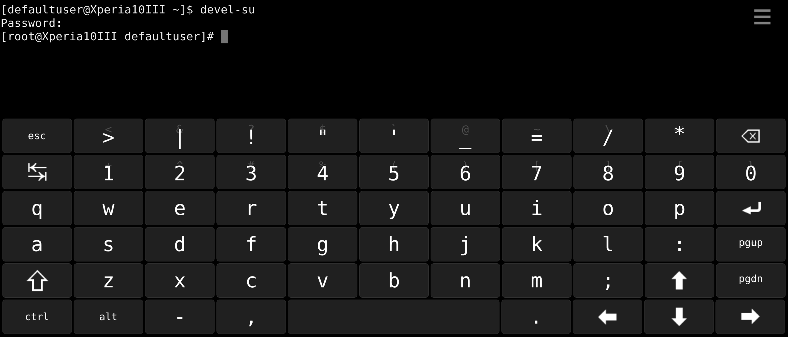

# How to enable the Developer mode


_Please be advised that in the Developer Mode you can run commands or enable features that, when used incorrectly, can cause permanent damage to your device and/or content._

## Turning Developer Mode on


Turning the Developer Mode on is protected by the **[Security code.](https://jolla.zendesk.com/hc/en-us/articles/201440487)**

Developer mode is pre-installed on Sailfish OS devices that have Sailfish OS version 3.2.1 or newer. Developer mode can be enabled locally, without any Internet connection. Not even the Jolla account is required.

<div class="flex-images" markdown="1">

* <a href="DM_off.png" class="narrow-image"></a>
  <span class="md_figcaption">
    Developer mode not yet enabled
  </span>
</div>


1) Go to menu Settings > Developer tools.

2) Tap on "Developer mode" to turn it on. Tap "Accept" at the top right corner.

The installation is ready when the switch light ("LED") in front of Developer mode is turned on. See the picture below.
  
<div class="flex-images" markdown="1">

* <a href="DM_on.png" class="narrow-image"></a>
  <span class="md_figcaption">
    Developer mode is enabled
  </span>
</div>

3) Now, tap "Remote connection" to turn it on, too. It makes SSH connections [^1] [^2] [^3] [^4] [^5] to the device possible. In addition, it gives you the so-called root rights.

4) Tap on the "Set password for SSH and root access" line and type or generate a password - we call it "SSH password" for short now. You can change this password at any time later. Tap on 'Save' to save it. 
After saving it the password appears as a number of asterisks (on the left below). There is no way to check the current password.

<div class="flex-images" markdown="1">

* <a href="DM_SSH_pwd_set.png" class="narrow-image"></a>
  <span class="md_figcaption">
    SSH password set
  </span>
</div>

You can change the password by tapping the password line. Type or generate a new password. Save it and confirm with the security code.

**NOTE:** The option "Enable developer updates" is available for Jolla staff and for nominated community testers (_cbeta_) only. Special credentials are required. You can use the Developer tools of Sailfish OS without this option.

It is good to close the Settings app now. Your phone is now in Developer Mode.


## Using Developer Mode


### A. In Terminal application

View the application launcher grid. At the end of the grid, you have now the Terminal application, providing the "command line".

<div class="flex-images" markdown="1">

* <a href="Terminal_icon.png"></a>
  <span class="md_figcaption">
    Icon of the Terminal app
  </span>
</div>

NOTE:
   * All commands shall be terminated by tapping the Enter key
   * Linux command interpreter is case sensitive, i.e. you must type the upper and lower case letters correctly.

Tap the settings button at the top right corner of the app to adjust the font size and other preferences.

Many commands can be executed with the normal user rights. This is the safe way - try it first. However, if there is a real need for the super-user right you can get it by issuing the command below in the Terminal

```
devel-su
```

Use your SSH password here. The characters you type are not shown on the screen.

<div class="flex-images" markdown="1">

* <a href="Finger_terminal.png"></a>
  <span class="md_figcaption">
    Getting the super-user rights
  </span>
</div>


Note that you must be careful with the super-user rights or else you might break your phone. Follow our instructions in other help articles and type (or copy/paste) the commands precisely in the same way.

### B. Over an SSH connection

Typing complicated commands at the tiny Terminal is error-prone and can lead to serious problems at worst. A safer way of entering commands is to do it at a terminal app running on a PC, after creating an SSH connection from the PC to the Sailfish OS device. In this way, you can copy the commands (one by one) from our articles and then paste them into the SSH terminal.

Read more about SSH connection over USB:  **[Windows](https://jolla.zendesk.com/hc/en-us/articles/202004823)** and **[Linux/Ubuntu](https://jolla.zendesk.com/hc/en-us/articles/202004793)**.

## Warnings related to Developer Mode

* Do not expose your SSH password and your WLAN-IP address to anyone as somebody close enough to your device (within the reach of WLAN access) might be able to make a connection to your device. Turn Developer Mode off when you do not need it anymore.
* Be careful in writing commands. A misspelt command may cause irreparable damage to the device or its data. All commands must be written correctly, including upper and lower case letters, punctuation and spaces.
* If you are in doubt about how to do something with Developer mode, please stop there. Do not take the risk.


- - - -

[^1]: [SSH connection over USB from Windows PC to Sailfish device](https://jolla.zendesk.com/hc/en-us/articles/202004823)

[^2]: [SSH and SCP connections over USB from Ubuntu to your Sailfish device](https://jolla.zendesk.com/hc/en-us/articles/202004793)

[^3]: [SSH connection over WLAN from Windows to Sailfish device](https://jolla.zendesk.com/hc/en-us/articles/202346707)

[^4]: [SSH and SCP connections over WLAN from Ubuntu to your Sailfish device](https://jolla.zendesk.com/hc/en-us/articles/203307716)

[^5]: [SSH over WLAN from MacOS to your Sailfish device](https://jolla.zendesk.com/hc/en-us/articles/202011903)
