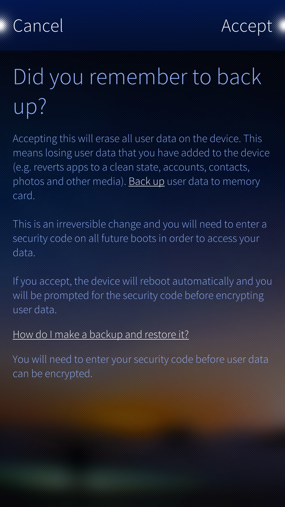
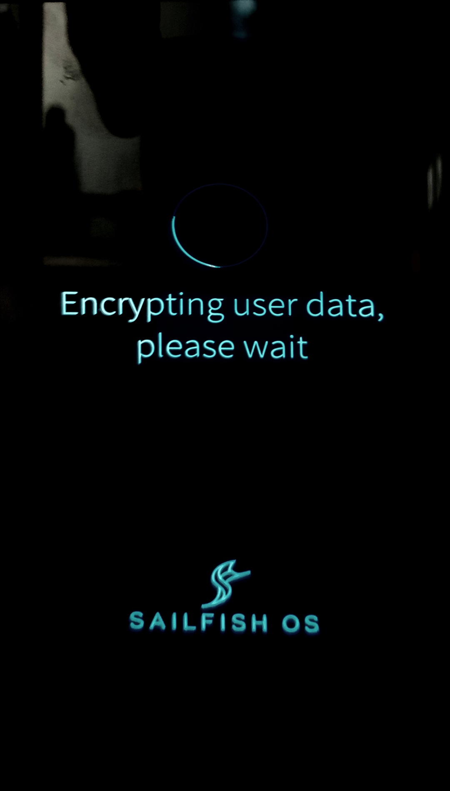

# Introduction to encryption in Sailfish OS

This article describes how encryption [^1] works on Sailfish OS releases.

* Sailfish encryption is based on **LUKS** [^2] [^3]. LUKS is the standard for Linux hard disk encryption. By providing a standard on-disk format, it not only facilitates compatibility among distributions but also provides secure management of multiple user passwords [^3].
* The data is encrypted with the 256-bit AES encryption algorithm.
* Sailfish encryption (and this help article) cover the data in the **home directory** (i.e.,```/home``` ). It contains all user data.
* The encryption service is present in every Sailfish OS device by default. It works in the background even when not explicitly activated.
* Encryption of user data is available on all Xperia devices from Sailfish OS version 3.3.0 onwards.
* Encrypting a device (that is done once) typically takes 10-15 minutes. During this phase, there is a spinner and the text "Encrypting user data, please wait" in the display.

NOTE: _Encryption of memory cards (SD cards) is a separate feature. It is explained in **[this article](https://jolla.zendesk.com/hc/en-us/articles/201997993)**_.


## Security code

The security code of Sailfish OS is used both for unlocking the **[Device lock](https://jolla.zendesk.com/hc/en-us/articles/201440487)** and for unlocking the encryption of user data.

The security code can contain numeric characters {0, 1, 2, 3,... 9} only (on Sailfish OS 4.4.0 and earlier releases). The minimum length of the code is 5 digits but we recommend a considerably longer code. The maximum is 42. An alphanumeric security code is coming up.


# Encryption - an extension to the Device lock

Encryption of user data in Sailfish OS is to some extent bundled with the **[Device lock](https://jolla.zendesk.com/hc/en-us/articles/201440487)** and Security code of Sailfish OS. One could think of encryption as an extension of the Device lock.

The user data is in an encrypted state when the device is off. It remains encrypted until the correct Security code is entered when starting up the device. The acceptance of the Security code unlocks the data for use. The unencrypted data is then available for the apps as long as the device is up and running.

Even if encryption had not been activated, it works in the background using some default arrangements.

If you want to learn more about how encryption works, please get familiar with **LUKS** [^2] [^3].


# How to enable encryption


## It is automatic when flashing

If you install (by flashing) any recent Sailfish OS release (3.4.0 or later) on your phone, it will get encryption automatically. You will need to set up the Security code as the first step of the initial startup - and you cannot skip this step. Encryption is in effect.

The intention of encryption is to keep the data in the phone safe. Encryption does not slow down the operation of the device or cause other harm. Therefore, there is no way to disable it.


## Activation from Settings

If you have installed an OS version older than 3.4.0 to your phone and kept updating the OS over the air since then, it may be that encryption is not yet fully activated.

If the menu page "Settings > System > Encryption" has the view of Pic 1 below, including "Encryption Enabled", then encryption is activated on your phone. However, if the view of Pic 2 appears, then it is time to enable encryption.

<div class="flex-images" markdown="1">

* <a href="Encr-menu-when-enabled.png"></a>
  <span class="md_figcaption">
    Pic 1: Encryption active
  </span>
* <a href="Encr-menu-when-not-enabled.png"></a>
  <span class="md_figcaption">
    Pic 2: Encryption not yet active
  </span>
</div>

Please do as follows:

1.  Open Settings > System > Encryption.
2.  Read the disclaimer. If ok, tap Encrypt.
3.  Read the instructions carefully (Pic 3). If you have not copied the data in the device to external storage (memory card, computer, cloud service), stop here, and back it up now. Once done, start this process again from step #1.
4.  Tap Accept at the top right corner.
5.  Enter your existing Security code or create one now. It is crucial to make the code long.
6.  Next, the initial startup ("startup wizard") starts with "Encrypting user data, please wait"
    This step will take 10-15 minutes, typically, to complete (Pic 4).
7.  Further steps of the initial startup are traversed.

**NOTE:**  _Please make sure that you **memorise the Security code**. An encrypted and device-locked Sailfish phone cannot be unlocked without the correct Security code - the only remaining option would be to reflash the device (i.e., install Sailfish OS again on it), which deletes all data, applications, and accounts._

<div class="flex-images" markdown="1">

* <a href="Encr-reminder-on-backup.png"></a>
  <span class="md_figcaption">
    Pic 3: Save your data before encryption
  </span>
* <a href="Encrypting.png"></a>
  <span class="md_figcaption">
    Pic 4: Encryption is ongoing
  </span>
</div>


# Boot-up order of an encrypted phone

A Sailfish phone with encrypted user data traverses the following steps while booting up.

## Case A: SIM/PIN query/queries are enabled

If the phone has one or two SIM cards inserted and the SIM/PIN query of at least one card has been turned on in "Settings > PIN code", then the phone starts up via the following steps:

1.  A bootloader reminder appears
2.  The Sony logo appears
3.  The Sailfish OS logo appears
4.  Security code dialogue for unlocking the encryption appears. The code must be typed - fingerprint recognition is not possible.
    NOTE: _if you do not pass this step the phone will turn itself off after 300 seconds (5 minutes)._
5.  Another security code dialogue appears. This is to unlock the touch screen (device lock). Fingerprint recognition cannot be used from Sailfish OS release 3.4.0 onwards.
6.  SIM/PIN code dialog(s) appear.
7.  The device completes the boot-up to the Home screen and is ready to be used, i.e. the touch screen can be used.

## Case B: SIM/PIN query/queries are disabled or no card inserted

If the phone has no SIM cards inserted or if the SIM/PIN query of all inserted cards has been turned off in "Settings > PIN code", then the phone starts up via the following steps:

1.  A bootloader reminder appears
2.  The Sony logo appears
3.  The Sailfish OS logo appears
4.  Security code dialogue for unlocking the encryption appears. The code must be typed - fingerprint recognition is not possible
    NOTE: _if you do not pass this step the phone will turn itself off after 300 seconds (5 minutes)._
5.  The device completes the boot-up to the Lock screen. The 2nd security code dialogue (for the device lock) appears only when you try to use the phone. Fingerprint recognition cannot be used.


# Further reading

[^1]: [Encryption is the process of encoding a message or information in such a way that only authorised parties can access it, and those who are not authorised, cannot](https://en.wikipedia.org/wiki/Encryption)

[^2]: [Linux Unified Key Setup (LUKS)](https://en.wikipedia.org/wiki/Linux_Unified_Key_Setup)

[^3]: [LUKS: Disk Encryption (Guardian)](https://guardianproject.info/fi/archive/luks/)


