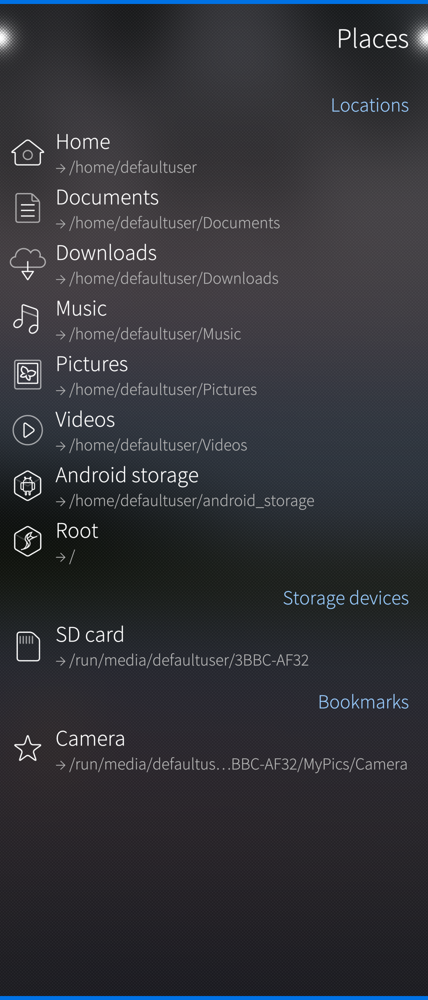
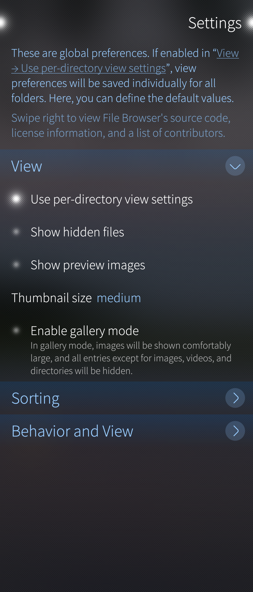
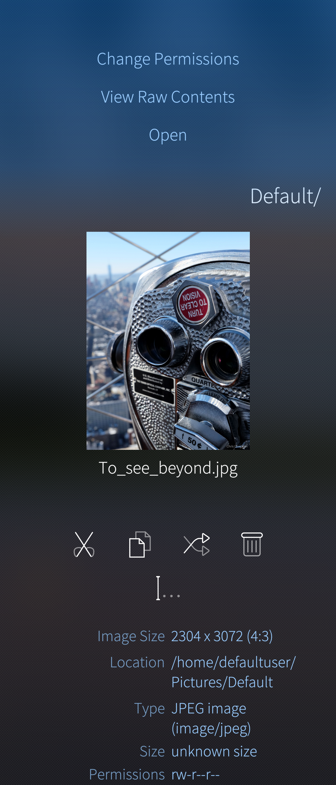

* 
  
  

File Browser application, available in Jolla Store, helps you to investigate the contents of the memory and to move files and folders around. This app is especially useful in case of moving data between the device's "Mass storage" and a [memory cards](/Support/Help_Articles/SD_Card_Format_and_Encryption/).

# Introduction
The permanent memory of a Sailfish OS device, or storage space, that is available for the user, is called "Home" in FileBrowser. It appears as "Mass storage" under Sailfish device on computers. In Linux notation, the Mass storage is located in folder $HOME.

After launching File Browser it presents the contents of the Home directory, or actually the contents of the storage area of the default user "Defaultuser" inside Home. From this folder, it is possible to move anywhere in the whole file system. Tap a folder name to see inside it. Flick right to move upwards in the folder hierarchy. 

From this initial view it is possible to move to Places -view with right flick, from this view it is possible to view the memory card which appears as "SD Card" under the Sailfish device on Windows computers. In Linux notation, the memory card resides in folder `/run/media/<uuid>`, where `<uuid>` is a unique card-specific identification code, in folder `/run/media/<name>`, where `<name>` is a nickname given for the card when formatting it. You can see the code or the nickname of your card by tapping the "SD Card".

From this "Places" view of File Browser settings tab can be opened by flicking right.

* 
  
  
* 
  
  
  Screen captures from File Browser main view and Settings.

# Copying files and folders
File Browser is a typical app of its kind: to create and delete folders, copy/cut/paste files, rename, view detailed information of the files, change permissions and open files.

File browser supports the selection of multiple files/folders, too. This is done by tapping the icons in front of the file/folder names. 
A toolbar appears with long press. It has the following tools:

* Cut
* Copy
* Delete
* Rename
* Show details

* 
  
  
* 
  
  
  Screen captures from File Browser tools view and file details.

## Example of copying files from Home to SD card
1. Select files to copy (you could also select folders).

2. Tap Copy icon at the toolbar.

3. Navigate to the location you want to paste the selected files.

We recommend keeping at least 2-3 GB of free space in Home. This may require that you cut and paste files (video clips, in particular) from Home to the memory card every now and then, in the same way as in this example. Easiest way to monitor the status is from Settings -> Storage, you can read how to free storage from this [article](https://jolla.zendesk.com/hc/en-us/articles/206354737-Freeing-up-storage-space-on-your-device).

