# Home view

The Sailfish Gallery app contains a collection of photos and videos residing on the phone, in the memory card (if inserted into the device), and even in the cloud and social network services configured to your Sailfish device. Sailfish OS runs a background service [^1] that looks for new photos and videos, keeping the collection up to date.

The Gallery makes it possible to easily view, edit, share and delete the artwork you have on your phone. The items remain where they are - Gallery just shows a projection of them.

* <a href="Gallery_home_view.png" class="narrow-image">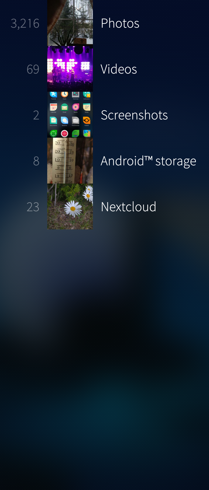</a>
  
    Pic 1: Gallery home view showing folders
  

The picture above shows the home view of the Gallery with the folders. The last one of them has the pictures uploaded to the cloud service Nextcloud and the one above it shows pictures in the Android storage area of the phone. [Screenshots](/Support/Help_Articles/Tips_and_Tricks/#taking-screenshots-screen-captures) are shown from the folder Pictures \> Screenshots.

# Viewing photos and videos

The local photos and videos are shown as a thumbnail matrix in each folder. Cloud services and the like may have a different approach (a list, for instance).

* <a href="Gallery_photos_as_thumbnails.png">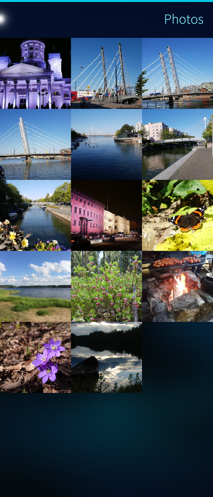</a>
  
    Pic 2: Thumbnails of photos
  
* <a href="Gallery_videos_as_thumbnails.png">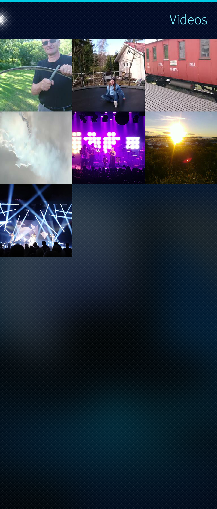</a>
  
    Pic 3: Thumbnails of videos
  

Tap a thumbnail to view the corresponding full-screen photo. Note the toolbars at the top and bottom.

* 
  
    Pic 4: Picture in portrait position
  

Turn the phone and the photo to landscape position:

* <a href="Gallery_landscape_orientation.png">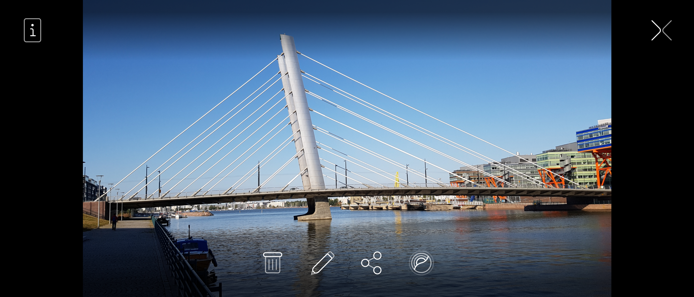</a>
  
     Pic 5: Picture in landscape position
  

Tap the photo to toggle the toolbars on and off.

Swipe the photo sideways to get to the next or previous photo (either in landscape or portrait mode). Swipe vertically to get back to the thumbnail matrix.

# Editing photos

Open one photo. Tap the pen button in the toolbar below the image. The edit mode gets active. The editing toolbar appears at the bottom. It has the following tools:

* rotate clockwise
* rotate counter-clockwise
* adjust brightness and contrast
* crop

* <a href="Gallery_cat_photo_original.png">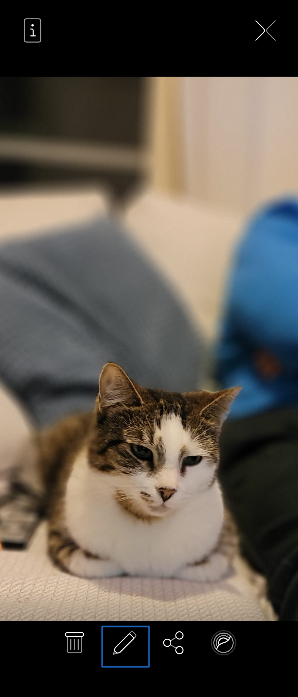</a>
  
    Pic 6: A photo to be edited
  
* <a href="Gallery_edit_mode.png">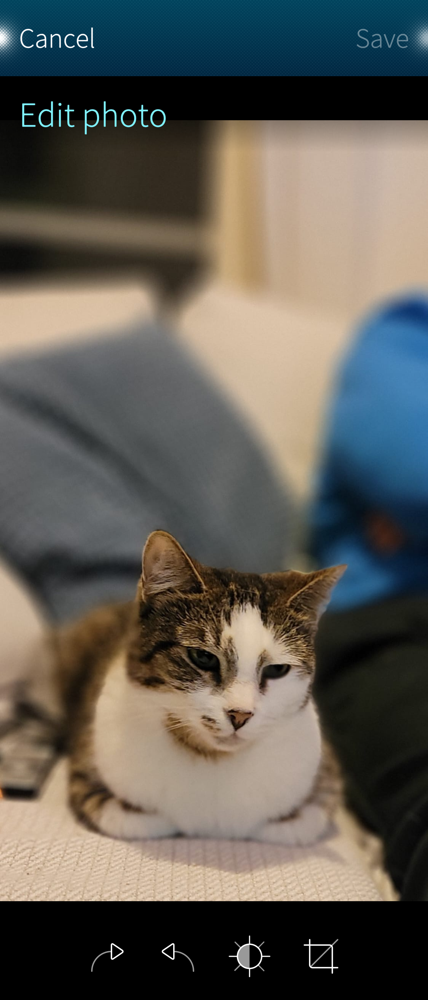</a>
  
    Pic 7: Edit mode activated
  

Note also the right-most tool at the toolbar of the original photo. It is the ambience tool that allows you to create a new ambience (background image and uniform colour pattern for the menus). Read more about **[Ambiences](/Support/Help_Articles/Ambiences/)**.

In the example below, we use the crop tool.  The first step is to select the aspect ratio. Then, move the object to the desired position. Use the "Save" button at the top right corner.

* <a href="Gallery_select_aspect_ratio.png">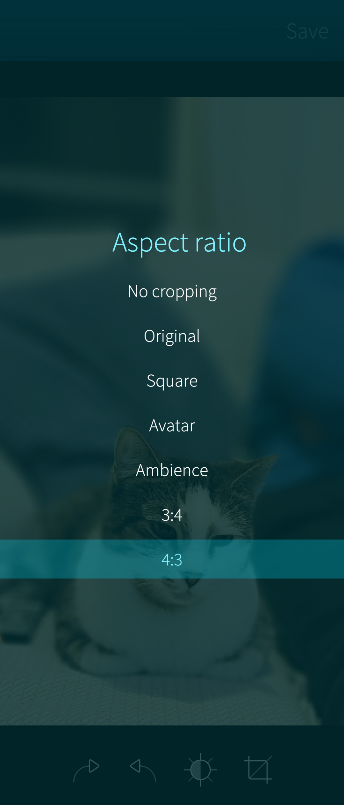</a>
  
    Pic 8: Selecting aspect ratio
  
* <a href="Gallery_setting_object_to_aspect_box.png">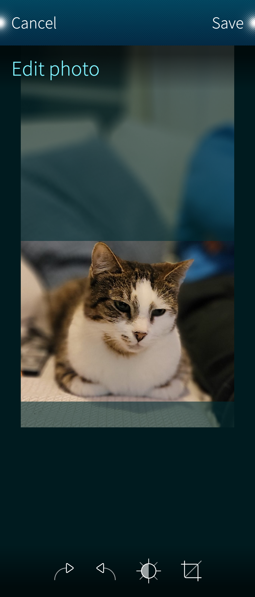</a>
  
    Pic 9: Fitting the photo into the crop area
  

The edited photo appears below as a single photo and as a new item in the thumbnail matrix, next to the original one.

* 
  
    Pic 10: Editing completed
  
* <a href="Gallery_photos_with_edited_cat_photo.png">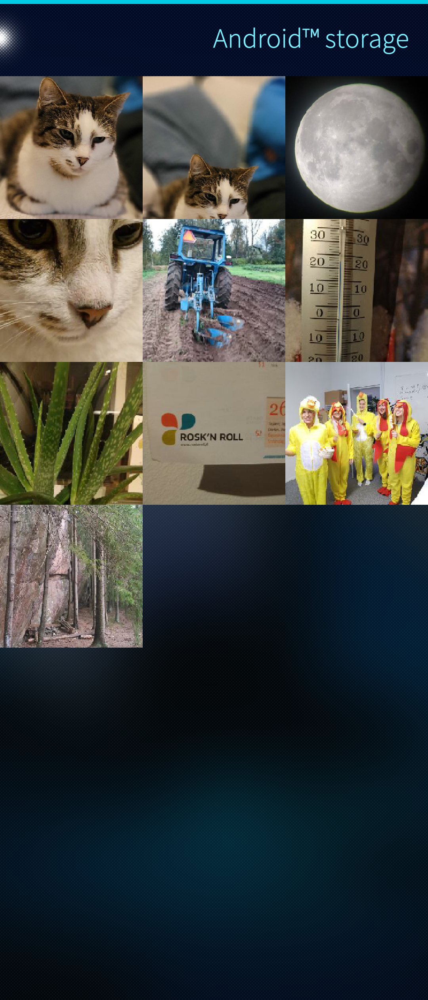</a>
  
    Pic 11: Edited and original photos in matrix
  

There is no video editor on Sailfish OS (release 4.4.0).

# Sharing

It is possible to share only one photo or video at a time. This can be done when viewing one single photo or video. There "Share" button is located in the toolbar below the photo or video. It is indicated with a blue rectangle in the pictures below.

On videos, the toolbar must first be made visible with the arrowhead button (in a green rectangle).

* <a href="Gallery_photo_toolbar.png">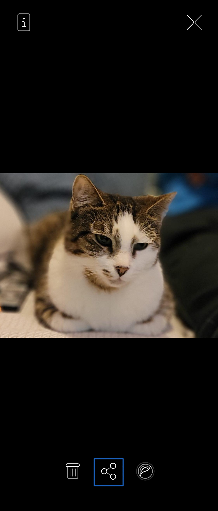</a>
  
    Pic 12: Photo toolbar
  
* <a href="Gallery_video_toolbar.png">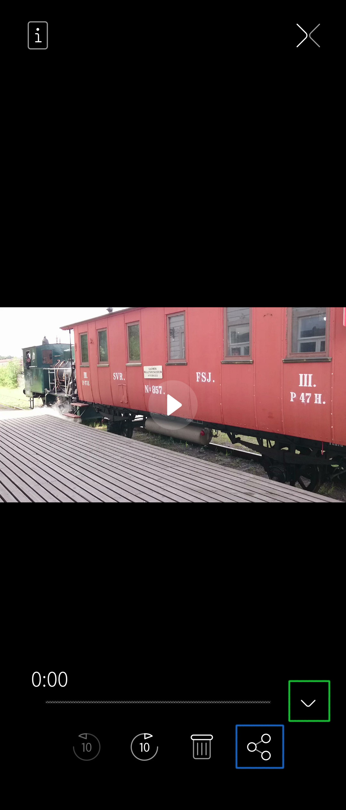</a>
  
    Pic 13: Video toolbar
  

There are multiple ways to share a photo depending on what apps are available on the phone.

* <a href="Gallery_ways_to_share.png" class="narrow-image">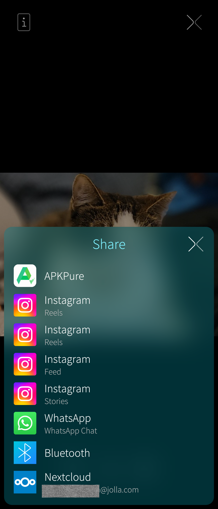</a>
  
    Pic 14: Options for sharing
  

# Deleting

Working on the photo (or video) thumbnail matrix, log-tap a photo (or video). Then select "Delete".

The remorse timer with the word "Undo" appears for about 5 seconds. You have a short while to cancel the deletion by tapping "Undo".
Note that there is no trash. What is deleted is deleted for good.

* <a href="Gallery_deleting_one_photo.png">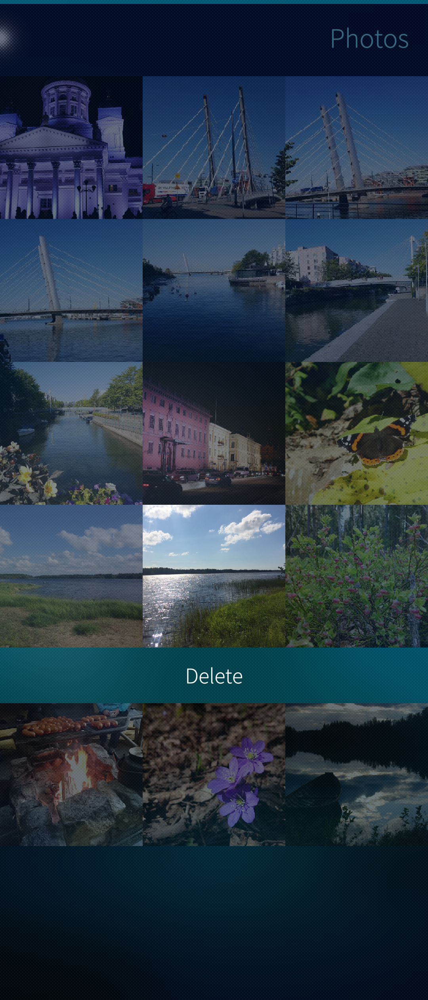</a>
  
    Pic 15: Deleting a photo
  
* <a href="Gallery_remorse_timer_running.png">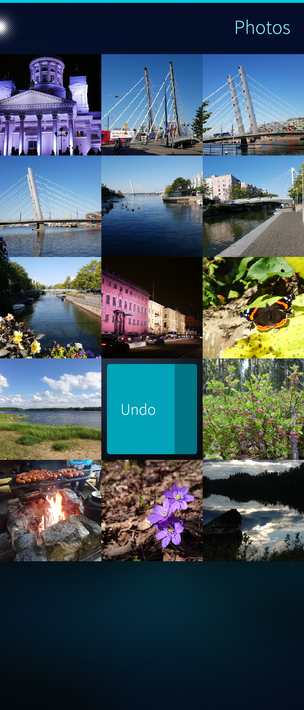</a>
  
    Pic 16: Remorse timer
  

One can select multiple items one by one (by tapping them), or by using "Select all" in the pulley menu during the selection mode. It is possible to cancel the selection by taking "Clear all" (i.e., clear all selections - the photos remain).

The selected items are deleted with the delete button at the bottom of the screen. The remorse timer will appear at the top of the display for 5 seconds. Tap it to undo the delete.

* <a href="Gallery_4_photos_selected_and_delete_button.png">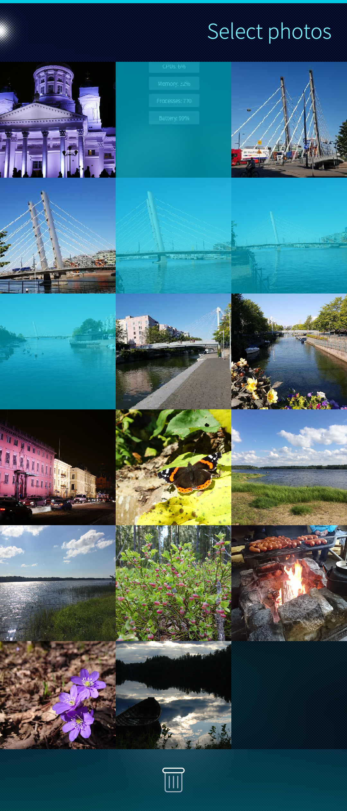</a>
  
    Pic 17: Four photos selected
  
* <a href="Gallery_select_all_or_clear_all.png">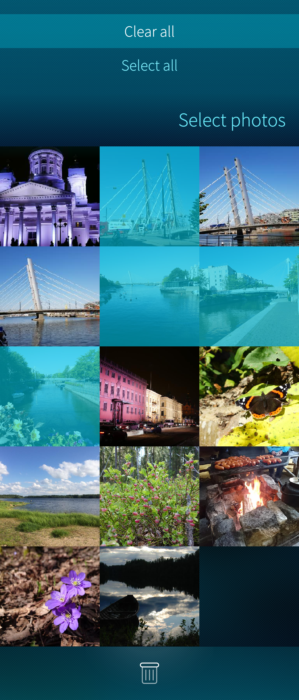</a>
  
    Pic 18: Select photos pulley
  

------

[^1]: Tracker
