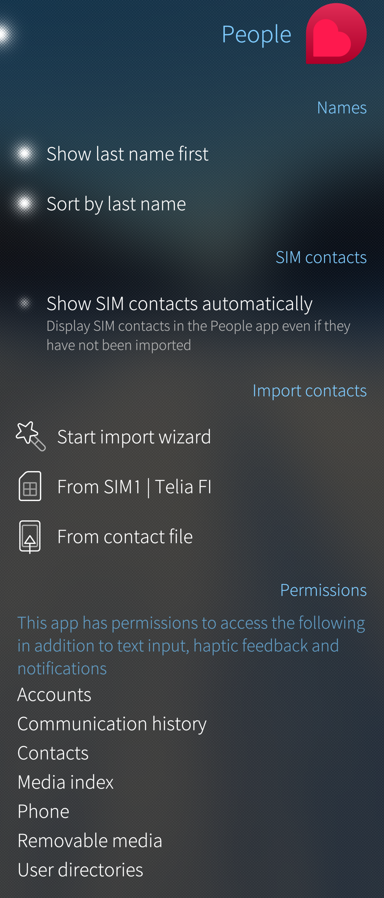
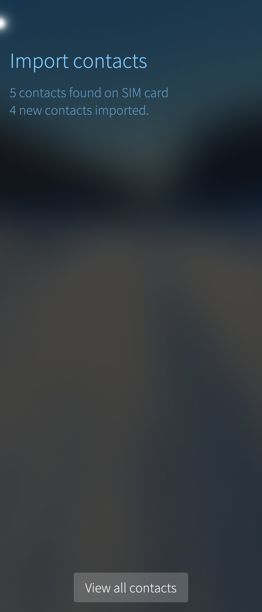
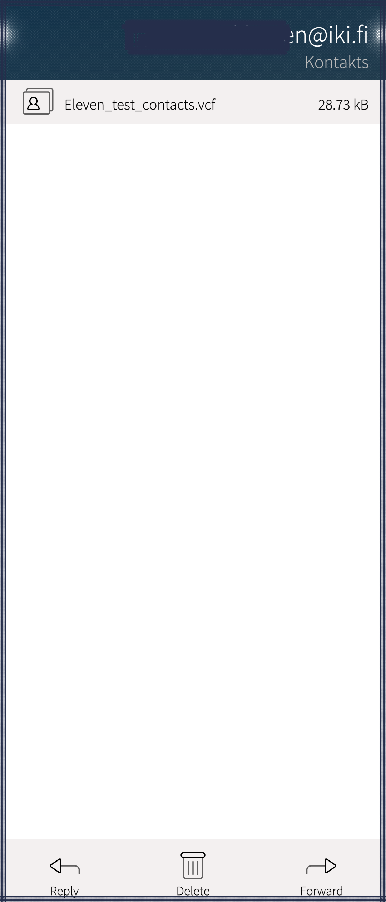
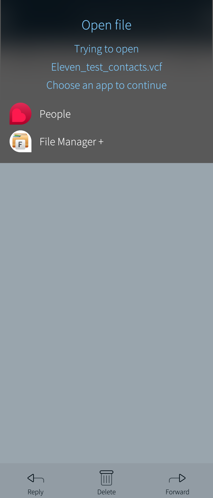
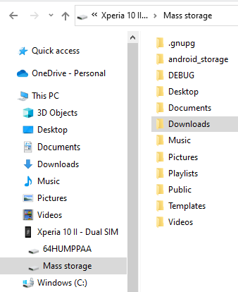
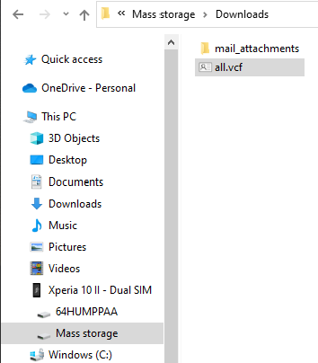
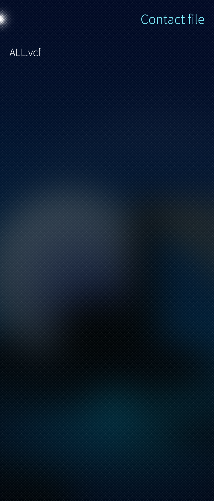
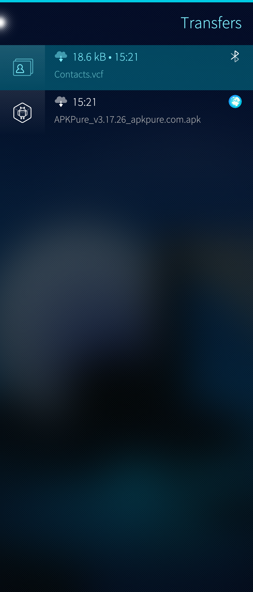

_There are several ways to transfer contacts to the People app of your Sailfish OS phone. In this document, we aim to detail the most common methods._

# Sailfish has an automatic import utility

On Sailfish phones, you can see the options for importing contacts on the menu page "Settings > Apps > People" in the section "Import contacts" (see Pic 1 below). The import utility is based on using standardized **[vCard files](https://en.wikipedia.org/wiki/VCard)** (also known as "VCF files" or *.vcf). The standard structure of those files makes it possible to process the contact data in the correct way and save them to the Sailfish contacts database.

Please note that the VCF files to be imported must be saved on the phone to one of the following directories or else the People app would not detect them: 
* Downloads
* Documents
* Desktop

Therefore, do not save the files in Home (which appears as "Mass storage" on a computer after connecting the phone in the media transfer mode).

VCF files can also be imported from all directories on a memory card. Read the details in chapter **[Importing from micro-SD card](#importing-from-micro-sd-card)**.

* 
  
    Pic 1: Menu page Settings > Apps > People
  

After the import is complete, the People app is automatically started. The view of Pic 2 (below) appears. Tap "View all contacts" button at the bottom to see the result.

* 
  
    Pic 2: Contacts imported to People app
  

# Importing from SIM card

The People app has the option to show the contacts residing in the SIM card without importing them. This option is called "Show SIM contacts automatically" (see Pic 1 above). The contacts in the SIM card appear in the People app in the same way as contacts kept in the phone memory.

If you want to copy the contacts from the SIM card to the phone memory (for instance, when you are about to change SIM cards), it can be done in the following way:

1)  Insert the SIM card containing your contacts into your Sailfish phone.

2)  Turn the phone on and enter the SIM/PIN code if requested.

3)  Go to "Settings > Apps > People"  (_shown in Pic 1 above_)

4)  Tap on “From SIM1 \| \<operator\>” under _Import contacts_.
    NOTE:  on dual SIM phones, you may see two items: "From SIM1\|\<operator\>" and "From SIM2\|\<operator\>"
    
5)  Transfer starts and completes in a few seconds.

6)  Confirmation of importing the contacts successfully from the file appears.

7)  Tap on “View all contacts” to launch the People app and to view your contacts.

_Note 1: These contacts are called local contacts as they will not be synchronised to any servers. They can be edited on the phone but they remain local. They are included in backups._

_Note 2: Sailfish OS does not support writing to the SIM card._

# Importing from micro-SD card

1)  Transfer the VCF file containing your contacts onto your SD card. Feel free to place the file in any folder on the card.

2)  Make sure the SD card is inserted in your Sailfish phone and turn the phone on.

3)  Go to "Settings > Apps > People"

4)  Tap on “From contact file” under _Import contacts_.

5)  Tap the VCF file in question. Transfer starts and completes in a few seconds.

6)  Confirmation of successfully importing the contacts from the file appears.

7)  Tap on “View all contacts” to launch the People app and to view your contacts.

_Note: These contacts are called local contacts as they will not be synchronised to any servers. They can be edited on the phone but they remain local. They are included in backups._

# Synchronizing from web services

If you have accounts for such web services that can manage contact information (e.g. Google, Exchange, Nextcloud), it is possible to synchronize (download) the contacts from those services into your phone. The reason for this may be that you have got a new phone, for instance.

Sign in to your account(s) in "Settings > Accounts". As soon as you have done this and if your account settings allow, the contacts will be automatically downloaded to your phone.

Below there are detailed descriptions of setting up some accounts.

## Synchronizing from Google

1)  Make sure you have a working Internet connection.

2)  Add your Google account to your Sailfish OS device in "Settings > Account > Add account".

3)  Tap on Google and proceed as requested.

4)  Under "Contacts > Sync", select "Two-way" if you want a complete synchronisation of your contacts between the phone and the server (so, the changes to the contacts made on the phone will be uploaded to the server). If you only want to download the contacts to the phone, select "To device only".

5)  In the final view, you will be asked to choose the services you want, including details related to the synchronisation frequency (a shared schedule for emails, calendar and contacts).

6)  If you have enabled the 2- step authentication it will be carried out in this phase.

7)  Save changes by tapping "Accept" at the top right corner.

Contacts and other selected items will be copied from Google to the phone immediately, provided that the Internet connection works.

_Related article: [Setting up a Google Account](/Support/Help_Articles/Accounts_Setup/Setup_Google_Account/)_

## Synchronizing from MS Exchange

1)  Make sure you have a working Internet connection.

2)  To add your Microsoft Exchange account to the Sailfish OS device go to "Settings > Accounts > Add account".

3)  Tap on Microsoft 365, and proceed as requested.

4)  Under "Contacts > Sync", select "Two-way" if you want a complete synchronisation of your contacts between the phone and the server (so, the changes to the contacts made on the phone will be uploaded to the server). If you only want to download the contacts to the phone, select "To device only".

5)  In the final view, you will be asked to choose the services you want, including details related to the synchronisation frequency (a shared schedule for emails, calendar and contacts).

6)  Save changes by tapping "Accept" at the top right corner.

7)  Contacts will be copied from Exchange to the phone starting immediately, provided that the Internet connection works.

8)  The next time, contacts are synchronised to the phone according to the email synchronization schedule (see the settings of the Exchange account).

9)  To force a sync, go to "Settings > Accounts > Exchange" and select "Sync" from the pulley menu above.

_Related article: [How do I set up an Exchange account on my Sailfish OS device?](/Support/Help_Articles/Accounts_Setup/Setup_Exchange_Account/)_

# Sending a contacts file over email

1)  Make sure you have a working email account and app on the Other phone (other than your phone).

2)  Open the phonebook of the Other phone.

3)  Select all contacts or the contacts you want to send (move). How to do this in practice may vary. Consult the manual of the Other phone.
    _NOTE: If also the Other phone happens to be a Sailfish phone, then the following applies:_
   * open the People app
   * pull down "Select contacts"
   * tap all contacts you want to select (so that their background colour gets brighter), or pull down n "Select all"
    
4)  On the Other phone, use the _share_ utility to send the contacts. Select the email to be used as the transport tool. This should make a new email message open up, having the selected contacts attached as one VCF file. This method works on Sailfish OS and on Android.

5)  Send the email message to your email account enabled on the Sailfish phone (the target phone).

6)  On your Sailfish phone, receive and open the mail message using your email app.

* 
  
    Pic 3: Email message has VCF as attachment
  
* 
  
    Pic 4: Open VCF into People app
  

7)  Tap the attached vCard (.vcf) file in the message to download it (Pic 3).

8)  Tap "People" on the "Open file" dialogue (Pic 4). This will make the People app import the contacts file.

9)  Confirmation of successfully importing the contacts from the file appears.

10) Tap on “View all contacts” to launch the People application and to view your contacts.

_Note: These contacts are called local contacts as they will not be synchronised to any servers. They can be edited on the phone but they remain local. They are included in backups._

# Importing from another phone

## Over USB

1)  Using the utilities in the other phone (which may vary), export your contacts to a memory card (or to phone memory). Usually, this utility can be found in the Phonebook. We assume here that they are exported to one vCard (.vcf) file containing all contacts. Let's give the name "All.vcf" to this file.

2)  Connect the other phone to a PC with a USB cable.

3)  Locate the directory having the contact file on the other phone.

4)  Copy the contact file "All.vcf" to the PC. 

5)  Disconnect the other phone from the PC.

6)  At this point, you have all of your contacts packed into one file on your PC, "**ALL.vcf**".

7)  Connect your Sailfish phone (the target phone) to the PC with a USB cable – select the item "Media transfer (MTP)” in the USB dialogue. Now your phone should appear by its name (e.g. "Xperia 10 II") on the File Manager of the PC.

8) Click _Mass storage_ on the left under the phone.  Observe that it contains the _Downloads_ folder (and many more) which appear on the right (Pic 5). Click _Downloads.

* 
  
    Pic 5: PC file manager: Downloads folder on a phone
  

9) Using the File Manager on the PC, copy the **ALL.vcf** file to the **_Downloads_** folder on the phone.

* 
  
    Pic 6: All.vcf copied into Downloads folder
  

10) Disconnect the Sailfish phone from the PC once the PC has completed copying the file.

11) On the phone, go to "Settings > Apps > People".

12) Tap “_From contact file_” under _Import contacts_.

13) Tap "ALL.vcf" (Pic 7).  The phone imports the transferred file to phonebook People in a moment.

* 
  
    Pic 7: All.vcf file found on the phone
  
* 
  
    Pic 8: Contacts imported to People app
  

14) Confirmation of importing the contacts successfully from the file appears (Pic 8).

15) Tap on “View all contacts” to launch the People app and to view your contacts.

_Note: These contacts are called local contacts as they will not be synchronised to any servers. They can be edited on the phone but they remain local. They are included in backups._

## Over Bluetooth

1)  Do Bluetooth pairing between the Other phone and your Sailfish phone.

2)  Open the phonebook of the Other phone.

3)  Select all contacts or the contacts you want to move. How to do this in practice may vary. Consult the manual of the Other phone.

NOTE: If also the Other phone happens to be a Sailfish phone, then the following applies:
   * open People app
   * pull down "Select contacts"
   * tap all contacts you want to select (so that their background colour gets brighter) or pull the option "Select all" down.
    
4)  Make the Other phone send the selected contact(s) over the Bluetooth connection to your Sailfish phone. How to do this in practice may vary but probably you should use the sharing utility. Consult the manual of the Other phone. Moving a lot of contacts works only if the Other phone is able to concatenate all contacts to one vCard (VCF) file.

NOTE: If also the Other phone happens to be a Sailfish phone, it concatenates the contacts to one file automatically. Sailfish creates the file, let's assume it is _Contacts.vcf_. 

Then, the following applies:
   * tap the Share button at the bottom of the display which makes the Share dialogue appear
   * tap Bluetooth on the dialogue (if there is no Bluetooth, go back to step #1 above)
   * tap the name of your Sailfish phone (to which you want to send the contacts) -- this makes the transmission start.
    
5)  On your Sailfish phone (the target phone), go to "Settings > System > Transfers". File _Contacts.vcf_ appears at the top of the list (Pic 9). The actual location of the file is in the Documents folder but that is not relevant here.

* 
  
    Pic 9: Transfers page has Contacts.vcf
  

6)  Tap _Contacts.vcf_.  Your phone will import the contacts now from the file to the People app.

7)  Confirmation of successfully importing the contacts from the file appears.

8)  Tap on “View all contacts” to launch the People app and to view your contacts.

# Extracting contacts from a backup file

Sailfish OS can be made to save the **[Backup](/Support/Help_Articles/Backup_and_Restore/)** file on an SD card inserted in the phone. Although the intention is to restore the backup data from the SD card by using the Restore operation, this might sometimes fail for various reasons.

In such a case, it may be necessary to extract the contacts from the backup file to a VCF file which can then be imported to the People of a Sailfish phone.  **[This support article](/Support/Help_Articles/Backup_Extraction/)** explains how this can be done.

