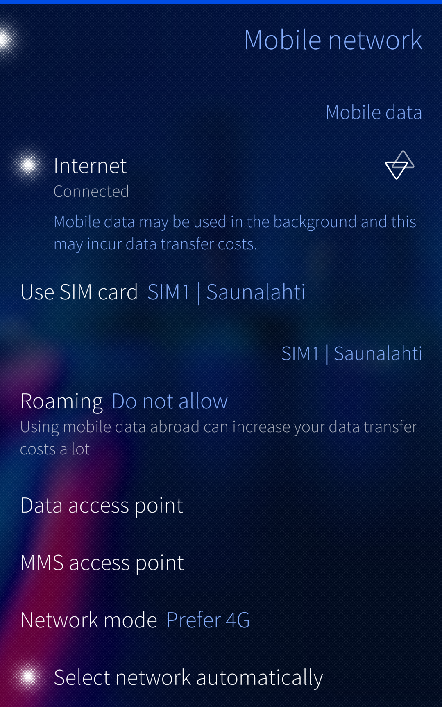
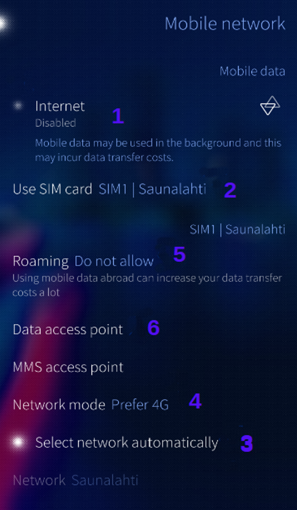
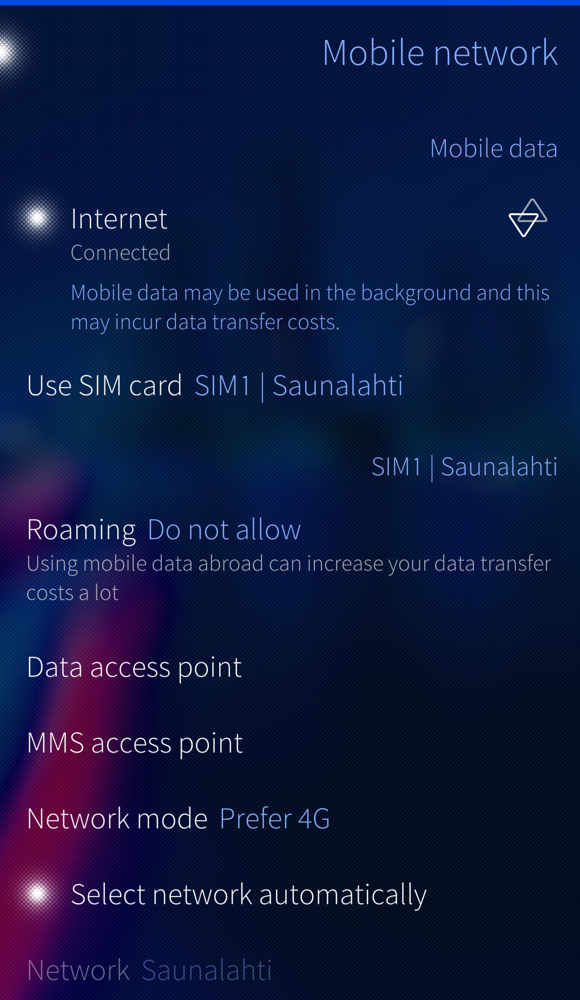
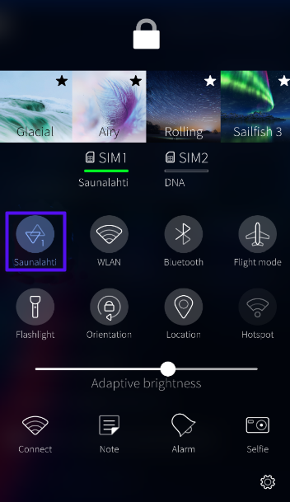
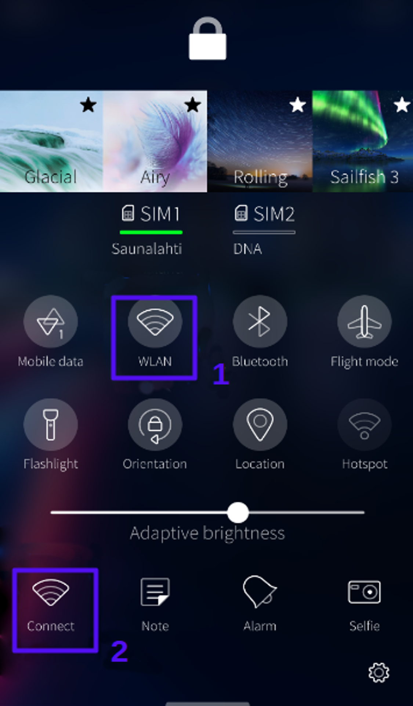
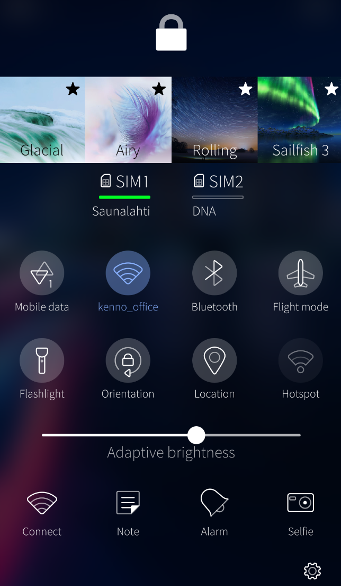

  
# General information about establishing an internet connection

Our goal has been to make it easy and automated to set up and use Internet connections with Sailfish OS. This document describes the main features.

  
  
## About Internet connections

Sailfish devices can handle one Internet connection at a time. The connection can be established via a WLAN (WiFi) network or via a mobile network. For the latter, there may be one or two options, depending on the number of SIM cards inserted and enabled.

Sailfish devices prefer WLAN to mobile networks by default.  If a suitable and known WLAN network (used previously by your phone) is available, Sailfish will create a connection via it automatically, as soon as the network is observed to be in the range (this is a distance of up to 20 meters typically) and measured to have a strong enough signal level.

If there are no WLAN networks in the range, or if they have not been previously used by this particular device, then your Sailfish device will create the Internet connection via a mobile network - given that you have a contract for data transfer with the relevant operator (carrier) and that you are in the range (i.e., the signal level is good enough).

The smooth switchover from WLAN to a mobile network and vice versa naturally requires that both of those network types are enabled on your device.

It is possible to affect the behaviour of your phone by configuring the Internet connections to your liking. Read more on this in chapter [Configuring Internet connections in Settings](#configuring-internet-connections-in-settings) below.

  
  
## Single-SIM and dual-SIM phones

Many recent phone models have two slots for SIM cards, making it possible to use one's private SIM in one slot and the work-related SIM in the other slot, for instance. These phones are often called "dual-SIM phones". How does this affect Internet connections, then, and in particular, in the case of Sailfish OS?

While single-SIM phones support Internet connections over WLAN (WiFi) and mobile data (with the only SIM card), dual-SIM phones have the WLAN and two mobile data connections available - but only one at a time. Therefore the user must choose what to use.

Dual-SIM phones have the extra menu item "Settings > System > SIM cards" (see Pic 1 below). In this item, you must choose if you use SIM1, SIM2 or both. See the picture below where both cards have been enabled, making their mobile data and voice call services available.

The upper part of this menu page concerns all services, including mobile data. Hence, the upper part works as the main switch of all cellular services.

The item "Use SIM card" in the lower part, under "Call and messages", only affects voice calls and text messages. This item dictates which of the SIM cards is used for outgoing calls (incoming calls can arrive to both SIMs).

There is a corresponding selection ("Use SIM card") for mobile data in the menu item "Settings > System > Mobile network" (Pic 2). That item dictates which of the two mobile connections is to be used for data transfer.

* 
  
    Pic 1: Menu item SIM cards
  
* 
  
    Pic 2: SIM card used for mobile data
  

  
# Configuring Internet connections in Settings 
 
  
## Mobile data settings

This chapter presents the most needed options for mobile data connections.

Go to the menu page "Settings > System > Mobile network". The numbers in Pic 3 below correspond to the steps below:

1.  At the top of the screen, there is a switch for mobile data. Tap it to turn mobile data on. This gives your Sailfish device permission to use mobile data when needed. Tap it again to turn it off (when you want to avoid using mobile data).
2.  Item "**Use SIM card"** appears on dual-SIM phones. The phones with one SIM card slot only do not have it. Here you can select which of the two SIM cards (if you have two and if both of them are enabled) you want to use for Internet connections via mobile data.
3.  We recommend keeping "**Select network automatically"** turned on. If you tap it off then the phone will run a search for available networks. This would be necessary abroad only as in the home country one cannot usually choose and use any other network but that dictated by the SIM card.
4.  Select the "**Network mode"** matching your deal with your operator/carrier and for your needs. We recommend using "Prefer 4G" but sometimes one could consider taking "Prefer 3G" or "2G only". For instance, selecting 2G would make the battery last longer, however, the data transfer would be considerably slower then. Note that even with "Prefer 4G", the device will automatically switch to 3G or 2G networks for voice calls, returning to 4G after the call has ended - unless the phone has Voice over LTE (VoLTE) enabled (_this is possible from Sailfish OS 4.4.0 onwards on some phone models_).
5.  The selection at **Roaming** does not usually matter while in the home country. While abroad, you should allow roaming if you want to use mobile data there (note: some costs will incur).
6.  Although Sailfish OS is supposed to automatically get and set the appropriate settings for your connections, it is also possible to manually adjust them at the **"Data access point"**. Please consult your mobile operator/carrier about the correct settings. In particular, check what kind of IP connections are supported, i.e., if it is IPv4 or IPv6. If the operator still supports IPv4, we would recommend using that (instead of IPv6) as there may still be problems with IPv6 in some cases.

* 
  
    Pic 3: Options for mobile data
  

The 2nd picture below shows an active Internet connection arranged with mobile data. It is based on the service from operator "Saunalahti" (SIM1).

The corresponding information is given in the 3rd picture representing the Top Menu (_below, on the right_) \- see the item inside the blue circle. 

NOTE: _The item "SIM1 Saunalahti" with a green line indicates the SIM card selected for phone calls and SMS. It does not affect the mobile data service, i.e., even if the green line was at "SIM2 DNA" you could still use mobile data via "Saunalahti" as shown in the 1st and 2nd picture from the left.

* 
  
    Pic 4: Mobile data connected using Saunalahti SIM
  
* 
  
    Pic 5: Top Menu shows the status of mobile data
  

  
## WLAN settings

This chapter presents the way how WLAN (WiFi) connections can be set up.

* Go to the menu page "Settings > System > WLAN".
* At the top of the page, you will see a switch light in front of "WLAN". Tap it (if it is off) to turn the WLAN radio on.

At this point, the device shows a list of networks (SSID) under the heading "Saved networks" if WLAN connections have been used previously with this device. Sailfish OS connects automatically to the best (strongest signal) network among those saved networks, if available at your current location.

The symbols to the right of the network names indicate the availability and signal strength. It is possible to enable or disable individual networks by using the switch light in front of each network name. By long-tapping a name, a pop-up menu appears with the command **Forget**. With that command you can remove the network from this list.

In Pic 6 (below) WLAN is turned off. Therefore all saved networks are shown without any signal strength. In addition, network "Xp10-SFOF" has been disabled.

In Pic 7, WLAN is on and the device has connected to the network "JollaGuest", indicated by the blue ambience colour and the word "Connected" under it. The signal strength of this network (on the right) is excellent.

* 
  
    Pic 6: WLAN off. Saved networks shown
  
* 
  
    Pic 7: WLAN on. Connected to one of the saved networks
  

If you are not in one of your regular WLAN areas or you want to check the availability of other WLAN networks (in addition to those saved to your device) you can run a search. Pull down and select "Connect to Internet" (Pic 8).

* 
  
    Pic 8: Pulling down to start Internet search
  

After a few seconds, available WLAN networks will be shown in the bottom part of the view. Select one of them (that you are allowed to use) by tapping it. Consider a network with the strongest signal strength indicated by the icon in front of it. If a network has the lock icon to the right of it you will need to enter the password to gain the connection (Pic 9).

Your phone will soon have a connection to the WLAN network (Pic 10). It is saved to the device and appears under "Saved networks" now. Your phone will seek to automatically connect to these saved networks, later on, making Internet access easy for you.

* 
  
    Pic 9: Searching WLAN networks
  
* 
  
    Pic 10: Connected to a WLAN network
  

For experienced users, there is the option to modify the proxies and the IP address if needed. Long-tap the network name and select **Edit**.

  
  
# How to quickly adjust internet connections with Top Menu?
  
  
## Toggling mobile data

Use the mobile data icon (_at the top left of Pic 11) to toggle mobile data on and off. Sailfish OS will activate the mobile data service of the SIM card you have selected for this task in "Settings > System > Mobile network > Use SIM card". Pic 12 shows an Internet connection with mobile data using operator Saunalhati's service.

If you want to start using the service of the other SIM card, long-tap the mobile data icon, take "Go to settings" and select the other SIM card at "Use SIM card".

* 
  
    Pic 11: Top Menu: no connections
  
* 
  
    Pic 12: Top Menu: mobile data connected using Saunalahti service
  

  
## Toggling WLAN

Look at the WLAN icon (item  #1) in Pic 13 (below). It does not have any colour and there is no network name (SSID) under it (just "WLAN"). This implies that the WLAN service is off. By tapping this icon, Sailfish OS will connect to your saved WLAN network having the strongest signal currently.

If you want to search for alternative networks, use the Connect icon (#2 in Pic 13) to run the "Connect to Internet" procedure and tap "WLAN" in the dialogue. You can do the same in pulldown menu of "Settings > System > WLAN".

The icon in Pic 14 shows how WLAN has been turned on: the icon has the ambience colour (here: blue) and the network name (SSID) 'kenno_office' under it.

* 
  
    Pic 13: Top Menu: no connection (1). Make a connection (2)
  
* 
  
    Pic 14: Top Menu: connected to WLAN network kenno_office
  

  
  
## Can both mobile data and WLAN be switched on at the same time?

For many users, it is good to keep both "channels", mobile data and WLAN, activated. With this setup, your Sailfish device will try to connect to your saved WLAN networks first (those that you have used previously), if in range, and choose mobile data only if no familiar WLAN networks are available.

This scheme is based on the assumption that using WLAN is free (no cost) whereas mobile data may incur costs and/or have a data transfer limit. In this way, Sailfish OS can provide you with working Internet connections all the time, i.e. switch from WLAN to mobile data and from mobile data to WLAN seamlessly and automatically. The priority is in WLAN whereas mobile data is used when there is no familiar WLAN network available.

There are also countries where mobile operators (carriers) offer mobile data contracts with flat monthly rates and unlimited data transfer at 4G speeds. In such cases, it may be wise to turn WLAN off and let the Sailfish device use mobile data all the time.

Everybody should set the switches according to their personal needs and constraints.

  
  
# Using Internet connections abroad
  
  
## Mobile data - roaming

You will need to open "Settings > System > Mobile network" and allow **roaming** to be able to connect your mobile phone to the internet using the local mobile operator's network. This requires a contract between this local operator and your home operator (the one you got your SIM card from). It is good to check from your home operator (before your trip) which foreign operators they have contracts with.

Please allow several minutes (usually quicker than that) for finding the appropriate networks and getting registered to one of them. Connecting to a foreign network (roaming) does not normally require any actions from the user, other than choosing the network if there are several of them available - Sailfish OS takes automatically care of the necessary settings.

In general, using mobile data abroad may cost a lot. Ensure that you know the costs before you enable roaming on your Sailfish device. Follow your data transfer at "Settings > System > Data counters", too.

For EU-originated SIM cards transferring data by roaming does not cost much more anywhere inside the EU compared to your EU home country, and typically you will receive text messages telling you about the prices when you connect to the foreign network.

  
  
## Foreign WLAN networks

Connecting to the internet via WiFi works in the same way abroad. However, pay attention to the security aspect - the connection may not be fully protected. Make sure you use secure WPA2 connections. Also, some hotels may incur charges for using their WiFi, so it is best to check the rules and fees before making connections.

  
  
# Troubleshooting

We have some useful links for trouble situations below, as well as some generally good-to-know information:

* [Troubleshooting phone calls, SMS & mobile data issues](https://jolla.zendesk.com/hc/en-us/articles/202505018-Jolla-phone-Troubleshooting-phone-call-SMS-mobile-data-issues)
* [Troubleshooting a WLAN connection](/Support/Help_Articles/WLAN_Troubleshooting/)
* [Some tricks that may help in getting access to mobile data](/Support/Help_Articles/Resetting_oFono_Settings/)

