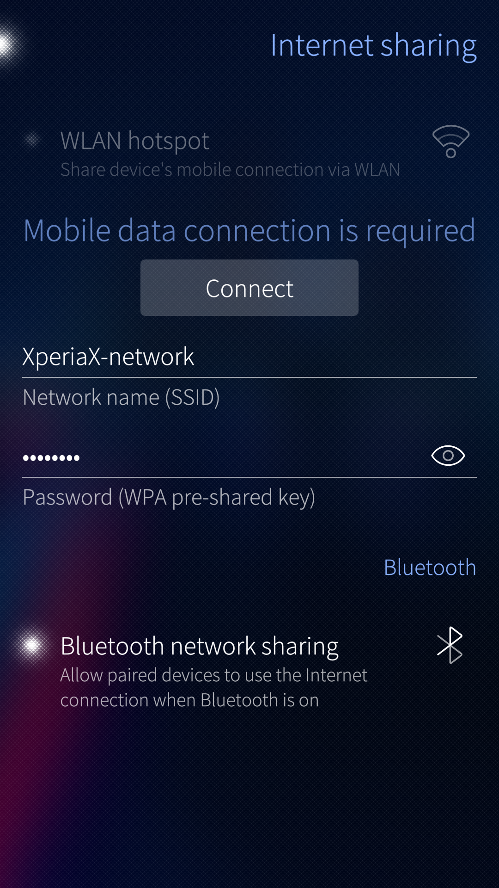

# What does 'Internet sharing' mean?
Internet sharing allows you to connect your computer to the Internet using your Sailfish device which is connected to the Internet either via WLAN or mobile data. The Sailfish device offers a local WLAN network or a modem for the computer (or another auxiliary device), making the Internet connection possible.

"WLAN hotspot" is the common way of Internet sharing. It means that the Sailfish device offers a WLAN network for the computer to connect to and relays the data transmission from/to the Internet.
Currently, Sailfish can only relay mobile data to a WLAN hotspot. 

There are two alternatives for the WLAN hotspot, namely "USB tethering" and "Bluetooth tethering" (a.k.a. Bluetooth network sharing). In these two cases, both WLAN and mobile data of the Sailfish device can be shared, depending on which one is connected to the Internet. Bluetooth tethering relays internet traffic through a local Personal Area Network (PAN) while USB tethering makes the Sailfish device appear as a modem to the computer.

To summarise, Sailfish OS supports three methods for Internet sharing: 
* WLAN hotspot
* Bluetooth tethering and,
* USB tethering.

Two of the Internet sharing methods, WLAN hotspot and Bluetooth tethering, are chosen in the menu "Settings > System > Internet sharing". The 3rd one, USB tethering, is still experimental and lacking proper UI. It must be installed (and removed) at the command line (see chapter ["Internet sharing over USB"](/Support/Help_Articles/Internet_Sharing/#internet-sharing-over-usb)). Once installed, the menu "Settings > System > USB" shows the additional option "Internet sharing".

Please note that Internet sharing over a mobile data connection may incur costs on you, depending on your contract with your cellular operator. Also, check with your operator that you have enough quota for Internet sharing.

Note also that Internet sharing as a WLAN hotspot requires a lot of processing which increases the current drain from the battery. Do not leave it on unnecessarily.

## Internet sharing over WLAN

Connect your Sailfish device to a mobile network ("Settings > System > Mobile network"), i.e., enable mobile data.

Go to "Settings > System > Internet sharing".

Give your WLAN network (hotspot) a meaningful name (SSID) - the name "XperiaX-network" is used in the picture below.
Set a strong password (check the spelling with the "abc" key). Setting and changing the password is confirmed by typing the **[security code](/Support/Help_Articles/Device_Lock_and_Security_Code/)** of the device.

Turn the hotspot on.
Search for your WLAN hotspot at the network settings of your computer. Connect to this network.
Your computer has now an Internet connection through your Sailfish device. The connection is based on mobile data. A hotspot icon appears near the top right corner of the home screen and the hotspot button is enabled in the Top menu.

<div class="flex-images" markdown="1">

* <a href="WLAN-hotspot.jpg" class="narrow-image"></a>
  <span class="md_figcaption">
    Setting up internet sharing
  </span>
</div>


# Internet sharing over Bluetooth

Connect your Sailfish device to a WLAN network or to a mobile network ("Settings > System > Mobile network"), i.e., enable mobile data.

Go to "Settings > System > Bluetooth". Pair the Sailfish device with the computer (or whichever client device you have). Connect the devices over Bluetooth. Allow them connect automatically.

Go to "Settings > System > Internet sharing". Turn on "Bluetooth network sharing" (see the picture below).

<div class="flex-images" markdown="1">

* <a href="BT-network-sharing.png" class="narrow-image"></a>
  <span class="md_figcaption">
    Option for Bluetooth tethering
  </span>
</div>

Open the network settings of your computer and enable the connection with the modem (i.e., the Sailfish device). Your computer has now an Internet connection arranged through your Sailfish device. The connection is based on mobile data or on WLAN, depending on which is connected to the Internet from the Sailfish device. This connection is intended for low bandwidth requirements. Streaming radio and accessing traffic info in a car are examples of typical use cases.


# Internet sharing over USB

Connect your Sailfish device to a WLAN network or to a mobile network ("Settings > System > Mobile network"), i.e., enable mobile data.

## Installing USB tethering

You will need the **[Developer mode](/Support/Help_Articles/Enabling_Developer_Mode/)** for this.

```
devel-su
pkcon refresh
pkcon install usb-moded-connection-sharing-android-connman-config
systemctl restart usb-moded
```

## Using USB tethering
Connect a USB cable between your Sailfish device and your computer.
NOTE: the cable must be data-enabled - a charging-only cable would not work here.
The dialogue shown in the picture below will appear. 

Select “Internet sharing”.
Your computer has now an Internet connection arranged through your Sailfish device. The connection is based on mobile data or on WLAN, depending on which is connected to the Internet from the Sailfish device. The device does not unfortunately indicate the connection in any way.

<div class="flex-images" markdown="1">

* <a href="USB-cable-conn.jpg" class="narrow-image"></a>
  <span class="md_figcaption">
    USB cable connected
  </span>
</div>

If you didn’t see the view of the picture above, please remove the cable from your Sailfish device and go to "Settings > System > USB". Change the “Default USB mode” to “Always ask” (or to "Internet sharing" if you use this frequently). Next, connect the USB cable again and select “Internet sharing”.

<div class="flex-images" markdown="1">

* <a href="USB-always-ask.jpg" class="narrow-image"></a>
  <span class="md_figcaption">
    Change the USB mode to Always ask
  </span>
</div>

## Uninstalling USB tethering

```
devel-su
pkcon remove usb-moded-connection-sharing-android-connman-config
systemctl restart usb-moded
```


# Problems in using Internet sharing

If you are not able to connect to the WLAN hotspot or to the tethering modem with a computer or another peripheral device please consider the following items:

* Check that you have enabled the mobile data connection on your phone (if you intend to use that for Internet sharing). Next, by using the Sailfish Browser app, ensure that your phone has a working Internet connection.

* Check the WLAN password you have set at "Settings > System > Internet sharing" by making it visible with the "abc" button (turn the hotspot off first). Then ensure that you have written the same password at the WLAN dialogue of your computer.

* Check the network setup of your computer. The connection offered by the Sailfish device may appear by different names in the case of the hotspots (e.g. "Sony Ericsson Mobile Ethernet", "Other devices > [the-Bluetooth-name-of-you-device]", "PAN network of [the-Bluetooth-name-of-you-device]", etc.). In the case of a WLAN hotspot, the computer should show the name you gave to your network.

* Follow our generic **[guidance](/Support/Help_Articles/Internet_Connections/)** about getting an Internet connection.

If this does not help you in getting connected to the Internet, then consider contacting your mobile operator (carrier). Namely, some operators may prevent the use of hotspots for various reasons. They can detect that such connection attempts come from "behind" a NAT. Explain your need for the Internet connection and ask them to enable the hotspot functionality for you.


