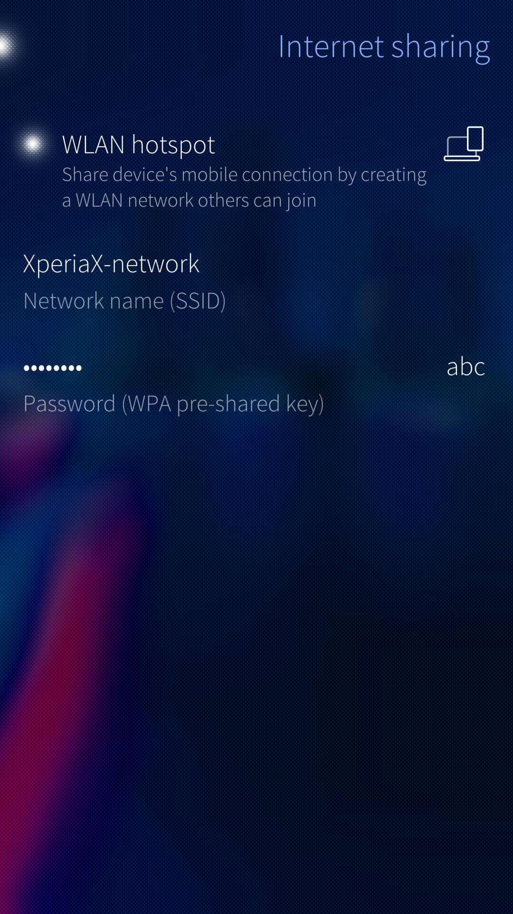
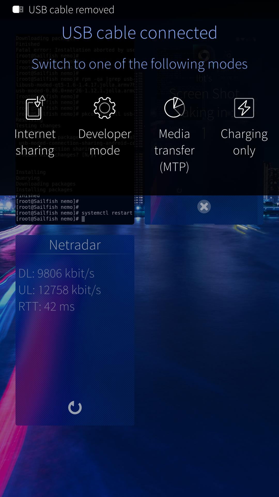
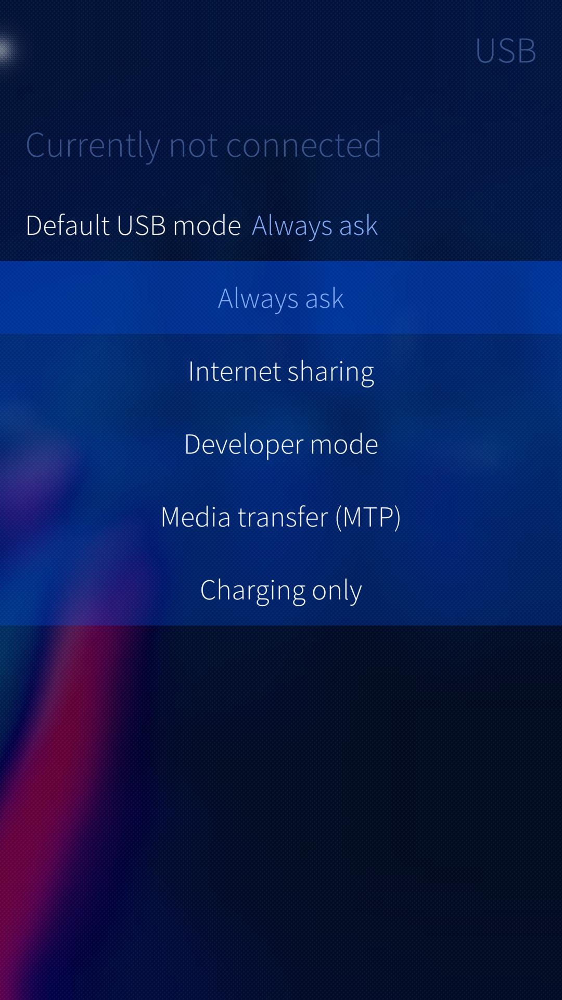

# What does 'Internet sharing' mean?
Internet sharing allows you to connect your computer to the Internet using the cellular data connection (a.k.a. mobile data) of your Sailfish device. There must a mobile data connection to the Internet from your Sailfish device, first. Then you can share this connection as a WLAN connection ("WLAN hotspot") for other devices. An alternative for WLAN is to use the "USB tethering".

What happens is that the Sailfish device converts the data transmission from/to the Internet via the mobile data connection to a local WLAN transmission. Hence your computer can connect to and use the WLAN network provided by your Sailfish device. In case of USB tethering, the phone appears to the computer as a modem, connected with a USB cable.

Connect your computer to your Sailfish device with a data-enabled USB cable ("USB tethering") or over the WLAN network ("WLAN hotspot") provided by your device, it can be control it in menu Settings > Internet sharing.

The current implementation of USB tethering is still experimental. There is no complete UI and the service must be installed (and removed) at the command line.
Therefore the internet sharing over WLAN is the preferred method.

Please note that Internet sharing is bound to use a lot of data and that the data is transferred over a mobile data connection. This may incur costs on you, depending on your contract with your cellular operator. Also, check with your operator that you have enough quota for Internet sharing.

Note also that Internet sharing requires a lot of processing which increases the current drain from the battery. Do not leave it on unnecessarily.

## Internet sharing over WLAN
Go to Settings > Internet sharing

Give your WLAN network (hotspot) a meaningful name (SSID) - "XperiaX-network" as for example in the picture below
Set a strong password (check the spelling with the "abc" key)
Turn the hotspot on.
Search for your WLAN network at the network settings of your computer. Connect to this network.
Your computer has now an Internet connection through your Sailfish device. The connection is based on mobile data.

<div class="flex-images" markdown="1">

* <a href="WLAN-hotspot.jpg" class="narrow-image"></a>
  <span class="md_figcaption">
    Setting up internet sharing
  </span>
</div>

# Internet sharing over USB

## Installing USB tethering

You will need the Developer mode for this.

```
devel-su
pkcon refresh
pkcon install usb-moded-connection-sharing-android-connman-config
systemctl restart usb-moded
```

## Using USB tethering
Connect a USB cable between your Sailfish device and your computer.
NOTE: the cable must be data-enabled - a charging-only cable would not work here.
The dialogue shown in the picture below will appear. Select “Internet sharing”.
Your computer has now an Internet connection arranged through your Sailfish device. The connection is based on mobile data.

<div class="flex-images" markdown="1">

* <a href="USB-cable-conn.jpg" class="narrow-image"></a>
  <span class="md_figcaption">
    USB cable connected
  </span>
</div>

If you didn’t see step 2, please remove the cable from your device and go to Settings > USB. Change the “Default USB mode” to “Always ask” (or to "Internet sharing" if you use this frequently). Next, connect the USB cable again.

<div class="flex-images" markdown="1">

* <a href="USB-always-ask.jpg" class="narrow-image"></a>
  <span class="md_figcaption">
    Change the USB mode to Always ask
  </span>
</div>

## Uninstalling USB tethering

```
devel-su
pkcon remove usb-moded-connection-sharing-android-connman-config
systemctl restart usb-moded
```

# Problems in using the hotspot

If you are not able to a) connect to the hotspot with a computer or another peripheral device or if b) the Internet connection fails even though the local WLAN connection works, please consider the following:

* Check the password you have set at Settings > Internet sharing by making it visible with the "abc" button. Then ensure that you have written the same password at the WLAN dialogue of your computer.

* First, check that you have enabled mobile data connections on your phone (Settings > Mobile networks). Next, by using the Sailfish Weather app, ensure that your phone has a working Internet connection (i.e., the app can show the weather conditions of a city).

* Follow our generic **[guidance](https://docs.sailfishos.org/Support/Help_Articles/Internet_Connections/)** about getting an Internet connection.

If this does not help you in getting connected to the Internet, then consider contacting your mobile operator (carrier). Namely, some operators may prevent the use of hotspots for various reasons. They can detect that such connection attempts come from "behind" a NAT. Explain your need for the Internet connection and ask them to enable the hotspot functionality for you.


