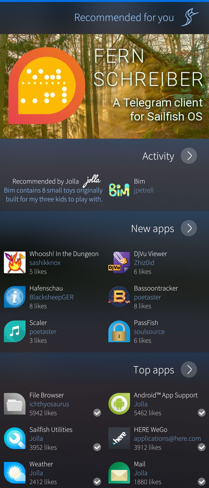
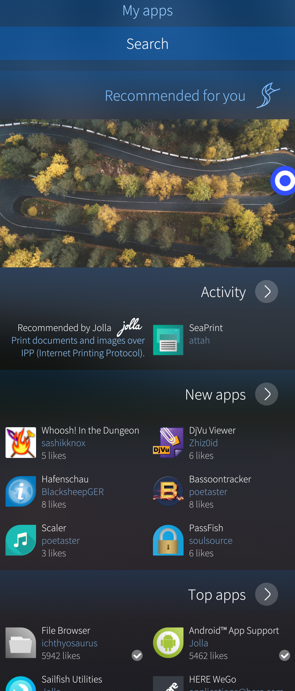
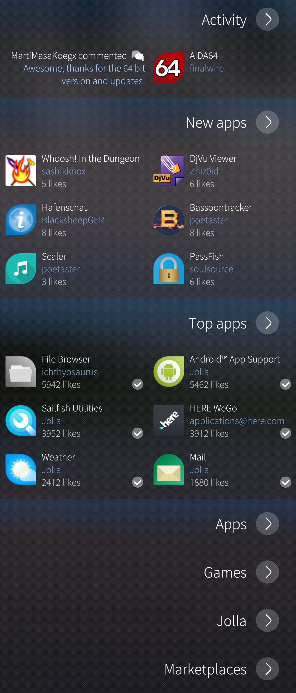
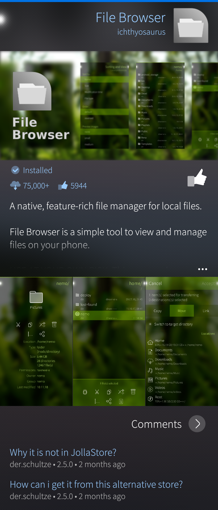

# Pre-requisite

You need to have added a Jolla Account to your phone to use the Store. Instructions how to setup Jolla Account can be found from [**here**](/Support/Help_Articles/Accounts_Setup/Setup_Jolla_Account/).

# Looking for apps

* Launch Jolla Store to see what’s available. The main page shows a stream of apps and reviews
  * At the top of this page you can see "Recommended for you". This collection contains Sailfish OS apps which are recommended for you by Jolla.
  * Next below there are apps categorized by active commenting, novelty and popularity

* 
  
  

* Use ‘Search’ command in the pulley menu of the Store start page to search for a specific app.

* 
  
  

* At the bottom of this page there is a coarse ranking by the content: Apps, Games, Jolla and Marketplaces. Marketplaces has application stores (e.g. F-Droid) for getting [**Android apps**](/Support/Help_Articles/Android_App_Support/).

* 
  
  

* Apps and Games has also internal categories, so after you have opened one of those you can swipe left and open related category view.

# Getting an application

* When you see an app that interests you, tap on it and apps page will be opened
  * At the page top you can see if the app is a SailfishOS or an Android one. Next to it tells how many times the app has been installed and how many recommendations it has got (thumbs up)
  * Next there is a short description of the app. Touch the icon of three dots to see more. The desciption ends in a series on screenshots from the app.
  * At the bottom of the screen there are comments and a place for you to leave a comment, too. Note that your name will appear alongside the comment.
  * If you haven't got this application yet, pull down to install the app and it will download and install
  * If you do already have this app installed then the pulley menu lets you remove it.
  

* 
  
  

* You can access and check your installed apps using 'My apps' in the pulley menu of the Store start page.  It is also possible to update and uninstall apps here.
