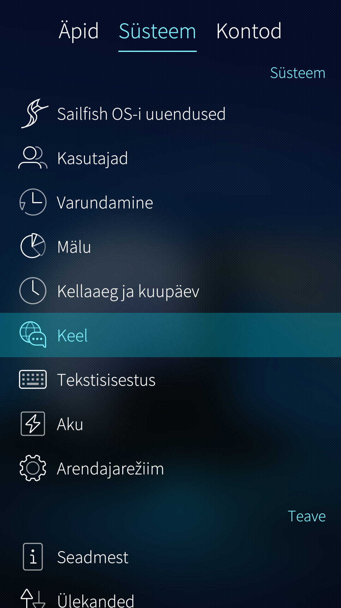
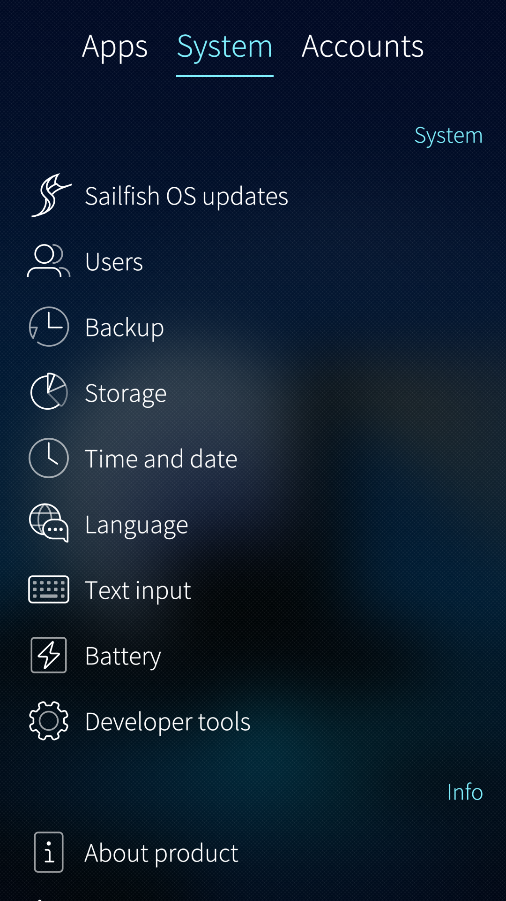
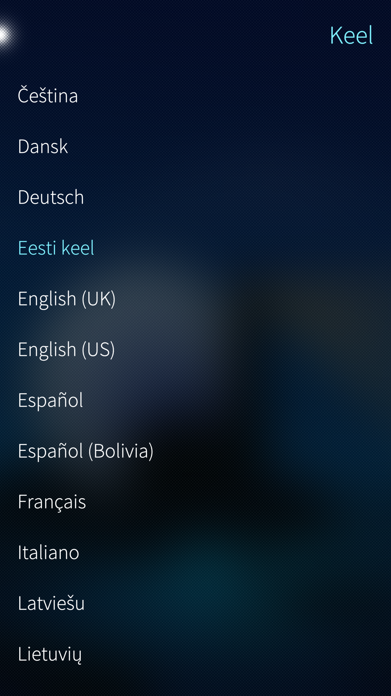
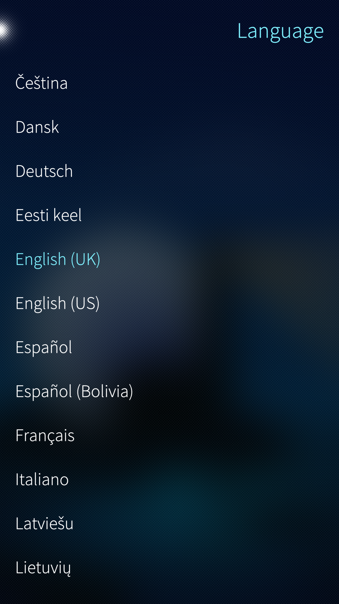
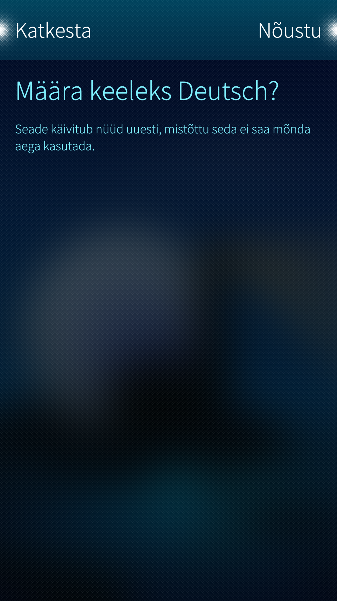
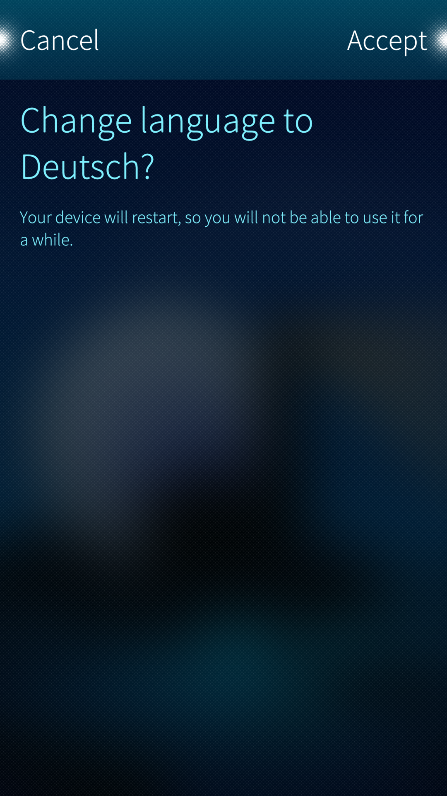

# Languages supported by Sailfish OS

At the moment (Sailfish OS 4.4.0) the following languages are available in the Sailfish OS user interface:

1.  Čeština (Czech)
2.  Dansk (Danish)
3.  Deutsch (German)
4.  Eesti keel (Estonian)
5.  English (UK)
6.  English (US)
7.  Español (Spanish)
8.  Español (Bolivia) (Spanish (Bolivia))
9.  Français (French)
10. Italiano (Italian)
11. Latviešu (Latvian)
12. Lietuvių (Lithuanian)
13. Magyar (Hungarian)
14. Nederlands (Dutch)
15. Norsk (Norwegian)
16. Polski (Polish)
17. Português (Portuguese)
18. Português Brasileiro (Brazilian Portuguese)
19. Română (Romanian)
20. Slovenčina (Slovak)
21. Slovenščina (Slovene)
22. Suomi (Finnish)
23. Svenska (Swedish)
24. Tiếng Việt (Vietnamese)
25. Türkçe (Turkish)
26. Ελληνικά (Greek)
27. Български (Bulgarian)
28. Русский (Russian)
29. Татарча (Tatar)
30. українська (Ukrainian) [^1]
31. मराठी (Marathi)
32. हिन्दी (Hindi)
33. বাংলা (Bengali)
34. ਪੰਜਾਬੀ (Punjabi)
35. ગુજરાતી (Gujarati)
36. தமிழ் (Tamil)
37. తెలుగు (Telugu)
38. ಕನ್ನಡ (Kannada)
39. മലയാളം (Malayalam)
40. 简体中文（Simplified Chinese)
41. 繁体中文（台湾） (Traditional Chinese (Taiwan))
42. 繁体中文（香港）(Traditional Chinese (Hong Kong))

# Changing the user interface language

1) Open the app "Settings" and tap the System header at the top of the display.

2) Scroll down until you see the **Globe icon** with the speech bubble on top of it. It is located in the same group with Sailfish OS updates (with the Sailfish logo in front of it). On Sailfish OS release 4.4.0, the Language item is the 6th in this group.

The pictures below show the same views in Estonian and English. Estonian is used here to depict the situation where the phone has a foreign language that you want to change to another language.

* 
  
    Language settings menu in Estonian
  
* 
  
    Language settings menu in English
  

3) Select your language from the list of all languages - they are all presented in their native languages:

* 
  
    List of languages (Estonian)
  
* 
  
    List of languages (English)
  

4) You will need to confirm the language change by tapping the top-right corner OR by swiping left:

* 
  
    Changing the language to Deutsch (Estonian)
  
* 
  
    Changing the language to Deutsch (English)
  

5) Your device will restart and the selected language will become into effect.
  

# Keyboard languages and layouts

Most of the languages listed in the beginning of this document have keyboard layouts of their own.
Keyboard languages and layouts are discussed in [this document](https://docs.sailfishos.org/Support/Help_Articles/Text_Input_Settings/).

- - - - -
[^1]: Ukrainian language is coming up on Sailfish 4.5.0

