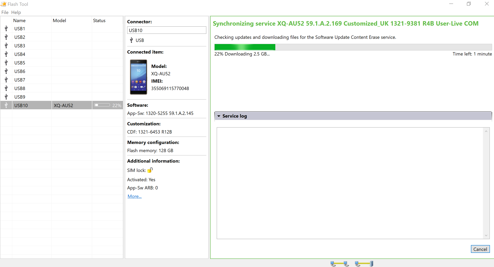
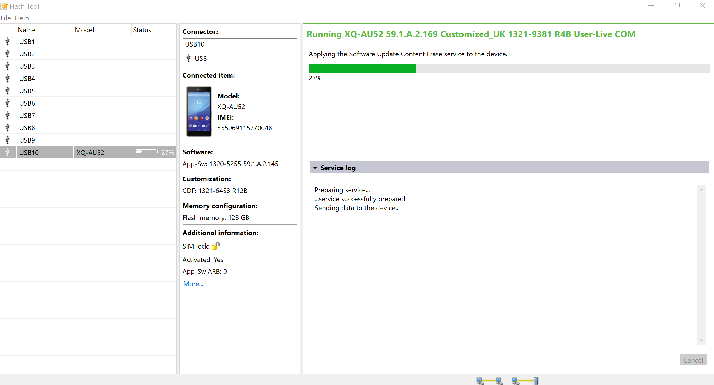

# Reverting Xperia device to Android OS and reinstalling Sailfish OS

It has turned out that the following procedure may sometimes help if something has gone wrong while preparing the device for Sailfish OS and/or while installing Sailfish OS.

These instructions are applicable for all [Xperia models supported by Sailfish OS](/Support/Supported_Devices/).

Depending on the problems observed on your Xperia, it may be enough to just **reinstall ("reflash") Sailfish OS** to it. It is good to try this easier way first. In this case, skip to chapter "[Installing Sailfish X again to Xperia](#installing-sailfish-x-again-to-xperia)" in this document.


However, if your Xperia cannot use the services of cellular network properly (or at all), then it may be necessary to revert the device back to Android OS first, and finally, reinstall Sailfish X.

**NOTE:** _Reverting the device back to Android means that **all data** in the device memory **will be deleted**. Only the SD and SIM cards remain untouched._


# This is our plan

1.  Revert the device back to Android OS first
2.  Use your device and your SIM card with Android OS, checking the main functionality (see chapter [Checking that the phone works with Android](#checking-that-the-phone-works-with-android))
3.  Re-flash Sailfish OS to the device.


# Reverting Xperia back to Android OS

## Getting Emma and connecting Xperia to it

Reverting Xperia device back to Android can be performed by the **[Emma](https://developer.sony.com/open-source/aosp-on-xperia-open-devices/get-started/flash-tool)** flashing tool from Sony. Emma runs on **Windows PC** only. It does not work on Linux or Mac computers.

1. Download and install the Flash tool “Emma”  from **[Sony’s developer website](https://developerworld.wpp.developer.sony.com/file/download/download-the-flash-tool/)** to your Windows computer.
2. Turn off your Xperia device. Leave it off for at least fifteen (15) seconds to be sure it is off.
3. Hold down the **Volume Down** button on the device while connecting your device to your computer with a USB **data** cable. The LED next to the speaker on the device should soon turn from red to **green** (not blue).
4. Run the Emma tool. A view similar to that in [Picture 1](#picture_1) should appear. It shows the phone model on the left. 


## Selecting the version of Android baseband

See [Picture 1](#picture_1) below. It shows the Emma home view on your PC once you have connected your Xperia phone (here: Xperia 10 II). The current Android baseband version (a.k.a. build number) is shown in the "Software" box under the phone icon in the Emma view.

Check the latest compatible Android baseband version (or "service" as they are called in Emma) according to the **[baseband version table](#the-baseband-version-table)** below. The corresponding Android OS versions shown in the phone settings are in parentheses. Pay attention to the first 2 numbers (preceeding the letter A).

<div class="flex-images" markdown="1">

* <a href="Emma_X10II_home.png" name="picture_1"></a>
  <span class="md_figcaption">
    Picture 1: Initial view of Emma. Xperia 10 II connected.
  </span>
</div>
  
As of March 2023, the latest services were as below but note that the exact version ID's can vary by model (regular/Plus/Ultra) and by sales area. The first part of the ID (in bold letters) is significant and should be followed (anything after the letter A may vary and does not matter in this context). This table contains the baseband versions that Jolla has used when testing the Sailfish port. If you selected a more recent version then you take a risk that not everything works as expected.

### The baseband version table

| Device        | Android baseband version                                                      |
| ------------- | ----------------------------------------------------------------------------- |
| Xperia X      | **34.4**.A.2.118 (Android 8)                                                  |
| Xperia XA2    | **50.2**.A.0.400 (Android 9) [^1] <br /> **50.1**.A.13.123 (Android 8) [^2]   |
| Xperia 10     | **53.0**.A.8.69 (Android 9) [^3]                                              |
| Xperia 10 II  | **59.1.**A.2.169 (Android 11) <br /> **59.0**.A.6.24 (Android 10) [^4]        |
| Xperia 10 III | **62.0.**A.3.109 (Android 11) <br /> **62.1.**A (Android 12) [^5]             |


[^1]: This Android 9 version appears to sometimes get an invalid WiFi MAC which prevents the phone from using WiFi networks (in the Android mode). In such a case, first flash an Android 8 version, boot up, and then flash Android 9.  Note that even if there was no WiFi on Android 9, after installing Sailfish, WiFi works again.
[^2]: We recommend Android 9 for Sailfish 3.3.0 and later. Baseband version 50.3.A.z.y might become available. Do not take it as it corresponds to Android 10, the compatibility with Sailfish has not been tested.
[^3]: Use 53.0.A.x.y (Android 9). Do not install Android 10 as Sailfish is not compatible with it. Baseband versions 53.1.A.x.y imply Android 10, so do not install them with Emma as the WiFi service of the phone would get broken.
[^4]: Both Android 10 and Android 11 are compatible with Sailfish. However, we recommend using Android 11, so select Android baseband 59.1.A.x.y if available.
[^5]: Both Android 11 and Android 12 are compatible with Sailfish. However, we still recommend using Android 11, so select Android baseband 62.0.A.x.y if available.

If there are two code packages with the same version ID, choose the one with the type "Software Update Content Erase" (instead of "Firmware update"), please (see [Picture 2](#picture_2) below). This is to force all possible changes into place.

## Downloading and installing Android baseband

Select the service matching your phone. In the example of [Picture 2](#picture_2), the phone has the version 59.1.A.2.145 while the latest available service is slightly more recent, 59.1.A.2.169. Click "Apply service" to take it. Emma starts to download the update which lasts quite a while as the size is about 2.5 GB - see [Picture 3](#picture_3).

<div class="flex-images" markdown="1">

* <a href="Emma_X10II_newer_service_found.png" name="picture_2"></a>
  <span class="md_figcaption">
    Picture 2: Emma: a more recent service for Xperia 10 II detected.
  </span>
</div>

<div class="flex-images" markdown="1">

* <a href="Emma_X10II_downloading.png" name="picture_3"></a>
  <span class="md_figcaption">
    Picture 3: Emma downloading the selected service.
  </span>
</div>

As soon as the download is completed, Emma automatically starts sending the new service to the phone, i.e. flashing it. [Picture 4](#picture_4) shows how Emma is flashing the service 59.1.A.2.169 (Android 11) to the Xperia 10 II phone.

<div class="flex-images" markdown="1">

* <a href="Emma_X10II_flashing_device.png" name="picture_4"></a>
  <span class="md_figcaption">
    Picture 4: Emma flashing the service to the phone.
  </span>
</div>

If everything was completed successfully, the view of [Picture 5](#picture_5) appears.

<div class="flex-images" markdown="1">

* <a href="Emma_X10II_complete.png" name="picture_5"></a>
  <span class="md_figcaption">
    Picture 5: Emma successfully completed flashing.
  </span>
</div>

Using Emma works in the same way with other Xperia phones.

Please note that the just-installed baseband becomes into effect only after running the Android startup on the phone. Therefore, dsconnect the USB cable and wait until the green LED turns off. Then, turn the phone on with the Power key and wait till the startup begins. This may take several minutes.


# Checking that the phone works with Android

Detach the USB cable from the device now. Start the device with the Power button and **run the Android start-up routine** where you can skip as many steps as possible (as you will soon install Sailfish OS).

Please note that it takes quite a while (minutes) before the Android start-up routine appears (other than a spinner).
  
**THIS IS VERY IMPORTANT**:
**Use your Xperia device some time with Android OS. Check the following, at least:

* phone calls can be made and received -- you can hear the remote party and (s)he can hear you
    
* browsing the internet with a mobile data connection (WLAN turned off) works
    
* browsing the internet with WLAN (mobile data turned off) works
    
* take pictures with the camera
    
* turn the location service (satellite-based position) on and check that the phone can show your location on a map
* play some music
* ensure that the touch display is responsive at all parts of the display
      
See [Picture 6](#picture_6) below. Do not forget to check that your phone has now the intended Android version. So, open the menu page Settings > System > About phone. Check the Android version and build number.

<div class="flex-images" markdown="1">

* <a href="Xperia10ii_build_number.png" name="picture_6" class="narrow-image"></a>
  <span class="md_figcaption">
    Picture 6: Check the Android build number a.k.a. baseband version
  </span>
</div>


# Installing Sailfish X again to Xperia

Installing Sailfish can be made with Windows, Linux or Mac computers. In the next chapters, we have pointers to our official Sailfish X instructions.

NOTE: _Installing Sailfish OS again means that all data in the device memory will be deleted. Only the SD and SIM cards remain untouched._

Make sure you have the **[latest available Sailfish OS](https://forum.sailfishos.org/tag/release-notes)** version downloaded to your computer and that the downloaded Sailfish image is the correct one for your **phone model**. You can check the exact model by pulling out a white label from the SIM card slot, listing the info (e.g. H3113 or I4213). Other ways to check the model are the sales box label and the phone menus. Trying to install (flash) an incorrect image will fail.

The latest Sailfish OS version (and only the latest) is always available in **[this repository](https://shop.jolla.com/downloads/)** and can be downloaded from there. Please, sign in to this service with the same Jolla account that you used for buying the Sailfish X license.

NOTE:  The links at the Download buttons are valid for a fairly short period of time only after entering the page. If you get the "403 permission denied" error when trying to download, you will need to reload the page to refresh the download links.

After downloading and unzipping the Sailfish package, it is good to check that the contents of your Sailfish OS directory are similar to that in [Picture 7](#picture_7") below. 

<div class="flex-images" markdown="1">

* <a href="Sailfish_flashing_directory_an_example.png" name="picture_7"></a>
  <span class="md_figcaption">
    Picture 7: Typical Sailfish OS flashing directory (here: Xperia 10 II)
  </span>
</div>

In particular, check that you have the correct file "SW_binaries_for_Xperia_Android*.img" (the so-called vendor binary image) there. There is a dedicated vendor image for different phone models. In the case of Xperia 10 II, it has the image name contains nickname "seine". If missing, select the instructions applicable to you:

* for Xperia X:      SW\_binaries\_for\_Xperia\_AOSP\_M\_MR1\_3.10\_**v13_loire**.img
    (if missing, visit chapter 5: **[Windows](https://jolla.com/sailfishx-windows-instructions/), [Linux](https://jolla.com/sailfishx-linux-instructions/), [Mac](https://jolla.com/sailfishx-macos-instructions/)** )
    
* for Xperia XA2:  SW\_binaries\_for\_Xperia\_Android\_8.1.6.4\_r1_**v16_nile**.img
    (if missing, visit chapter 5: **[Windows](https://jolla.com/sailfishx-windows-instructions-xa2/), [Linux](https://jolla.com/sailfishx-linux-instructions-xa2/), [Mac](https://jolla.com/sailfishx-macos-instructions-xa2/)** )
    
* for Xperia 10:  SW\_binaries\_for\_Xperia\_Android\_9.0\_2.3.2_**v9_ganges**.img
    (if missing, visit chapter 5: **[Windows](https://jolla.com/install-sailfish-x-xperia-10-windows/), [Linux](https://jolla.com/install-sailfish-x-xperia-10-linux/), [Mac](https://jolla.com/sailfishx-xperia10-macos/)** )
* for Xperia 10 II:  SW\_binaries\_for\_Xperia\_Android\_10.0.7.1\_r1_**v12b_seine**.img
    (if missing, visit chapter 5: **[Windows](https://jolla.com/how-to-install-sailfish-x-on-xperia-10-ii-on-windows/)**, **[Linux](https://jolla.com/how-to-install-sailfish-x-on-xperia-10-ii-on-linux/)**, **[Mac](https://jolla.com/how-to-install-sailfish-x-on-xperia-10-ii-on-macos/)** )
* for Xperia 10 III:  SW\_binaries\_for\_Xperia\_Android\_11\_4.19_**v9a_lena**.img
    (if missing, visit chapter 5: [**Windows**](https://jolla.com/how-to-install-sailfish-x-on-xperia-10-iii-on-windows/), **[Linux](https://jolla.com/how-to-install-sailfish-x-on-xperia-10-iii-on-linux/)**, **[Mac](https://jolla.com/how-to-install-sailfish-x-on-xperia-10-iii-on-macos/)** )

Install (flash) Sailfish OS  to your Xperia. Select the instructions applicable to you:

* Xperia X, as instructed in chapters 6: [Windows](https://jolla.com/sailfishx-windows-instructions/), [Linux](https://jolla.com/sailfishx-linux-instructions/), [Mac](https://jolla.com/sailfishx-macos-instructions/).
* Xperia XA2, as instructed in chapters 6: [Windows](https://jolla.com/sailfishx-windows-instructions-xa2/)[,](https://jolla.com/sailfishx-macos-instructions/) [Linux](https://jolla.com/sailfishx-linux-instructions-xa2/)[,](https://jolla.com/sailfishx-macos-instructions/) [Mac](https://jolla.com/sailfishx-macos-instructions-xa2/)
* Xperia 10, as instructed in chapters **8**: [Windows](https://jolla.com/install-sailfish-x-xperia-10-windows/), [Linux](https://jolla.com/install-sailfish-x-xperia-10-linux/), [Mac](https://jolla.com/sailfishx-xperia10-macos/)
* Xperia 10 II, as instructed in chapters **8**: [Windows](https://jolla.com/how-to-install-sailfish-x-on-xperia-10-ii-on-windows/), [Linux](https://jolla.com/how-to-install-sailfish-x-on-xperia-10-ii-on-linux/), [Mac](https://jolla.com/how-to-install-sailfish-x-on-xperia-10-ii-on-macos/)
* Xperia 10 III, as instructed in chapters **8**: [Windows](https://jolla.com/how-to-install-sailfish-x-on-xperia-10-iii-on-windows/), [Linux](https://jolla.com/how-to-install-sailfish-x-on-xperia-10-iii-on-linux/), [Mac](https://jolla.com/how-to-install-sailfish-x-on-xperia-10-iii-on-macos/)
    

  
While connecting the USB data cable, press the **Volume Up** button of the phone. Then, you must see a **BLUE light** lit on the phone (if green, disconnect, reconnect and try again - press the button gently).

When the flashing script has reached the end, the lines 
```
Flashing completed.
Remove the USB cable and bootup the device by pressing the Power key.
```
should appear on your computer screen.

# Booting up to Sailfish OS

You can now turn your Xperia on by pressing the Power key. Let it then run the initial start-up of Sailfish OS.

First, you will see a reminder of an unlocked boot loader, which you can ignore. This is not a defect.

Sign in to your **[Jolla account](/Support/Help_Articles/Accounts_Setup/Setup_Jolla_Account/)** in order to get the Android AppSupport and other licensed content. The Jolla account must be the same as you used when purchasing the Sailfish X licence.

Next, you can install more **Sailfish apps** from the **[Jolla store](/Support/Help_Articles/Jolla_Store/)**  and **[Android apps](/Support/Help_Articles/Android_App_Support/)** from stores like **[APKPure](/Support/Help_Articles/Android_App_Support/APKPure/)** or **[Aptoide](/Support/Help_Articles/Android_App_Support/Aptoide/)**.

----

