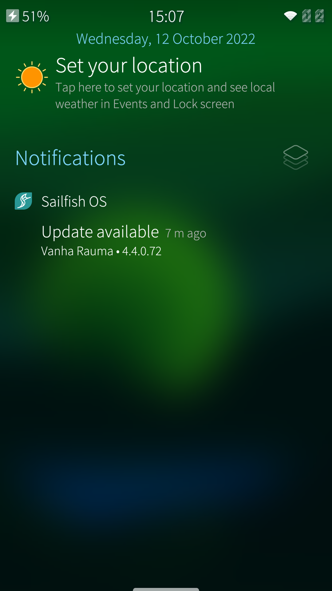
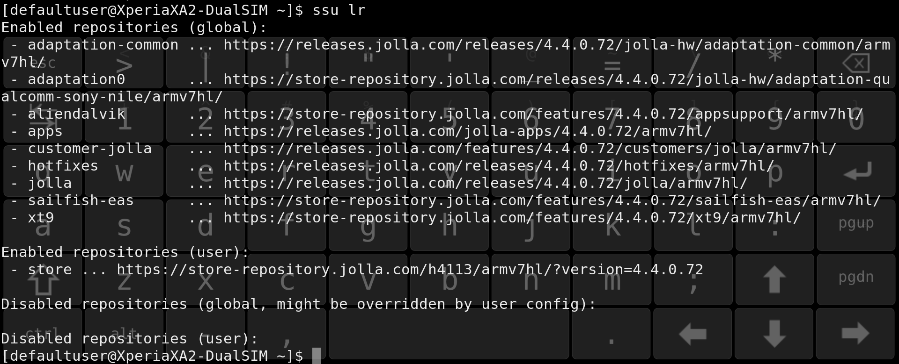

# How to download and install a Sailfish OS update


## Prerequisites

Before starting an OS update, ensure that the following crucial matters are as they shall be:

* Always read the **release notes** of the OS version you are going to install. The release notes are kept in **[Sailfish OS Forum](https://forum.sailfishos.org/tag/release-notes)**, the latest on top of the list.
* Check that you have a working **Internet** connection on your device. Use the Sailfish browser to check this. Note that the size of the update may be up to hundreds of megabytes. Prefer WLAN to download it. If you use mobile data, make sure that this will not incur costs for you.
* Check that the **date and time** of your device are correct.
* Check that you have a working **Jolla account** on your Sailfish device. Launch the Jolla Store application and try to install any application from the Store. If this works then your account is okay. Should there be any trouble please read **[this article](/Support/Help_Articles/Accounts_Setup/Setup_Jolla_Account/)**.
* We recommend keeping the device **connected to a battery charger** throughout the whole update process.
* Make sure you have that you have enough **free storage space** (disk space) in the device: the user data "Used" is shown on menu page _Settings > Storage._
* If you have installed applications from **OpenRepos** service, then see chapter OpenRepos in the end of this article. _If you have never heard of OpenRepos, no worries, please skip this step._

NOTE: Xperia and Gemini device must have a valid **[Sailfish X licence](/Support/Help_Articles/Sailfish_X_Licence/)**, or else they won't get any OS updates.

## Updating the operating system

### Finding an update

**Recommended way:**

1.  Visit menu page "_Settings > System > Sailfish OS updates_"
    \- see the picture below on the left.
2.  Open the pulley menu and take action "_Check for updates_".

**Alternative way:**

Notifications on available Sailfish OS updates appear in the **Events View** which you can make visible by swiping sideways from beyond the left edge of the device to the right.  See the picture below on the right. Tap such a notification. The Jolla Store application will launch automatically.  You will end up on the menu page explained above under "Recommended way".

<div class="flex-images" markdown="1">

* <a href="OS-update-available-menu.png"></a>
  <span class="md_figcaption">
  OS update available
  </span>
* <a href="OS-update-available-events-view.png"></a>
  <span class="md_figcaption">
  OS update in Events view
  </span>
</div>


### Preparations for the update

A good amount of free storage space is required for a successful OS update. Sailfish OS will do its best to make space for the update by running an optimization task as soon as an OS update has been detected. The text "_Preparing update_" may appear briefly. Once done, the view with "_Update available_" with the download size will appear (see the picture  on the left above).


### Downloading the update from Jolla Store to your device

* Select "Download" in the pull-down menu
* Wait until the download gets completed - the scenery at the top of the display will turn lighter starting from the left, indicating the download progress. There will be further instructions on the screen for the installation phase
* If the download should get interrupted due to a connection problem, please try again. Sailfish OS knows how to continue from the point where the previous attempt stopped (the progress indicator always starts from the left, though).
* The pictures below show how the download phase goes:

<div class="flex-images" markdown="1">

* <a href="OS-update-downloading.png"></a>
  <span class="md_figcaption">
  Update being downloaded
  </span>
* <a href="OS-update-installable.png"></a>
  <span class="md_figcaption">
  Update downloaded. Ready to be installed
  </span>
</div>


### Installing the update

* Installing the update will not delete contacts or other user data in the device. It will not affect the memory card or the SIM card, either.

* Never try to interrupt the installation as this would very likely break your device. Do not turn the phone off (unless an hour has passed without getting the job completed)
* Make sure your device is connected to a charger. Your device must not turn off during this phase.
* Start the process by selecting "Install" in the pull-down menu.
* The phone will restart first. The Sony logo appears. Soon after, you will need to type the security code.
* Next, Sailfish logo will appear on a black background. There is a progress indicator line below it.

<div class="flex-images" markdown="1">

* <a href="Sailfish-installation-ongoing.png" class="narrow-image"></a>
  <span class="md_figcaption">
    Installation in progress
  </span>
</div>


* Wait patiently until the update is installed - do not turn the device off (in fact, the Power key is disabled at this point). Let the device restart itself - you will eventually see the familiar Lock Screen. At this point, the installation is over and the device is ready for use. It takes usually about 10-20 minutes to install an update.

NOTE: If the progress bar of the black Sailfish screen stalls at 100% and stays there for more than 15 minutes, it is safe to force the phone to restart. Do it by pressing both the Power key and the Volume Up key at the same time for 20-30 seconds, until you feel the vibrator play three times. Now, release the keys. Turn the phone on in the normal way with the Power key. Check at Settings > System > About product that your phone has the new OS release.


## Updating from early Sailfish OS versions

With "early versions" we mean Sailfish OS updates of generations 1, 2, and 3.

### The update path and Stop Releases

There are several so-called **[Stop Releases](https://docs.sailfishos.org/Support/Releases/)** in the Sailfish OS update path. A stop release brings in some critical changes that make it possible to install the subsequent updates.
Stop releases are mandatory intermediate steps in the update path through which the update process must traverse if the current OS version of the device is from the past.

The reason for the current version being from the past would be that you have performed the _factory reset_ which automatically reverts the system to the original OS version installed on the device.

If you always download and install the new OS release when it becomes available then there is no hassle with the stop releases. You would not even notice that they exist!

**NOTE for the users of Xperia devices:**
Instead of performing the factory reset, we recommend **reinstalling** ("flashing") the latest Sailfish OS version to your Xperia device. In this way, you will avoid the nuisance of stop releases. Read here the **[comparison of flashing and resetting](https://docs.sailfishos.org/Support/Help_Articles/Tips_and_Tricks/#total-device-reset)**.

### The Stop Releases are listed at Sailfish OS Docs

If you start updating your device from an early release, your device will have to download and install all of the **[Stop Releases](https://docs.sailfishos.org/Support/Releases/)** between the current release on the phone and the latest available release.

The phone will automatically suggest the next stop release in _Settings > System > Sailfish OS update._

**NOTE:** Do not install any apps or sign in to your accounts (your Jolla account is an exception) before you have completed updating the OS to the latest version!

### How to update using the menu

Seek updates as explained above. The first applicable stop release will be offered. Note here that it is recommended to use **a WLAN** connection for the download and turn mobile data off. Check that **your Jolla account** really works by first installing an application from the Store, and if it succeeded, then download the OS update. If the download of the OS update gets stalled and/or you see the notification "Problem with Store" then check your Internet connection again. Retry the download. Should the update keep failing, contact **[Jolla Customer Support.](https://jolla.zendesk.com/hc/en-us/requests/new)**

As soon as the first stop release is installed on the device, seek the next one. Carry on in the same way. Once the last stop release has been installed, **the latest Sailfish OS version** will be offered. Download and install it.

### Updating at the command line

If the device keeps failing to indicate the availability of Sailfish OS updates, it may be possible to get them with the following commands (this requires the **Developer mode**, SSH password, and Terminal app  (see "_Settings > System > Developer mode_"). If you need help with the commands below, read this **[help article on Developer mode](/Support/Help_Articles/Enabling_Developer_Mode/)** or contact **[Jolla Customer Support](https://jolla.zendesk.com/hc/en-us/requests/new)**.

The way of working here is to download and install the stop releases one by one with the command set below (an example), and then, eventually, the latest public release.

```
devel-su               ## Your SSH password is needed here
ssu release 1.1.9.30   ## Set the next STOP RELEASE here
version --dup          ## Download and install
reboot                 ## Restart device
```

**(*)** NOTE: Use the next stop release counted from the current OS version of your phone. You must traverse through all stop releases, and only after the last one of them you can "version dup" to the latest OS version. Otherwise, there is a great risk of breaking your device.

Q: What is my next stop release?
A: Check the current OS version of your device in _Settings > About product_ (or _Settings > Info > About product_ on some very old Sailfish 1 releases). Then look at the **[list of stop releases](https://docs.sailfishos.org/Support/Releases/)**. If your current version is let's say 1.1.6, then the next stop release would be 1.1.7.28.

Q: If I have OS version **1.0.0.5** on my device which steps do I need to take to update it to the latest version?
A: Unfortunately, all of the following:

```
devel-su

ssu release 1.0.2.5
version --dup
reboot

ssu release 1.1.2.16
version --dup
reboot

ssu release 1.1.7.28
version --dup
reboot

ssu release 1.1.9.30
version --dup
reboot

ssu release 2.0.0.10
version --dup
reboot

ssu release 2.2.0.29
version --dup
reboot

ssu release 3.0.0.8
version --dup
reboot

ssu release 3.2.0.12
version --dup
reboot

ssu release 3.4.0.24
version --dup
reboot

ssu release 4.0.1.48
version --dup
reboot

ssu release 4.1.0.24
version --dup
reboot

ssu release 4.2.0.21
version --dup
reboot

ssu release 4.3.0.15
version --dup
reboot

ssu release 4.4.0.72
version --dup
reboot

ssu release     ## the latest OS version
version --dup
reboot

```

You can disable Developer Mode now if you wish.


## Things to pay attention to

### Open Repos

_If you have not heard about OpenRepos or Warehouse, you can ignore this chapter._

**[OpenRepos](https://openrepos.net/)** is an application store that contains lots of nice and useful apps for Sailfish OS and other operating systems. This store is independent of Jolla. Many developers publish their work in OpenRepos for feedback before trying to get them accepted to the Jolla Store (to become so-called Harbour apps).

This chapter is a disclaimer. It has turned out that some (a minority) of the Sailfish apps in OpenRepos are not fully compatible with Sailfish OS. Those apps may make Sailfish OS updates fail, partly or completely.

It is best to read the **[release notes](https://forum.sailfishos.org/tag/release-notes)** of the OS release which you are going to install. Pay attention to the potentially harmful apps of OpenRepos.

### Warning about downgrading

**Sailfish OS does not support downgrading**. Never try to downgrade the OS version as this could brick your device.

The only way to "downgrade" is to use the **[factory reset](/Support/Help_Articles/Factory_Reset/)**. This will revert the OS version back to the initial one put in when flashing the device the previous time (at the factory or in repair service).

## Updating by reinstalling Sailfish OS

If getting or installing a Sailfish OS update keeps failing for unknown reasons on an Xperia device then please consider **[reinstalling Sailfish OS](https://docs.sailfishos.org/Support/Help_Articles/Reinstalling_Sailfish_OS/)** to the device.

Given that you have a valid Sailfish X licence on your Jolla account for your Xperia phone, you can download the latest Sailfish OS version from **[Jolla Shop](https://shop.jolla.com/downloads/)** and reinstall it.


# What to do if the OS download fails

_Sometimes the download of an OS update fails unexpectedly. This article has some advice on how to recover from this situation._


## Common issues

One of the typical reasons for a download failure is that the device does not have free storage space left for the update to be downloaded and processed.

We recommend ensuring that there is at least some 3-4 GB of free space in the internal storage of your device before starting the OS download. To make space, move your pictures, videos, and other big files to your SD card (or to your PC or to a cloud service).  Check the space in "Settings > Storage".
  
Also, there are some apps from the OpenRepos app distribution that have sometimes caused problems when updating the OS. Please uninstall those apps before you proceed to update. Check the **[release notes](https://forum.sailfishos.org/tag/release-notes)** of the OS update you are aiming to install.

  
## Eliminating possible conflicts


### The phone does not indicate the availability of an update at all

After running the command "Check for updates" in the pulley menu of the page "Settings > Sailfish OS updates", the phone replies "Up to date".  What should be done?

Please read the Prerequisites chapter in the beginning of this document and follow the advice. Visit the page "Sailfish OS updates" again and try to get an update.


### Download starts but gets interrupted before complete

Sometimes the problem has turned out to be that the Store client (on the device) and Store backend (on Jolla internet) are not in sync with each other. We will try to eliminate some of those conflicts here.

We need to go to the command line, i.e. use **the Terminal application**. You get this app by enabling the **[Developer mode](/Support/Help_Articles/Enabling_Developer_Mode/)**. Remember to set the SSH password for yourself, too. Even a better way would be to use the **SSH connection** from a terminal app on a PC - see **[this article](/Support/Help_Articles/SSH_and_SCP/SSH_and_SCP_Windows/)**.
  
Now, open either the Terminal app or the Putty terminal.   Issue the following commands one by one:

```
cd $HOME
devel-su     ###  you will need to type your SSH password here
pkill store-client  
rm -rf /home/.pk-zypp-dist-upgrade-cache/*  
rm -rf ./.cache/sailfish-osupdateservice/os-info  
reboot
```
Your Sailfish device will restart now. Once up and running, visit the menu page "Settings > Sailfish OS updates" and seek updates. You should see the latest OS version available. Download and install it.
 

## The problem persists - collecting logs for Jolla R&D to investigate

In case the OS download keeps failing, please collect some logs from your device. We have a script for doing this easily. Please read the **[instructions](/Support/Help_Articles/Collecting_Logs/Collect_Basic_Logs/)**.

Then, file a **[request to Jolla customer support](https://jolla.zendesk.com/hc/en-us/requests/new)** and attach the log file from your phone, please.


# What if installing an OS update fails (but download worked)

_Sometimes installing an OS update may fail even though the download seemingly worked okay. The problem is usually caused by the device and Jolla Store being out of sync somehow._

The picture below indicates a failure with the OS installation. Restart the phone and try again.

<div class="flex-images" markdown="1">

* <a href="OS-could-not-be-updated-reboot.jpg" class="narrow-image"></a>
  <span class="md_figcaption">
    Installation failed
  </span>
</div>


If the problem persists, try the command line update explained below. If that fails, too, or looks too complicated, then consider reinstalling the OS by "flashing" - see the last chapter, please.

## Update using the command line

Let's download and install the OS update by initiating the process from the command line (Terminal app) instead of the menu page "Settings > System > Sailfish OS updates". In this way, some checks are by-passed which may allow the update to work okay.

Please read this **[help article](/Support/Help_Articles/Enabling_Developer_Mode/)** first and do as instructed in it. It explains how to enable and disable the **Developer mode**. Developer mode makes access deeper to Sailfish OS possible by allowing you to get the super-user rights ("root" rights). Also, it installs the **Terminal application** to the device.

### Start OS update from the command line

Once you have the Developer Mode enabled, do as follows:

1.  Connect your phone to a battery charger.
2.  Open the Terminal app. If the font is too small make it bigger using Settings at the top right corner.
3.  Type and execute the following commands below in the grey box.

NOTE: You must not skip any **Stop Releases** over. All of them, higher than the release of your phone now, must be traversed.  Read more about stop releases in **[this chapter](#the-update-path-and-stop-releases)** first.

Example:  _Your phone has the OS version 3.0.1.11 in it now (after a factory reset). To update the phone to 4.5.0.18, the update path via the stop releases is this:_

_3.0.1.11 -> 3.2.0.12 -> 3.4.0.24 -> 4.0.1.48 -> 4.1.0.24 -> 4.2.0.21 -> 4.3.0.15 -> 4.4.0.72 -> 4.5.0.18_


```
devel-su
## type your SSH password here
  
ssu re 3.2.0.12   ## replace "3.2.0.12" with the ID of the next Stop Release 
                  ## (or the final release if all stop releases passed)  
version --dup     ## note the 2 dash characters in front of 'dup'! 
reboot
```
Command  `version --dup` will last long as it first downloads everything necessary and then installs them. You can see the progress in percentage all the time.

If this way of updating the OS worked, please jump to the chapter "Final clean up" below.

### If it keeps failing

If the update still keeps failing then let's try some more tricks:

Delete the reminders of earlier failing OS update attempts to make a clean update possible.

**Cleaning up**

```
cd $HOME  
devel-su  
pkill  store-client
rm -rf /home/.pk-zypp-dist-upgrade-cache/*
rm ./.cache/sailfish-osupdateservice/os-info
exit
```

**Installing OS updates from the command line**

Revisit chapter 2. Try again.

### Final clean up

The OS update notification may persist in the device after updating the OS with the command line method. The commands below may help in eliminating the notification:

```
cd $HOME  
devel-su  
pkill store-client
rm ./.cache/sailfish-osupdateservice/os-info
```

Once done, visit the menu "Settings > System > Sailfish OS updates" and seek updates using the pull-down menu. Your phone should not indicate any updates at this point but trying to search for them completes the cleanup.

### Troubleshooting

Command "`version --dup`" might fail in cases where the user has added some extra code repositories to his/her device. 

In case of trouble, we would ask you to run the command below and send a picture (pictures) showing the complete printout. Then file a **[service request](https://jolla.zendesk.com/hc/en-us/requests/new)** and attach the pictures to it.

```
ssu lr
```

The correct output should be something like in the picture below (an example from Xperia XA2):

<div class="flex-images" markdown="1">

* <a href="Example-ssu-lr-xa2.png"></a>
  <span class="md_figcaption">
    Example: output from 'ssu lr' on Xperia XA2
  </span>
</div>


Section  "Enabled repositories (user)" may contain some incorrect (extra) repositories which can be **removed** with the commands

```
ssu rr <_repository-name_> 
ssu ur
```

where <_repository-name_\> shall be replaced with the short names in the leftmost column of the printout of command "ssu lr" (compare to the picture above -- note that the picture above does not have any incorrect items, though).

If you want to keep your repositories for some reason then it is also possible to only **disable** them for the OS update:

```
ssu dr <_repository-name_>
```

Afterward, they can be enabled with

```
ssu er <_repository-name_> 
```

## Reinstall the OS - do not update


If you have an Xperia phone it may be easiest to reinstall the OS onto it. See **[these instructions](https://docs.sailfishos.org/Support/Help_Articles/Reinstalling_Sailfish_OS/)**.

The benefit of this approach is that you will get the latest OS version directly, without traversing the multiple stop releases of the update path.
